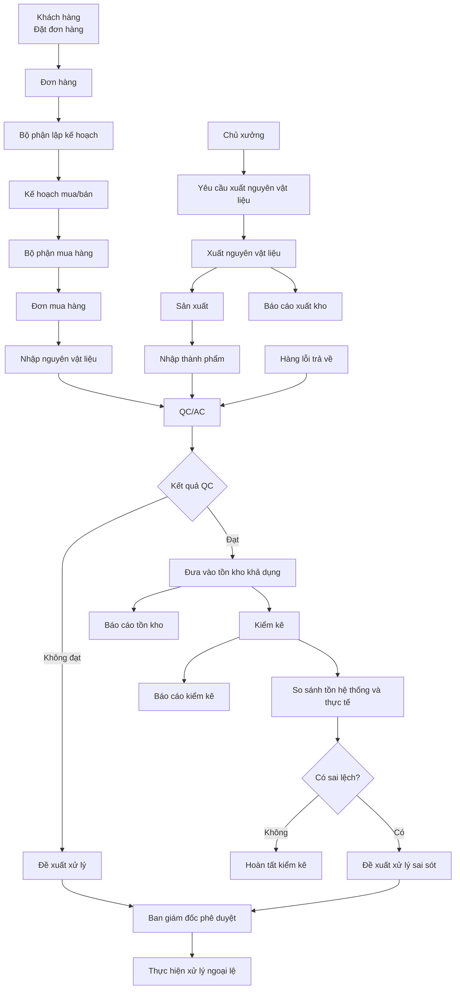
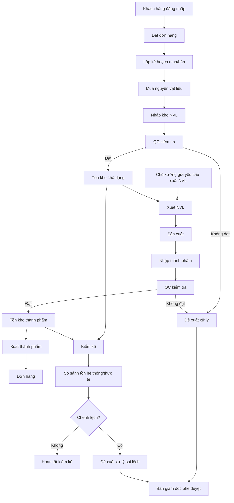
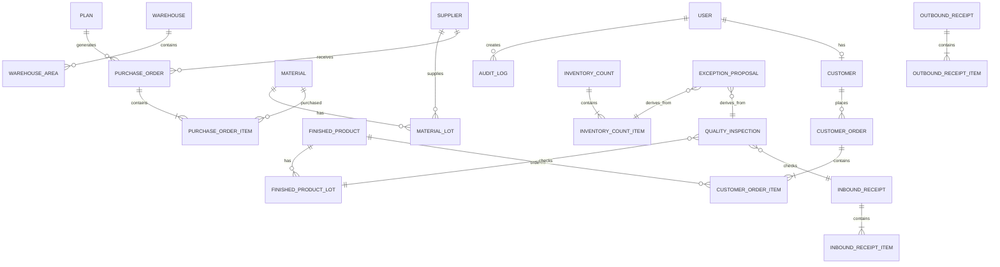
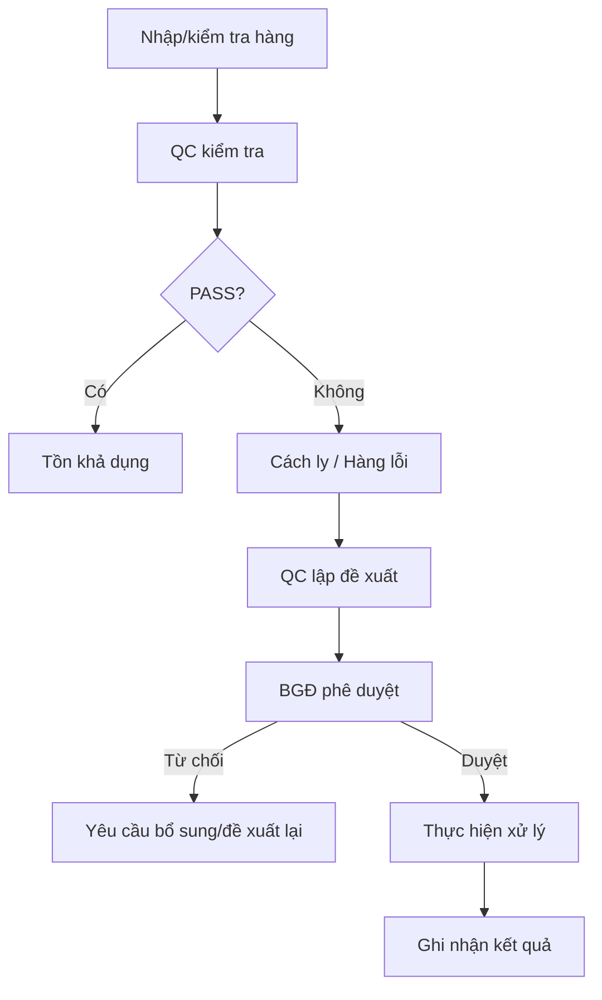
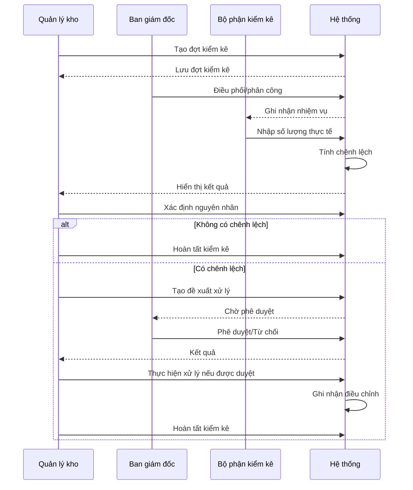

# SRS – HỆ THỐNG QUẢN LÝ KHO VÀ VẬN HÀNH SẢN XUẤT

> **Software Requirements Specification (SRS)**  
> Phiên bản: 1.0  
> Ngôn ngữ: Tiếng Việt  
> Phạm vi: Quản lý đơn hàng, lập kế hoạch, mua hàng, nhập/xuất kho, QC/AC, kiểm kê, xử lý sai lệch và báo cáo quản trị.  
> Tài liệu được xây dựng theo cấu trúc SRS tham chiếu từ tài liệu `srs.md` của dự án CAB System và được điều chỉnh cho nghiệp vụ quản lý kho.

---

# 1. Bối cảnh nghiệp vụ và vấn đề cần giải quyết

## 1.1. Bối cảnh

Doanh nghiệp có hoạt động mua nguyên vật liệu, tiếp nhận nguyên vật liệu, sản xuất thành phẩm, kiểm tra chất lượng, lưu kho, xuất nguyên vật liệu cho sản xuất, xuất thành phẩm cho khách hàng và xử lý hàng lỗi/sai lệch kiểm kê.

Các nghiệp vụ liên quan đến kho có sự tham gia của nhiều bộ phận:

- Khách hàng.
- Bộ phận lập kế hoạch.
- Bộ phận mua hàng.
- Chủ xưởng.
- Quản lý kho.
- Nhân viên kho.
- Bộ phận QC/AC.
- Bộ phận kiểm kê.
- Ban giám đốc.

Nếu không có hệ thống tập trung, dữ liệu tồn kho, nhập kho, xuất kho, chất lượng và kiểm kê dễ bị phân tán, dẫn đến sai lệch giữa số liệu hệ thống và số lượng thực tế.

## 1.2. Business Problem

Doanh nghiệp cần giải quyết các vấn đề:

- Theo dõi tồn kho chưa tập trung.
- Khó kiểm soát chính xác số lượng nguyên vật liệu, thành phẩm và hàng lỗi.
- Quy trình nhập kho và xuất kho có nhiều bên tham gia nhưng thiếu luồng kiểm soát thống nhất.
- Khó liên kết nguyên vật liệu/thành phẩm với lô hàng.
- Kết quả kiểm tra chất lượng chưa được liên kết chặt với nghiệp vụ nhập kho/xuất kho.
- Quy trình xử lý hàng lỗi và sai lệch kiểm kê cần có đề xuất và phê duyệt.
- Việc lập kế hoạch mua nguyên vật liệu và bán hàng cần liên kết với tồn kho.
- Việc kiểm kê cần có đợt kiểm kê, người thực hiện, kết quả và chênh lệch rõ ràng.
- Ban giám đốc cần báo cáo tồn kho, xuất kho và kiểm kê để ra quyết định.
- Cần kiểm soát quyền của từng bộ phận để tránh một người thực hiện toàn bộ quy trình.
- Cần lưu lịch sử thao tác đối với các nghiệp vụ quan trọng.

## 1.3. Vấn đề cốt lõi

Hệ thống cần số hóa và liên kết chuỗi nghiệp vụ:

**Đơn hàng → Kế hoạch → Mua hàng/Yêu cầu xuất → Nhập kho/Xuất kho → QC/AC → Tồn kho → Kiểm kê → Sai lệch → Đề xuất xử lý → Phê duyệt → Báo cáo.**

---

# 2. Stakeholders và Actors

## 2.1. Danh sách Actor

| Mã | Actor | Vai trò |
|---|---|---|
| ACT01 | Khách hàng (Thy) | Đặt và theo dõi đơn hàng |
| ACT02 | Bộ phận lập kế hoạch | Lập và quản lý kế hoạch mua nguyên vật liệu/bán hàng |
| ACT03 | Ban giám đốc (Dũng) | Phê duyệt, điều phối, xem báo cáo |
| ACT04 | Bộ phận QC/AC | Kiểm tra chất lượng và đề xuất xử lý |
| ACT05 | Quản lý kho (Thái) | Quản lý dữ liệu kho, theo dõi nhập/xuất, kiểm kê |
| ACT06 | Nhân viên kho (Tuấn) | Thực hiện nhập kho/xuất kho |
| ACT07 | Chủ xưởng (Huy) | Gửi và quản lý yêu cầu nhập thành phẩm/xuất nguyên vật liệu |
| ACT08 | Bộ phận mua hàng (Ý) | Thực hiện mua hàng và quản lý đơn mua |
| ACT09 | Bộ phận kiểm kê | Thực hiện kiểm kê thực tế |

## 2.2. Stakeholder matrix

| Stakeholder | Quyền lực | Mức quan tâm | Vai trò |
|---|---:|---:|---|
| Ban giám đốc | Cao | Cao | Phê duyệt và ra quyết định |
| Quản lý kho | Cao | Cao | Quản trị nghiệp vụ kho |
| Lập kế hoạch | Trung bình/Cao | Cao | Điều phối kế hoạch |
| QC/AC | Trung bình | Cao | Kiểm soát chất lượng |
| Mua hàng | Trung bình | Cao | Đảm bảo nguồn cung |
| Nhân viên kho | Trung bình | Cao | Thực hiện nghiệp vụ vật lý |
| Chủ xưởng | Trung bình | Cao | Yêu cầu cấp phát/tiếp nhận sản xuất |
| Kiểm kê | Trung bình | Cao | Xác nhận số lượng thực tế |
| Khách hàng | Thấp | Cao | Phát sinh nhu cầu bán hàng |

---

# 3. Mục tiêu nghiệp vụ (Business Goals)

| Mã | Business Goal |
|---|---|
| BG01 | Quản lý tập trung danh mục kho, nhà cung cấp, nguyên vật liệu, thành phẩm, hàng lỗi và thông tin lô. |
| BG02 | Cho phép khách hàng tạo và theo dõi đơn hàng. |
| BG03 | Cho phép bộ phận lập kế hoạch lập kế hoạch mua nguyên vật liệu và bán hàng. |
| BG04 | Cho phép bộ phận mua hàng thực hiện mua hàng theo nhu cầu/kế hoạch. |
| BG05 | Kiểm soát quy trình nhập kho nguyên vật liệu, thành phẩm và hàng lỗi trả về. |
| BG06 | Kiểm soát quy trình xuất kho nguyên vật liệu, thành phẩm và hàng lỗi trả về. |
| BG07 | Liên kết nghiệp vụ kho với lô hàng và trạng thái chất lượng. |
| BG08 | Quản lý kết quả kiểm tra chất lượng và đề xuất xử lý hàng không đạt. |
| BG09 | Tổ chức các đợt kiểm kê và ghi nhận chênh lệch. |
| BG10 | Kiểm soát việc đề xuất và phê duyệt xử lý sai lệch/ngoại lệ. |
| BG11 | Cung cấp báo cáo tồn kho, xuất kho và kiểm kê cho Ban giám đốc. |
| BG12 | Phân quyền người dùng theo đúng trách nhiệm nghiệp vụ. |
| BG13 | Lưu vết các thao tác quan trọng để phục vụ kiểm tra và truy xuất. |

---

# 4. Phạm vi hệ thống (Scope)

## 4.1. In Scope

1. Xác thực và phân quyền người dùng.
2. Quản lý đơn hàng khách hàng.
3. Quản lý kế hoạch mua nguyên vật liệu và bán hàng.
4. Quản lý đơn mua hàng.
5. Quản lý khu vực kho.
6. Quản lý nhà cung cấp.
7. Quản lý nguyên vật liệu.
8. Quản lý thành phẩm.
9. Quản lý hàng lỗi.
10. Quản lý lô nguyên vật liệu.
11. Quản lý lô thành phẩm.
12. Quản lý phiếu nhập kho.
13. Quản lý phiếu xuất kho.
14. Nhập nguyên vật liệu.
15. Nhập thành phẩm.
16. Nhập hàng lỗi trả về.
17. Xuất nguyên vật liệu.
18. Xuất thành phẩm.
19. Xuất hàng lỗi trả về.
20. Quản lý kết quả QC/AC.
21. Gửi kết quả QC.
22. Đề xuất xử lý hàng không đạt.
23. Lập đợt kiểm kê.
24. Phân công/điều phối kiểm kê.
25. Thực hiện kiểm kê.
26. Ghi nhận chênh lệch kiểm kê.
27. Đề xuất xử lý sai sót.
28. Phê duyệt đề xuất xử lý ngoại lệ.
29. Báo cáo tồn kho.
30. Báo cáo xuất kho.
31. Báo cáo kiểm kê.
32. Tra cứu dữ liệu danh mục và lịch sử nghiệp vụ.

## 4.2. Out of Scope / cần xác nhận

Các nội dung sau chưa được xác định đầy đủ trong yêu cầu ban đầu và phải được stakeholder xác nhận trước khi triển khai chính thức:

- Quản lý công thức/BOM sản xuất.
- Lập lịch sản xuất chi tiết.
- Tính giá vốn.
- Kế toán công nợ.
- Thanh toán nhà cung cấp.
- Quản lý vận chuyển.
- Tích hợp ERP/kế toán bên ngoài.
- Quét barcode/QR code.
- Tích hợp cân điện tử.
- Tự động dự báo nhu cầu bằng AI/ML.
- Tích hợp email/SMS/Zalo.
- Quản lý nhiều công ty/chi nhánh nếu chưa có yêu cầu.
- Chính sách FIFO/FEFO cụ thể nếu doanh nghiệp chưa xác nhận.
- Hạn sử dụng bắt buộc hay không.
- Định mức tồn kho tối thiểu/tối đa.

---

# 5. Business Requirements

| Mã | Tên | Mô tả |
|---|---|---|
| BR01 | Quản lý tài khoản | Hệ thống phải xác thực người dùng và phân quyền theo Actor. |
| BR02 | Quản lý đơn hàng khách hàng | Hệ thống phải tiếp nhận và quản lý đơn hàng của khách hàng. |
| BR03 | Lập kế hoạch | Hệ thống phải hỗ trợ lập kế hoạch mua nguyên vật liệu và bán hàng. |
| BR04 | Quản lý kế hoạch | Hệ thống phải cho phép thêm, sửa, xóa kế hoạch theo quyền. |
| BR05 | Quản lý mua hàng | Hệ thống phải hỗ trợ tạo và quản lý nghiệp vụ mua hàng. |
| BR06 | Quản lý danh mục kho | Hệ thống phải quản lý khu vực kho, nhà cung cấp, nguyên vật liệu, thành phẩm, hàng lỗi và lô. |
| BR07 | Nhập kho | Hệ thống phải ghi nhận các nghiệp vụ nhập kho. |
| BR08 | Xuất kho | Hệ thống phải ghi nhận các nghiệp vụ xuất kho. |
| BR09 | QC/AC | Hệ thống phải ghi nhận và quản lý kết quả kiểm tra chất lượng. |
| BR10 | Xử lý hàng không đạt | Hệ thống phải hỗ trợ đề xuất và phê duyệt xử lý hàng không đạt. |
| BR11 | Kiểm kê | Hệ thống phải hỗ trợ lập, phân công, thực hiện và hoàn tất đợt kiểm kê. |
| BR12 | Xử lý sai lệch | Hệ thống phải ghi nhận chênh lệch và xử lý theo cơ chế đề xuất/phê duyệt. |
| BR13 | Báo cáo | Hệ thống phải cung cấp báo cáo tồn kho, xuất kho và kiểm kê. |
| BR14 | Tra cứu | Người dùng được phép phải tra cứu dữ liệu theo phạm vi quyền. |
| BR15 | Audit | Hệ thống phải lưu lịch sử các thao tác quan trọng. |

---

# 6. Business Process tổng thể



---

# 7. Phân rã Functional Requirements

## 7.1. BR01 – Quản lý tài khoản

| Mã | Functional Requirement | Mô tả |
|---|---|---|
| FR01 | Đăng nhập | Người dùng đăng nhập bằng thông tin xác thực hợp lệ. |
| FR02 | Xác thực tài khoản | Hệ thống kiểm tra tài khoản tồn tại và trạng thái hoạt động. |
| FR03 | Phân quyền | Hệ thống xác định Actor và quyền sau đăng nhập. |
| FR04 | Đăng xuất | Người dùng có thể kết thúc phiên làm việc. |
| FR05 | Từ chối truy cập | Hệ thống từ chối chức năng không thuộc quyền người dùng. |

## 7.2. BR02 – Đơn hàng khách hàng

| Mã | Functional Requirement | Mô tả |
|---|---|---|
| FR06 | Thêm đơn hàng | Khách hàng tạo đơn hàng mới. |
| FR07 | Sửa đơn hàng | Khách hàng được sửa đơn hàng khi trạng thái cho phép. |
| FR08 | Xem đơn hàng | Khách hàng xem danh sách và chi tiết đơn hàng của mình. |
| FR09 | Kiểm tra đơn hàng | Hệ thống kiểm tra các trường bắt buộc trước khi lưu. |
| FR10 | Quản lý trạng thái đơn hàng | Hệ thống lưu trạng thái đơn hàng theo vòng đời nghiệp vụ. |

## 7.3. BR03 – Lập kế hoạch

| Mã | Functional Requirement | Mô tả |
|---|---|---|
| FR11 | Tạo kế hoạch mua | Lập kế hoạch mua nguyên vật liệu. |
| FR12 | Tạo kế hoạch bán | Lập kế hoạch bán hàng. |
| FR13 | Sửa kế hoạch | Cho phép sửa kế hoạch khi chưa khóa/chốt. |
| FR14 | Xóa kế hoạch | Cho phép xóa kế hoạch theo quyền và trạng thái. |
| FR15 | Xem kế hoạch | Xem danh sách và chi tiết kế hoạch. |
| FR16 | Liên kết kế hoạch | Liên kết kế hoạch với mặt hàng, số lượng, thời gian và nghiệp vụ liên quan. |

## 7.4. BR04 – Mua hàng

| Mã | Functional Requirement | Mô tả |
|---|---|---|
| FR17 | Tạo nghiệp vụ mua hàng | Bộ phận mua hàng tạo đơn mua theo nhu cầu/kế hoạch. |
| FR18 | Sửa đơn mua | Sửa thông tin đơn mua khi trạng thái cho phép. |
| FR19 | Xóa đơn mua | Xóa đơn mua khi chưa phát sinh nghiệp vụ phụ thuộc và có quyền. |
| FR20 | Xem đơn mua | Tra cứu đơn mua và trạng thái. |
| FR21 | Gắn nhà cung cấp | Xác định nhà cung cấp cho đơn mua. |
| FR22 | Gắn nguyên vật liệu | Xác định mặt hàng, số lượng và đơn vị tính. |

## 7.5. BR05 – Quản lý danh mục kho

| Mã | Functional Requirement | Mô tả |
|---|---|---|
| FR23 | Quản lý khu vực kho | Thêm, sửa, xóa, xem khu vực kho. |
| FR24 | Quản lý nhà cung cấp | Thêm, sửa, xóa, xem nhà cung cấp. |
| FR25 | Quản lý nguyên vật liệu | Thêm, sửa, xóa, xem nguyên vật liệu. |
| FR26 | Quản lý thành phẩm | Thêm, sửa, xóa, xem thành phẩm. |
| FR27 | Quản lý hàng lỗi | Thêm, sửa, xóa, xem loại hàng lỗi. |
| FR28 | Quản lý lô nguyên vật liệu | Tạo và tra cứu lô nguyên vật liệu. |
| FR29 | Quản lý lô thành phẩm | Tạo và tra cứu lô thành phẩm. |
| FR30 | Tra cứu danh mục | Tìm kiếm/lọc theo các thuộc tính được phép. |
| FR31 | Kiểm tra tham chiếu | Không cho xóa danh mục đang được nghiệp vụ khác tham chiếu nếu việc xóa làm mất tính toàn vẹn dữ liệu. |

## 7.6. BR06 – Nhập kho

| Mã | Functional Requirement | Mô tả |
|---|---|---|
| FR32 | Nhập nguyên vật liệu | Nhân viên kho ghi nhận nguyên vật liệu nhập kho. |
| FR33 | Nhập thành phẩm | Nhân viên kho ghi nhận thành phẩm nhập kho. |
| FR34 | Nhập hàng lỗi trả về | Nhân viên kho ghi nhận hàng lỗi trả về. |
| FR35 | Chọn lô | Phiếu nhập phải xác định lô khi mặt hàng được quản lý theo lô. |
| FR36 | Chọn khu vực kho | Phiếu nhập xác định vị trí lưu trữ. |
| FR37 | Ghi nhận số lượng thực nhập | Hệ thống lưu số lượng thực tế nhập. |
| FR38 | Ghi nhận thời gian nhập | Hệ thống lưu ngày/giờ nhập kho. |
| FR39 | Gắn nguồn nhập | Ghi nhận nguồn nhập như nhà cung cấp, sản xuất hoặc trả về. |
| FR40 | Xác nhận phiếu nhập | Phiếu nhập chỉ làm thay đổi tồn kho sau khi đạt trạng thái xác nhận theo quy trình. |

## 7.7. BR07 – Xuất kho

| Mã | Functional Requirement | Mô tả |
|---|---|---|
| FR41 | Xuất nguyên vật liệu | Nhân viên kho thực hiện xuất nguyên vật liệu. |
| FR42 | Xuất thành phẩm | Nhân viên kho thực hiện xuất thành phẩm. |
| FR43 | Xuất hàng lỗi trả về | Hệ thống ghi nhận nghiệp vụ xuất hàng lỗi trả về khi có nghiệp vụ phù hợp. |
| FR44 | Kiểm tra tồn khả dụng | Hệ thống kiểm tra số lượng có thể xuất trước khi xác nhận. |
| FR45 | Chọn lô xuất | Xác định lô cần xuất khi mặt hàng quản lý theo lô. |
| FR46 | Xác định nơi nhận | Ghi nhận bộ phận/đơn hàng/đối tượng nhận. |
| FR47 | Xác nhận phiếu xuất | Chỉ phiếu xuất hợp lệ mới làm giảm tồn kho. |
| FR48 | Từ chối xuất thiếu tồn | Không cho xác nhận xuất vượt số lượng tồn khả dụng, trừ trường hợp ngoại lệ được thiết kế và phê duyệt. |

## 7.8. BR08 – QC/AC

| Mã | Functional Requirement | Mô tả |
|---|---|---|
| FR49 | Tạo kết quả kiểm tra | QC/AC tạo kết quả kiểm tra chất lượng. |
| FR50 | Sửa kết quả | Sửa kết quả khi bản ghi chưa khóa/chốt. |
| FR51 | Xóa kết quả | Xóa khi nghiệp vụ cho phép và không làm mất dữ liệu bắt buộc. |
| FR52 | Xem kết quả | Người có quyền xem kết quả kiểm tra. |
| FR53 | Gửi kết quả | QC/AC gửi kết quả đến bộ phận liên quan. |
| FR54 | Xác định đạt/không đạt | Ghi nhận kết luận chất lượng. |
| FR55 | Đề xuất xử lý | Tạo đề xuất xử lý đối với hàng không đạt. |
| FR56 | Theo dõi trạng thái đề xuất | Theo dõi chờ duyệt/đã duyệt/từ chối/đã xử lý. |

## 7.9. BR09 – Kiểm kê

| Mã | Functional Requirement | Mô tả |
|---|---|---|
| FR57 | Lập đợt kiểm kê | Quản lý kho tạo đợt kiểm kê. |
| FR58 | Chọn phạm vi kiểm kê | Chọn kho/khu vực/mặt hàng/lô theo phạm vi kiểm kê. |
| FR59 | Phân công kiểm kê | Ban giám đốc/Quản lý kho điều phối nhân sự theo quyền được cấu hình. |
| FR60 | Thực hiện kiểm kê | Bộ phận kiểm kê nhập số lượng thực tế. |
| FR61 | Khóa dữ liệu kiểm kê | Kiểm soát việc chỉnh sửa số liệu sau khi chốt theo quy trình. |
| FR62 | Tính chênh lệch | Hệ thống so sánh số lượng hệ thống và thực tế. |
| FR63 | Xác nhận kết quả | Hoàn tất đợt kiểm kê sau khi xử lý các điều kiện bắt buộc. |
| FR64 | Xuất báo cáo kiểm kê | Cung cấp kết quả kiểm kê và chênh lệch. |

## 7.10. BR10 – Xử lý ngoại lệ/sai lệch

| Mã | Functional Requirement | Mô tả |
|---|---|---|
| FR65 | Đề xuất xử lý sai lệch | Quản lý kho lập đề xuất khi có sai lệch kiểm kê. |
| FR66 | Đề xuất xử lý hàng lỗi | QC/AC lập đề xuất xử lý hàng không đạt. |
| FR67 | Gửi phê duyệt | Chuyển đề xuất đến Ban giám đốc. |
| FR68 | Phê duyệt | Ban giám đốc phê duyệt đề xuất. |
| FR69 | Từ chối đề xuất | Ban giám đốc từ chối và ghi nhận lý do. |
| FR70 | Thực hiện quyết định | Bộ phận có trách nhiệm thực hiện phương án đã được duyệt. |
| FR71 | Ghi nhận kết quả xử lý | Lưu kết quả và thời điểm hoàn tất. |

## 7.11. BR11 – Báo cáo

| Mã | Functional Requirement | Mô tả |
|---|---|---|
| FR72 | Báo cáo tồn kho | Hiển thị tồn theo mặt hàng, kho, khu vực và lô theo quyền. |
| FR73 | Báo cáo xuất kho | Thống kê phiếu xuất và số lượng xuất. |
| FR74 | Báo cáo kiểm kê | Hiển thị số hệ thống, số thực tế và chênh lệch. |
| FR75 | Lọc báo cáo | Cho phép lọc theo thời gian và các tiêu chí phù hợp. |
| FR76 | Xem chi tiết | Cho phép drill-down từ báo cáo đến dữ liệu nghiệp vụ nếu có quyền. |
| FR77 | Xuất báo cáo | Cho phép xuất file theo định dạng được hệ thống hỗ trợ. |

---

# 8. Business Rules

| Mã | Quy tắc | Nội dung |
|---|---|---|
| BRULE01 | Đăng nhập bắt buộc | Các chức năng nghiệp vụ chỉ được sử dụng sau khi xác thực. |
| BRULE02 | Phân quyền | Người dùng chỉ được thực hiện chức năng thuộc quyền của Actor. |
| BRULE03 | Dữ liệu theo phạm vi quyền | Người dùng chỉ xem/sửa dữ liệu thuộc phạm vi được cấp. |
| BRULE04 | Đơn hàng hợp lệ | Đơn hàng phải có các trường bắt buộc trước khi lưu. |
| BRULE05 | Kế hoạch chưa chốt | Chỉ kế hoạch chưa chốt mới được sửa/xóa. |
| BRULE06 | Đơn mua liên kết kế hoạch | Nếu đơn mua được tạo từ kế hoạch, hệ thống phải lưu liên kết đến kế hoạch. |
| BRULE07 | Phiếu nhập hợp lệ | Phiếu nhập phải có loại nhập, mặt hàng, số lượng và thông tin kho cần thiết. |
| BRULE08 | Phiếu xuất hợp lệ | Phiếu xuất phải có loại xuất, mặt hàng, số lượng và đối tượng nhận cần thiết. |
| BRULE09 | Không xuất vượt tồn | Không cho phép xuất vượt số lượng tồn khả dụng trong điều kiện thông thường. |
| BRULE10 | Quản lý theo lô | Mặt hàng đã cấu hình quản lý theo lô phải được nhập/xuất gắn với lô. |
| BRULE11 | Tồn kho cập nhật khi xác nhận | Chỉ nghiệp vụ đạt trạng thái xác nhận hợp lệ mới làm thay đổi tồn kho. |
| BRULE12 | Không sửa phiếu đã khóa | Phiếu đã khóa/chốt không được sửa trực tiếp. |
| BRULE13 | QC ảnh hưởng trạng thái hàng | Hàng không đạt không được coi là tồn kho khả dụng cho mục đích sử dụng thông thường nếu quy trình chất lượng quy định phải cách ly. |
| BRULE14 | Một kết quả QC có đối tượng rõ ràng | Kết quả QC phải liên kết với đối tượng kiểm tra, lô hoặc nghiệp vụ liên quan. |
| BRULE15 | Đề xuất phải có lý do | Đề xuất xử lý ngoại lệ/sai lệch phải có nguyên nhân hoặc mô tả. |
| BRULE16 | Phê duyệt tách biệt | Người tạo đề xuất không mặc nhiên được coi là người phê duyệt đề xuất đó. |
| BRULE17 | Từ chối phải có lý do | Khi từ chối đề xuất, Ban giám đốc phải ghi nhận lý do. |
| BRULE18 | Kiểm kê có phạm vi | Mỗi đợt kiểm kê phải xác định phạm vi trước khi thực hiện. |
| BRULE19 | Không tự ý thay đổi số hệ thống | Số lượng hệ thống dùng để đối chiếu phải được truy xuất từ dữ liệu nghiệp vụ tại thời điểm kiểm kê theo chính sách đã xác định. |
| BRULE20 | Chênh lệch phải được ghi nhận | Nếu số thực tế khác số hệ thống, hệ thống phải tạo/ghi nhận chênh lệch. |
| BRULE21 | Chỉ điều chỉnh sau phê duyệt | Nếu chính sách yêu cầu phê duyệt, tồn kho không được điều chỉnh theo chênh lệch trước khi có phê duyệt. |
| BRULE22 | Audit Log | Thao tác thêm/sửa/xóa/xác nhận/phê duyệt/từ chối phải được ghi log. |
| BRULE23 | Không xóa dữ liệu lịch sử tùy tiện | Dữ liệu đã phát sinh nghiệp vụ không được xóa vật lý nếu việc xóa phá vỡ lịch sử. |
| BRULE24 | Trạng thái phải hợp lệ | Không được chuyển một chứng từ sang trạng thái không hợp lệ với vòng đời nghiệp vụ. |
| BRULE25 | Số lượng phải dương | Số lượng nhập/xuất/kiểm kê phải lớn hơn 0, trừ trường hợp nghiệp vụ đặc biệt được xác định riêng. |

---

# 9. Trạng thái nghiệp vụ

## 9.1. Đơn hàng

```text
MỚI
  ↓
ĐÃ TIẾP NHẬN
  ↓
ĐANG XỬ LÝ
  ↓
HOÀN TẤT

MỚI/ĐÃ TIẾP NHẬN/ĐANG XỬ LÝ
  └──> HỦY (nếu điều kiện cho phép)
```

## 9.2. Đơn mua

```text
NHÁP
  ↓
ĐÃ TẠO
  ↓
ĐANG XỬ LÝ
  ↓
ĐÃ NHẬN HÀNG / HOÀN TẤT

ĐÃ TẠO
  └──> HỦY (nếu chưa phát sinh nghiệp vụ không thể hoàn tác)
```

## 9.3. Phiếu nhập kho

```text
NHÁP → CHỜ XÁC NHẬN → ĐÃ XÁC NHẬN
```

Chỉ trạng thái **ĐÃ XÁC NHẬN** làm thay đổi tồn kho theo nghiệp vụ.

## 9.4. Phiếu xuất kho

```text
NHÁP → CHỜ XÁC NHẬN → ĐÃ XÁC NHẬN
```

## 9.5. Kết quả QC

```text
NHÁP → ĐÃ KIỂM TRA → ĐÃ GỬI
                       ├── ĐẠT
                       └── KHÔNG ĐẠT
```

## 9.6. Đề xuất xử lý

```text
NHÁP
  ↓
CHỜ PHÊ DUYỆT
  ├──> ĐÃ PHÊ DUYỆT → ĐANG THỰC HIỆN → ĐÃ HOÀN TẤT
  └──> TỪ CHỐI
```

## 9.7. Đợt kiểm kê

```text
NHÁP
  ↓
ĐÃ LẬP
  ↓
ĐANG KIỂM KÊ
  ↓
CHỜ XỬ LÝ CHÊNH LỆCH
  ↓
ĐÃ HOÀN TẤT
```

Nếu không có chênh lệch:

```text
ĐANG KIỂM KÊ → KHÔNG CÓ CHÊNH LỆCH → ĐÃ HOÀN TẤT
```

---

# 10. Use Case Diagram

```mermaid
flowchart LR

    KH["ACT01<br/>Khách hàng"]
    KHPLAN["ACT02<br/>Bộ phận lập kế hoạch"]
    BGD["ACT03<br/>Ban giám đốc"]
    QC["ACT04<br/>QC/AC"]
    QK["ACT05<br/>Quản lý kho"]
    NVK["ACT06<br/>Nhân viên kho"]
    XUONG["ACT07<br/>Chủ xưởng"]
    MH["ACT08<br/>Bộ phận mua hàng"]
    KK["ACT09<br/>Bộ phận kiểm kê"]

    subgraph SYS["HỆ THỐNG QUẢN LÝ KHO"]
        UC01(("Đăng nhập"))
        UC02(("Quản lý đơn hàng khách hàng"))
        UC03(("Lập kế hoạch"))
        UC04(("Quản lý kế hoạch"))
        UC05(("Mua hàng"))
        UC06(("Quản lý đơn mua"))
        UC07(("Quản lý danh mục"))
        UC08(("Theo dõi phiếu nhập"))
        UC09(("Theo dõi phiếu xuất"))
        UC10(("Nhập kho"))
        UC11(("Xuất kho"))
        UC12(("Quản lý QC/AC"))
        UC13(("Gửi kết quả QC"))
        UC14(("Đề xuất xử lý hàng lỗi"))
        UC15(("Lập đợt kiểm kê"))
        UC16(("Phân công kiểm kê"))
        UC17(("Thực hiện kiểm kê"))
        UC18(("Xử lý chênh lệch"))
        UC19(("Phê duyệt đề xuất"))
        UC20(("Báo cáo tồn kho"))
        UC21(("Báo cáo xuất kho"))
        UC22(("Báo cáo kiểm kê"))
        UC23(("Tra cứu danh mục"))
        UC24(("Gửi yêu cầu xuất/nhập"))
        UC25(("Quản lý yêu cầu"))
        UC26(("Phân công công việc"))
        UC27(("Điều phối kiểm kê"))
    end

    KH --> UC01
    KH --> UC02

    KHPLAN --> UC01
    KHPLAN --> UC03
    KHPLAN --> UC04

    BGD --> UC01
    BGD --> UC19
    BGD --> UC20
    BGD --> UC21
    BGD --> UC22
    BGD --> UC26
    BGD --> UC27

    QC --> UC01
    QC --> UC12
    QC --> UC13
    QC --> UC14

    QK --> UC01
    QK --> UC07
    QK --> UC08
    QK --> UC09
    QK --> UC15
    QK --> UC18
    QK --> UC23

    NVK --> UC01
    NVK --> UC10
    NVK --> UC11

    XUONG --> UC01
    XUONG --> UC24
    XUONG --> UC25
    XUONG --> UC12

    MH --> UC01
    MH --> UC05
    MH --> UC06

    KK --> UC01
    KK --> UC17
```



---

# 11. Luồng nghiệp vụ chính



---

# 12. Đặc tả Use Case

## UC01 – Đăng nhập

| Thành phần | Nội dung |
|---|---|
| Use Case ID | UC01 |
| Actor chính | ACT01–ACT09 |
| Mục tiêu | Xác thực người dùng và xác định quyền |
| Tiền điều kiện | Người dùng có tài khoản hợp lệ |
| Hậu điều kiện | Người dùng được cấp phiên đăng nhập và quyền tương ứng |
| Trigger | Người dùng gửi thông tin đăng nhập |

### Main Flow

1. Người dùng mở màn hình đăng nhập.
2. Người dùng nhập thông tin đăng nhập.
3. Hệ thống kiểm tra trường bắt buộc.
4. Hệ thống xác thực tài khoản.
5. Hệ thống kiểm tra trạng thái tài khoản.
6. Hệ thống xác định Actor/quyền.
7. Hệ thống tạo phiên xác thực.
8. Hệ thống chuyển người dùng đến giao diện phù hợp.
9. Use Case kết thúc.

### Alternative/Exception

| Mã | Trường hợp | Xử lý |
|---|---|---|
| A1 | Thiếu thông tin | Yêu cầu nhập lại |
| A2 | Sai thông tin | Từ chối đăng nhập |
| A3 | Tài khoản không tồn tại | Thông báo lỗi |
| A4 | Tài khoản bị khóa | Từ chối truy cập |
| A5 | Không có quyền | Không cho truy cập chức năng |

---

## UC02 – Đặt đơn hàng

| Thành phần | Nội dung |
|---|---|
| Use Case ID | UC02 |
| Actor chính | ACT01 – Khách hàng |
| Mục tiêu | Tạo đơn hàng |
| Tiền điều kiện | Khách hàng đã đăng nhập |
| Hậu điều kiện | Đơn hàng được tạo với trạng thái hợp lệ |
| Trigger | Khách hàng chọn Đặt đơn |

### Main Flow

1. Khách hàng mở chức năng đặt đơn.
2. Hệ thống hiển thị form.
3. Khách hàng nhập/chọn thông tin đơn hàng.
4. Khách hàng xác nhận.
5. Hệ thống kiểm tra dữ liệu.
6. Hệ thống tạo mã đơn hàng.
7. Hệ thống lưu đơn hàng.
8. Hệ thống thông báo thành công.
9. Use Case kết thúc.

### Alternative/Exception

- Thiếu trường bắt buộc → không lưu.
- Sản phẩm không tồn tại → yêu cầu chọn lại.
- Số lượng không hợp lệ → yêu cầu chỉnh sửa.
- Lỗi lưu dữ liệu → rollback giao dịch và thông báo thất bại.

---

## UC03 – Quản lý đơn hàng khách hàng

| Thành phần | Nội dung |
|---|---|
| Actor | ACT01 |
| Mục tiêu | Xem và sửa đơn hàng thuộc khách hàng |
| Tiền điều kiện | Đã đăng nhập |
| Hậu điều kiện | Thông tin được hiển thị/cập nhật |

### Main Flow

1. Khách hàng mở danh sách đơn hàng.
2. Hệ thống chỉ hiển thị đơn của khách hàng.
3. Khách hàng chọn đơn.
4. Hệ thống hiển thị chi tiết.
5. Nếu trạng thái cho phép, khách hàng chọn sửa.
6. Hệ thống kiểm tra dữ liệu.
7. Hệ thống lưu thay đổi.
8. Hệ thống ghi log nếu thao tác thuộc phạm vi audit.

### Rule

Không cho sửa các thông tin đã bị khóa bởi trạng thái đơn hàng hoặc đã phát sinh nghiệp vụ phụ thuộc không thể thay đổi.

---

## UC04 – Lập kế hoạch mua/bán

| Thành phần | Nội dung |
|---|---|
| Actor | ACT02 |
| Mục tiêu | Lập kế hoạch mua nguyên vật liệu và bán hàng |
| Tiền điều kiện | Đã đăng nhập, có quyền |
| Hậu điều kiện | Kế hoạch được lưu |
| Trigger | Chọn Tạo kế hoạch |

### Main Flow

1. Actor chọn loại kế hoạch.
2. Nhập kỳ kế hoạch.
3. Chọn mặt hàng.
4. Nhập số lượng dự kiến.
5. Nhập thông tin cần thiết khác.
6. Hệ thống kiểm tra dữ liệu.
7. Hệ thống lưu kế hoạch.
8. Hệ thống gán trạng thái kế hoạch.
9. Use Case kết thúc.

### Exception

- Kỳ kế hoạch không hợp lệ.
- Số lượng không hợp lệ.
- Mặt hàng không tồn tại.
- Kế hoạch trùng phạm vi theo rule cấu hình.

---

## UC05 – Quản lý kế hoạch

| Thành phần | Nội dung |
|---|---|
| Actor | ACT02 |
| Mục tiêu | Thêm, sửa, xóa, xem kế hoạch |
| Tiền điều kiện | Có quyền |
| Hậu điều kiện | Dữ liệu kế hoạch được cập nhật |

### Rule

Chỉ kế hoạch chưa chốt/khóa mới được sửa hoặc xóa.

---

## UC06 – Mua hàng

| Thành phần | Nội dung |
|---|---|
| Actor | ACT08 |
| Actor phụ | ACT02, ACT05 |
| Mục tiêu | Thực hiện mua nguyên vật liệu |
| Tiền điều kiện | Có nhu cầu/kế hoạch hợp lệ |
| Hậu điều kiện | Đơn mua được tạo |

### Main Flow

1. Bộ phận mua hàng xem nhu cầu/kế hoạch.
2. Chọn nhà cung cấp.
3. Chọn nguyên vật liệu.
4. Nhập số lượng.
5. Xác nhận đơn mua.
6. Hệ thống tạo đơn mua.
7. Đơn mua chuyển trạng thái xử lý.
8. Khi hàng về, nghiệp vụ nhập kho được thực hiện.
9. Use Case kết thúc.

---

## UC07 – Quản lý danh mục kho

| Thành phần | Nội dung |
|---|---|
| Actor | ACT05 |
| Mục tiêu | CRUD dữ liệu danh mục |
| Phạm vi | Khu vực kho, nhà cung cấp, NVL, thành phẩm, hàng lỗi, lô NVL, lô thành phẩm |

### Main Flow

1. Quản lý kho chọn loại danh mục.
2. Hệ thống hiển thị danh sách.
3. Người dùng tìm kiếm/lọc.
4. Chọn thêm/sửa/xóa/xem.
5. Hệ thống kiểm tra quyền.
6. Hệ thống kiểm tra dữ liệu.
7. Hệ thống kiểm tra tham chiếu.
8. Hệ thống lưu thay đổi.
9. Hệ thống ghi audit log.
10. Thông báo kết quả.

---

## UC08 – Theo dõi phiếu nhập kho

| Thành phần | Nội dung |
|---|---|
| Actor | ACT05 |
| Mục tiêu | Theo dõi các phiếu nhập |
| Tiền điều kiện | Đã đăng nhập |
| Hậu điều kiện | Danh sách/chi tiết phiếu nhập được hiển thị |

### Dữ liệu tra cứu

- Mã phiếu.
- Loại nhập.
- Ngày nhập.
- Nhà cung cấp/nguồn nhập.
- Kho.
- Khu vực.
- Trạng thái.
- Người lập.
- Người xác nhận.
- Mã lô.

---

## UC09 – Theo dõi phiếu xuất kho

Tương tự UC08, nhưng áp dụng cho phiếu xuất.

Dữ liệu tra cứu:

- Mã phiếu.
- Loại xuất.
- Ngày xuất.
- Kho.
- Khu vực.
- Đối tượng nhận.
- Đơn hàng/yêu cầu liên quan.
- Trạng thái.
- Người lập.
- Người xác nhận.
- Mã lô.

---

## UC10 – Nhập kho

| Thành phần | Nội dung |
|---|---|
| Actor | ACT06 – Nhân viên kho |
| Actor phụ | ACT04 – QC/AC |
| Mục tiêu | Ghi nhận hàng thực tế nhập kho |
| Tiền điều kiện | Có nguồn nhập hợp lệ |
| Hậu điều kiện | Phiếu nhập được xác nhận và tồn kho được cập nhật theo rule |

### Main Flow

1. Nhân viên kho chọn loại nhập.
2. Chọn nguồn nhập.
3. Chọn mặt hàng.
4. Chọn/khởi tạo lô.
5. Chọn khu vực kho.
6. Nhập số lượng thực tế.
7. Nhập thông tin liên quan.
8. Hệ thống kiểm tra.
9. Lưu phiếu nhập.
10. Thực hiện xác nhận theo quyền/quy trình.
11. Cập nhật tồn kho.
12. Ghi audit log.

### Exception

- Mặt hàng không tồn tại.
- Lô không hợp lệ.
- Khu vực kho không hợp lệ.
- Số lượng <= 0.
- Chứng từ nguồn không hợp lệ.
- Phiếu đã khóa.

---

## UC11 – Xuất kho

| Thành phần | Nội dung |
|---|---|
| Actor | ACT06 |
| Actor phụ | ACT05, ACT07, ACT01 |
| Mục tiêu | Ghi nhận hàng xuất khỏi kho |
| Tiền điều kiện | Có yêu cầu/đơn hàng/nghiệp vụ hợp lệ |
| Hậu điều kiện | Tồn kho giảm theo số lượng được xác nhận |

### Main Flow

1. Nhân viên kho mở yêu cầu/phiếu xuất.
2. Chọn mặt hàng.
3. Chọn lô.
4. Kiểm tra tồn khả dụng.
5. Nhập số lượng xuất.
6. Chọn đối tượng nhận.
7. Hệ thống kiểm tra.
8. Xác nhận phiếu.
9. Hệ thống trừ tồn.
10. Ghi lịch sử.
11. Use Case kết thúc.

### Exception

- Không đủ tồn.
- Lô không tồn tại.
- Số lượng vượt tồn.
- Phiếu đã xác nhận.
- Yêu cầu nguồn đã hủy.
- Không đủ quyền.

---

## UC12 – Quản lý kết quả kiểm tra chất lượng

| Thành phần | Nội dung |
|---|---|
| Actor | ACT04 |
| Mục tiêu | Quản lý kết quả QC |
| Tiền điều kiện | Có đối tượng cần kiểm tra |
| Hậu điều kiện | Kết quả QC được lưu |

### Main Flow

1. QC chọn đối tượng kiểm tra.
2. Nhập thông tin kiểm tra.
3. Ghi kết quả.
4. Kết luận đạt/không đạt.
5. Lưu kết quả.
6. Gửi kết quả nếu cần.
7. Nếu không đạt, tạo đề xuất xử lý.

---

## UC13 – Gửi kết quả QC

1. QC mở kết quả đã hoàn tất.
2. Kiểm tra thông tin.
3. Chọn Gửi.
4. Hệ thống chuyển trạng thái.
5. Hệ thống ghi người gửi và thời gian.
6. Các Actor có quyền có thể xem kết quả.

---

## UC14 – Đề xuất xử lý hàng lỗi

1. QC xác định kết quả không đạt.
2. Chọn Tạo đề xuất.
3. Chọn phương án xử lý theo danh mục/giá trị được hệ thống hỗ trợ.
4. Nhập nguyên nhân.
5. Đính kèm thông tin cần thiết nếu có.
6. Gửi đề xuất.
7. Hệ thống chuyển trạng thái Chờ phê duyệt.
8. Ban giám đốc xử lý theo UC19.

---

## UC15 – Lập đợt kiểm kê

| Actor | ACT05 |
|---|---|
| Mục tiêu | Tạo đợt kiểm kê có phạm vi rõ ràng |

### Main Flow

1. Quản lý kho chọn Lập đợt kiểm kê.
2. Nhập tên/mã đợt.
3. Chọn thời gian.
4. Chọn kho/khu vực/mặt hàng/lô.
5. Hệ thống kiểm tra phạm vi.
6. Lưu đợt kiểm kê.
7. Chuyển trạng thái Đã lập.

---

## UC16 – Phân công/điều phối kiểm kê

| Actor | ACT03, ACT05 |
|---|---|
| Mục tiêu | Giao nhiệm vụ kiểm kê |

### Main Flow

1. Mở đợt kiểm kê.
2. Chọn nhân sự.
3. Phân chia phạm vi.
4. Xác nhận phân công.
5. Hệ thống lưu người phụ trách.
6. Người được phân công nhận nhiệm vụ.

---

## UC17 – Thực hiện kiểm kê

| Actor | ACT09 |
|---|---|
| Mục tiêu | Ghi nhận số lượng thực tế |

### Main Flow

1. Nhân viên kiểm kê mở đợt được phân công.
2. Hệ thống hiển thị danh sách đối tượng.
3. Nhân viên kiểm kê đếm thực tế.
4. Nhập số lượng thực tế.
5. Ghi nhận ghi chú nếu cần.
6. Hệ thống tính chênh lệch.
7. Lưu kết quả.
8. Khi hoàn tất, gửi kết quả cho Quản lý kho.

### Rule

Không được tự ý sửa số liệu hệ thống gốc để làm cho số liệu khớp số kiểm kê.

---

## UC18 – Xử lý chênh lệch kiểm kê

| Actor | ACT05 |
|---|---|
| Mục tiêu | Xử lý chênh lệch giữa hệ thống và thực tế |

### Main Flow

1. Quản lý kho xem kết quả kiểm kê.
2. Hệ thống hiển thị chênh lệch.
3. Quản lý kho xác định nguyên nhân.
4. Tạo đề xuất xử lý.
5. Gửi Ban giám đốc.
6. Chờ phê duyệt.
7. Sau phê duyệt, thực hiện điều chỉnh theo chính sách.
8. Ghi nhận kết quả.
9. Hoàn tất kiểm kê.

---

## UC19 – Phê duyệt đề xuất xử lý ngoại lệ

| Actor | ACT03 |
|---|---|
| Mục tiêu | Phê duyệt/từ chối đề xuất |

### Main Flow

1. Ban giám đốc mở danh sách đề xuất.
2. Chọn đề xuất.
3. Xem dữ liệu liên quan.
4. Xem lý do và bằng chứng.
5. Chọn Phê duyệt hoặc Từ chối.
6. Nếu từ chối, nhập lý do.
7. Hệ thống lưu quyết định.
8. Hệ thống cập nhật trạng thái.
9. Ghi audit log.

---

## UC20 – Báo cáo tồn kho

| Actor | ACT03 |
|---|---|
| Mục tiêu | Cung cấp tình hình tồn kho |

### Nội dung

- Mã mặt hàng.
- Tên mặt hàng.
- Loại mặt hàng.
- Kho.
- Khu vực.
- Lô.
- Số lượng tồn.
- Trạng thái tồn.
- Thời điểm cập nhật.

### Filter

- Kho.
- Khu vực.
- Loại hàng.
- Mặt hàng.
- Lô.
- Khoảng thời gian nếu báo cáo hỗ trợ lịch sử.

---

## UC21 – Báo cáo xuất kho

Nội dung:

- Mã phiếu xuất.
- Ngày xuất.
- Loại xuất.
- Mặt hàng.
- Lô.
- Số lượng.
- Kho.
- Đối tượng nhận.
- Đơn hàng/yêu cầu liên quan.
- Người thực hiện.

---

## UC22 – Báo cáo kiểm kê

Nội dung:

- Mã đợt kiểm kê.
- Phạm vi.
- Ngày kiểm kê.
- Mặt hàng.
- Lô.
- Số lượng hệ thống.
- Số lượng thực tế.
- Chênh lệch.
- Nguyên nhân.
- Trạng thái xử lý.
- Người kiểm kê.

---

## UC23 – Tra cứu danh mục

Actor: ACT05.

Cho phép:

- Tìm kiếm.
- Lọc.
- Xem chi tiết.
- Xem trạng thái.
- Tra cứu mã.
- Tra cứu theo tên.
- Tra cứu theo loại.
- Tra cứu theo khu vực/lô khi áp dụng.

---

## UC24 – Gửi yêu cầu nhập/xuất của chủ xưởng

Actor: ACT07.

### Main Flow

1. Chủ xưởng đăng nhập.
2. Chọn loại yêu cầu.
3. Chọn nhập thành phẩm hoặc xuất nguyên vật liệu.
4. Chọn mặt hàng.
5. Nhập số lượng.
6. Nhập thông tin thời gian/yêu cầu.
7. Gửi yêu cầu.
8. Hệ thống kiểm tra.
9. Lưu yêu cầu.
10. Quản lý kho/nhân sự liên quan xử lý.

---

## UC25 – Quản lý yêu cầu của chủ xưởng

Actor: ACT07.

Cho phép:

- Xem yêu cầu.
- Thêm yêu cầu.
- Sửa yêu cầu chưa khóa.
- Xóa yêu cầu chưa phát sinh nghiệp vụ phụ thuộc.
- Xem trạng thái xử lý.

---

## UC26 – Phân công công việc

Actor: ACT03.

### Main Flow

1. Ban giám đốc chọn công việc.
2. Chọn nhân viên/bộ phận.
3. Nhập phạm vi/nội dung.
4. Xác định thời hạn nếu có.
5. Xác nhận phân công.
6. Hệ thống lưu người giao, người nhận, thời điểm và trạng thái.

---

## UC27 – Điều phối kiểm kê

Actor: ACT03.

Cho phép Ban giám đốc:

- Xem các đợt kiểm kê.
- Xem tiến độ.
- Phân công nhân sự.
- Điều chỉnh phân công theo quyền.
- Theo dõi đợt chưa hoàn tất.
- Xem kết quả và chênh lệch.

---

# 13. Mô hình dữ liệu

## 13.1. User

| Thuộc tính | Kiểu | Mô tả |
|---|---|---|
| userId | UUID | Mã người dùng |
| fullName | String | Họ tên |
| username | String | Tên đăng nhập |
| passwordHash | String | Mật khẩu đã mã hóa |
| role | Enum | Vai trò |
| status | Enum | Trạng thái |
| createdAt | DateTime | Ngày tạo |
| updatedAt | DateTime | Ngày cập nhật |

## 13.2. Customer

| Thuộc tính | Kiểu | Mô tả |
|---|---|---|
| customerId | UUID | Mã khách hàng |
| userId | UUID | Tài khoản |
| customerCode | String | Mã khách hàng |
| fullName | String | Tên |
| phone | String | SĐT |
| email | String | Email |
| address | String | Địa chỉ |
| status | Enum | Trạng thái |

## 13.3. Warehouse

| Thuộc tính | Kiểu | Mô tả |
|---|---|---|
| warehouseId | UUID | Mã kho |
| warehouseCode | String | Mã kho |
| warehouseName | String | Tên kho |
| address | String | Địa chỉ |
| status | Enum | Trạng thái |

## 13.4. WarehouseArea

| Thuộc tính | Kiểu | Mô tả |
|---|---|---|
| areaId | UUID | Mã khu vực |
| warehouseId | UUID | Kho |
| areaCode | String | Mã khu vực |
| areaName | String | Tên khu vực |
| status | Enum | Trạng thái |

## 13.5. Supplier

| Thuộc tính | Kiểu | Mô tả |
|---|---|---|
| supplierId | UUID | Mã NCC |
| supplierCode | String | Mã NCC |
| supplierName | String | Tên NCC |
| phone | String | SĐT |
| email | String | Email |
| address | String | Địa chỉ |
| status | Enum | Trạng thái |

## 13.6. Material

| Thuộc tính | Kiểu | Mô tả |
|---|---|---|
| materialId | UUID | Mã NVL |
| materialCode | String | Mã NVL |
| materialName | String | Tên NVL |
| unit | String | Đơn vị tính |
| lotManaged | Boolean | Có quản lý theo lô |
| status | Enum | Trạng thái |

## 13.7. FinishedProduct

| Thuộc tính | Kiểu | Mô tả |
|---|---|---|
| productId | UUID | Mã thành phẩm |
| productCode | String | Mã TP |
| productName | String | Tên TP |
| unit | String | ĐVT |
| lotManaged | Boolean | Có quản lý theo lô |
| status | Enum | Trạng thái |

## 13.8. DefectiveItem

| Thuộc tính | Kiểu | Mô tả |
|---|---|---|
| defectTypeId | UUID | Mã loại lỗi |
| defectCode | String | Mã lỗi |
| defectName | String | Tên lỗi |
| description | Text | Mô tả |
| status | Enum | Trạng thái |

## 13.9. MaterialLot

| Thuộc tính | Kiểu | Mô tả |
|---|---|---|
| materialLotId | UUID | Mã bản ghi lô |
| materialId | UUID | NVL |
| lotCode | String | Mã lô |
| supplierId | UUID | NCC |
| receivedDate | Date | Ngày nhập |
| expiryDate | Date/Nullable | Hạn sử dụng nếu áp dụng |
| status | Enum | Trạng thái |

## 13.10. FinishedProductLot

| Thuộc tính | Kiểu | Mô tả |
|---|---|---|
| productLotId | UUID | Mã bản ghi |
| productId | UUID | Thành phẩm |
| lotCode | String | Mã lô |
| productionDate | Date | Ngày sản xuất |
| expiryDate | Date/Nullable | Hạn sử dụng nếu áp dụng |
| status | Enum | Trạng thái |

## 13.11. CustomerOrder

| Thuộc tính | Kiểu | Mô tả |
|---|---|---|
| orderId | UUID | Mã đơn |
| customerId | UUID | Khách hàng |
| orderDate | DateTime | Ngày đặt |
| status | Enum | Trạng thái |
| note | Text | Ghi chú |
| createdAt | DateTime | Ngày tạo |
| updatedAt | DateTime | Ngày cập nhật |

## 13.12. CustomerOrderItem

| Thuộc tính | Kiểu | Mô tả |
|---|---|---|
| orderItemId | UUID | Mã dòng |
| orderId | UUID | Đơn hàng |
| productId | UUID | Thành phẩm |
| quantity | Decimal | Số lượng |

## 13.13. Plan

| Thuộc tính | Kiểu | Mô tả |
|---|---|---|
| planId | UUID | Mã kế hoạch |
| planCode | String | Mã kế hoạch |
| planType | Enum | PURCHASE/SALES |
| periodStart | Date | Bắt đầu |
| periodEnd | Date | Kết thúc |
| status | Enum | Trạng thái |
| createdBy | UUID | Người lập |

## 13.14. PurchaseOrder

| Thuộc tính | Kiểu | Mô tả |
|---|---|---|
| purchaseOrderId | UUID | Mã đơn mua |
| purchaseOrderCode | String | Mã đơn |
| supplierId | UUID | Nhà cung cấp |
| planId | UUID/Nullable | Kế hoạch liên quan |
| orderDate | DateTime | Ngày tạo |
| status | Enum | Trạng thái |

## 13.15. PurchaseOrderItem

| Thuộc tính | Kiểu | Mô tả |
|---|---|---|
| itemId | UUID | Mã dòng |
| purchaseOrderId | UUID | Đơn mua |
| materialId | UUID | NVL |
| quantity | Decimal | Số lượng |
| unit | String | ĐVT |

## 13.16. InboundReceipt

| Thuộc tính | Kiểu | Mô tả |
|---|---|---|
| inboundId | UUID | Mã phiếu nhập |
| inboundCode | String | Số phiếu |
| inboundType | Enum | Loại nhập |
| warehouseId | UUID | Kho |
| sourceReference | String | Chứng từ nguồn |
| status | Enum | Trạng thái |
| receivedAt | DateTime | Thời gian nhập |
| createdBy | UUID | Người lập |
| confirmedBy | UUID/Nullable | Người xác nhận |

## 13.17. InboundReceiptItem

| Thuộc tính | Kiểu | Mô tả |
|---|---|---|
| inboundItemId | UUID | Mã dòng |
| inboundId | UUID | Phiếu nhập |
| itemType | Enum | MATERIAL/PRODUCT/DEFECTIVE |
| itemId | UUID | Đối tượng |
| lotId | UUID/Nullable | Lô |
| areaId | UUID | Khu vực |
| quantity | Decimal | Số lượng |

## 13.18. OutboundReceipt

| Thuộc tính | Kiểu | Mô tả |
|---|---|---|
| outboundId | UUID | Mã phiếu |
| outboundCode | String | Số phiếu |
| outboundType | Enum | Loại xuất |
| warehouseId | UUID | Kho |
| destinationReference | String | Đối tượng nhận |
| status | Enum | Trạng thái |
| issuedAt | DateTime | Thời gian xuất |
| createdBy | UUID | Người lập |
| confirmedBy | UUID/Nullable | Người xác nhận |

## 13.19. OutboundReceiptItem

| Thuộc tính | Kiểu | Mô tả |
|---|---|---|
| outboundItemId | UUID | Mã dòng |
| outboundId | UUID | Phiếu xuất |
| itemType | Enum | MATERIAL/PRODUCT/DEFECTIVE |
| itemId | UUID | Đối tượng |
| lotId | UUID/Nullable | Lô |
| areaId | UUID | Khu vực |
| quantity | Decimal | Số lượng |

## 13.20. QualityInspection

| Thuộc tính | Kiểu | Mô tả |
|---|---|---|
| inspectionId | UUID | Mã kiểm tra |
| inspectionCode | String | Mã kiểm tra |
| referenceType | Enum | INBOUND/PRODUCT/OTHER |
| referenceId | UUID | Đối tượng liên quan |
| lotId | UUID/Nullable | Lô |
| inspectionDate | DateTime | Ngày kiểm tra |
| result | Enum | PASS/FAIL |
| note | Text | Ghi chú |
| inspectedBy | UUID | Người kiểm tra |
| status | Enum | Trạng thái |

## 13.21. ExceptionProposal

| Thuộc tính | Kiểu | Mô tả |
|---|---|---|
| proposalId | UUID | Mã đề xuất |
| proposalCode | String | Mã đề xuất |
| proposalType | Enum | QUALITY/INVENTORY |
| referenceId | UUID | Đối tượng liên quan |
| reason | Text | Nguyên nhân |
| proposedAction | Text | Phương án |
| status | Enum | Trạng thái |
| createdBy | UUID | Người tạo |
| approvedBy | UUID/Nullable | Người duyệt |
| approvedAt | DateTime/Nullable | Thời điểm duyệt |
| approvalNote | Text/Nullable | Ghi chú |

## 13.22. InventoryCount

| Thuộc tính | Kiểu | Mô tả |
|---|---|---|
| inventoryId | UUID | Mã đợt |
| inventoryCode | String | Mã đợt |
| warehouseId | UUID | Kho |
| startDate | DateTime | Bắt đầu |
| endDate | DateTime/Nullable | Kết thúc |
| status | Enum | Trạng thái |
| createdBy | UUID | Người lập |

## 13.23. InventoryCountItem

| Thuộc tính | Kiểu | Mô tả |
|---|---|---|
| countItemId | UUID | Mã dòng |
| inventoryId | UUID | Đợt kiểm kê |
| itemType | Enum | MATERIAL/PRODUCT/DEFECTIVE |
| itemId | UUID | Mặt hàng |
| lotId | UUID/Nullable | Lô |
| systemQuantity | Decimal | Số hệ thống |
| actualQuantity | Decimal | Số thực tế |
| varianceQuantity | Decimal | Chênh lệch |
| note | Text | Ghi chú |
| countedBy | UUID | Người kiểm kê |

## 13.24. WorkAssignment

| Thuộc tính | Kiểu | Mô tả |
|---|---|---|
| assignmentId | UUID | Mã công việc |
| title | String | Tên công việc |
| description | Text | Nội dung |
| assignedTo | UUID | Người nhận |
| assignedBy | UUID | Người giao |
| dueDate | DateTime/Nullable | Hạn |
| status | Enum | Trạng thái |

## 13.25. AuditLog

| Thuộc tính | Kiểu | Mô tả |
|---|---|---|
| auditId | UUID | Mã log |
| userId | UUID | Người thao tác |
| action | String | Hành động |
| entityType | String | Loại dữ liệu |
| entityId | UUID | Đối tượng |
| oldValue | JSON/Nullable | Dữ liệu cũ |
| newValue | JSON/Nullable | Dữ liệu mới |
| createdAt | DateTime | Thời gian |

---

# 14. Quan hệ dữ liệu tổng quát



---

# 15. Phân quyền

| Chức năng | KH | KHPL | BGD | QC | QK | NVK | Xưởng | Mua | Kiểm kê |
|---|---:|---:|---:|---:|---:|---:|---:|---:|---:|
| Đăng nhập | ✓ | ✓ | ✓ | ✓ | ✓ | ✓ | ✓ | ✓ | ✓ |
| Đặt đơn | C/R | | | | | | | | |
| Xem đơn của mình | R | | | | | | | | |
| Lập kế hoạch | | C/R/U | R | | R | | | R | |
| Quản lý kế hoạch | | C/R/U/D | R | | R | | | R | |
| Mua hàng | | R | R | | R | | | C/R/U | |
| Danh mục kho | | | R | R | C/R/U/D | R | R | R | R |
| Theo dõi phiếu nhập | | | R | R | R | R | R | R | R |
| Theo dõi phiếu xuất | | | | | R | R | R | | |
| Nhập kho | | | R | R | R | C/R/U | | | |
| Xuất kho | | | R | | R | C/R/U | R | | |
| QC | | | R | C/R/U/D | R | R | R | | |
| Gửi kết quả QC | | | R | C/R | R | | | | |
| Đề xuất xử lý hàng lỗi | | | R/A | C | R | | | | |
| Lập đợt kiểm kê | | | A | C/R/U | C/R/U | | | | R |
| Điều phối kiểm kê | | | A | | C/R/U | | | | R |
| Thực hiện kiểm kê | | | | | R | | | | C/R/U |
| Đề xuất sai lệch | | | R/A | | C/R | | | | R |
| Phê duyệt ngoại lệ | | | A | | | | | | |
| Báo cáo tồn kho | | | R | R | R | R | R | R | R |
| Báo cáo xuất kho | | | R | R | R | R | R | R | R |
| Báo cáo kiểm kê | | | R | R | R | R | R | R | R |

**Ký hiệu:**

- C = Create
- R = Read
- U = Update
- D = Delete
- A = Approve

> Ma trận trên là baseline nghiệp vụ. Quyền thực tế phải được cấu hình trong hệ thống và có thể tinh chỉnh theo chính sách doanh nghiệp.

---

# 16. Yêu cầu phi chức năng (NFR)

| Mã | Nhóm | Yêu cầu |
|---|---|---|
| NFR01 | Authentication | Các chức năng nghiệp vụ phải yêu cầu xác thực. |
| NFR02 | Authorization | Hệ thống phải kiểm soát quyền theo Actor. |
| NFR03 | Data Isolation | Người dùng không được truy cập dữ liệu ngoài phạm vi quyền. |
| NFR04 | Password | Mật khẩu phải được lưu dưới dạng hash, không lưu plaintext. |
| NFR05 | Audit | Thao tác nhạy cảm phải có Audit Log. |
| NFR06 | Integrity | Dữ liệu nhập/xuất phải đảm bảo tính toàn vẹn giao dịch. |
| NFR07 | Concurrency | Hệ thống phải tránh việc hai thao tác đồng thời làm xuất vượt tồn. |
| NFR08 | Transaction | Các thay đổi tồn kho và chứng từ liên quan phải được xử lý nhất quán. |
| NFR09 | Performance | Các màn hình danh sách thông thường phải có phân trang và lọc để tránh tải toàn bộ dữ liệu. |
| NFR10 | Performance | Thời gian phản hồi mục tiêu cho thao tác CRUD thông thường cần được xác nhận bằng SLA trước nghiệm thu chính thức. |
| NFR11 | Availability | Hệ thống phải có cơ chế xử lý lỗi và không làm mất dữ liệu khi một request thất bại. |
| NFR12 | Backup | Dữ liệu phải có cơ chế sao lưu phù hợp. |
| NFR13 | Recovery | Phải có phương án phục hồi dữ liệu theo chính sách doanh nghiệp. |
| NFR14 | Maintainability | Code phải được tổ chức theo module nghiệp vụ rõ ràng. |
| NFR15 | Scalability | Hệ thống phải có khả năng mở rộng khi số lượng chứng từ và người dùng tăng. |
| NFR16 | Logging | Lỗi hệ thống và thao tác quan trọng phải được ghi log. |
| NFR17 | Usability | Giao diện phải hiển thị rõ trạng thái chứng từ và lỗi validation. |
| NFR18 | Consistency | Thuật ngữ và mã trạng thái phải thống nhất trên toàn hệ thống. |
| NFR19 | Data Validation | Dữ liệu đầu vào phải được kiểm tra ở backend, không chỉ ở frontend. |
| NFR20 | Security | API phải kiểm tra authentication và authorization ở server. |

---

# 17. Quy tắc dữ liệu và Validation

## 17.1. Mã

- Mã kho phải duy nhất.
- Mã khu vực phải duy nhất trong phạm vi kho.
- Mã nhà cung cấp phải duy nhất.
- Mã nguyên vật liệu phải duy nhất.
- Mã thành phẩm phải duy nhất.
- Mã lô phải đáp ứng chính sách uniqueness được xác nhận.
- Mã chứng từ phải duy nhất.

## 17.2. Số lượng

- Không cho phép số lượng âm.
- Không cho phép số lượng bằng 0 đối với giao dịch thông thường.
- Số lượng phải phù hợp với đơn vị tính.
- Không được xuất vượt tồn khả dụng.

## 17.3. Ngày tháng

- Ngày kết thúc không được nhỏ hơn ngày bắt đầu.
- Không cho phép sửa thời gian chứng từ đã khóa nếu không có quyền đặc biệt.
- Thời điểm tạo/cập nhật phải do hệ thống quản lý.

## 17.4. Xóa dữ liệu

Không xóa vật lý nếu bản ghi đã được tham chiếu bởi:

- Phiếu nhập.
- Phiếu xuất.
- Đơn hàng.
- Đơn mua.
- QC.
- Kiểm kê.
- Đề xuất xử lý.

Thay vào đó ưu tiên trạng thái `INACTIVE` hoặc cơ chế soft delete.

---

# 18. Các trường hợp ngoại lệ

| Mã | Ngoại lệ | Xử lý |
|---|---|---|
| EX01 | Đăng nhập sai | Từ chối đăng nhập |
| EX02 | Không có quyền | HTTP/UI trả lỗi không được phép |
| EX03 | Dữ liệu không hợp lệ | Hiển thị lỗi từng trường |
| EX04 | Mặt hàng không tồn tại | Từ chối giao dịch |
| EX05 | Không đủ tồn | Không cho xác nhận xuất |
| EX06 | Lô không hợp lệ | Không cho xác nhận |
| EX07 | Phiếu đã xác nhận | Không cho sửa trực tiếp |
| EX08 | QC không đạt | Chuyển hàng sang trạng thái xử lý theo chính sách |
| EX09 | Đề xuất bị từ chối | Trả về trạng thái Từ chối và lưu lý do |
| EX10 | Kiểm kê có chênh lệch | Tạo/ghi nhận xử lý sai lệch |
| EX11 | Người tạo tự phê duyệt | Hệ thống từ chối nếu chính sách tách biệt phê duyệt được áp dụng |
| EX12 | Xóa bản ghi có tham chiếu | Từ chối xóa |
| EX13 | Lỗi database | Rollback transaction |
| EX14 | Mất kết nối | Không ghi nhận giao dịch một phần |
| EX15 | Hai người cùng xuất một lô | Backend phải kiểm soát concurrency và tính nhất quán tồn kho |

---

# 19. Audit Log

Các thao tác bắt buộc ghi Audit Log:

- Đăng nhập/đăng xuất quan trọng.
- Thêm danh mục.
- Sửa danh mục.
- Xóa/khóa danh mục.
- Tạo/sửa/xóa đơn hàng.
- Tạo/sửa/xóa kế hoạch.
- Tạo/sửa/xóa đơn mua.
- Tạo phiếu nhập.
- Xác nhận phiếu nhập.
- Tạo phiếu xuất.
- Xác nhận phiếu xuất.
- Tạo/sửa kết quả QC.
- Gửi kết quả QC.
- Tạo đề xuất.
- Phê duyệt.
- Từ chối.
- Lập đợt kiểm kê.
- Ghi nhận kết quả kiểm kê.
- Điều chỉnh tồn kho.
- Phân công công việc/kiểm kê.

---

# 20. Acceptance Criteria

## AC01 – Đăng nhập

| Mã | Given | When | Then |
|---|---|---|---|
| AC01.1 | Tài khoản hợp lệ | Nhập đúng thông tin | Đăng nhập thành công |
| AC01.2 | Sai mật khẩu | Đăng nhập | Hệ thống từ chối |
| AC01.3 | Tài khoản khóa | Đăng nhập | Hệ thống từ chối |
| AC01.4 | Tài khoản không có quyền | Truy cập chức năng | Hệ thống từ chối |

## AC02 – Đơn hàng

| Mã | Given | When | Then |
|---|---|---|---|
| AC02.1 | Khách hàng đăng nhập | Nhập đơn hợp lệ | Đơn được tạo |
| AC02.2 | Thiếu thông tin | Gửi đơn | Không tạo đơn |
| AC02.3 | Đơn ở trạng thái cho phép | Sửa đơn | Cập nhật thành công |
| AC02.4 | Đơn đã khóa | Sửa đơn | Hệ thống từ chối |

## AC03 – Kế hoạch

| Mã | Given | When | Then |
|---|---|---|---|
| AC03.1 | Người lập có quyền | Nhập kế hoạch hợp lệ | Kế hoạch được tạo |
| AC03.2 | Kế hoạch chưa khóa | Sửa | Thành công |
| AC03.3 | Kế hoạch đã khóa | Sửa | Từ chối |
| AC03.4 | Không có quyền | Xóa | Từ chối |

## AC04 – Nhập kho

| Mã | Given | When | Then |
|---|---|---|---|
| AC04.1 | Có nguồn nhập hợp lệ | Nhập số lượng hợp lệ | Phiếu nhập được tạo |
| AC04.2 | Phiếu hợp lệ | Xác nhận | Tồn kho tăng |
| AC04.3 | Số lượng <= 0 | Xác nhận | Từ chối |
| AC04.4 | Lô bắt buộc | Không chọn lô | Từ chối |
| AC04.5 | QC không đạt | Hoàn tất kiểm tra | Hàng không được coi là tồn khả dụng theo rule |

## AC05 – Xuất kho

| Mã | Given | When | Then |
|---|---|---|---|
| AC05.1 | Có đủ tồn | Xác nhận xuất | Tồn kho giảm |
| AC05.2 | Không đủ tồn | Xác nhận xuất | Từ chối |
| AC05.3 | Có quản lý lô | Không chọn lô | Từ chối |
| AC05.4 | Phiếu đã xác nhận | Sửa | Từ chối |
| AC05.5 | Hai giao dịch đồng thời | Cùng xuất một lượng vượt tồn | Không được làm tồn kho âm |

## AC06 – QC

| Mã | Given | When | Then |
|---|---|---|---|
| AC06.1 | Có đối tượng kiểm tra | QC nhập kết quả | Kết quả được lưu |
| AC06.2 | Kết quả đạt | Gửi | Trạng thái PASS |
| AC06.3 | Kết quả không đạt | Gửi | Trạng thái FAIL |
| AC06.4 | FAIL | Tạo đề xuất | Đề xuất được tạo |

## AC07 – Kiểm kê

| Mã | Given | When | Then |
|---|---|---|---|
| AC07.1 | Đợt kiểm kê hợp lệ | Lập đợt | Đợt được tạo |
| AC07.2 | Nhân viên được phân công | Nhập số thực tế | Kết quả được lưu |
| AC07.3 | Số thực tế = số hệ thống | Hoàn tất | Không tạo sai lệch |
| AC07.4 | Số thực tế khác số hệ thống | Hoàn tất | Chênh lệch được ghi nhận |
| AC07.5 | Có chênh lệch | Xử lý | Tạo đề xuất theo chính sách |

## AC08 – Phê duyệt

| Mã | Given | When | Then |
|---|---|---|---|
| AC08.1 | Đề xuất chờ duyệt | BGD phê duyệt | Trạng thái Approved |
| AC08.2 | Đề xuất chờ duyệt | BGD từ chối | Trạng thái Rejected |
| AC08.3 | Từ chối | Không nhập lý do nếu lý do bắt buộc | Hệ thống yêu cầu nhập |
| AC08.4 | Không có quyền | Phê duyệt | Hệ thống từ chối |

## AC09 – Báo cáo

| Mã | Given | When | Then |
|---|---|---|---|
| AC09.1 | BGD đăng nhập | Mở tồn kho | Hiển thị báo cáo |
| AC09.2 | Có bộ lọc | Lọc | Dữ liệu thay đổi đúng điều kiện |
| AC09.3 | Không có dữ liệu | Truy vấn | Hiển thị trạng thái không có dữ liệu |
| AC09.4 | Có quyền xuất | Export | File được tạo đúng dữ liệu |

---

# 21. Điều kiện nghiệm thu tổng thể

Hệ thống được xem là đạt nghiệm thu khi đồng thời đáp ứng:

## 21.1. Business Acceptance

- Đơn hàng được quản lý.
- Kế hoạch mua/bán được lập và quản lý.
- Mua hàng được quản lý.
- Nhập kho được ghi nhận.
- Xuất kho được ghi nhận.
- QC được quản lý.
- Hàng lỗi có quy trình xử lý.
- Kiểm kê được tổ chức và thực hiện.
- Chênh lệch được ghi nhận.
- Đề xuất được phê duyệt.
- Báo cáo tồn kho, xuất kho và kiểm kê hoạt động.

## 21.2. Functional Acceptance

- Main Flow hoạt động đúng.
- Alternative Flow hoạt động đúng.
- Exception được xử lý.
- Trạng thái chứng từ hợp lệ.
- Tồn kho được cập nhật đúng.
- Không phát sinh tồn kho âm ngoài trường hợp chính sách cho phép.
- Dữ liệu liên kết đúng.

## 21.3. Security Acceptance

- Authentication hoạt động.
- Authorization hoạt động.
- Không truy cập được chức năng ngoài quyền.
- Không truy cập dữ liệu ngoài phạm vi.
- Password không lưu plaintext.
- Audit Log được ghi nhận.

## 21.4. Data Acceptance

- Không mất dữ liệu khi transaction lỗi.
- Không tạo chứng từ trùng mã.
- Không tạo giao dịch tồn kho không nhất quán.
- Quan hệ khóa ngoại hợp lệ.
- Lịch sử nghiệp vụ được bảo toàn.

## 21.5. Quality Acceptance

- Danh sách có phân trang.
- Có validation.
- Có xử lý lỗi.
- Có logging.
- Có backup/recovery theo chính sách triển khai.
- Performance/SLA phải được stakeholder xác nhận trước nghiệm thu chính thức.

---

# 22. Requirement Traceability Matrix

| Requirement | Functional | Use Case | Acceptance | Priority |
|---|---|---|---|---|
| BR01 | FR01–FR05 | UC01 | AC01 | High |
| BR02 | FR06–FR10 | UC02–UC03 | AC02 | High |
| BR03 | FR11–FR16 | UC04–UC05 | AC03 | High |
| BR04 | FR17–FR22 | UC06 | AC03 | High |
| BR05 | FR23–FR31 | UC07, UC23 | AC09 | High |
| BR06 | FR32–FR40 | UC10 | AC04 | Critical |
| BR07 | FR41–FR48 | UC11 | AC05 | Critical |
| BR08 | FR49–FR56 | UC12–UC14 | AC06 | High |
| BR09 | FR57–FR64 | UC15–UC17 | AC07 | Critical |
| BR10 | FR65–FR71 | UC18–UC19 | AC08 | Critical |
| BR11 | FR72–FR77 | UC20–UC22 | AC09 | High |
| BR12 | FR01–FR05 | All UC | AC01–AC09 | Critical |
| BR13 | Audit requirements | All sensitive UC | Security Acceptance | High |

---

# 23. Open Issues cần xác nhận trước khi code

Các nội dung dưới đây **không được tự ý coi là yêu cầu chính thức** nếu doanh nghiệp chưa xác nhận:

1. Có bao nhiêu kho?
2. Một mặt hàng có được lưu ở nhiều kho không?
3. Một kho có nhiều khu vực không?
4. Có quản lý vị trí/bin cụ thể không?
5. Có bắt buộc quản lý theo lô cho tất cả NVL/TP không?
6. Có hạn sử dụng không?
7. Có áp dụng FIFO/FEFO không?
8. Có cho phép tồn kho âm không?
9. Phiếu nhập có bắt buộc QC trước khi tăng tồn khả dụng không?
10. Hàng không đạt được cách ly ở kho riêng hay chỉ đổi trạng thái?
11. Ai được xác nhận phiếu nhập?
12. Ai được xác nhận phiếu xuất?
13. Chủ xưởng có quyền trực tiếp yêu cầu xuất hay phải qua kế hoạch?
14. Đơn hàng khách hàng có cần kiểm tra tồn trước khi xác nhận không?
15. Đơn hàng có cần Ban giám đốc phê duyệt không?
16. Đơn mua có cần phê duyệt không?
17. Một người có được vừa lập vừa xác nhận chứng từ không?
18. Người tạo đề xuất có được phê duyệt không?
19. Điều chỉnh tồn kho sau kiểm kê cần cấp phê duyệt nào?
20. Có cần quản lý giá nhập/giá xuất không?
21. Có cần tính giá vốn không?
22. Có cần quản lý nhiều đơn vị tính/quy đổi đơn vị không?
23. Có cần barcode/QR code không?
24. Có cần tích hợp cân điện tử không?
25. Có cần thông báo realtime không?
26. Có cần email/SMS/Zalo không?
27. Báo cáo cần xuất Excel/PDF hay cả hai?
28. Cần lưu dữ liệu bao nhiêu năm?
29. Số người dùng đồng thời dự kiến?
30. SLA/response time mục tiêu là bao nhiêu?
31. Có yêu cầu triển khai on-premise/cloud không?
32. Có tích hợp hệ thống kế toán/ERP không?
33. Có yêu cầu chữ ký điện tử không?
34. Có cần đính kèm hình ảnh/chứng từ vào phiếu nhập/xuất/QC không?

---

# 24. Nguyên tắc thiết kế hệ thống được đề xuất

## 24.1. Không để tồn kho được nhập tay tùy ý

Tồn kho nên được hình thành từ các nghiệp vụ:

```text
NHẬP KHO → TĂNG TỒN
XUẤT KHO → GIẢM TỒN
ĐIỀU CHỈNH ĐƯỢC PHÊ DUYỆT → ĐIỀU CHỈNH TỒN
```

Không nên xây màn hình cho phép người dùng trực tiếp sửa `quantity_on_hand` mà không có chứng từ.

## 24.2. Tách số liệu hệ thống và số liệu kiểm kê

```text
System Quantity
       ↓
Inventory Count
       ↓
Actual Quantity
       ↓
Variance
       ↓
Proposal
       ↓
Approval
       ↓
Adjustment
```

Điều này giúp truy vết được vì sao tồn kho thay đổi.

## 24.3. Tách hàng đạt và hàng không đạt

Hàng không đạt QC không nên mặc nhiên được coi là hàng có thể xuất bán/sử dụng.

Nên có trạng thái hoặc khu vực cách ly nếu doanh nghiệp xác nhận mô hình này.

## 24.4. Tách quyền lập và phê duyệt

Đối với các nghiệp vụ nhạy cảm:

```text
Người lập
   ↓
Đề xuất
   ↓
Người có quyền phê duyệt
   ↓
Quyết định
   ↓
Thực hiện
```

---

# 25. API/Backend Requirements ở mức SRS

Tài liệu SRS không khóa framework, nhưng backend phải cung cấp tối thiểu các nhóm API tương ứng:

```text
/auth
/users
/customers
/orders
/plans
/suppliers
/materials
/products
/defective-items
/warehouses
/warehouse-areas
/material-lots
/product-lots
/purchase-orders
/inbound-receipts
/outbound-receipts
/quality-inspections
/exception-proposals
/inventory-counts
/inventory-count-items
/work-assignments
/reports
/audit-logs
```

Mọi API nghiệp vụ phải:

1. Kiểm tra authentication.
2. Kiểm tra authorization.
3. Validate request.
4. Kiểm tra trạng thái nghiệp vụ.
5. Thực hiện transaction khi thay đổi dữ liệu liên quan.
6. Trả lỗi có cấu trúc.
7. Ghi audit log đối với thao tác nhạy cảm.

---

# 26. Error Handling

API nên chuẩn hóa lỗi:

| Code | Ý nghĩa |
|---|---|
| 400 | Request không hợp lệ |
| 401 | Chưa xác thực |
| 403 | Không có quyền |
| 404 | Không tìm thấy dữ liệu |
| 409 | Xung đột dữ liệu/trạng thái |
| 422 | Validation nghiệp vụ |
| 500 | Lỗi hệ thống |

Ví dụ:

```json
{
  "code": "INSUFFICIENT_STOCK",
  "message": "Số lượng xuất vượt tồn kho khả dụng",
  "details": {
    "itemId": "ITEM-001",
    "requested": 100,
    "available": 75
  }
}
```

---

# 27. Các yêu cầu về tính nhất quán tồn kho

Đây là phần quan trọng nhất của hệ thống.

## 27.1. Công thức khái quát

```text
Tồn cuối =
Tồn đầu
+ Tổng nhập hợp lệ
- Tổng xuất hợp lệ
± Điều chỉnh đã được phê duyệt
```

## 27.2. Theo lô

Nếu mặt hàng quản lý theo lô:

```text
Tồn mặt hàng
    =
Tổng tồn của các lô hợp lệ
```

## 27.3. Theo khu vực

Nếu kho quản lý theo khu vực:

```text
Tồn tại kho
    =
Tổng tồn của các khu vực thuộc kho
```

## 27.4. Concurrency

Khi hai nhân viên đồng thời xuất cùng một lô:

- Backend phải kiểm tra tồn trong transaction.
- Không được chỉ dựa vào dữ liệu frontend.
- Một giao dịch phải được commit trước khi giao dịch khác được xác định tồn khả dụng.
- Không được để tồn kho âm nếu chính sách không cho phép.

---

# 28. Quy trình xử lý hàng lỗi



---

# 29. Quy trình kiểm kê hoàn chỉnh



---

# 30. Checklist hoàn thiện hệ thống

## Authentication & Authorization

- [ ] Đăng nhập.
- [ ] Đăng xuất.
- [ ] Role.
- [ ] Permission.
- [ ] API authorization.
- [ ] Không truy cập dữ liệu ngoài quyền.

## Master Data

- [ ] Kho.
- [ ] Khu vực.
- [ ] Nhà cung cấp.
- [ ] Nguyên vật liệu.
- [ ] Thành phẩm.
- [ ] Hàng lỗi.
- [ ] Lô NVL.
- [ ] Lô TP.

## Procurement

- [ ] Kế hoạch mua.
- [ ] Đơn mua.
- [ ] Nhà cung cấp.
- [ ] Liên kết kế hoạch – đơn mua.

## Inventory

- [ ] Nhập NVL.
- [ ] Nhập TP.
- [ ] Nhập hàng lỗi trả về.
- [ ] Xuất NVL.
- [ ] Xuất TP.
- [ ] Xuất hàng lỗi.
- [ ] Theo dõi phiếu nhập.
- [ ] Theo dõi phiếu xuất.
- [ ] Tồn theo kho.
- [ ] Tồn theo khu vực.
- [ ] Tồn theo lô.

## Quality

- [ ] Kết quả QC.
- [ ] PASS/FAIL.
- [ ] Gửi kết quả.
- [ ] Đề xuất hàng lỗi.
- [ ] Phê duyệt.

## Inventory Count

- [ ] Lập đợt.
- [ ] Phân công.
- [ ] Kiểm kê.
- [ ] Tính chênh lệch.
- [ ] Đề xuất.
- [ ] Phê duyệt.
- [ ] Điều chỉnh.
- [ ] Hoàn tất.

## Reporting

- [ ] Tồn kho.
- [ ] Xuất kho.
- [ ] Kiểm kê.
- [ ] Filter.
- [ ] Detail.
- [ ] Export.

## Audit

- [ ] Create.
- [ ] Update.
- [ ] Delete.
- [ ] Confirm.
- [ ] Approve.
- [ ] Reject.
- [ ] Inventory adjustment.

---

# 31. Kết luận

Hệ thống quản lý kho được thiết kế theo nguyên tắc:

```text
                KHÁCH HÀNG
                     │
                     ▼
                 ĐƠN HÀNG
                     │
                     ▼
             BỘ PHẬN LẬP KẾ HOẠCH
                │            │
                ▼            ▼
           KẾ HOẠCH MUA   KẾ HOẠCH BÁN
                │
                ▼
            MUA HÀNG
                │
                ▼
            NHẬP KHO
                │
                ▼
               QC
             /    \
          PASS    FAIL
           │        │
           ▼        ▼
      TỒN KHẢ DỤNG  XỬ LÝ NGOẠI LỆ
           │             │
           ▼             ▼
      XUẤT KHO       PHÊ DUYỆT
           │
           ▼
        SẢN XUẤT
           │
           ▼
       THÀNH PHẨM
           │
           ▼
          QC
           │
           ▼
       TỒN THÀNH PHẨM
           │
           ▼
        KIỂM KÊ
           │
           ▼
     SO SÁNH THỰC TẾ
           │
       ┌───┴───┐
       │       │
     KHỚP    LỆCH
       │       │
       ▼       ▼
    HOÀN TẤT  ĐỀ XUẤT
               │
               ▼
             PHÊ DUYỆT
               │
               ▼
             XỬ LÝ
```

Tài liệu này là **baseline SRS** để BA, Developer, Tester và các bên nghiệp vụ cùng thống nhất. Những thông tin chưa được cung cấp trong yêu cầu ban đầu được đánh dấu là **Open Issues** thay vì tự ý biến thành quy định chính thức. Trước khi khóa SRS để code, các Open Issues phải được stakeholder xác nhận.
