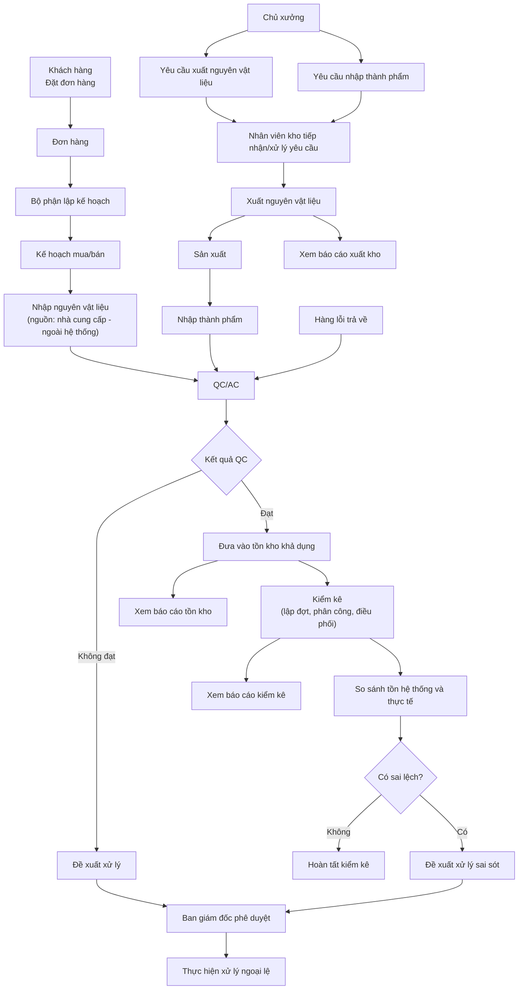
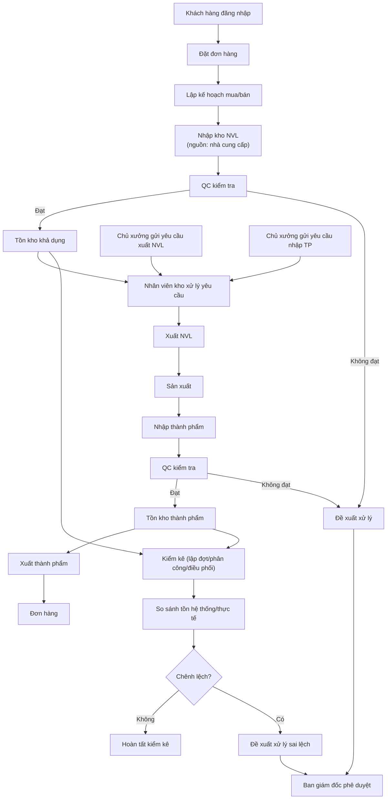
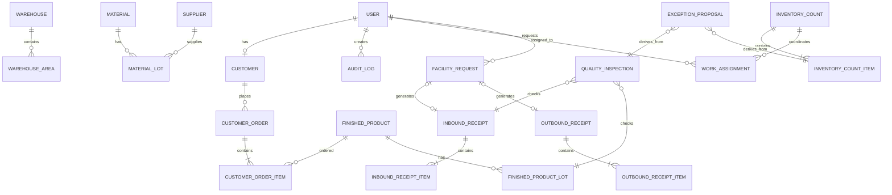
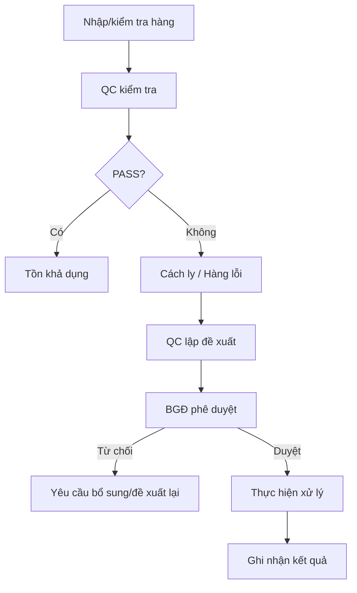
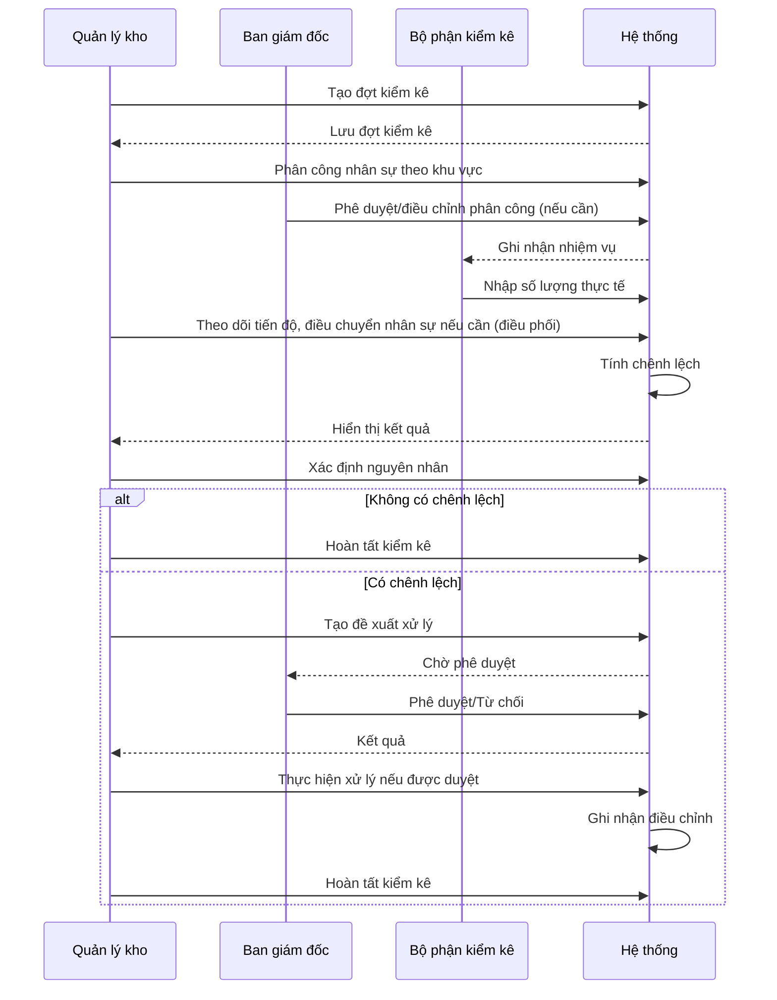

# SRS – HỆ THỐNG QUẢN LÝ KHO VÀ VẬN HÀNH SẢN XUẤT

> **Software Requirements Specification (SRS)**
> Phiên bản: 2.0
> Ngôn ngữ: Tiếng Việt
> Phạm vi: Quản lý đơn hàng, lập kế hoạch, nhập/xuất kho, QC/AC, kiểm kê, xử lý sai lệch, yêu cầu của chủ xưởng, phân công công việc và báo cáo quản trị.
> Tài liệu này thay thế bản v1.0 (`SRS_He_Thong_Quan_Ly_Kho.md`), được cập nhật theo danh sách 25 Use Case đã được thống nhất với stakeholder (xem `Dac_ta_Use_Case.docx`).

---

## 0. Ghi chú thay đổi so với SRS v1.0

| # | Thay đổi | Lý do |
|---|---|---|
| 1 | Bỏ toàn bộ UC/BR/FR/Actor liên quan đến **Mua hàng** (UC06 cũ) và **PurchaseOrder** | Stakeholder xác nhận bỏ khỏi phạm vi hệ thống này |
| 2 | Gộp **Gửi kết quả QC** (UC13 cũ) vào **Quản lý kết quả kiểm tra chất lượng** như một thao tác "Gửi" | Tránh tách UC không cần thiết cho một thao tác đơn lẻ trên cùng danh sách |
| 3 | Đổi tên UC Báo cáo tồn kho/xuất kho/kiểm kê → **Xem báo cáo tồn kho/xuất kho/kiểm kê** | Làm rõ đây là chức năng chỉ đọc |
| 4 | Đổi tên **Gửi yêu cầu nhập/xuất của chủ xưởng** → **Yêu cầu nhập xuất** | Rút gọn theo yêu cầu stakeholder |
| 5 | Bỏ Actor phụ (QC/AC) khỏi UC **Nhập kho** | QC/AC không trực tiếp thao tác trong luồng nhập kho |
| 6 | Đánh số lại liên tục **UC01–UC25** (khớp với `Dac_ta_Use_Case.docx`) | Đồng bộ số UC giữa các tài liệu |
| 7 | **Bổ sung FR, entity dữ liệu, dòng phân quyền** cho UC Yêu cầu nhập xuất, Quản lý yêu cầu của chủ xưởng, Phân công công việc, Điều phối kiểm kê | Các UC này có trong UC Diagram của bản v1.0 nhưng **chưa được đặc tả FR** — cần bổ sung để FR đủ dùng cho việc build API |
| 8 | Đánh số lại toàn bộ Actor (ACT01–ACT08), Business Goal, Business Requirement, Functional Requirement, Business Rule | Loại bỏ khoảng trống do mục (1) và giữ số liên tục sau khi bổ sung mục (7) |

Bảng đối chiếu UC cũ → UC mới giống hệt bảng đã gửi trong `Dac_ta_Use_Case.docx` (UC06 cũ bị bỏ, UC13 cũ gộp vào UC11 mới, các UC còn lại dịch số).

---

# 1. Bối cảnh nghiệp vụ và vấn đề cần giải quyết

## 1.1. Bối cảnh

Doanh nghiệp có hoạt động tiếp nhận nguyên vật liệu (từ nguồn cung ứng bên ngoài), sản xuất thành phẩm, kiểm tra chất lượng, lưu kho, xuất nguyên vật liệu cho sản xuất, xuất thành phẩm cho khách hàng và xử lý hàng lỗi/sai lệch kiểm kê.

Các nghiệp vụ liên quan đến kho có sự tham gia của nhiều bộ phận:

- Khách hàng.
- Bộ phận lập kế hoạch.
- Chủ xưởng.
- Quản lý kho.
- Nhân viên kho.
- Bộ phận QC/AC.
- Bộ phận kiểm kê.
- Ban giám đốc.

> **Lưu ý phạm vi:** Nghiệp vụ mua nguyên vật liệu từ nhà cung cấp (đặt hàng, theo dõi đơn mua) được thực hiện **ngoài hệ thống này** (thủ công hoặc hệ thống khác). Hệ thống chỉ cần lưu danh mục **Nhà cung cấp** và cho phép gắn nhà cung cấp làm **nguồn nhập** khi tạo phiếu nhập kho, để phục vụ truy vết — xem mục 4.2 (Out of Scope) và FR33.

Nếu không có hệ thống tập trung, dữ liệu tồn kho, nhập kho, xuất kho, chất lượng và kiểm kê dễ bị phân tán, dẫn đến sai lệch giữa số liệu hệ thống và số lượng thực tế.

## 1.2. Business Problem

Doanh nghiệp cần giải quyết các vấn đề:

- Theo dõi tồn kho chưa tập trung.
- Khó kiểm soát chính xác số lượng nguyên vật liệu, thành phẩm và hàng lỗi.
- Quy trình nhập kho và xuất kho có nhiều bên tham gia nhưng thiếu luồng kiểm soát thống nhất.
- Khó liên kết nguyên vật liệu/thành phẩm với lô hàng.
- Kết quả kiểm tra chất lượng chưa được liên kết chặt với nghiệp vụ nhập kho/xuất kho.
- Quy trình xử lý hàng lỗi và sai lệch kiểm kê cần có đề xuất và phê duyệt.
- Việc lập kế hoạch mua nguyên vật liệu và bán hàng cần liên kết với tồn kho.
- Việc kiểm kê cần có đợt kiểm kê, người thực hiện, kết quả và chênh lệch rõ ràng.
- Chủ xưởng cần một kênh chính thức để gửi yêu cầu nhập thành phẩm/xuất nguyên vật liệu và theo dõi trạng thái xử lý, thay vì trao đổi thủ công.
- Quản lý kho cần phân công công việc và điều phối nhân sự kiểm kê một cách có ghi nhận, thay vì phân công miệng.
- Ban giám đốc cần báo cáo tồn kho, xuất kho và kiểm kê để ra quyết định.
- Cần kiểm soát quyền của từng bộ phận để tránh một người thực hiện toàn bộ quy trình.
- Cần lưu lịch sử thao tác đối với các nghiệp vụ quan trọng.

## 1.3. Vấn đề cốt lõi

Hệ thống cần số hóa và liên kết chuỗi nghiệp vụ:

**Đơn hàng → Kế hoạch → Yêu cầu/nguồn nhập → Nhập kho/Xuất kho → QC/AC → Tồn kho → Kiểm kê → Sai lệch → Đề xuất xử lý → Phê duyệt → Báo cáo.**

---

# 2. Stakeholders và Actors

## 2.1. Danh sách Actor

| Mã | Actor | Vai trò |
|---|---|---|
| ACT01 | Khách hàng | Đặt và theo dõi đơn hàng |
| ACT02 | Bộ phận lập kế hoạch | Lập và quản lý kế hoạch mua nguyên vật liệu/bán hàng |
| ACT03 | Ban giám đốc | Phê duyệt, điều phối, xem báo cáo |
| ACT04 | Bộ phận QC/AC | Kiểm tra chất lượng và đề xuất xử lý |
| ACT05 | Quản lý kho | Quản lý dữ liệu kho, theo dõi nhập/xuất, xử lý yêu cầu chủ xưởng, phân công công việc, lập/điều phối kiểm kê |
| ACT06 | Nhân viên kho | Thực hiện nhập kho/xuất kho |
| ACT07 | Chủ xưởng | Gửi và theo dõi yêu cầu nhập thành phẩm/xuất nguyên vật liệu |
| ACT08 | Bộ phận kiểm kê | Thực hiện kiểm kê thực tế |

> So với v1.0: đã **bỏ ACT08 Bộ phận mua hàng** (không còn UC nào dùng actor này); ACT09 Bộ phận kiểm kê cũ đổi thành ACT08.

## 2.2. Stakeholder matrix

| Stakeholder | Quyền lực | Mức quan tâm | Vai trò |
|---|---:|---:|---|
| Ban giám đốc | Cao | Cao | Phê duyệt và ra quyết định |
| Quản lý kho | Cao | Cao | Quản trị nghiệp vụ kho, xử lý yêu cầu chủ xưởng, phân công công việc |
| Lập kế hoạch | Trung bình/Cao | Cao | Điều phối kế hoạch |
| QC/AC | Trung bình | Cao | Kiểm soát chất lượng |
| Nhân viên kho | Trung bình | Cao | Thực hiện nghiệp vụ vật lý |
| Chủ xưởng | Trung bình | Cao | Yêu cầu cấp phát/tiếp nhận sản xuất |
| Kiểm kê | Trung bình | Cao | Xác nhận số lượng thực tế |
| Khách hàng | Thấp | Cao | Phát sinh nhu cầu bán hàng |

---

# 3. Mục tiêu nghiệp vụ (Business Goals)

| Mã | Business Goal |
|---|---|
| BG01 | Quản lý tập trung danh mục kho, nhà cung cấp, nguyên vật liệu, thành phẩm, hàng lỗi và thông tin lô. |
| BG02 | Cho phép khách hàng tạo và theo dõi đơn hàng. |
| BG03 | Cho phép bộ phận lập kế hoạch lập kế hoạch mua nguyên vật liệu và bán hàng. |
| BG04 | Kiểm soát quy trình nhập kho nguyên vật liệu, thành phẩm và hàng lỗi trả về. |
| BG05 | Kiểm soát quy trình xuất kho nguyên vật liệu, thành phẩm và hàng lỗi trả về. |
| BG06 | Liên kết nghiệp vụ kho với lô hàng và trạng thái chất lượng. |
| BG07 | Quản lý kết quả kiểm tra chất lượng, gửi kết quả và đề xuất xử lý hàng không đạt. |
| BG08 | Tổ chức các đợt kiểm kê và ghi nhận chênh lệch. |
| BG09 | Kiểm soát việc đề xuất và phê duyệt xử lý sai lệch/ngoại lệ. |
| BG10 | Cho phép Chủ xưởng gửi yêu cầu nhập thành phẩm/xuất nguyên vật liệu và theo dõi trạng thái xử lý. |
| BG11 | Hỗ trợ Quản lý kho/Ban giám đốc phân công công việc và điều phối nhân sự kiểm kê. |
| BG12 | Cung cấp báo cáo tồn kho, xuất kho và kiểm kê cho Ban giám đốc. |
| BG13 | Phân quyền người dùng theo đúng trách nhiệm nghiệp vụ. |
| BG14 | Lưu vết các thao tác quan trọng để phục vụ kiểm tra và truy xuất. |

---

# 4. Phạm vi hệ thống (Scope)

## 4.1. In Scope

1. Xác thực và phân quyền người dùng.
2. Quản lý đơn hàng khách hàng.
3. Quản lý kế hoạch mua nguyên vật liệu và bán hàng.
4. Quản lý khu vực kho.
5. Quản lý nhà cung cấp (danh mục phục vụ gắn nguồn nhập).
6. Quản lý nguyên vật liệu.
7. Quản lý thành phẩm.
8. Quản lý hàng lỗi.
9. Quản lý lô nguyên vật liệu.
10. Quản lý lô thành phẩm.
11. Quản lý phiếu nhập kho.
12. Quản lý phiếu xuất kho.
13. Nhập nguyên vật liệu.
14. Nhập thành phẩm.
15. Nhập hàng lỗi trả về.
16. Xuất nguyên vật liệu.
17. Xuất thành phẩm.
18. Xuất hàng lỗi trả về.
19. Quản lý kết quả QC/AC (bao gồm thao tác Gửi kết quả).
20. Đề xuất xử lý hàng không đạt.
21. Lập đợt kiểm kê.
22. Phân công/điều phối kiểm kê (thực hiện bởi Quản lý kho/Ban giám đốc).
23. Thực hiện kiểm kê.
24. Ghi nhận chênh lệch kiểm kê.
25. Đề xuất xử lý sai sót.
26. Phê duyệt đề xuất xử lý ngoại lệ.
27. Xem báo cáo tồn kho.
28. Xem báo cáo xuất kho.
29. Xem báo cáo kiểm kê.
30. Tra cứu dữ liệu danh mục và lịch sử nghiệp vụ.
31. Yêu cầu nhập xuất (Chủ xưởng gửi yêu cầu nhập thành phẩm/xuất nguyên vật liệu).
32. Quản lý yêu cầu của chủ xưởng (Nhân viên kho tiếp nhận, thêm hộ, cập nhật trạng thái).
33. Phân công công việc (Quản lý kho giao việc cho nhân viên/bộ phận).

## 4.2. Out of Scope / cần xác nhận

- **Mua hàng nguyên vật liệu / Quản lý đơn mua hàng** — thực hiện ngoài hệ thống này theo xác nhận của stakeholder; hệ thống chỉ giữ danh mục Nhà cung cấp làm tham chiếu.
- Quản lý công thức/BOM sản xuất.
- Lập lịch sản xuất chi tiết.
- Tính giá vốn.
- Kế toán công nợ.
- Thanh toán nhà cung cấp.
- Quản lý vận chuyển.
- Tích hợp ERP/kế toán bên ngoài.
- Quét barcode/QR code.
- Tích hợp cân điện tử.
- Tự động dự báo nhu cầu bằng AI/ML.
- Tích hợp email/SMS/Zalo.
- Quản lý nhiều công ty/chi nhánh nếu chưa có yêu cầu.
- Chính sách FIFO/FEFO cụ thể nếu doanh nghiệp chưa xác nhận.
- Hạn sử dụng bắt buộc hay không.
- Định mức tồn kho tối thiểu/tối đa.

---

# 5. Business Requirements

| Mã | Tên | Mô tả |
|---|---|---|
| BR01 | Quản lý tài khoản | Hệ thống phải xác thực người dùng và phân quyền theo Actor. |
| BR02 | Quản lý đơn hàng khách hàng | Hệ thống phải tiếp nhận và quản lý đơn hàng của khách hàng. |
| BR03 | Lập kế hoạch | Hệ thống phải hỗ trợ lập, sửa, xóa, xem kế hoạch mua nguyên vật liệu và bán hàng. |
| BR04 | Quản lý danh mục kho | Hệ thống phải quản lý khu vực kho, nhà cung cấp, nguyên vật liệu, thành phẩm, hàng lỗi và lô. |
| BR05 | Nhập kho | Hệ thống phải ghi nhận các nghiệp vụ nhập kho. |
| BR06 | Xuất kho | Hệ thống phải ghi nhận các nghiệp vụ xuất kho. |
| BR07 | QC/AC | Hệ thống phải ghi nhận, quản lý và cho gửi kết quả kiểm tra chất lượng. |
| BR08 | Xử lý hàng lỗi & ngoại lệ | Hệ thống phải hỗ trợ đề xuất và phê duyệt xử lý hàng không đạt và sai lệch kiểm kê. |
| BR09 | Kiểm kê | Hệ thống phải hỗ trợ lập, phân công, thực hiện và hoàn tất đợt kiểm kê. |
| BR10 | Yêu cầu của chủ xưởng | Hệ thống phải cho phép Chủ xưởng gửi yêu cầu nhập/xuất và Nhân viên kho quản lý, xử lý yêu cầu đó. |
| BR11 | Phân công công việc & điều phối kiểm kê | Hệ thống phải cho phép giao việc, theo dõi và điều chuyển nhân sự kiểm kê. |
| BR12 | Báo cáo & tra cứu | Hệ thống phải cung cấp báo cáo tồn kho, xuất kho, kiểm kê và tra cứu danh mục/lịch sử. |
| BR13 | Phân quyền | Người dùng chỉ được thao tác chức năng và dữ liệu thuộc phạm vi quyền. |
| BR14 | Audit | Hệ thống phải lưu lịch sử các thao tác quan trọng. |

---

# 6. Business Process tổng thể



---

# 7. Phân rã Functional Requirements

> Đây là phần trọng yếu để build API. Mỗi FR tương ứng tối thiểu một endpoint hoặc một action trong endpoint đã liệt kê ở Mục 25.

## 7.1. BR01 – Quản lý tài khoản

| Mã | Functional Requirement | Mô tả | UC liên quan |
|---|---|---|---|
| FR01 | Đăng nhập | Người dùng đăng nhập bằng thông tin xác thực hợp lệ. | UC01 |
| FR02 | Xác thực tài khoản | Hệ thống kiểm tra tài khoản tồn tại và trạng thái hoạt động. | UC01 |
| FR03 | Phân quyền | Hệ thống xác định Actor và quyền sau đăng nhập. | UC01 |
| FR04 | Đăng xuất | Người dùng có thể kết thúc phiên làm việc. | UC01 |
| FR05 | Từ chối truy cập | Hệ thống từ chối chức năng không thuộc quyền người dùng. | Tất cả UC |

## 7.2. BR02 – Đơn hàng khách hàng

| Mã | Functional Requirement | Mô tả | UC liên quan |
|---|---|---|---|
| FR06 | Thêm đơn hàng | Khách hàng tạo đơn hàng mới. | UC02 |
| FR07 | Sửa đơn hàng | Khách hàng/Nhân viên được sửa đơn hàng khi trạng thái cho phép. | UC03 |
| FR08 | Xem đơn hàng | Xem danh sách và chi tiết đơn hàng theo phạm vi quyền. | UC02, UC03 |
| FR09 | Kiểm tra đơn hàng | Hệ thống kiểm tra các trường bắt buộc trước khi lưu. | UC02, UC03 |
| FR10 | Quản lý trạng thái đơn hàng | Hệ thống lưu trạng thái đơn hàng theo vòng đời nghiệp vụ. | UC03 |

## 7.3. BR03 – Lập kế hoạch

| Mã | Functional Requirement | Mô tả | UC liên quan |
|---|---|---|---|
| FR11 | Tạo kế hoạch mua | Lập kế hoạch mua nguyên vật liệu. | UC04 |
| FR12 | Tạo kế hoạch bán | Lập kế hoạch bán hàng. | UC04 |
| FR13 | Sửa kế hoạch | Cho phép sửa kế hoạch khi chưa khóa/chốt. | UC05 |
| FR14 | Xóa kế hoạch | Cho phép xóa kế hoạch theo quyền và trạng thái. | UC05 |
| FR15 | Xem kế hoạch | Xem danh sách và chi tiết kế hoạch. | UC04, UC05 |
| FR16 | Liên kết kế hoạch | Liên kết kế hoạch với mặt hàng, số lượng, thời gian và nghiệp vụ liên quan (nhập kho). | UC04, UC05 |

## 7.4. BR04 – Quản lý danh mục kho

| Mã | Functional Requirement | Mô tả | UC liên quan |
|---|---|---|---|
| FR17 | Quản lý khu vực kho | Thêm, sửa, xóa, xem khu vực kho. | UC06 |
| FR18 | Quản lý nhà cung cấp | Thêm, sửa, xóa, xem nhà cung cấp (dùng làm nguồn nhập). | UC06 |
| FR19 | Quản lý nguyên vật liệu | Thêm, sửa, xóa, xem nguyên vật liệu. | UC06 |
| FR20 | Quản lý thành phẩm | Thêm, sửa, xóa, xem thành phẩm. | UC06 |
| FR21 | Quản lý hàng lỗi | Thêm, sửa, xóa, xem loại hàng lỗi. | UC06 |
| FR22 | Quản lý lô nguyên vật liệu | Tạo và tra cứu lô nguyên vật liệu. | UC06 |
| FR23 | Quản lý lô thành phẩm | Tạo và tra cứu lô thành phẩm. | UC06 |
| FR24 | Tra cứu danh mục | Tìm kiếm/lọc theo các thuộc tính được phép. | UC21 |
| FR25 | Kiểm tra tham chiếu | Không cho xóa danh mục đang được nghiệp vụ khác tham chiếu nếu việc xóa làm mất tính toàn vẹn dữ liệu. | UC06 |

## 7.5. BR05 – Nhập kho

| Mã | Functional Requirement | Mô tả | UC liên quan |
|---|---|---|---|
| FR26 | Nhập nguyên vật liệu | Nhân viên kho ghi nhận nguyên vật liệu nhập kho. | UC09 |
| FR27 | Nhập thành phẩm | Nhân viên kho ghi nhận thành phẩm nhập kho. | UC09 |
| FR28 | Nhập hàng lỗi trả về | Nhân viên kho ghi nhận hàng lỗi trả về. | UC09 |
| FR29 | Chọn lô khi nhập | Phiếu nhập phải xác định lô khi mặt hàng được quản lý theo lô. | UC09 |
| FR30 | Chọn khu vực kho khi nhập | Phiếu nhập xác định vị trí lưu trữ. | UC09 |
| FR31 | Ghi nhận số lượng thực nhập | Hệ thống lưu số lượng thực tế nhập. | UC09 |
| FR32 | Ghi nhận thời gian nhập | Hệ thống lưu ngày/giờ nhập kho. | UC09 |
| FR33 | Gắn nguồn nhập | Ghi nhận nguồn nhập (nhà cung cấp, sản xuất nội bộ, hoặc trả về từ khách hàng/xưởng). | UC07, UC09 |
| FR34 | Xác nhận phiếu nhập | Phiếu nhập chỉ làm thay đổi tồn kho sau khi đạt trạng thái xác nhận theo quy trình. | UC09 |

## 7.6. BR06 – Xuất kho

| Mã | Functional Requirement | Mô tả | UC liên quan |
|---|---|---|---|
| FR35 | Xuất nguyên vật liệu | Nhân viên kho thực hiện xuất nguyên vật liệu. | UC10 |
| FR36 | Xuất thành phẩm | Nhân viên kho thực hiện xuất thành phẩm. | UC10 |
| FR37 | Xuất hàng lỗi trả về | Hệ thống ghi nhận nghiệp vụ xuất hàng lỗi trả về khi có nghiệp vụ phù hợp. | UC10 |
| FR38 | Kiểm tra tồn khả dụng | Hệ thống kiểm tra số lượng có thể xuất trước khi xác nhận. | UC10 |
| FR39 | Chọn lô xuất | Xác định lô cần xuất khi mặt hàng quản lý theo lô. | UC10 |
| FR40 | Xác định nơi nhận | Ghi nhận bộ phận/đơn hàng/yêu cầu chủ xưởng/đối tượng nhận. | UC08, UC10 |
| FR41 | Xác nhận phiếu xuất | Chỉ phiếu xuất hợp lệ mới làm giảm tồn kho. | UC10 |
| FR42 | Từ chối xuất thiếu tồn | Không cho xác nhận xuất vượt số lượng tồn khả dụng, trừ trường hợp ngoại lệ được thiết kế và phê duyệt. | UC10 |

## 7.7. BR07 – QC/AC

| Mã | Functional Requirement | Mô tả | UC liên quan |
|---|---|---|---|
| FR43 | Tạo kết quả kiểm tra | QC/AC tạo kết quả kiểm tra chất lượng. | UC11 |
| FR44 | Sửa kết quả kiểm tra | Sửa kết quả khi bản ghi chưa gửi/chưa khóa. | UC11 |
| FR45 | Xóa kết quả kiểm tra | Xóa khi nghiệp vụ cho phép và không làm mất dữ liệu bắt buộc. | UC11 |
| FR46 | Xem kết quả kiểm tra | Người có quyền xem kết quả kiểm tra. | UC11 |
| FR47 | Gửi kết quả kiểm tra | QC/AC gửi kết quả đến bộ phận liên quan; hệ thống ghi người gửi và thời gian. | UC11 |
| FR48 | Xác định đạt/không đạt | Ghi nhận kết luận chất lượng PASS/FAIL. | UC11 |
| FR49 | Khởi tạo đề xuất khi FAIL | Cho phép tạo đề xuất xử lý ngay từ kết quả không đạt (điều hướng sang BR08). | UC11, UC12 |
| FR50 | Theo dõi trạng thái gửi | Theo dõi trạng thái NHÁP/ĐÃ KIỂM TRA/ĐÃ GỬI của kết quả. | UC11 |

## 7.8. BR08 – Xử lý hàng lỗi & ngoại lệ

| Mã | Functional Requirement | Mô tả | UC liên quan |
|---|---|---|---|
| FR51 | Đề xuất xử lý hàng không đạt | QC/AC tạo đề xuất xử lý đối với hàng không đạt. | UC12 |
| FR52 | Đề xuất xử lý sai lệch kiểm kê | Quản lý kho lập đề xuất khi có sai lệch kiểm kê. | UC16 |
| FR53 | Gửi phê duyệt | Chuyển đề xuất đến Ban giám đốc. | UC12, UC16 |
| FR54 | Phê duyệt | Ban giám đốc phê duyệt đề xuất. | UC17 |
| FR55 | Từ chối đề xuất | Ban giám đốc từ chối và ghi nhận lý do bắt buộc. | UC17 |
| FR56 | Thực hiện quyết định | Bộ phận có trách nhiệm thực hiện phương án đã được duyệt. | UC16, UC17 |
| FR57 | Ghi nhận kết quả xử lý | Lưu kết quả và thời điểm hoàn tất. | UC12, UC16, UC17 |

## 7.9. BR09 – Kiểm kê

| Mã | Functional Requirement | Mô tả | UC liên quan |
|---|---|---|---|
| FR58 | Lập đợt kiểm kê | Quản lý kho tạo đợt kiểm kê. | UC13 |
| FR59 | Chọn phạm vi kiểm kê | Chọn kho/khu vực/mặt hàng/lô theo phạm vi kiểm kê. | UC13 |
| FR60 | Phân công kiểm kê | Quản lý kho/Ban giám đốc phân công nhân sự theo quyền được cấu hình. | UC14 |
| FR61 | Thực hiện kiểm kê | Bộ phận kiểm kê nhập số lượng thực tế. | UC15 |
| FR62 | Khóa dữ liệu kiểm kê | Kiểm soát việc chỉnh sửa số liệu sau khi chốt theo quy trình. | UC15 |
| FR63 | Tính chênh lệch | Hệ thống so sánh số lượng hệ thống và thực tế. | UC15, UC16 |
| FR64 | Xác nhận kết quả | Hoàn tất đợt kiểm kê sau khi xử lý các điều kiện bắt buộc. | UC16 |
| FR65 | Xuất báo cáo kiểm kê | Cung cấp kết quả kiểm kê và chênh lệch. | UC20 |

## 7.10. BR10 – Yêu cầu của chủ xưởng *(bổ sung mới)*

| Mã | Functional Requirement | Mô tả | UC liên quan |
|---|---|---|---|
| FR66 | Tạo yêu cầu nhập/xuất | Chủ xưởng tạo yêu cầu nhập thành phẩm hoặc xuất nguyên vật liệu, chọn mặt hàng, số lượng, thời gian mong muốn. | UC22 |
| FR67 | Xem yêu cầu | Chủ xưởng xem yêu cầu của mình; Nhân viên kho/Quản lý kho xem toàn bộ yêu cầu theo quyền. | UC22, UC23 |
| FR68 | Thêm yêu cầu hộ | Nhân viên kho tạo yêu cầu thay cho chủ xưởng (ghi nhận qua kênh khác). | UC23 |
| FR69 | Sửa yêu cầu | Sửa nội dung yêu cầu khi chưa được tiếp nhận xử lý. | UC23 |
| FR70 | Cập nhật trạng thái xử lý yêu cầu | Nhân viên kho chuyển trạng thái: Mới → Đã tiếp nhận → Đang xử lý → Hoàn tất/Từ chối. | UC23 |
| FR71 | Hủy yêu cầu | Chủ xưởng hủy yêu cầu trước khi được tiếp nhận. | UC22 |
| FR72 | Liên kết yêu cầu với phiếu nhập/xuất | Khi yêu cầu được xử lý, hệ thống liên kết yêu cầu với phiếu nhập kho/xuất kho phát sinh. | UC23 |

## 7.11. BR11 – Phân công công việc & điều phối kiểm kê *(bổ sung mới)*

| Mã | Functional Requirement | Mô tả | UC liên quan |
|---|---|---|---|
| FR73 | Tạo phân công công việc | Quản lý kho giao việc cho nhân viên/bộ phận, có nội dung và hạn (nếu có). | UC24 |
| FR74 | Xem danh sách phân công | Xem phân công theo người giao/người nhận. | UC24, UC25 |
| FR75 | Điều chỉnh phân công | Cập nhật người phụ trách/nội dung của phân công đã giao. | UC24, UC14 |
| FR76 | Theo dõi tiến độ kiểm kê | Hiển thị tiến độ kiểm kê theo từng khu vực/nhân viên trong đợt đang diễn ra. | UC25 |
| FR77 | Điều chuyển nhân sự kiểm kê | Điều chuyển nhân viên kiểm kê giữa các khu vực khi đợt kiểm kê đang thực hiện. | UC25 |
| FR78 | Ghi nhận hoàn thành phân công | Cập nhật trạng thái hoàn tất của công việc/phân công. | UC24, UC25 |

## 7.12. BR12 – Báo cáo & tra cứu

| Mã | Functional Requirement | Mô tả | UC liên quan |
|---|---|---|---|
| FR79 | Xem báo cáo tồn kho | Hiển thị tồn theo mặt hàng, kho, khu vực và lô theo quyền. | UC18 |
| FR80 | Xem báo cáo xuất kho | Thống kê phiếu xuất và số lượng xuất. | UC19 |
| FR81 | Xem báo cáo kiểm kê | Hiển thị số hệ thống, số thực tế và chênh lệch. | UC20 |
| FR82 | Lọc báo cáo | Cho phép lọc theo thời gian và các tiêu chí phù hợp. | UC18, UC19, UC20 |
| FR83 | Xem chi tiết | Cho phép drill-down từ báo cáo đến dữ liệu nghiệp vụ nếu có quyền. | UC18, UC19, UC20 |
| FR84 | Xuất báo cáo | Cho phép xuất file theo định dạng được hệ thống hỗ trợ. | UC18, UC19, UC20 |
| FR85 | Tra cứu danh mục và lịch sử | Tìm kiếm, lọc, xem chi tiết/trạng thái danh mục và lịch sử nghiệp vụ theo phạm vi quyền. | UC21 |

## 7.13. Cross-cutting

| Mã | Functional Requirement | Mô tả | UC liên quan |
|---|---|---|---|
| FR86 | Ghi Audit Log | Ghi log cho các thao tác thêm/sửa/xóa/xác nhận/gửi/phê duyệt/từ chối theo danh sách Mục 19. | Tất cả UC có ghi/sửa dữ liệu |

---

# 8. Business Rules

| Mã | Quy tắc | Nội dung |
|---|---|---|
| BRULE01 | Đăng nhập bắt buộc | Các chức năng nghiệp vụ chỉ được sử dụng sau khi xác thực. |
| BRULE02 | Phân quyền | Người dùng chỉ được thực hiện chức năng thuộc quyền của Actor. |
| BRULE03 | Dữ liệu theo phạm vi quyền | Người dùng chỉ xem/sửa dữ liệu thuộc phạm vi được cấp. |
| BRULE04 | Đơn hàng hợp lệ | Đơn hàng phải có các trường bắt buộc trước khi lưu. |
| BRULE05 | Kế hoạch chưa chốt | Chỉ kế hoạch chưa chốt mới được sửa/xóa. |
| BRULE06 | Phiếu nhập hợp lệ | Phiếu nhập phải có loại nhập, mặt hàng, số lượng và thông tin kho cần thiết. |
| BRULE07 | Phiếu xuất hợp lệ | Phiếu xuất phải có loại xuất, mặt hàng, số lượng và đối tượng nhận cần thiết. |
| BRULE08 | Không xuất vượt tồn | Không cho phép xuất vượt số lượng tồn khả dụng trong điều kiện thông thường. |
| BRULE09 | Quản lý theo lô | Mặt hàng đã cấu hình quản lý theo lô phải được nhập/xuất gắn với lô. |
| BRULE10 | Tồn kho cập nhật khi xác nhận | Chỉ nghiệp vụ đạt trạng thái xác nhận hợp lệ mới làm thay đổi tồn kho. |
| BRULE11 | Không sửa phiếu đã khóa | Phiếu đã khóa/chốt không được sửa trực tiếp. |
| BRULE12 | QC ảnh hưởng trạng thái hàng | Hàng không đạt không được coi là tồn kho khả dụng cho mục đích sử dụng thông thường nếu quy trình chất lượng quy định phải cách ly. |
| BRULE13 | Kết quả QC có đối tượng rõ ràng | Kết quả QC phải liên kết với đối tượng kiểm tra, lô hoặc nghiệp vụ liên quan. |
| BRULE14 | Đề xuất phải có lý do | Đề xuất xử lý ngoại lệ/sai lệch phải có nguyên nhân hoặc mô tả. |
| BRULE15 | Phê duyệt tách biệt | Người tạo đề xuất không mặc nhiên được coi là người phê duyệt đề xuất đó. |
| BRULE16 | Từ chối phải có lý do | Khi từ chối đề xuất, Ban giám đốc phải ghi nhận lý do. |
| BRULE17 | Kiểm kê có phạm vi | Mỗi đợt kiểm kê phải xác định phạm vi trước khi thực hiện. |
| BRULE18 | Không tự ý thay đổi số hệ thống | Số lượng hệ thống dùng để đối chiếu phải được truy xuất từ dữ liệu nghiệp vụ tại thời điểm kiểm kê theo chính sách đã xác định. |
| BRULE19 | Chênh lệch phải được ghi nhận | Nếu số thực tế khác số hệ thống, hệ thống phải tạo/ghi nhận chênh lệch. |
| BRULE20 | Chỉ điều chỉnh sau phê duyệt | Nếu chính sách yêu cầu phê duyệt, tồn kho không được điều chỉnh theo chênh lệch trước khi có phê duyệt. |
| BRULE21 | Audit Log | Thao tác thêm/sửa/xóa/xác nhận/gửi/phê duyệt/từ chối phải được ghi log. |
| BRULE22 | Không xóa dữ liệu lịch sử tùy tiện | Dữ liệu đã phát sinh nghiệp vụ không được xóa vật lý nếu việc xóa phá vỡ lịch sử. |
| BRULE23 | Trạng thái phải hợp lệ | Không được chuyển một chứng từ sang trạng thái không hợp lệ với vòng đời nghiệp vụ. |
| BRULE24 | Số lượng phải dương | Số lượng nhập/xuất/kiểm kê phải lớn hơn 0, trừ trường hợp nghiệp vụ đặc biệt được xác định riêng. |
| BRULE25 | Yêu cầu chủ xưởng hợp lệ | Yêu cầu nhập/xuất của chủ xưởng phải có loại yêu cầu, mặt hàng và số lượng trước khi gửi. |
| BRULE26 | Quyền xử lý yêu cầu chủ xưởng | Chỉ Nhân viên kho/Quản lý kho được cập nhật trạng thái xử lý yêu cầu của chủ xưởng. |
| BRULE27 | Phân công rõ ràng | Một phân công công việc phải có người giao, người nhận và trạng thái rõ ràng. |
| BRULE28 | Điều phối trong phạm vi đợt | Điều chuyển nhân sự kiểm kê chỉ được thực hiện trong phạm vi đợt kiểm kê đang hoạt động (chưa hoàn tất). |

---

# 9. Trạng thái nghiệp vụ

## 9.1. Đơn hàng

```text
MỚI → ĐÃ TIẾP NHẬN → ĐANG XỬ LÝ → HOÀN TẤT

MỚI/ĐÃ TIẾP NHẬN/ĐANG XỬ LÝ
  └──> HỦY (nếu điều kiện cho phép)
```

## 9.2. Phiếu nhập kho

```text
NHÁP → CHỜ XÁC NHẬN → ĐÃ XÁC NHẬN
```

Chỉ trạng thái **ĐÃ XÁC NHẬN** làm thay đổi tồn kho theo nghiệp vụ.

## 9.3. Phiếu xuất kho

```text
NHÁP → CHỜ XÁC NHẬN → ĐÃ XÁC NHẬN
```

## 9.4. Kết quả QC

```text
NHÁP → ĐÃ KIỂM TRA → ĐÃ GỬI
                       ├── ĐẠT
                       └── KHÔNG ĐẠT
```

## 9.5. Đề xuất xử lý

```text
NHÁP
  ↓
CHỜ PHÊ DUYỆT
  ├──> ĐÃ PHÊ DUYỆT → ĐANG THỰC HIỆN → ĐÃ HOÀN TẤT
  └──> TỪ CHỐI
```

## 9.6. Đợt kiểm kê

```text
NHÁP → ĐÃ LẬP → ĐANG KIỂM KÊ → CHỜ XỬ LÝ CHÊNH LỆCH → ĐÃ HOÀN TẤT
```

Nếu không có chênh lệch:

```text
ĐANG KIỂM KÊ → KHÔNG CÓ CHÊNH LỆCH → ĐÃ HOÀN TẤT
```

## 9.7. Yêu cầu của chủ xưởng *(bổ sung mới)*

```text
MỚI → ĐÃ TIẾP NHẬN → ĐANG XỬ LÝ → HOÀN TẤT

MỚI
  └──> HỦY (Chủ xưởng hủy trước khi tiếp nhận)

ĐÃ TIẾP NHẬN/ĐANG XỬ LÝ
  └──> TỪ CHỐI (Nhân viên kho/Quản lý kho từ chối, có lý do)
```

## 9.8. Phân công công việc *(bổ sung mới)*

```text
MỚI → ĐANG THỰC HIỆN → HOÀN TẤT

MỚI/ĐANG THỰC HIỆN
  └──> HỦY
```

---

# 10. Use Case Diagram

```mermaid
flowchart LR

    KH["ACT01<br/>Khách hàng"]
    KHPLAN["ACT02<br/>Bộ phận lập kế hoạch"]
    BGD["ACT03<br/>Ban giám đốc"]
    QC["ACT04<br/>QC/AC"]
    QK["ACT05<br/>Quản lý kho"]
    NVK["ACT06<br/>Nhân viên kho"]
    XUONG["ACT07<br/>Chủ xưởng"]
    KK["ACT08<br/>Bộ phận kiểm kê"]

    subgraph SYS["HỆ THỐNG QUẢN LÝ KHO"]
        UC01(("UC01 Đăng nhập"))
        UC02(("UC02 Đặt đơn hàng"))
        UC03(("UC03 Quản lý đơn hàng KH"))
        UC04(("UC04 Lập kế hoạch mua/bán"))
        UC05(("UC05 Quản lý kế hoạch"))
        UC06(("UC06 Quản lý danh mục kho"))
        UC07(("UC07 Theo dõi phiếu nhập"))
        UC08(("UC08 Theo dõi phiếu xuất"))
        UC09(("UC09 Nhập kho"))
        UC10(("UC10 Xuất kho"))
        UC11(("UC11 Quản lý kết quả QC/AC"))
        UC12(("UC12 Đề xuất xử lý hàng lỗi"))
        UC13(("UC13 Lập đợt kiểm kê"))
        UC14(("UC14 Phân công/điều phối kiểm kê"))
        UC15(("UC15 Thực hiện kiểm kê"))
        UC16(("UC16 Xử lý chênh lệch kiểm kê"))
        UC17(("UC17 Phê duyệt đề xuất ngoại lệ"))
        UC18(("UC18 Xem báo cáo tồn kho"))
        UC19(("UC19 Xem báo cáo xuất kho"))
        UC20(("UC20 Xem báo cáo kiểm kê"))
        UC21(("UC21 Tra cứu danh mục"))
        UC22(("UC22 Yêu cầu nhập xuất"))
        UC23(("UC23 Quản lý yêu cầu chủ xưởng"))
        UC24(("UC24 Phân công công việc"))
        UC25(("UC25 Điều phối kiểm kê"))
    end

    KH --> UC01
    KH --> UC02
    KH --> UC03

    KHPLAN --> UC01
    KHPLAN --> UC04
    KHPLAN --> UC05

    BGD --> UC01
    BGD --> UC17
    BGD --> UC18
    BGD --> UC19
    BGD --> UC20

    QC --> UC01
    QC --> UC11
    QC --> UC12

    QK --> UC01
    QK --> UC06
    QK --> UC07
    QK --> UC08
    QK --> UC13
    QK --> UC14
    QK --> UC16
    QK --> UC21
    QK --> UC23
    QK --> UC24
    QK --> UC25

    NVK --> UC01
    NVK --> UC09
    NVK --> UC10
    NVK --> UC23

    XUONG --> UC01
    XUONG --> UC22

    KK --> UC01
    KK --> UC15
```



---

# 11. Luồng nghiệp vụ chính



---

# 12. Đặc tả Use Case (tóm tắt)

> Danh sách đầy đủ **Main flow / Alternative flow / Exception flow** cho cả 25 UC đã có trong tài liệu `Dac_ta_Use_Case.docx` (đã gửi trước đó). Bảng dưới đây chỉ tóm tắt để đối chiếu nhanh với FR/BR; không lặp lại nội dung chi tiết luồng.

| UC | Tên | Actor chính | Actor phụ | FR liên quan |
|---|---|---|---|---|
| UC01 | Đăng nhập | Tất cả Actor | — | FR01–FR05 |
| UC02 | Đặt đơn hàng | Khách hàng | — | FR06, FR08, FR09 |
| UC03 | Quản lý đơn hàng khách hàng (thêm, sửa) | Khách hàng | — | FR07, FR08, FR09, FR10 |
| UC04 | Lập kế hoạch mua/bán | Bộ phận lập kế hoạch | — | FR11, FR12, FR15, FR16 |
| UC05 | Quản lý kế hoạch (thêm, sửa, xóa) | Bộ phận lập kế hoạch | — | FR13, FR14, FR15 |
| UC06 | Quản lý danh mục kho (thêm, sửa, xóa) | Quản lý kho | — | FR17–FR23, FR25 |
| UC07 | Theo dõi phiếu nhập kho | Quản lý kho | — | FR33, FR40 (đọc) |
| UC08 | Theo dõi phiếu xuất kho | Quản lý kho | — | FR40 (đọc) |
| UC09 | Nhập kho | Nhân viên kho | — | FR26–FR34 |
| UC10 | Xuất kho | Nhân viên kho | — | FR35–FR42 |
| UC11 | Quản lý kết quả kiểm tra chất lượng (thêm, sửa, gửi) | Bộ phận QC/AC | — | FR43–FR50 |
| UC12 | Đề xuất xử lý hàng lỗi | Bộ phận QC/AC | — | FR49, FR51, FR53, FR57 |
| UC13 | Lập đợt kiểm kê | Quản lý kho | — | FR58, FR59 |
| UC14 | Phân công/điều phối kiểm kê | Quản lý kho | Bộ phận kiểm kê | FR60, FR75 |
| UC15 | Thực hiện kiểm kê | Bộ phận kiểm kê | — | FR61–FR63 |
| UC16 | Xử lý chênh lệch kiểm kê | Quản lý kho | — | FR52, FR53, FR56, FR57, FR63, FR64 |
| UC17 | Phê duyệt đề xuất xử lý ngoại lệ | Ban giám đốc | — | FR54–FR57 |
| UC18 | Xem báo cáo tồn kho | Ban giám đốc | — | FR79, FR82–FR84 |
| UC19 | Xem báo cáo xuất kho | Ban giám đốc | — | FR80, FR82–FR84 |
| UC20 | Xem báo cáo kiểm kê | Ban giám đốc | — | FR65, FR81–FR84 |
| UC21 | Tra cứu danh mục | Quản lý kho | — | FR24, FR85 |
| UC22 | Yêu cầu nhập xuất | Chủ xưởng | — | FR66, FR67, FR71 |
| UC23 | Quản lý yêu cầu của chủ xưởng (thêm, sửa) | Nhân viên kho | Chủ xưởng | FR67–FR70, FR72 |
| UC24 | Phân công công việc | Quản lý kho | — | FR73–FR75, FR78 |
| UC25 | Điều phối kiểm kê | Quản lý kho | Bộ phận kiểm kê | FR76–FR78 |

---

# 13. Mô hình dữ liệu

## 13.1. User

| Thuộc tính | Kiểu | Mô tả |
|---|---|---|
| userId | UUID | Mã người dùng |
| fullName | String | Họ tên |
| username | String | Tên đăng nhập |
| passwordHash | String | Mật khẩu đã mã hóa |
| role | Enum | Vai trò (ACT01–ACT08) |
| status | Enum | Trạng thái |
| createdAt | DateTime | Ngày tạo |
| updatedAt | DateTime | Ngày cập nhật |

## 13.2. Customer

| Thuộc tính | Kiểu | Mô tả |
|---|---|---|
| customerId | UUID | Mã khách hàng |
| userId | UUID | Tài khoản |
| customerCode | String | Mã khách hàng |
| fullName | String | Tên |
| phone | String | SĐT |
| email | String | Email |
| address | String | Địa chỉ |
| status | Enum | Trạng thái |

## 13.3. Warehouse

| Thuộc tính | Kiểu | Mô tả |
|---|---|---|
| warehouseId | UUID | Mã kho |
| warehouseCode | String | Mã kho |
| warehouseName | String | Tên kho |
| address | String | Địa chỉ |
| status | Enum | Trạng thái |

## 13.4. WarehouseArea

| Thuộc tính | Kiểu | Mô tả |
|---|---|---|
| areaId | UUID | Mã khu vực |
| warehouseId | UUID | Kho |
| areaCode | String | Mã khu vực |
| areaName | String | Tên khu vực |
| status | Enum | Trạng thái |

## 13.5. Supplier

| Thuộc tính | Kiểu | Mô tả |
|---|---|---|
| supplierId | UUID | Mã NCC |
| supplierCode | String | Mã NCC |
| supplierName | String | Tên NCC |
| phone | String | SĐT |
| email | String | Email |
| address | String | Địa chỉ |
| status | Enum | Trạng thái |

## 13.6. Material

| Thuộc tính | Kiểu | Mô tả |
|---|---|---|
| materialId | UUID | Mã NVL |
| materialCode | String | Mã NVL |
| materialName | String | Tên NVL |
| unit | String | Đơn vị tính |
| lotManaged | Boolean | Có quản lý theo lô |
| status | Enum | Trạng thái |

## 13.7. FinishedProduct

| Thuộc tính | Kiểu | Mô tả |
|---|---|---|
| productId | UUID | Mã thành phẩm |
| productCode | String | Mã TP |
| productName | String | Tên TP |
| unit | String | ĐVT |
| lotManaged | Boolean | Có quản lý theo lô |
| status | Enum | Trạng thái |

## 13.8. DefectiveItem

| Thuộc tính | Kiểu | Mô tả |
|---|---|---|
| defectTypeId | UUID | Mã loại lỗi |
| defectCode | String | Mã lỗi |
| defectName | String | Tên lỗi |
| description | Text | Mô tả |
| status | Enum | Trạng thái |

## 13.9. MaterialLot

| Thuộc tính | Kiểu | Mô tả |
|---|---|---|
| materialLotId | UUID | Mã bản ghi lô |
| materialId | UUID | NVL |
| lotCode | String | Mã lô |
| supplierId | UUID/Nullable | NCC (nếu nguồn nhập là nhà cung cấp) |
| receivedDate | Date | Ngày nhập |
| expiryDate | Date/Nullable | Hạn sử dụng nếu áp dụng |
| status | Enum | Trạng thái |

## 13.10. FinishedProductLot

| Thuộc tính | Kiểu | Mô tả |
|---|---|---|
| productLotId | UUID | Mã bản ghi |
| productId | UUID | Thành phẩm |
| lotCode | String | Mã lô |
| productionDate | Date | Ngày sản xuất |
| expiryDate | Date/Nullable | Hạn sử dụng nếu áp dụng |
| status | Enum | Trạng thái |

## 13.11. CustomerOrder

| Thuộc tính | Kiểu | Mô tả |
|---|---|---|
| orderId | UUID | Mã đơn |
| customerId | UUID | Khách hàng |
| orderDate | DateTime | Ngày đặt |
| status | Enum | Trạng thái |
| note | Text | Ghi chú |
| createdAt | DateTime | Ngày tạo |
| updatedAt | DateTime | Ngày cập nhật |

## 13.12. CustomerOrderItem

| Thuộc tính | Kiểu | Mô tả |
|---|---|---|
| orderItemId | UUID | Mã dòng |
| orderId | UUID | Đơn hàng |
| productId | UUID | Thành phẩm |
| quantity | Decimal | Số lượng |

## 13.13. Plan

| Thuộc tính | Kiểu | Mô tả |
|---|---|---|
| planId | UUID | Mã kế hoạch |
| planCode | String | Mã kế hoạch |
| planType | Enum | PURCHASE/SALES |
| periodStart | Date | Bắt đầu |
| periodEnd | Date | Kết thúc |
| status | Enum | Trạng thái |
| createdBy | UUID | Người lập |

## 13.14. InboundReceipt

| Thuộc tính | Kiểu | Mô tả |
|---|---|---|
| inboundId | UUID | Mã phiếu nhập |
| inboundCode | String | Số phiếu |
| inboundType | Enum | Loại nhập (MATERIAL/PRODUCT/DEFECTIVE_RETURN) |
| warehouseId | UUID | Kho |
| sourceType | Enum | SUPPLIER/PRODUCTION/RETURN/FACILITY_REQUEST |
| sourceReference | String/Nullable | Chứng từ nguồn (ví dụ mã yêu cầu chủ xưởng) |
| facilityRequestId | UUID/Nullable | Yêu cầu chủ xưởng liên quan (nếu có) |
| status | Enum | Trạng thái |
| receivedAt | DateTime | Thời gian nhập |
| createdBy | UUID | Người lập |
| confirmedBy | UUID/Nullable | Người xác nhận |

## 13.15. InboundReceiptItem

| Thuộc tính | Kiểu | Mô tả |
|---|---|---|
| inboundItemId | UUID | Mã dòng |
| inboundId | UUID | Phiếu nhập |
| itemType | Enum | MATERIAL/PRODUCT/DEFECTIVE |
| itemId | UUID | Đối tượng |
| lotId | UUID/Nullable | Lô |
| areaId | UUID | Khu vực |
| quantity | Decimal | Số lượng |

## 13.16. OutboundReceipt

| Thuộc tính | Kiểu | Mô tả |
|---|---|---|
| outboundId | UUID | Mã phiếu |
| outboundCode | String | Số phiếu |
| outboundType | Enum | Loại xuất (MATERIAL/PRODUCT/DEFECTIVE_RETURN) |
| warehouseId | UUID | Kho |
| destinationReference | String | Đối tượng nhận |
| facilityRequestId | UUID/Nullable | Yêu cầu chủ xưởng liên quan (nếu có) |
| status | Enum | Trạng thái |
| issuedAt | DateTime | Thời gian xuất |
| createdBy | UUID | Người lập |
| confirmedBy | UUID/Nullable | Người xác nhận |

## 13.17. OutboundReceiptItem

| Thuộc tính | Kiểu | Mô tả |
|---|---|---|
| outboundItemId | UUID | Mã dòng |
| outboundId | UUID | Phiếu xuất |
| itemType | Enum | MATERIAL/PRODUCT/DEFECTIVE |
| itemId | UUID | Đối tượng |
| lotId | UUID/Nullable | Lô |
| areaId | UUID | Khu vực |
| quantity | Decimal | Số lượng |

## 13.18. QualityInspection

| Thuộc tính | Kiểu | Mô tả |
|---|---|---|
| inspectionId | UUID | Mã kiểm tra |
| inspectionCode | String | Mã kiểm tra |
| referenceType | Enum | INBOUND/PRODUCT/OTHER |
| referenceId | UUID | Đối tượng liên quan |
| lotId | UUID/Nullable | Lô |
| inspectionDate | DateTime | Ngày kiểm tra |
| result | Enum | PASS/FAIL |
| note | Text | Ghi chú |
| inspectedBy | UUID | Người kiểm tra |
| status | Enum | NHÁP/ĐÃ KIỂM TRA/ĐÃ GỬI |
| sentAt | DateTime/Nullable | Thời điểm gửi |
| sentBy | UUID/Nullable | Người gửi |

## 13.19. ExceptionProposal

| Thuộc tính | Kiểu | Mô tả |
|---|---|---|
| proposalId | UUID | Mã đề xuất |
| proposalCode | String | Mã đề xuất |
| proposalType | Enum | QUALITY/INVENTORY |
| referenceId | UUID | Đối tượng liên quan |
| reason | Text | Nguyên nhân |
| proposedAction | Text | Phương án |
| status | Enum | Trạng thái |
| createdBy | UUID | Người tạo |
| approvedBy | UUID/Nullable | Người duyệt |
| approvedAt | DateTime/Nullable | Thời điểm duyệt |
| approvalNote | Text/Nullable | Ghi chú |

## 13.20. InventoryCount

| Thuộc tính | Kiểu | Mô tả |
|---|---|---|
| inventoryId | UUID | Mã đợt |
| inventoryCode | String | Mã đợt |
| warehouseId | UUID | Kho |
| startDate | DateTime | Bắt đầu |
| endDate | DateTime/Nullable | Kết thúc |
| status | Enum | Trạng thái |
| createdBy | UUID | Người lập |

## 13.21. InventoryCountItem

| Thuộc tính | Kiểu | Mô tả |
|---|---|---|
| countItemId | UUID | Mã dòng |
| inventoryId | UUID | Đợt kiểm kê |
| itemType | Enum | MATERIAL/PRODUCT/DEFECTIVE |
| itemId | UUID | Mặt hàng |
| lotId | UUID/Nullable | Lô |
| systemQuantity | Decimal | Số hệ thống |
| actualQuantity | Decimal | Số thực tế |
| varianceQuantity | Decimal | Chênh lệch |
| note | Text | Ghi chú |
| countedBy | UUID | Người kiểm kê |

## 13.22. FacilityRequest *(entity mới — Yêu cầu của chủ xưởng)*

| Thuộc tính | Kiểu | Mô tả |
|---|---|---|
| facilityRequestId | UUID | Mã yêu cầu |
| requestCode | String | Mã yêu cầu |
| requestType | Enum | INBOUND_PRODUCT (nhập thành phẩm) / OUTBOUND_MATERIAL (xuất NVL) |
| itemType | Enum | MATERIAL/PRODUCT |
| itemId | UUID | Mặt hàng |
| quantity | Decimal | Số lượng đề nghị |
| desiredDate | Date/Nullable | Thời gian mong muốn |
| note | Text | Ghi chú của chủ xưởng |
| status | Enum | MỚI/ĐÃ TIẾP NHẬN/ĐANG XỬ LÝ/HOÀN TẤT/TỪ CHỐI/HỦY |
| requestedBy | UUID | Chủ xưởng tạo yêu cầu (hoặc người tạo hộ) |
| createdOnBehalf | Boolean | Yêu cầu được Nhân viên kho tạo hộ hay không |
| processedBy | UUID/Nullable | Người xử lý (Nhân viên kho/Quản lý kho) |
| processedAt | DateTime/Nullable | Thời điểm xử lý |
| rejectReason | Text/Nullable | Lý do từ chối |
| relatedInboundId | UUID/Nullable | Phiếu nhập phát sinh (nếu là INBOUND_PRODUCT) |
| relatedOutboundId | UUID/Nullable | Phiếu xuất phát sinh (nếu là OUTBOUND_MATERIAL) |
| createdAt | DateTime | Ngày tạo |
| updatedAt | DateTime | Ngày cập nhật |

## 13.23. WorkAssignment *(mở rộng — Phân công công việc & điều phối kiểm kê)*

| Thuộc tính | Kiểu | Mô tả |
|---|---|---|
| assignmentId | UUID | Mã công việc |
| assignmentType | Enum | GENERAL (phân công công việc) / INVENTORY_COUNT (điều phối kiểm kê) |
| title | String | Tên công việc |
| description | Text | Nội dung |
| relatedInventoryId | UUID/Nullable | Đợt kiểm kê liên quan (khi assignmentType = INVENTORY_COUNT) |
| relatedAreaId | UUID/Nullable | Khu vực kiểm kê liên quan (khi điều phối) |
| assignedTo | UUID | Người nhận |
| assignedBy | UUID | Người giao |
| dueDate | DateTime/Nullable | Hạn |
| status | Enum | MỚI/ĐANG THỰC HIỆN/HOÀN TẤT/HỦY |
| createdAt | DateTime | Ngày tạo |
| updatedAt | DateTime | Ngày cập nhật |

## 13.24. AuditLog

| Thuộc tính | Kiểu | Mô tả |
|---|---|---|
| auditId | UUID | Mã log |
| userId | UUID | Người thao tác |
| action | String | Hành động |
| entityType | String | Loại dữ liệu |
| entityId | UUID | Đối tượng |
| oldValue | JSON/Nullable | Dữ liệu cũ |
| newValue | JSON/Nullable | Dữ liệu mới |
| createdAt | DateTime | Thời gian |

> **Đã loại bỏ** so với v1.0: `PurchaseOrder`, `PurchaseOrderItem` (thuộc phạm vi Mua hàng, nay ngoài phạm vi hệ thống).

---

# 14. Quan hệ dữ liệu tổng quát



---

# 15. Phân quyền

| Chức năng | KH | KHPL | BGD | QC | QK | NVK | Xưởng | Kiểm kê |
|---|---:|---:|---:|---:|---:|---:|---:|---:|
| Đăng nhập | ✓ | ✓ | ✓ | ✓ | ✓ | ✓ | ✓ | ✓ |
| Đặt đơn hàng | C/R | | | | | | | |
| Quản lý đơn hàng khách hàng | C/R/U | | | | | | | |
| Lập kế hoạch | | C/R/U | R | | R | | | |
| Quản lý kế hoạch | | C/R/U/D | R | | R | | | |
| Quản lý danh mục kho | | | R | R | C/R/U/D | R | R | R |
| Theo dõi phiếu nhập | | | R | R | R | R | R | |
| Theo dõi phiếu xuất | | | | | R | R | R | |
| Nhập kho | | | R | | R | C/R/U | | |
| Xuất kho | | | R | | R | C/R/U | R | |
| Quản lý kết quả QC/AC (kể cả Gửi) | | | R | C/R/U/D | R | R | | |
| Đề xuất xử lý hàng lỗi | | | R/A | C | R | | | |
| Lập đợt kiểm kê | | | A | | C/R/U | | | R |
| Phân công/điều phối kiểm kê | | | A | | C/R/U | | | R |
| Thực hiện kiểm kê | | | | | R | | | C/R/U |
| Xử lý chênh lệch kiểm kê | | | R/A | | C/R/U | | | R |
| Phê duyệt đề xuất ngoại lệ | | | A | | | | | |
| Xem báo cáo tồn kho | | | R | R | R | R | R | R |
| Xem báo cáo xuất kho | | | R | R | R | R | R | R |
| Xem báo cáo kiểm kê | | | R | R | R | R | R | R |
| Tra cứu danh mục | | | R | R | C/R | R | R | R |
| Yêu cầu nhập xuất | | | | | R | R | C/R/D | |
| Quản lý yêu cầu của chủ xưởng | | | R | | C/R/U | C/R/U | R | |
| Phân công công việc | | | R | | C/R/U | R | | R |

**Ký hiệu:** C = Create · R = Read · U = Update · D = Delete · A = Approve

> Ma trận trên là baseline nghiệp vụ. Quyền thực tế phải được cấu hình trong hệ thống và có thể tinh chỉnh theo chính sách doanh nghiệp.

---

# 16. Yêu cầu phi chức năng (NFR)

| Mã | Nhóm | Yêu cầu |
|---|---|---|
| NFR01 | Authentication | Các chức năng nghiệp vụ phải yêu cầu xác thực. |
| NFR02 | Authorization | Hệ thống phải kiểm soát quyền theo Actor. |
| NFR03 | Data Isolation | Người dùng không được truy cập dữ liệu ngoài phạm vi quyền. |
| NFR04 | Password | Mật khẩu phải được lưu dưới dạng hash, không lưu plaintext. |
| NFR05 | Audit | Thao tác nhạy cảm phải có Audit Log. |
| NFR06 | Integrity | Dữ liệu nhập/xuất phải đảm bảo tính toàn vẹn giao dịch. |
| NFR07 | Concurrency | Hệ thống phải tránh việc hai thao tác đồng thời làm xuất vượt tồn. |
| NFR08 | Transaction | Các thay đổi tồn kho và chứng từ liên quan phải được xử lý nhất quán. |
| NFR09 | Performance | Các màn hình danh sách thông thường phải có phân trang và lọc để tránh tải toàn bộ dữ liệu. |
| NFR10 | Performance | Thời gian phản hồi mục tiêu cho thao tác CRUD thông thường cần được xác nhận bằng SLA trước nghiệm thu chính thức. |
| NFR11 | Availability | Hệ thống phải có cơ chế xử lý lỗi và không làm mất dữ liệu khi một request thất bại. |
| NFR12 | Backup | Dữ liệu phải có cơ chế sao lưu phù hợp. |
| NFR13 | Recovery | Phải có phương án phục hồi dữ liệu theo chính sách doanh nghiệp. |
| NFR14 | Maintainability | Code phải được tổ chức theo module nghiệp vụ rõ ràng. |
| NFR15 | Scalability | Hệ thống phải có khả năng mở rộng khi số lượng chứng từ và người dùng tăng. |
| NFR16 | Logging | Lỗi hệ thống và thao tác quan trọng phải được ghi log. |
| NFR17 | Usability | Giao diện phải hiển thị rõ trạng thái chứng từ và lỗi validation. |
| NFR18 | Consistency | Thuật ngữ và mã trạng thái phải thống nhất trên toàn hệ thống. |
| NFR19 | Data Validation | Dữ liệu đầu vào phải được kiểm tra ở backend, không chỉ ở frontend. |
| NFR20 | Security | API phải kiểm tra authentication và authorization ở server. |

---

# 17. Quy tắc dữ liệu và Validation

## 17.1. Mã

- Mã kho phải duy nhất.
- Mã khu vực phải duy nhất trong phạm vi kho.
- Mã nhà cung cấp phải duy nhất.
- Mã nguyên vật liệu phải duy nhất.
- Mã thành phẩm phải duy nhất.
- Mã lô phải đáp ứng chính sách uniqueness được xác nhận.
- Mã chứng từ (phiếu nhập/xuất, yêu cầu chủ xưởng, đợt kiểm kê, đề xuất) phải duy nhất.

## 17.2. Số lượng

- Không cho phép số lượng âm.
- Không cho phép số lượng bằng 0 đối với giao dịch thông thường.
- Số lượng phải phù hợp với đơn vị tính.
- Không được xuất vượt tồn khả dụng.

## 17.3. Ngày tháng

- Ngày kết thúc không được nhỏ hơn ngày bắt đầu.
- Không cho phép sửa thời gian chứng từ đã khóa nếu không có quyền đặc biệt.
- Thời điểm tạo/cập nhật phải do hệ thống quản lý.

## 17.4. Xóa dữ liệu

Không xóa vật lý nếu bản ghi đã được tham chiếu bởi:

- Phiếu nhập.
- Phiếu xuất.
- Đơn hàng.
- QC.
- Kiểm kê.
- Đề xuất xử lý.
- Yêu cầu của chủ xưởng.

Thay vào đó ưu tiên trạng thái `INACTIVE` hoặc cơ chế soft delete.

---

# 18. Các trường hợp ngoại lệ

| Mã | Ngoại lệ | Xử lý |
|---|---|---|
| EX01 | Đăng nhập sai | Từ chối đăng nhập |
| EX02 | Không có quyền | HTTP/UI trả lỗi không được phép |
| EX03 | Dữ liệu không hợp lệ | Hiển thị lỗi từng trường |
| EX04 | Mặt hàng không tồn tại | Từ chối giao dịch |
| EX05 | Không đủ tồn | Không cho xác nhận xuất |
| EX06 | Lô không hợp lệ | Không cho xác nhận |
| EX07 | Phiếu đã xác nhận | Không cho sửa trực tiếp |
| EX08 | QC không đạt | Chuyển hàng sang trạng thái xử lý theo chính sách |
| EX09 | Đề xuất bị từ chối | Trả về trạng thái Từ chối và lưu lý do |
| EX10 | Kiểm kê có chênh lệch | Tạo/ghi nhận xử lý sai lệch |
| EX11 | Người tạo tự phê duyệt | Hệ thống từ chối nếu chính sách tách biệt phê duyệt được áp dụng |
| EX12 | Xóa bản ghi có tham chiếu | Từ chối xóa |
| EX13 | Lỗi database | Rollback transaction |
| EX14 | Mất kết nối | Không ghi nhận giao dịch một phần |
| EX15 | Hai người cùng xuất một lô | Backend phải kiểm soát concurrency và tính nhất quán tồn kho |
| EX16 | Yêu cầu chủ xưởng thiếu thông tin | Từ chối gửi, yêu cầu bổ sung |
| EX17 | Hủy yêu cầu đã được tiếp nhận | Từ chối hủy, yêu cầu liên hệ Nhân viên kho |
| EX18 | Phân công cho người không khả dụng | Cảnh báo xung đột lịch, yêu cầu chọn lại |

---

# 19. Audit Log

Các thao tác bắt buộc ghi Audit Log:

- Đăng nhập/đăng xuất quan trọng.
- Thêm/sửa/xóa danh mục.
- Tạo/sửa/xóa đơn hàng.
- Tạo/sửa/xóa kế hoạch.
- Tạo phiếu nhập / xác nhận phiếu nhập.
- Tạo phiếu xuất / xác nhận phiếu xuất.
- Tạo/sửa kết quả QC / gửi kết quả QC.
- Tạo đề xuất / phê duyệt / từ chối.
- Lập đợt kiểm kê / ghi nhận kết quả kiểm kê / điều chỉnh tồn kho.
- Tạo/sửa/cập nhật trạng thái yêu cầu của chủ xưởng.
- Tạo/điều chỉnh phân công công việc và điều phối kiểm kê.

---

# 20. Acceptance Criteria

## AC01 – Đăng nhập

| Mã | Given | When | Then |
|---|---|---|---|
| AC01.1 | Tài khoản hợp lệ | Nhập đúng thông tin | Đăng nhập thành công |
| AC01.2 | Sai mật khẩu | Đăng nhập | Hệ thống từ chối |
| AC01.3 | Tài khoản khóa | Đăng nhập | Hệ thống từ chối |
| AC01.4 | Tài khoản không có quyền | Truy cập chức năng | Hệ thống từ chối |

## AC02 – Đơn hàng

| Mã | Given | When | Then |
|---|---|---|---|
| AC02.1 | Khách hàng đăng nhập | Nhập đơn hợp lệ | Đơn được tạo |
| AC02.2 | Thiếu thông tin | Gửi đơn | Không tạo đơn |
| AC02.3 | Đơn ở trạng thái cho phép | Sửa đơn | Cập nhật thành công |
| AC02.4 | Đơn đã khóa | Sửa đơn | Hệ thống từ chối |

## AC03 – Kế hoạch

| Mã | Given | When | Then |
|---|---|---|---|
| AC03.1 | Người lập có quyền | Nhập kế hoạch hợp lệ | Kế hoạch được tạo |
| AC03.2 | Kế hoạch chưa khóa | Sửa | Thành công |
| AC03.3 | Kế hoạch đã khóa | Sửa | Từ chối |
| AC03.4 | Không có quyền | Xóa | Từ chối |

## AC04 – Nhập kho

| Mã | Given | When | Then |
|---|---|---|---|
| AC04.1 | Có nguồn nhập hợp lệ | Nhập số lượng hợp lệ | Phiếu nhập được tạo |
| AC04.2 | Phiếu hợp lệ | Xác nhận | Tồn kho tăng |
| AC04.3 | Số lượng <= 0 | Xác nhận | Từ chối |
| AC04.4 | Lô bắt buộc | Không chọn lô | Từ chối |
| AC04.5 | QC không đạt | Hoàn tất kiểm tra | Hàng không được coi là tồn khả dụng theo rule |

## AC05 – Xuất kho

| Mã | Given | When | Then |
|---|---|---|---|
| AC05.1 | Có đủ tồn | Xác nhận xuất | Tồn kho giảm |
| AC05.2 | Không đủ tồn | Xác nhận xuất | Từ chối |
| AC05.3 | Có quản lý lô | Không chọn lô | Từ chối |
| AC05.4 | Phiếu đã xác nhận | Sửa | Từ chối |
| AC05.5 | Hai giao dịch đồng thời | Cùng xuất một lượng vượt tồn | Không được làm tồn kho âm |

## AC06 – QC

| Mã | Given | When | Then |
|---|---|---|---|
| AC06.1 | Có đối tượng kiểm tra | QC nhập kết quả | Kết quả được lưu |
| AC06.2 | Kết quả đạt | Gửi | Trạng thái PASS |
| AC06.3 | Kết quả không đạt | Gửi | Trạng thái FAIL |
| AC06.4 | FAIL | Tạo đề xuất | Đề xuất được tạo |

## AC07 – Kiểm kê

| Mã | Given | When | Then |
|---|---|---|---|
| AC07.1 | Đợt kiểm kê hợp lệ | Lập đợt | Đợt được tạo |
| AC07.2 | Nhân viên được phân công | Nhập số thực tế | Kết quả được lưu |
| AC07.3 | Số thực tế = số hệ thống | Hoàn tất | Không tạo sai lệch |
| AC07.4 | Số thực tế khác số hệ thống | Hoàn tất | Chênh lệch được ghi nhận |
| AC07.5 | Có chênh lệch | Xử lý | Tạo đề xuất theo chính sách |

## AC08 – Phê duyệt

| Mã | Given | When | Then |
|---|---|---|---|
| AC08.1 | Đề xuất chờ duyệt | BGD phê duyệt | Trạng thái Approved |
| AC08.2 | Đề xuất chờ duyệt | BGD từ chối | Trạng thái Rejected |
| AC08.3 | Từ chối | Không nhập lý do | Hệ thống yêu cầu nhập |
| AC08.4 | Không có quyền | Phê duyệt | Hệ thống từ chối |

## AC09 – Báo cáo

| Mã | Given | When | Then |
|---|---|---|---|
| AC09.1 | BGD đăng nhập | Mở báo cáo tồn kho | Hiển thị báo cáo |
| AC09.2 | Có bộ lọc | Lọc | Dữ liệu thay đổi đúng điều kiện |
| AC09.3 | Không có dữ liệu | Truy vấn | Hiển thị trạng thái không có dữ liệu |
| AC09.4 | Có quyền xuất | Export | File được tạo đúng dữ liệu |

## AC10 – Yêu cầu của chủ xưởng *(bổ sung mới)*

| Mã | Given | When | Then |
|---|---|---|---|
| AC10.1 | Chủ xưởng đăng nhập | Gửi yêu cầu hợp lệ | Yêu cầu được tạo, trạng thái Mới |
| AC10.2 | Thiếu mặt hàng/số lượng | Gửi yêu cầu | Hệ thống từ chối |
| AC10.3 | Yêu cầu chưa tiếp nhận | Chủ xưởng hủy | Trạng thái chuyển Hủy |
| AC10.4 | Yêu cầu đã tiếp nhận | Chủ xưởng hủy | Hệ thống từ chối |
| AC10.5 | Nhân viên kho xử lý xong | Cập nhật trạng thái Hoàn tất | Yêu cầu liên kết với phiếu nhập/xuất tương ứng |

## AC11 – Phân công công việc & điều phối kiểm kê *(bổ sung mới)*

| Mã | Given | When | Then |
|---|---|---|---|
| AC11.1 | Quản lý kho có quyền | Tạo phân công hợp lệ | Phân công được tạo, thông báo đến người nhận |
| AC11.2 | Nhân viên trùng lịch | Phân công | Hệ thống cảnh báo xung đột |
| AC11.3 | Đợt kiểm kê đang diễn ra | Điều chuyển nhân sự | Phân công khu vực được cập nhật |
| AC11.4 | Đợt kiểm kê đã hoàn tất | Điều chuyển nhân sự | Hệ thống từ chối |

---

# 21. Điều kiện nghiệm thu tổng thể

## 21.1. Business Acceptance

- Đơn hàng được quản lý.
- Kế hoạch mua/bán được lập và quản lý.
- Nhập kho được ghi nhận.
- Xuất kho được ghi nhận.
- QC được quản lý, gửi kết quả hoạt động.
- Hàng lỗi có quy trình xử lý.
- Kiểm kê được tổ chức và thực hiện.
- Chênh lệch được ghi nhận.
- Đề xuất được phê duyệt.
- Yêu cầu của chủ xưởng được gửi, xử lý và liên kết với phiếu nhập/xuất.
- Phân công công việc và điều phối kiểm kê hoạt động.
- Báo cáo tồn kho, xuất kho và kiểm kê hoạt động.

## 21.2. Functional Acceptance

- Main Flow hoạt động đúng.
- Alternative Flow hoạt động đúng.
- Exception được xử lý.
- Trạng thái chứng từ hợp lệ.
- Tồn kho được cập nhật đúng.
- Không phát sinh tồn kho âm ngoài trường hợp chính sách cho phép.
- Dữ liệu liên kết đúng (bao gồm liên kết yêu cầu chủ xưởng ↔ phiếu nhập/xuất).

## 21.3. Security Acceptance

- Authentication hoạt động.
- Authorization hoạt động.
- Không truy cập được chức năng ngoài quyền.
- Không truy cập dữ liệu ngoài phạm vi.
- Password không lưu plaintext.
- Audit Log được ghi nhận.

## 21.4. Data Acceptance

- Không mất dữ liệu khi transaction lỗi.
- Không tạo chứng từ trùng mã.
- Không tạo giao dịch tồn kho không nhất quán.
- Quan hệ khóa ngoại hợp lệ.
- Lịch sử nghiệp vụ được bảo toàn.

## 21.5. Quality Acceptance

- Danh sách có phân trang.
- Có validation.
- Có xử lý lỗi.
- Có logging.
- Có backup/recovery theo chính sách triển khai.
- Performance/SLA phải được stakeholder xác nhận trước nghiệm thu chính thức.

---

# 22. Requirement Traceability Matrix

| Requirement | Functional | Use Case | Acceptance | Priority |
|---|---|---|---|---|
| BR01 | FR01–FR05 | UC01 | AC01 | High |
| BR02 | FR06–FR10 | UC02–UC03 | AC02 | High |
| BR03 | FR11–FR16 | UC04–UC05 | AC03 | High |
| BR04 | FR17–FR25 | UC06, UC21 | AC09 | High |
| BR05 | FR26–FR34 | UC07, UC09 | AC04 | Critical |
| BR06 | FR35–FR42 | UC08, UC10 | AC05 | Critical |
| BR07 | FR43–FR50 | UC11 | AC06 | High |
| BR08 | FR51–FR57 | UC12, UC16, UC17 | AC08 | Critical |
| BR09 | FR58–FR65 | UC13–UC15, UC20 | AC07 | Critical |
| BR10 | FR66–FR72 | UC22–UC23 | AC10 | High |
| BR11 | FR73–FR78 | UC14, UC24–UC25 | AC11 | High |
| BR12 | FR79–FR85 | UC18–UC21 | AC09 | High |
| BR13 | FR01–FR05 | Tất cả UC | AC01–AC11 | Critical |
| BR14 | FR86 | Tất cả UC có ghi/sửa dữ liệu | Security Acceptance | High |

---

# 23. Open Issues cần xác nhận trước khi code

1. Có bao nhiêu kho?
2. Một mặt hàng có được lưu ở nhiều kho không?
3. Một kho có nhiều khu vực không?
4. Có quản lý vị trí/bin cụ thể không?
5. Có bắt buộc quản lý theo lô cho tất cả NVL/TP không?
6. Có hạn sử dụng không?
7. Có áp dụng FIFO/FEFO không?
8. Có cho phép tồn kho âm không?
9. Phiếu nhập có bắt buộc QC trước khi tăng tồn khả dụng không?
10. Hàng không đạt được cách ly ở kho riêng hay chỉ đổi trạng thái?
11. Ai được xác nhận phiếu nhập?
12. Ai được xác nhận phiếu xuất?
13. Yêu cầu của chủ xưởng có cần được phê duyệt trước khi Nhân viên kho xử lý, hay Nhân viên kho được toàn quyền tiếp nhận/từ chối?
14. Đơn hàng khách hàng có cần kiểm tra tồn trước khi xác nhận không?
15. Đơn hàng có cần Ban giám đốc phê duyệt không?
16. Một người có được vừa lập vừa xác nhận chứng từ không?
17. Người tạo đề xuất có được phê duyệt không?
18. Điều chỉnh tồn kho sau kiểm kê cần cấp phê duyệt nào?
19. Có cần quản lý giá nhập/giá xuất không?
20. Có cần tính giá vốn không?
21. Có cần quản lý nhiều đơn vị tính/quy đổi đơn vị không?
22. Có cần barcode/QR code không?
23. Có cần tích hợp cân điện tử không?
24. Có cần thông báo realtime không (ví dụ khi có yêu cầu mới từ chủ xưởng)?
25. Có cần email/SMS/Zalo không?
26. Báo cáo cần xuất Excel/PDF hay cả hai?
27. Cần lưu dữ liệu bao nhiêu năm?
28. Số người dùng đồng thời dự kiến?
29. SLA/response time mục tiêu là bao nhiêu?
30. Có yêu cầu triển khai on-premise/cloud không?
31. Có tích hợp hệ thống kế toán/ERP không?
32. Có yêu cầu chữ ký điện tử không?
33. Có cần đính kèm hình ảnh/chứng từ vào phiếu nhập/xuất/QC/yêu cầu chủ xưởng không?
34. Một nhân viên có được từ chối nhận phân công công việc không, hay phân công là bắt buộc?
35. Nếu doanh nghiệp sau này cần lại nghiệp vụ Mua hàng, có nên thiết kế API theo hướng dễ bổ sung module `/purchase-orders` mà không phá vỡ cấu trúc hiện tại không?

---

# 24. Nguyên tắc thiết kế hệ thống được đề xuất

## 24.1. Không để tồn kho được nhập tay tùy ý

```text
NHẬP KHO → TĂNG TỒN
XUẤT KHO → GIẢM TỒN
ĐIỀU CHỈNH ĐƯỢC PHÊ DUYỆT → ĐIỀU CHỈNH TỒN
```

Không nên xây màn hình cho phép người dùng trực tiếp sửa `quantity_on_hand` mà không có chứng từ.

## 24.2. Tách số liệu hệ thống và số liệu kiểm kê

```text
System Quantity → Inventory Count → Actual Quantity → Variance → Proposal → Approval → Adjustment
```

## 24.3. Tách hàng đạt và hàng không đạt

Hàng không đạt QC không nên mặc nhiên được coi là hàng có thể xuất bán/sử dụng. Nên có trạng thái hoặc khu vực cách ly nếu doanh nghiệp xác nhận mô hình này.

## 24.4. Tách quyền lập và phê duyệt

```text
Người lập → Đề xuất → Người có quyền phê duyệt → Quyết định → Thực hiện
```

## 24.5. Yêu cầu của chủ xưởng là điểm khởi phát, không phải chứng từ kho *(mới)*

`FacilityRequest` chỉ là **yêu cầu**; nó không làm thay đổi tồn kho. Chỉ khi Nhân viên kho tạo và xác nhận `InboundReceipt`/`OutboundReceipt` liên kết với yêu cầu đó, tồn kho mới thay đổi. Điều này giữ nguyên tắc "một chứng từ kho là nguồn duy nhất làm thay đổi tồn" đã nêu ở mục 24.1.

---

# 25. API/Backend Requirements ở mức SRS

Tài liệu SRS không khóa framework, nhưng backend phải cung cấp tối thiểu các nhóm API tương ứng 1:1 với các entity ở Mục 13 và các FR ở Mục 7:

```text
/auth                     → FR01–FR05
/users                    → FR01–FR05 (quản trị tài khoản)
/customers                → FR06–FR10 (thông tin khách hàng)
/orders                   → FR06–FR10
/plans                    → FR11–FR16
/warehouses               → FR17
/warehouse-areas          → FR17
/suppliers                → FR18
/materials                → FR19
/products                 → FR20
/defective-items          → FR21
/material-lots            → FR22
/product-lots             → FR23
/catalog-search           → FR24, FR85 (tra cứu chung)
/inbound-receipts         → FR26–FR34
/outbound-receipts        → FR35–FR42
/quality-inspections      → FR43–FR50
/exception-proposals      → FR49, FR51–FR57
/inventory-counts         → FR58–FR59, FR62–FR65
/inventory-count-items    → FR61, FR63
/facility-requests        → FR66–FR72   (MỚI)
/work-assignments         → FR73–FR78   (mở rộng: hỗ trợ cả GENERAL và INVENTORY_COUNT)
/reports                  → FR79–FR84
/audit-logs               → FR86
```

Mọi API nghiệp vụ phải:

1. Kiểm tra authentication.
2. Kiểm tra authorization theo Actor (Mục 15).
3. Validate request theo Mục 17.
4. Kiểm tra trạng thái nghiệp vụ (Mục 9) trước khi chuyển trạng thái.
5. Thực hiện transaction khi thay đổi dữ liệu liên quan (ví dụ: xác nhận phiếu nhập phải cập nhật tồn kho trong cùng transaction).
6. Trả lỗi có cấu trúc (Mục 26).
7. Ghi audit log đối với thao tác nhạy cảm (Mục 19).

### 25.1. Gợi ý endpoint chi tiết cho nhóm mới `/facility-requests`

| Method | Endpoint | FR | Actor được phép |
|---|---|---|---|
| POST | `/facility-requests` | FR66 | Chủ xưởng |
| GET | `/facility-requests` | FR67 | Chủ xưởng (chỉ của mình), Quản lý kho, Nhân viên kho |
| GET | `/facility-requests/{id}` | FR67 | Chủ xưởng (chỉ của mình), Quản lý kho, Nhân viên kho |
| POST | `/facility-requests` (tạo hộ, `createdOnBehalf=true`) | FR68 | Nhân viên kho |
| PATCH | `/facility-requests/{id}` | FR69 | Chủ xưởng (khi status=MỚI), Nhân viên kho |
| PATCH | `/facility-requests/{id}/status` | FR70 | Nhân viên kho, Quản lý kho |
| POST | `/facility-requests/{id}/cancel` | FR71 | Chủ xưởng (khi status=MỚI) |
| POST | `/facility-requests/{id}/link` (gắn `relatedInboundId`/`relatedOutboundId`) | FR72 | Nhân viên kho |

### 25.2. Gợi ý endpoint chi tiết cho nhóm mở rộng `/work-assignments`

| Method | Endpoint | FR | Actor được phép |
|---|---|---|---|
| POST | `/work-assignments` (`assignmentType=GENERAL`) | FR73 | Quản lý kho |
| POST | `/work-assignments` (`assignmentType=INVENTORY_COUNT`) | FR60 | Quản lý kho, Ban giám đốc |
| GET | `/work-assignments` | FR74 | Theo phạm vi quyền (người giao/người nhận) |
| PATCH | `/work-assignments/{id}` | FR75 | Quản lý kho, Ban giám đốc |
| PATCH | `/work-assignments/{id}/reassign` (điều chuyển khu vực) | FR77 | Quản lý kho |
| GET | `/inventory-counts/{id}/progress` | FR76 | Quản lý kho, Ban giám đốc |
| PATCH | `/work-assignments/{id}/complete` | FR78 | Người được giao, Quản lý kho |

---

# 26. Error Handling

API nên chuẩn hóa lỗi:

| Code | Ý nghĩa |
|---|---|
| 400 | Request không hợp lệ |
| 401 | Chưa xác thực |
| 403 | Không có quyền |
| 404 | Không tìm thấy dữ liệu |
| 409 | Xung đột dữ liệu/trạng thái |
| 422 | Validation nghiệp vụ |
| 500 | Lỗi hệ thống |

Ví dụ:

```json
{
  "code": "INSUFFICIENT_STOCK",
  "message": "Số lượng xuất vượt tồn kho khả dụng",
  "details": {
    "itemId": "ITEM-001",
    "requested": 100,
    "available": 75
  }
}
```

Ví dụ riêng cho nhóm mới:

```json
{
  "code": "FACILITY_REQUEST_ALREADY_ACCEPTED",
  "message": "Yêu cầu đã được tiếp nhận, không thể hủy",
  "details": {
    "facilityRequestId": "FR-2026-000123",
    "status": "ĐÃ TIẾP NHẬN"
  }
}
```

---

# 27. Các yêu cầu về tính nhất quán tồn kho

## 27.1. Công thức khái quát

```text
Tồn cuối = Tồn đầu + Tổng nhập hợp lệ - Tổng xuất hợp lệ ± Điều chỉnh đã được phê duyệt
```

## 27.2. Theo lô

```text
Tồn mặt hàng = Tổng tồn của các lô hợp lệ
```

## 27.3. Theo khu vực

```text
Tồn tại kho = Tổng tồn của các khu vực thuộc kho
```

## 27.4. Concurrency

Khi hai nhân viên đồng thời xuất cùng một lô:

- Backend phải kiểm tra tồn trong transaction.
- Không được chỉ dựa vào dữ liệu frontend.
- Một giao dịch phải được commit trước khi giao dịch khác được xác định tồn khả dụng.
- Không được để tồn kho âm nếu chính sách không cho phép.

---

# 28. Quy trình xử lý hàng lỗi



---

# 29. Quy trình kiểm kê hoàn chỉnh



---

# 30. Checklist hoàn thiện hệ thống

## Authentication & Authorization

- [ ] Đăng nhập.
- [ ] Đăng xuất.
- [ ] Role.
- [ ] Permission.
- [ ] API authorization.
- [ ] Không truy cập dữ liệu ngoài quyền.

## Master Data

- [ ] Kho.
- [ ] Khu vực.
- [ ] Nhà cung cấp.
- [ ] Nguyên vật liệu.
- [ ] Thành phẩm.
- [ ] Hàng lỗi.
- [ ] Lô NVL.
- [ ] Lô TP.

## Inventory

- [ ] Nhập NVL.
- [ ] Nhập TP.
- [ ] Nhập hàng lỗi trả về.
- [ ] Xuất NVL.
- [ ] Xuất TP.
- [ ] Xuất hàng lỗi.
- [ ] Theo dõi phiếu nhập.
- [ ] Theo dõi phiếu xuất.
- [ ] Tồn theo kho.
- [ ] Tồn theo khu vực.
- [ ] Tồn theo lô.

## Quality

- [ ] Kết quả QC.
- [ ] PASS/FAIL.
- [ ] Gửi kết quả.
- [ ] Đề xuất hàng lỗi.
- [ ] Phê duyệt.

## Inventory Count

- [ ] Lập đợt.
- [ ] Phân công.
- [ ] Kiểm kê.
- [ ] Tính chênh lệch.
- [ ] Đề xuất.
- [ ] Phê duyệt.
- [ ] Điều chỉnh.
- [ ] Hoàn tất.
- [ ] Điều phối/điều chuyển nhân sự thời gian thực.

## Facility Request *(mới)*

- [ ] Chủ xưởng tạo yêu cầu.
- [ ] Nhân viên kho tạo hộ.
- [ ] Cập nhật trạng thái xử lý.
- [ ] Hủy yêu cầu.
- [ ] Liên kết với phiếu nhập/xuất.

## Work Assignment *(mới)*

- [ ] Tạo phân công công việc chung.
- [ ] Xem theo người giao/người nhận.
- [ ] Điều chỉnh phân công.
- [ ] Đánh dấu hoàn tất.

## Reporting

- [ ] Tồn kho.
- [ ] Xuất kho.
- [ ] Kiểm kê.
- [ ] Filter.
- [ ] Detail.
- [ ] Export.

## Audit

- [ ] Create.
- [ ] Update.
- [ ] Delete.
- [ ] Confirm.
- [ ] Approve.
- [ ] Reject.
- [ ] Inventory adjustment.

---

# 31. Kết luận

Hệ thống quản lý kho được thiết kế theo nguyên tắc:

```text
                KHÁCH HÀNG                        CHỦ XƯỞNG
                     │                                 │
                     ▼                                 ▼
                 ĐƠN HÀNG                        YÊU CẦU NHẬP/XUẤT
                     │                                 │
                     ▼                                 ▼
             BỘ PHẬN LẬP KẾ HOẠCH              NHÂN VIÊN KHO XỬ LÝ
                │            │                         │
                ▼            ▼                         │
           KẾ HOẠCH MUA   KẾ HOẠCH BÁN                  │
                │                                       │
                ▼                                       │
            NHẬP KHO  ◄────────────────────────────────┤
                │                                       │
                ▼                                       │
               QC                                       │
             /    \                                     │
          PASS    FAIL                                  │
           │        │                                   │
           ▼        ▼                                   │
      TỒN KHẢ DỤNG  XỬ LÝ NGOẠI LỆ                       │
           │             │                               │
           ▼             ▼                               │
      XUẤT KHO ◄────────────────────────────────────────┘
           │         PHÊ DUYỆT
           ▼
        SẢN XUẤT
           │
           ▼
       THÀNH PHẨM
           │
           ▼
          QC
           │
           ▼
       TỒN THÀNH PHẨM
           │
           ▼
        KIỂM KÊ (lập đợt → phân công → điều phối)
           │
           ▼
     SO SÁNH THỰC TẾ
           │
       ┌───┴───┐
       │       │
     KHỚP    LỆCH
       │       │
       ▼       ▼
    HOÀN TẤT  ĐỀ XUẤT
               │
               ▼
             PHÊ DUYỆT
               │
               ▼
             XỬ LÝ
```

Tài liệu này là **baseline SRS v2.0**, cập nhật từ v1.0 theo danh sách 25 Use Case đã chốt với stakeholder, để BA, Developer, Tester và các bên nghiệp vụ cùng thống nhất. Phần **Functional Requirements (Mục 7)** và **API/Backend Requirements (Mục 25)** đã được rà soát để đảm bảo mọi UC đều có FR và endpoint tương ứng — kể cả các UC trước đây chưa được đặc tả FR (Yêu cầu nhập xuất, Quản lý yêu cầu của chủ xưởng, Phân công công việc, Điều phối kiểm kê) — nhằm phục vụ trực tiếp việc build API.

Những thông tin chưa được cung cấp trong yêu cầu ban đầu được đánh dấu là **Open Issues** (Mục 23) thay vì tự ý biến thành quy định chính thức. Trước khi khóa SRS để code, các Open Issues phải được stakeholder xác nhận.
