### Domain Model

1. Nhóm Tài khoản / Người dùng

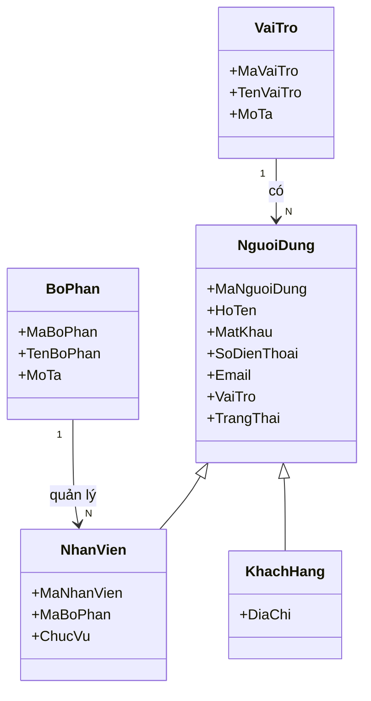

2. Nhóm Đơn hàng khách hàng

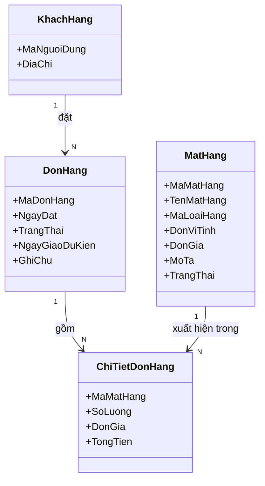

3. Nhóm Mặt hàng / Loại hàng

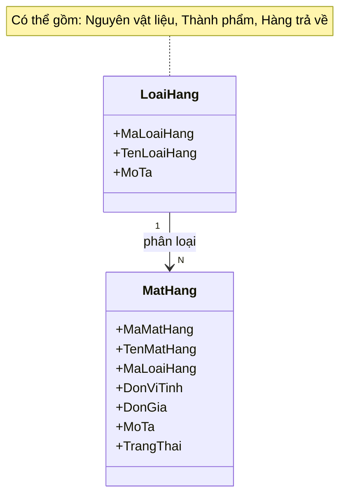

4. Nhóm Xưởng / Nhà cung cấp

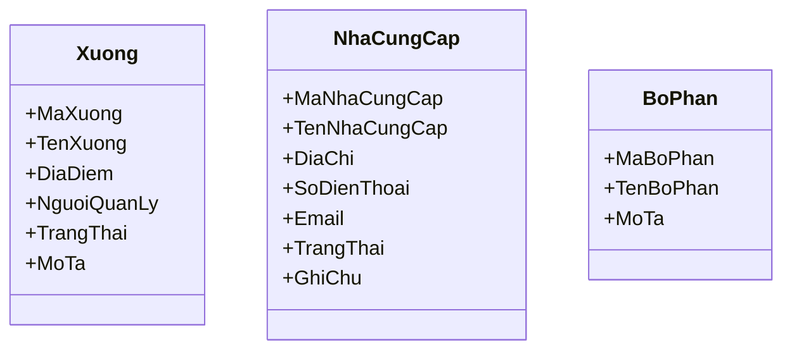

5. Nhóm Kế hoạch sản xuất

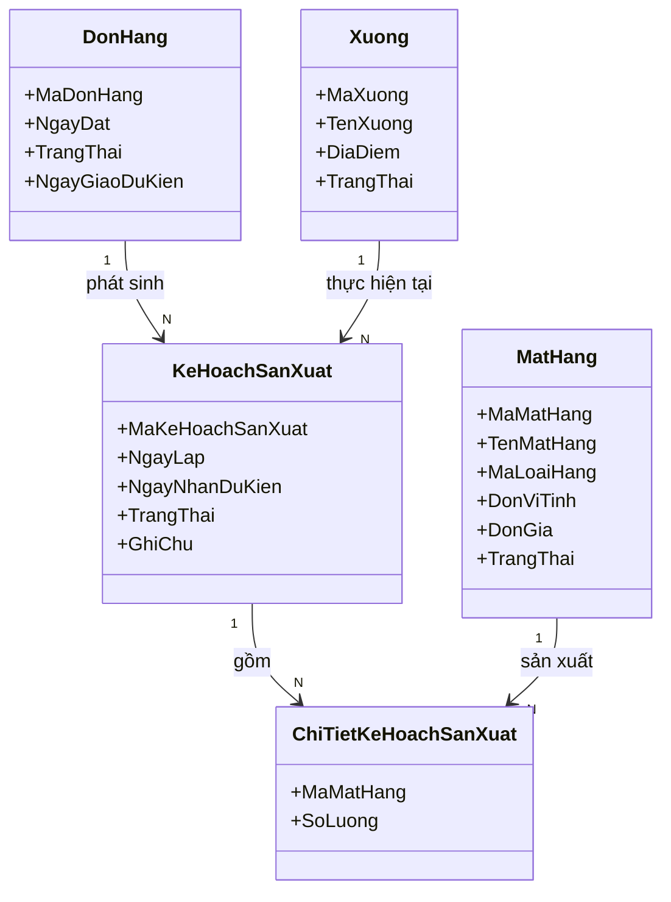

6. Nhóm Kế hoạch mua / bán và Đơn mua hàng

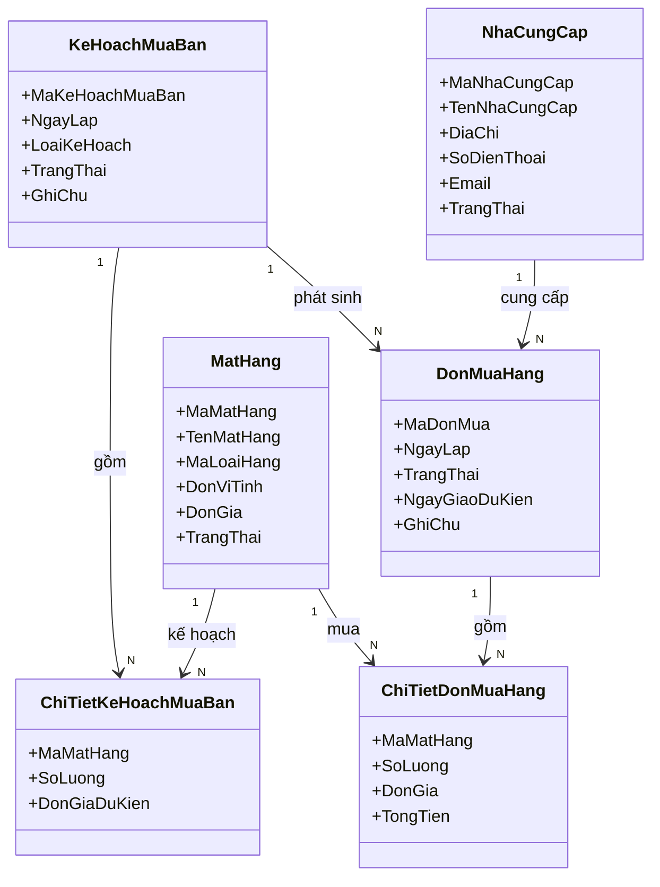

7. Nhóm Yêu cầu và Phiếu nhập / xuất kho

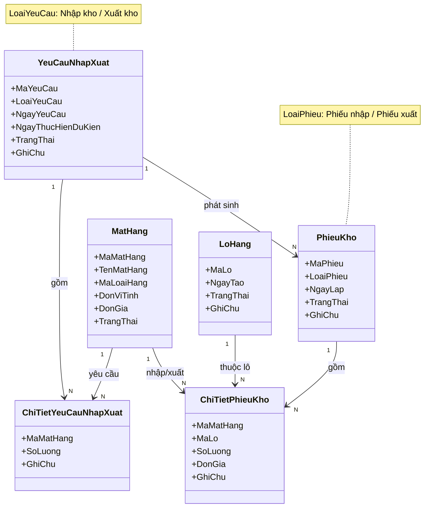

8. Nhóm Lô hàng

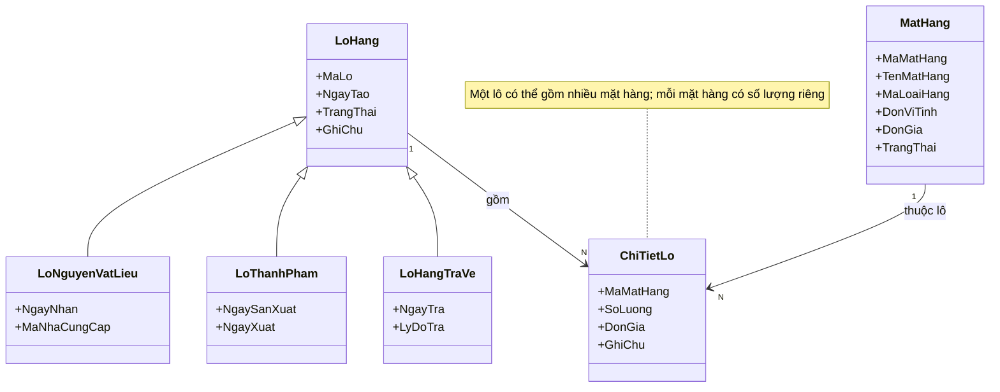

9. Nhóm Kho và Tồn kho

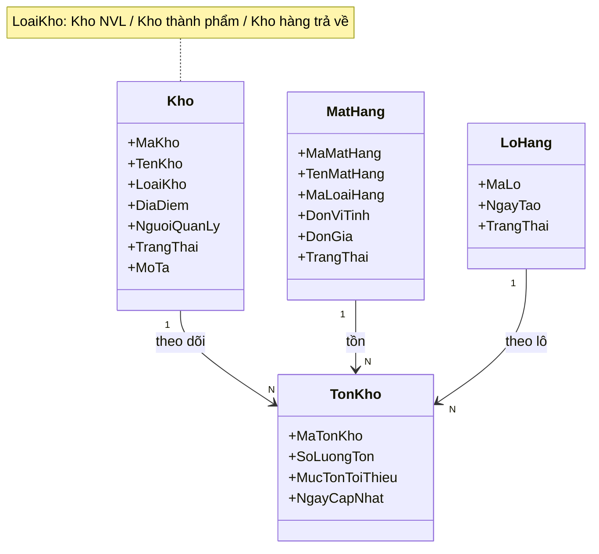

10. Nhóm Kiểm kê

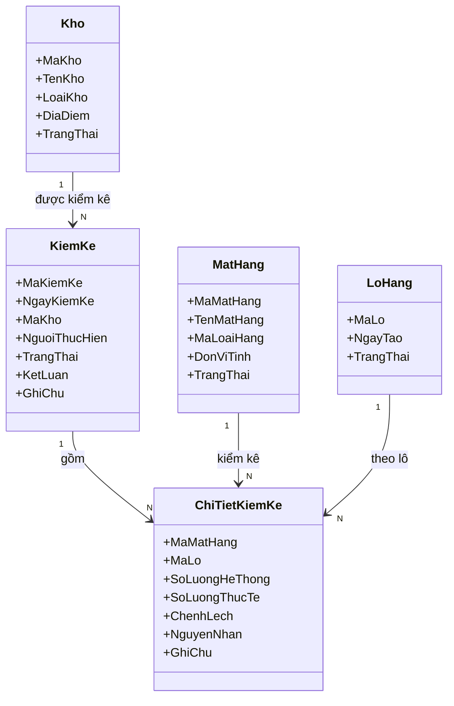

11. Nhóm Kiểm tra QC/AC

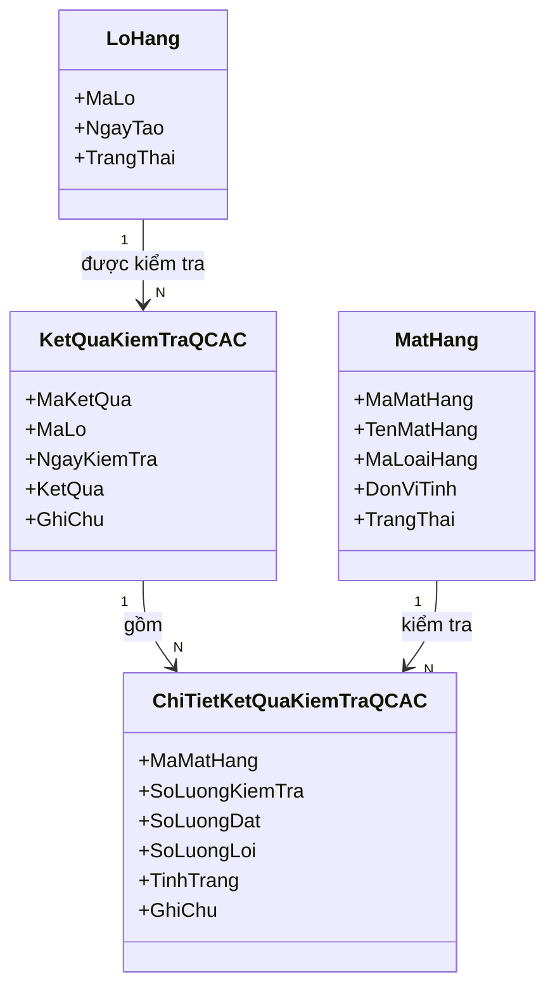

12. Nhóm Báo cáo sản xuất / Thành phẩm

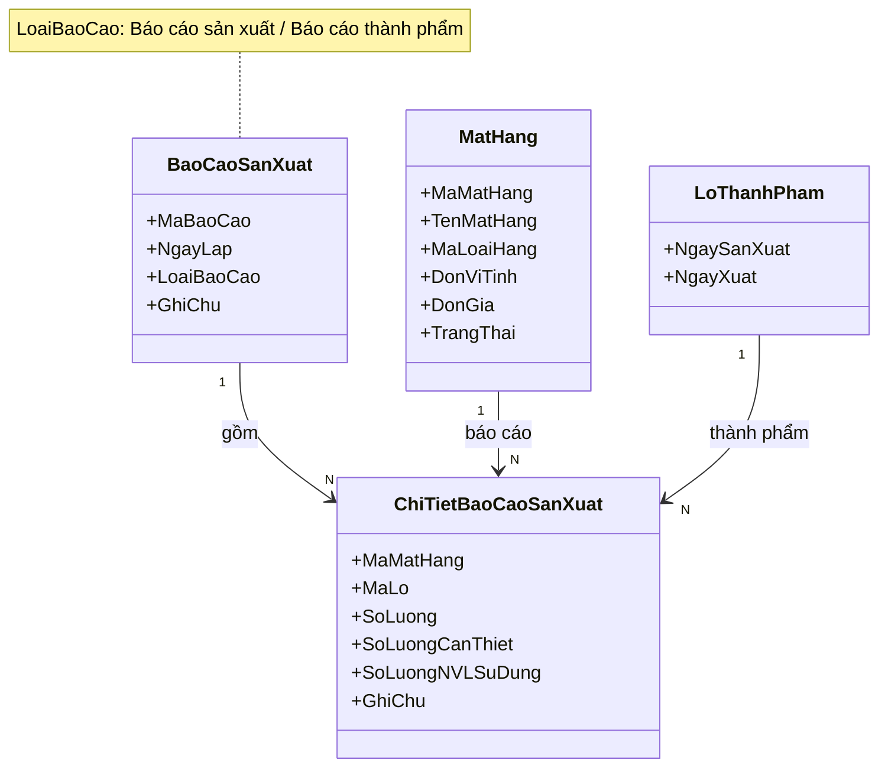

13. Nhóm Xử lý ngoại lệ

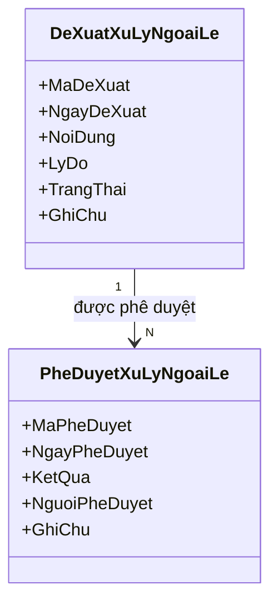

14. Sơ đồ tổng thể

```mermaid
classDiagram


    class NguoiDung {
        +MaNguoiDung
        +HoTen
        +MatKhau
        +SoDienThoai
        +Email
        +VaiTro
        +TrangThai
    }

    class NhanVien {
        +MaNhanVien
        +MaBoPhan
        +ChucVu
    }

    class KhachHang {
        +DiaChi
    }

    class VaiTro {
        +MaVaiTro
        +TenVaiTro
        +MoTa
    }

    class BoPhan {
        +MaBoPhan
        +TenBoPhan
        +MoTa
    }

    class DonHang {
        +MaDonHang
        +NgayDat
        +TrangThai
        +NgayGiaoDuKien
        +GhiChu
    }

    class ChiTietDonHang {
        +MaMatHang
        +SoLuong
        +DonGia
        +TongTien
    }

    class MatHang {
        +MaMatHang
        +TenMatHang
        +MaLoaiHang
        +DonViTinh
        +DonGia
        +MoTa
        +TrangThai
    }

    class LoaiHang {
        +MaLoaiHang
        +TenLoaiHang
        +MoTa
    }

    class Xuong {
        +MaXuong
        +TenXuong
        +DiaDiem
        +NguoiQuanLy
        +TrangThai
    }

    class NhaCungCap {
        +MaNhaCungCap
        +TenNhaCungCap
        +DiaChi
        +SoDienThoai
        +Email
        +TrangThai
    }

    class KeHoachSanXuat {
        +MaKeHoachSanXuat
        +NgayLap
        +NgayNhanDuKien
        +TrangThai
        +GhiChu
    }

    class ChiTietKeHoachSanXuat {
        +MaMatHang
        +SoLuong
    }

    class KeHoachMuaBan {
        +MaKeHoachMuaBan
        +NgayLap
        +LoaiKeHoach
        +TrangThai
        +GhiChu
    }

    class ChiTietKeHoachMuaBan {
        +MaMatHang
        +SoLuong
        +DonGiaDuKien
    }

    class DonMuaHang {
        +MaDonMua
        +NgayLap
        +TrangThai
        +NgayGiaoDuKien
        +GhiChu
    }

    class ChiTietDonMuaHang {
        +MaMatHang
        +SoLuong
        +DonGia
        +TongTien
    }

    class YeuCauNhapXuat {
        +MaYeuCau
        +LoaiYeuCau
        +NgayYeuCau
        +NgayThucHienDuKien
        +TrangThai
        +GhiChu
    }

    class ChiTietYeuCauNhapXuat {
        +MaMatHang
        +SoLuong
        +GhiChu
    }

    class PhieuKho {
        +MaPhieu
        +LoaiPhieu
        +NgayLap
        +TrangThai
        +GhiChu
    }

    class ChiTietPhieuKho {
        +MaMatHang
        +MaLo
        +SoLuong
        +DonGia
        +GhiChu
    }

    class LoHang {
        +MaLo
        +NgayTao
        +TrangThai
        +GhiChu
    }

    class LoNguyenVatLieu {
        +NgayNhan
        +MaNhaCungCap
    }

    class LoThanhPham {
        +NgaySanXuat
        +NgayXuat
    }

    class LoHangTraVe {
        +NgayTra
        +LyDoTra
    }

    class ChiTietLo {
        +MaMatHang
        +SoLuong
        +DonGia
        +GhiChu
    }

    class Kho {
        +MaKho
        +TenKho
        +LoaiKho
        +DiaDiem
        +NguoiQuanLy
        +TrangThai
    }

    class TonKho {
        +MaTonKho
        +SoLuongTon
        +MucTonToiThieu
        +NgayCapNhat
    }

    class KiemKe {
        +MaKiemKe
        +NgayKiemKe
        +MaKho
        +NguoiThucHien
        +TrangThai
        +KetLuan
    }

    class ChiTietKiemKe {
        +MaMatHang
        +MaLo
        +SoLuongHeThong
        +SoLuongThucTe
        +ChenhLech
        +NguyenNhan
    }

    class KetQuaKiemTraQCAC {
        +MaKetQua
        +MaLo
        +NgayKiemTra
        +KetQua
        +GhiChu
    }

    class ChiTietKetQuaKiemTraQCAC {
        +MaMatHang
        +SoLuongKiemTra
        +SoLuongDat
        +SoLuongLoi
        +TinhTrang
    }

    class BaoCaoSanXuat {
        +MaBaoCao
        +NgayLap
        +LoaiBaoCao
        +GhiChu
    }

    class ChiTietBaoCaoSanXuat {
        +MaMatHang
        +MaLo
        +SoLuong
        +SoLuongCanThiet
        +SoLuongNVLSuDung
    }

    class DeXuatXuLyNgoaiLe {
        +MaDeXuat
        +NgayDeXuat
        +NoiDung
        +LyDo
        +TrangThai
    }

    class PheDuyetXuLyNgoaiLe {
        +MaPheDuyet
        +NgayPheDuyet
        +KetQua
        +NguoiPheDuyet
        +GhiChu
    }

    NguoiDung <|-- NhanVien
    NguoiDung <|-- KhachHang

    VaiTro "1" --> "N" NguoiDung : có
    BoPhan "1" --> "N" NhanVien : có

    LoaiHang "1" --> "N" MatHang : phân loại

    KhachHang "1" --> "N" DonHang : đặt
    DonHang "1" --> "N" ChiTietDonHang : gồm
    MatHang "1" --> "N" ChiTietDonHang : xuất hiện trong

    DonHang "1" --> "N" KeHoachSanXuat : phát sinh
    Xuong "1" --> "N" KeHoachSanXuat : thực hiện tại
    KeHoachSanXuat "1" --> "N" ChiTietKeHoachSanXuat : gồm
    MatHang "1" --> "N" ChiTietKeHoachSanXuat : sản xuất

    KeHoachMuaBan "1" --> "N" ChiTietKeHoachMuaBan : gồm
    MatHang "1" --> "N" ChiTietKeHoachMuaBan : kế hoạch
    KeHoachMuaBan "1" --> "N" DonMuaHang : phát sinh
    NhaCungCap "1" --> "N" DonMuaHang : cung cấp
    DonMuaHang "1" --> "N" ChiTietDonMuaHang : gồm
    MatHang "1" --> "N" ChiTietDonMuaHang : mua

    YeuCauNhapXuat "1" --> "N" ChiTietYeuCauNhapXuat : gồm
    MatHang "1" --> "N" ChiTietYeuCauNhapXuat : yêu cầu

    YeuCauNhapXuat "1" --> "N" PhieuKho : phát sinh
    PhieuKho "1" --> "N" ChiTietPhieuKho : gồm
    MatHang "1" --> "N" ChiTietPhieuKho : nhập/xuất
    LoHang "1" --> "N" ChiTietPhieuKho : thuộc lô

    LoHang <|-- LoNguyenVatLieu
    LoHang <|-- LoThanhPham
    LoHang <|-- LoHangTraVe

    LoHang "1" --> "N" ChiTietLo : gồm
    MatHang "1" --> "N" ChiTietLo : thuộc lô

    Kho "1" --> "N" TonKho : theo dõi
    MatHang "1" --> "N" TonKho : tồn
    LoHang "1" --> "N" TonKho : theo lô

    Kho "1" --> "N" KiemKe : kiểm kê
    KiemKe "1" --> "N" ChiTietKiemKe : gồm
    MatHang "1" --> "N" ChiTietKiemKe : kiểm kê
    LoHang "1" --> "N" ChiTietKiemKe : theo lô

    LoHang "1" --> "N" KetQuaKiemTraQCAC : kiểm tra
    KetQuaKiemTraQCAC "1" --> "N" ChiTietKetQuaKiemTraQCAC : gồm
    MatHang "1" --> "N" ChiTietKetQuaKiemTraQCAC : kiểm tra

    BaoCaoSanXuat "1" --> "N" ChiTietBaoCaoSanXuat : gồm
    MatHang "1" --> "N" ChiTietBaoCaoSanXuat : báo cáo
    LoHang "1" --> "N" ChiTietBaoCaoSanXuat : liên quan

    DeXuatXuLyNgoaiLe "1" --> "N" PheDuyetXuLyNgoaiLe : được phê duyệt
```
