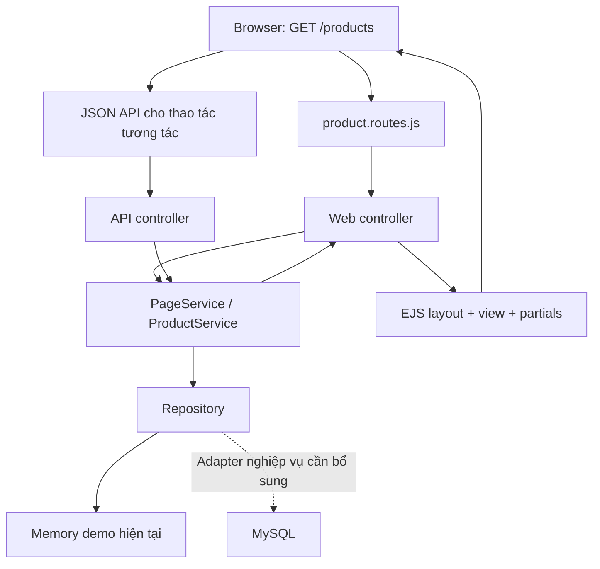

# Express MVC + EJS + MySQL

Toàn bộ ứng dụng nằm trong `app/`. Repository root có README, cấu hình Git và entry Compose/.env.example để clone rồi chạy. Nền tảng SQL mới đặt trong `src/modules/` và `src/shared/`; demo nghiệp vụ cũ được giữ để đối chiếu. Cây thư mục hiện hành và trạng thái nằm trong [DOCKER_IMPLEMENTATION.md](DOCKER_IMPLEMENTATION.md).

```text
WarehouseSystem/
├── README.md
├── .gitignore
└── app/
    ├── src/
    │   ├── config/          # env, session, database, navigation
    │   ├── models/          # Metadata thực thể; chưa dùng ORM
    │   ├── views/
    │   │   ├── layouts/main.ejs
    │   │   ├── partials/    # header, sidebar, footer
    │   │   ├── auth/
    │   │   ├── dashboard/
    │   │   ├── products/    # index, create, edit, form
    │   │   ├── warehouses/
    │   │   ├── inventory/
    │   │   ├── stock-in/
    │   │   ├── stock-out/
    │   │   ├── resources/   # Bảng và chi tiết dùng chung
    │   │   └── errors/
    │   ├── controllers/
    │   │   ├── web/         # Render EJS / redirect
    │   │   └── api/         # JSON và xuất CSV
    │   ├── services/
    │   │   ├── AuthService.js
    │   │   ├── ProductService.js
    │   │   ├── InventoryService.js
    │   │   ├── StockInService.js
    │   │   ├── StockOutService.js
    │   │   ├── PageService.js
    │   │   ├── WarehouseService.js
    │   │   └── domain/      # Các quy tắc nghiệp vụ đã có
    │   ├── repositories/   # Memory, seed, repository thực thể
    │   ├── routes/          # web, api, auth, product, inventory
    │   ├── middlewares/     # auth, role, CSRF, validate, error
    │   ├── validators/
    │   ├── utils/           # response, pagination
    │   ├── app.js           # Ghép ứng dụng
    │   └── server.js        # Nạp .env và listen
    ├── public/
    │   ├── css/main.css
    │   ├── js/             # app, forms, workflow-forms
    │   ├── images/
    │   └── uploads/         # Chưa có tính năng upload
    ├── database/
    │   ├── migrations/     # Chờ chốt schema
    │   └── seeders/         # Chờ chốt schema
    ├── tests/
    │   ├── unit/
    │   ├── integration/
    │   └── helpers/
    ├── e2e/                # Luồng nghiệp vụ + EJS khi tắt JS
    ├── scripts/            # Chạy, kiểm thử, kiểm tra cú pháp
    ├── artifacts/          # Ảnh kiểm thử
    ├── docs/
    ├── .env.example
    ├── .gitignore
    ├── package.json
    ├── package-lock.json
    └── README.md
```

`.env`, `.runtime` và `node_modules` là dữ liệu cục bộ, được Git bỏ qua. `.runtime` chứa Node portable đã chuẩn bị cho workspace này. Không đưa mật khẩu thật vào repository.

## Luồng request



`app.js` không chứa các handler nghiệp vụ. Web controller nhận request, gọi service và `res.render`; API controller gọi service rồi trả JSON theo envelope có request ID. Service giữ quyền, trạng thái, giới hạn nguồn, tính toán thập phân, version, chống lặp và transaction. Repository giữ truy cập dữ liệu.

Đăng nhập, dashboard, danh sách/chi tiết và form tạo/sửa mặt hàng hoạt động khi tắt JavaScript. Các nghiệp vụ nhiều dòng như QC, phân công nhân viên và ghi phiếu dùng JavaScript để tăng tương tác, chung một Express server và session. Không có frontend riêng. URL cũ được giữ; `/products` và `/inventory` được bổ sung.

EJS escape dữ liệu bằng `<%=`. Chỉ include các template cố định từ server; không nhận tên template từ query người dùng. Boot data nằm trong thuộc tính HTML được escape. Web POST và JSON mutation đều kiểm tra CSRF. Form mặt hàng dùng version và khóa idempotency; thành công redirect 303 để tránh gửi lại khi tải trang.

## Trạng thái MySQL

Pool mysql2 ở config/database.js; bootstrap SQL chọn src/shared/create-mysql-app.js khi STORAGE_DRIVER=mysql. Các module auth/catalog/notifications dùng repository SQL với binding; DECIMAL/BIGINT giữ dạng chuỗi. SQL session, migration và seed đã được kiểm tra trên MySQL 8.4 thật bằng Docker.

Theo yêu cầu Docker mới, migration foundation đã có và mysql được hỗ trợ. Hai chế độ tách biệt: SQL không trộn dữ liệu memory, nghiệp vụ chưa chuyển trả 501. Các transaction kho/sản xuất đồng bộ của demo cần chuyển sang SQL bất đồng bộ với khóa hàng và replay/audit bền vững trước nghiệm thu.

Không tạo các file CSS/JS riêng rỗng cho từng màn hình: dùng stylesheet và form dùng chung. `stock_documents` là chứng từ nhập/xuất phân biệt bởi `type`, `items` là mặt hàng theo tài liệu, nên không tạo bảng trùng `products`, `stock_in`, `stock_out`.

## Kiểm tra

```powershell
cd app
npm test
npm run check
npm run test:browser
```

Kiểm thử HTTP/MVC kiểm tra dữ liệu đã có trong HTML, escape nội dung, form POST, quyền truy cập, session, CSRF, version và chống gửi lặp. Kiểm thử trình duyệt chạy đầy đủ luồng SRS và thêm một lượt tắt JavaScript cho các form EJS.
