# Class diagram hệ thống quản lý kho

## Cách đọc và phạm vi

- `boundary`: giao diện, kiểm tra định dạng input, nhận thao tác, hiển thị dữ liệu và thông báo.
- `control`: điều phối use case, kiểm tra nghiệp vụ, tính toán và gửi thông báo.
- `entity`: dữ liệu nghiệp vụ và các thao tác truy xuất/lưu dữ liệu mà sequence gọi đến.
- Thuộc tính dùng `-`, method dùng `+`. Đây là lựa chọn đóng gói khi chuyển từ domain sang thiết kế lớp; hình domain gốc dùng thuộc tính công khai.
- `DanhSach`, `DuLieu`, `KetQuaXuLy`, `TepBaoCao` là ký hiệu kiểu trả về/DTO, **không phải entity hoặc bảng mới**. `KetQuaXuLy` mang dữ liệu, trạng thái thành công/thất bại và message trả về UI.
- Kiểu dữ liệu, tham số chưa đầy đủ, tên lớp viết liền và tên method thiếu trên hình đã được chuẩn hóa để sử dụng trong class diagram. Không coi các chữ ký được bổ sung là nguyên văn sequence. Các method giao diện `hienThiDuLieu`, `hienThiThongBao`, `kiemTraInput`, `guiYeuCau`, `nhanKetQua` là tên thiết kế cho các thao tác tương ứng trên hình.
- Mỗi lớp entity dùng chung một định nghĩa; lớp xuất hiện ở nhiều module vẫn là cùng một lớp. Không tạo entity hồ sơ nhập/xuất, phiếu tiếp nhận hoặc biên bản kiểm kê riêng.
- Đây là **thiết kế từ tài liệu**, chưa có đối chiếu source code hay kiểm thử triển khai.

## Nguồn sequence theo use case

| Thành viên | UC | Nguồn sequence |
|---|---|---|
|Nguyễn Tiến Dũng|UC-02, UC-03, UC-03.1, UC-32, UC-16, UC-22|BaoCaoGK|
|Vũ Uyên Thy|UC-17, UC-18, UC-19, UC-20, UC-21, UC-25, UC-25.1, UC-25.2|BaoCaoGK|
|Trần Văn Thái|UC-29, UC-06, UC-06.1, UC-06.2, UC-06.3, UC-07, UC-07.1, UC-07.2, UC-07.3, UC-08, UC-09, UC-13|Tuan6|
|Trương Bảo Huy|UC-31, UC-14, UC-23, UC-24, UC-24.1, UC-24.2, UC-27|Tuan6|
|Trần Quốc Tuấn|UC-04, UC-05, UC-05.1, UC-05.2, UC-10, UC-11, UC-11.01, UC-11.02, UC-35|Tuan6|
|Trần Như Ý|UC-01, UC-12, UC-12.1, UC-12.2, UC-12.3, UC-34, UC-15, UC-28|Tuan6|

## Những điểm cần đối chiếu trước khi dùng để viết code

| Điểm | Nội dung nguồn và cách thể hiện trong bản này |
|---|---|
| Nguồn kế hoạch BAN | Sequence UC-04 và UC-05.1 trong Tuan6 còn dùng báo cáo `THANH_PHAM`; quy tắc BR-11 trong BaoCaoGK nói BAN lấy từ kế hoạch sản xuất. Bản này giữ quan hệ đến báo cáo theo sequence được chọn; chưa thay sang kế hoạch sản xuất. Cần sửa sequence nếu áp dụng BR-11. |
| Nguồn xuất NVL | UC-23 trong Tuan6 import từ KeHoachSanXuat, nhưng UC-11.01 còn đối chiếu BanBaoCaoSanXuat. Giữ cả hai tham chiếu để phản ánh hiện trạng tài liệu; chưa kết luận chúng cùng bắt buộc cho một yêu cầu. |
| Người duyệt ngoại lệ | UC-17 trong BaoCaoGK vẫn ghi Ban giám đốc trên sequence/đặc tả; yêu cầu sửa trước đây của anh là Chủ xưởng. Không gán cứng actor vào lớp entity/control; quyền thực thi UC-17 cần đồng bộ lại trên sequence và đặc tả. |
| Tên method UC-18 | Sequence UC-18 dùng tên `getHoSoXuatKho` trong luồng xem tồn kho. Giữ tên để truy vết, nhưng nên đổi thành `getChiTietTonKho` khi sửa sequence, tránh nhầm với UC-19. |
| Trách nhiệm entity trong sequence của Dũng | UC-02/03.1 có thông điệp kiểm tra dữ liệu đến entity. Bản này giữ các method `kiemTraThongTin`, `kiemTraDonHang`, `kiemTraChiTiet` để khớp hình; nếu tách nghiệp vụ hoàn toàn sang controller thì phải sửa cả sequence. |
| Thuộc tính liên kết | Các mã tham chiếu suy ra từ association được ghi rõ ở bảng bên dưới. Đây là bổ sung để thiết kế lớp, chưa xác nhận migration hoặc ràng buộc CSDL. |
| Giữ chỗ tồn kho | Tài liệu nói tồn khả dụng và lượng cam kết nhưng domain chưa xác định cấu trúc lưu giữ chỗ/thời điểm giải phóng. Không tự thêm entity giữ chỗ hoặc khẳng định đã có cơ chế chống tranh chấp. |
| Method không đọc được đầy đủ trên hình | Một số sequence UC-04, 10, 11.01, 11.02, 27, 35 có chữ nhỏ hoặc chữ ký thiếu. Bản này chuẩn hóa tên theo thao tác và đặc tả của UC, không khẳng định trùng từng ký tự với hình. |

## Thuộc tính được bổ sung khi chuyển từ domain sang thiết kế lớp

| Lớp | Thuộc tính bổ sung | Căn cứ |
|---|---|---|
| DonHang | MaKhachHang | Association KhachHang đặt DonHang |
| ChiTietDonHang | MaDonHang | Thuộc đơn hàng |
| KeHoachSanXuat | MaDonHang, MaXuong | Lập từ đơn hàng và phân xưởng |
| ChiTietKeHoachSanXuat | MaKeHoachSanXuat | Thuộc kế hoạch sản xuất |
| ChiTietKeHoachMuaBan | MaKeHoachMuaBan | Thuộc kế hoạch mua/bán |
| DonMuaHang | MaKeHoachMuaBan, MaNhaCungCap | UC-27 liên kết kế hoạch đã duyệt và nhà cung cấp |
| ChiTietDonMuaHang | MaDonMua | Thuộc đơn mua |
| PhieuYeuCauNhapXuat | MaKeHoachSanXuat, MaKeHoachMuaBan | Nguồn import tại UC-23; các mã nguồn có thể rỗng theo nhánh, chưa chốt ràng buộc |
| ChiTietPhieuYeuCauNhapXuat | MaPhieuYeuCau | Thuộc yêu cầu |
| PhieuKho | MaPhieuYeuCau | Một yêu cầu được thực hiện qua phiếu kho |
| ChiTietPhieuKho | MaPhieu | Thuộc phiếu kho |
| ChiTietPhieuKiemKe | MaKiemKe | Thuộc phiếu kiểm kê |
| ChiTietKetQuaKiemTraQCAC | MaKetQua | Thuộc kết quả kiểm tra |
| BanBaoCaoSanXuat | TienDo, MoTa, TrangThaiNVL, GuiThemBoPhanLapKeHoach | UC-34; cờ gửi thêm có thể chỉ là dữ liệu request, cần chốt có lưu hay không |
| ChiTietBaoCaoSanXuat | MaBaoCao, SoLuongNVLHienCo | Thuộc báo cáo và chụp lượng NVL tại thời điểm lập UC-34 |
| ChiTietLoBaoCaoSanXuat | MaChiTietBaoCao | Liên kết dòng báo cáo với dòng lô |
| KetQuaXuLyNgoaiLe | MaDeXuat | Lịch sử kết quả của đề xuất |
| CongViec | Toàn bộ thuộc tính được trình bày | Lấy từ đặc tả UC-25 vì nhóm domain không có hình lớp này; DanhSachNhanVien là collection liên kết, không phải một cột chuỗi |

## Các module entity

Kiểu `String` cho mã, `Decimal` cho số lượng/tiền, `Date` và `DateTime` cho thời gian là quy ước thiết kế. Chưa chốt độ dài mã, độ chính xác số hoặc enum vật lý. `TongTien`, `ChenhLech` là thông tin tính toán xuất hiện trong domain; sơ đồ không quyết định lưu cột hay tính khi truy vấn. `MatKhau` là tên thuộc tính từ domain, không mang nghĩa lưu mật khẩu dạng rõ.

### 1. Tài khoản và người dùng

UC liên quan: UC-01.

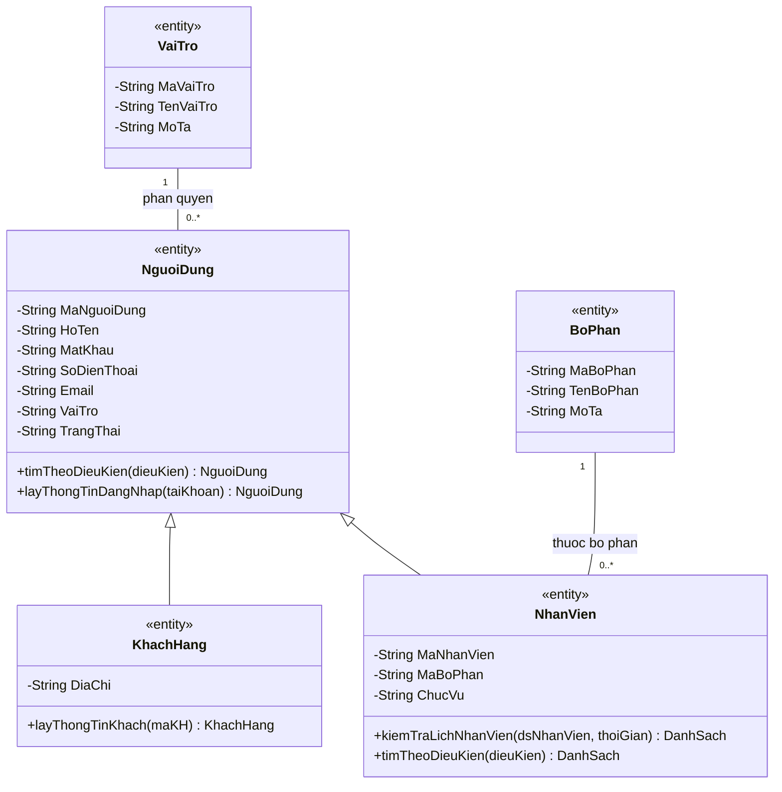
```mermaid
classDiagram
    direction TB
    class NguoiDung {
        <<entity>>
        -String MaNguoiDung
        -String HoTen
        -String MatKhau
        -String SoDienThoai
        -String Email
        -String VaiTro
        -String TrangThai
        +timTheoDieuKien(dieuKien) NguoiDung
        +layThongTinDangNhap(taiKhoan) NguoiDung
    }
    class VaiTro {
        <<entity>>
        -String MaVaiTro
        -String TenVaiTro
        -String MoTa
    }
    class BoPhan {
        <<entity>>
        -String MaBoPhan
        -String TenBoPhan
        -String MoTa
    }
    class KhachHang {
        <<entity>>
        -String DiaChi
        +layThongTinKhach(maKH) KhachHang
    }
    class NhanVien {
        <<entity>>
        -String MaNhanVien
        -String MaBoPhan
        -String ChucVu
        +kiemTraLichNhanVien(dsNhanVien, thoiGian) DanhSach
        +timTheoDieuKien(dieuKien) DanhSach
    }
    VaiTro "1" -- "0..*" NguoiDung : phan quyen
    BoPhan "1" -- "0..*" NhanVien : thuoc bo phan
    NguoiDung <|-- KhachHang
    NguoiDung <|-- NhanVien
```

### 2. Đơn hàng khách hàng

UC liên quan: UC-02, UC-03, UC-03.1, UC-29, UC-31.

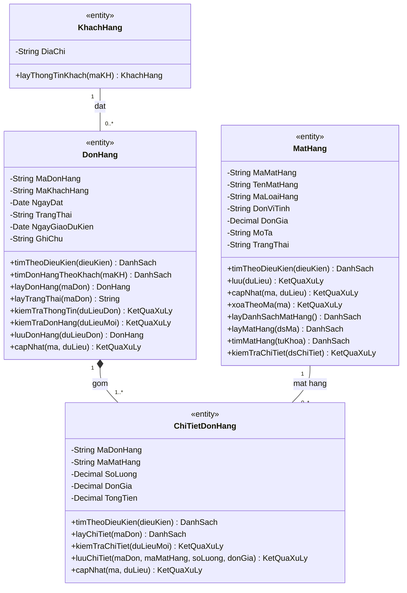
```mermaid
classDiagram
    direction TB
    class KhachHang {
        <<entity>>
        -String DiaChi
        +layThongTinKhach(maKH) KhachHang
    }
    class DonHang {
        <<entity>>
        -String MaDonHang
        -String MaKhachHang
        -Date NgayDat
        -String TrangThai
        -Date NgayGiaoDuKien
        -String GhiChu
        +timTheoDieuKien(dieuKien) DanhSach
        +timDonHangTheoKhach(maKH) DanhSach
        +layDonHang(maDon) DonHang
        +layTrangThai(maDon) String
        +kiemTraThongTin(duLieuDon) KetQuaXuLy
        +kiemTraDonHang(duLieuMoi) KetQuaXuLy
        +luuDonHang(duLieuDon) DonHang
        +capNhat(ma, duLieu) KetQuaXuLy
    }
    class ChiTietDonHang {
        <<entity>>
        -String MaDonHang
        -String MaMatHang
        -Decimal SoLuong
        -Decimal DonGia
        -Decimal TongTien
        +timTheoDieuKien(dieuKien) DanhSach
        +layChiTiet(maDon) DanhSach
        +kiemTraChiTiet(duLieuMoi) KetQuaXuLy
        +luuChiTiet(maDon, maMatHang, soLuong, donGia) KetQuaXuLy
        +capNhat(ma, duLieu) KetQuaXuLy
    }
    class MatHang {
        <<entity>>
        -String MaMatHang
        -String TenMatHang
        -String MaLoaiHang
        -String DonViTinh
        -Decimal DonGia
        -String MoTa
        -String TrangThai
        +timTheoDieuKien(dieuKien) DanhSach
        +luu(duLieu) KetQuaXuLy
        +capNhat(ma, duLieu) KetQuaXuLy
        +xoaTheoMa(ma) KetQuaXuLy
        +layDanhSachMatHang() DanhSach
        +layMatHang(dsMa) DanhSach
        +timMatHang(tuKhoa) DanhSach
        +kiemTraChiTiet(dsChiTiet) KetQuaXuLy
    }
    KhachHang "1" -- "0..*" DonHang : dat
    DonHang "1" *-- "1..*" ChiTietDonHang : gom
    MatHang "1" -- "0..*" ChiTietDonHang : mat hang
```

### 3. Mặt hàng và loại hàng

UC liên quan: UC-06, UC-06.1, UC-06.2, UC-06.3, UC-07, UC-07.1, UC-07.2, UC-07.3.

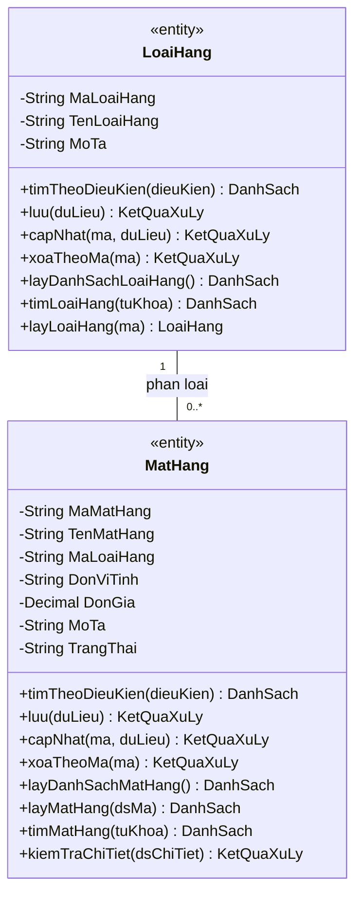
```mermaid
classDiagram
    direction TB
    class LoaiHang {
        <<entity>>
        -String MaLoaiHang
        -String TenLoaiHang
        -String MoTa
        +timTheoDieuKien(dieuKien) DanhSach
        +luu(duLieu) KetQuaXuLy
        +capNhat(ma, duLieu) KetQuaXuLy
        +xoaTheoMa(ma) KetQuaXuLy
        +layDanhSachLoaiHang() DanhSach
        +timLoaiHang(tuKhoa) DanhSach
        +layLoaiHang(ma) LoaiHang
    }
    class MatHang {
        <<entity>>
        -String MaMatHang
        -String TenMatHang
        -String MaLoaiHang
        -String DonViTinh
        -Decimal DonGia
        -String MoTa
        -String TrangThai
        +timTheoDieuKien(dieuKien) DanhSach
        +luu(duLieu) KetQuaXuLy
        +capNhat(ma, duLieu) KetQuaXuLy
        +xoaTheoMa(ma) KetQuaXuLy
        +layDanhSachMatHang() DanhSach
        +layMatHang(dsMa) DanhSach
        +timMatHang(tuKhoa) DanhSach
        +kiemTraChiTiet(dsChiTiet) KetQuaXuLy
    }
    LoaiHang "1" -- "0..*" MatHang : phan loai
```

### 4. Xưởng và nhà cung cấp

UC liên quan: UC-22, UC-27.

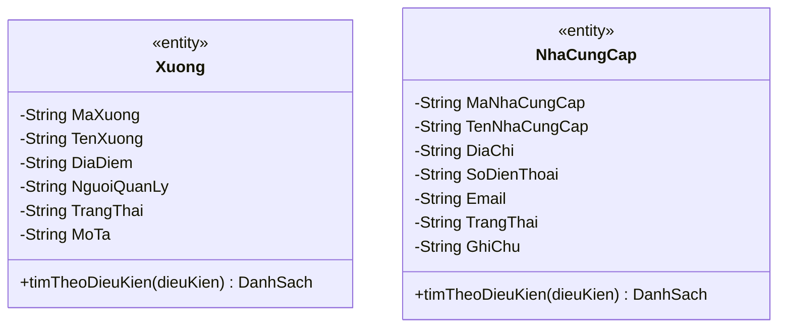
```mermaid
classDiagram
    direction TB
    class Xuong {
        <<entity>>
        -String MaXuong
        -String TenXuong
        -String DiaDiem
        -String NguoiQuanLy
        -String TrangThai
        -String MoTa
        +timTheoDieuKien(dieuKien) DanhSach
    }
    class NhaCungCap {
        <<entity>>
        -String MaNhaCungCap
        -String TenNhaCungCap
        -String DiaChi
        -String SoDienThoai
        -String Email
        -String TrangThai
        -String GhiChu
        +timTheoDieuKien(dieuKien) DanhSach
    }

```

### 5. Kế hoạch sản xuất

UC liên quan: UC-04, UC-31.

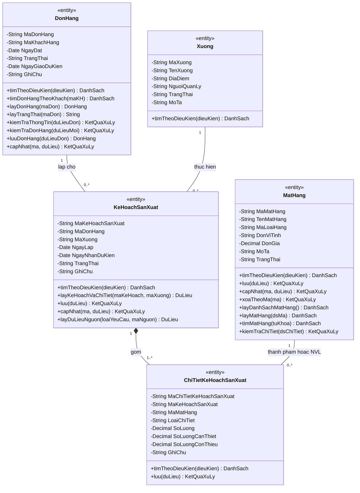
```mermaid
classDiagram
    direction TB
    class DonHang {
        <<entity>>
        -String MaDonHang
        -String MaKhachHang
        -Date NgayDat
        -String TrangThai
        -Date NgayGiaoDuKien
        -String GhiChu
        +timTheoDieuKien(dieuKien) DanhSach
        +timDonHangTheoKhach(maKH) DanhSach
        +layDonHang(maDon) DonHang
        +layTrangThai(maDon) String
        +kiemTraThongTin(duLieuDon) KetQuaXuLy
        +kiemTraDonHang(duLieuMoi) KetQuaXuLy
        +luuDonHang(duLieuDon) DonHang
        +capNhat(ma, duLieu) KetQuaXuLy
    }
    class Xuong {
        <<entity>>
        -String MaXuong
        -String TenXuong
        -String DiaDiem
        -String NguoiQuanLy
        -String TrangThai
        -String MoTa
        +timTheoDieuKien(dieuKien) DanhSach
    }
    class KeHoachSanXuat {
        <<entity>>
        -String MaKeHoachSanXuat
        -String MaDonHang
        -String MaXuong
        -Date NgayLap
        -Date NgayNhanDuKien
        -String TrangThai
        -String GhiChu
        +timTheoDieuKien(dieuKien) DanhSach
        +layKeHoachVaChiTiet(maKeHoach, maXuong) DuLieu
        +luu(duLieu) KetQuaXuLy
        +capNhat(ma, duLieu) KetQuaXuLy
        +layDuLieuNguon(loaiYeuCau, maNguon) DuLieu
    }
    class ChiTietKeHoachSanXuat {
        <<entity>>
        -String MaChiTietKeHoachSanXuat
        -String MaKeHoachSanXuat
        -String MaMatHang
        -String LoaiChiTiet
        -Decimal SoLuong
        -Decimal SoLuongCanThiet
        -Decimal SoLuongConThieu
        -String GhiChu
        +timTheoDieuKien(dieuKien) DanhSach
        +luu(duLieu) KetQuaXuLy
    }
    class MatHang {
        <<entity>>
        -String MaMatHang
        -String TenMatHang
        -String MaLoaiHang
        -String DonViTinh
        -Decimal DonGia
        -String MoTa
        -String TrangThai
        +timTheoDieuKien(dieuKien) DanhSach
        +luu(duLieu) KetQuaXuLy
        +capNhat(ma, duLieu) KetQuaXuLy
        +xoaTheoMa(ma) KetQuaXuLy
        +layDanhSachMatHang() DanhSach
        +layMatHang(dsMa) DanhSach
        +timMatHang(tuKhoa) DanhSach
        +kiemTraChiTiet(dsChiTiet) KetQuaXuLy
    }
    DonHang "1" -- "0..*" KeHoachSanXuat : lap cho
    Xuong "1" -- "0..*" KeHoachSanXuat : thuc hien
    KeHoachSanXuat "1" *-- "1..*" ChiTietKeHoachSanXuat : gom
    MatHang "1" -- "0..*" ChiTietKeHoachSanXuat : thanh pham hoac NVL
```

### 6. Kế hoạch mua bán

UC liên quan: UC-04, UC-05, UC-05.1, UC-05.2, UC-32.

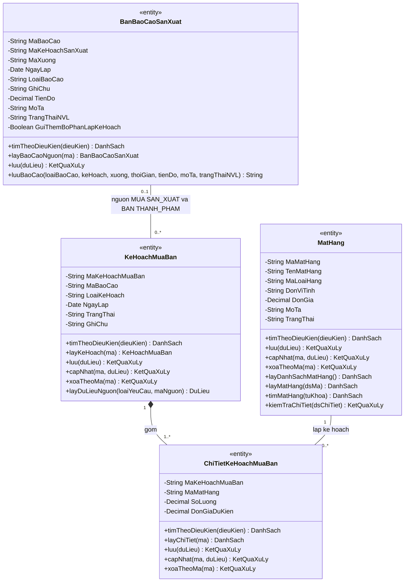
```mermaid
classDiagram
    direction TB
    class BanBaoCaoSanXuat {
        <<entity>>
        -String MaBaoCao
        -String MaKeHoachSanXuat
        -String MaXuong
        -Date NgayLap
        -String LoaiBaoCao
        -String GhiChu
        -Decimal TienDo
        -String MoTa
        -String TrangThaiNVL
        -Boolean GuiThemBoPhanLapKeHoach
        +timTheoDieuKien(dieuKien) DanhSach
        +layBaoCaoNguon(ma) BanBaoCaoSanXuat
        +luu(duLieu) KetQuaXuLy
        +luuBaoCao(loaiBaoCao, keHoach, xuong, thoiGian, tienDo, moTa, trangThaiNVL) String
    }
    class KeHoachMuaBan {
        <<entity>>
        -String MaKeHoachMuaBan
        -String MaBaoCao
        -String LoaiKeHoach
        -Date NgayLap
        -String TrangThai
        -String GhiChu
        +timTheoDieuKien(dieuKien) DanhSach
        +layKeHoach(ma) KeHoachMuaBan
        +luu(duLieu) KetQuaXuLy
        +capNhat(ma, duLieu) KetQuaXuLy
        +xoaTheoMa(ma) KetQuaXuLy
        +layDuLieuNguon(loaiYeuCau, maNguon) DuLieu
    }
    class ChiTietKeHoachMuaBan {
        <<entity>>
        -String MaKeHoachMuaBan
        -String MaMatHang
        -Decimal SoLuong
        -Decimal DonGiaDuKien
        +timTheoDieuKien(dieuKien) DanhSach
        +layChiTiet(ma) DanhSach
        +luu(duLieu) KetQuaXuLy
        +capNhat(ma, duLieu) KetQuaXuLy
        +xoaTheoMa(ma) KetQuaXuLy
    }
    class MatHang {
        <<entity>>
        -String MaMatHang
        -String TenMatHang
        -String MaLoaiHang
        -String DonViTinh
        -Decimal DonGia
        -String MoTa
        -String TrangThai
        +timTheoDieuKien(dieuKien) DanhSach
        +luu(duLieu) KetQuaXuLy
        +capNhat(ma, duLieu) KetQuaXuLy
        +xoaTheoMa(ma) KetQuaXuLy
        +layDanhSachMatHang() DanhSach
        +layMatHang(dsMa) DanhSach
        +timMatHang(tuKhoa) DanhSach
        +kiemTraChiTiet(dsChiTiet) KetQuaXuLy
    }
    KeHoachMuaBan "1" *-- "1..*" ChiTietKeHoachMuaBan : gom
    MatHang "1" -- "0..*" ChiTietKeHoachMuaBan : lap ke hoach
    BanBaoCaoSanXuat "0..1" -- "0..*" KeHoachMuaBan : nguon MUA SAN_XUAT va BAN THANH_PHAM
```

### 7. Đơn mua hàng

UC liên quan: UC-14, UC-27.

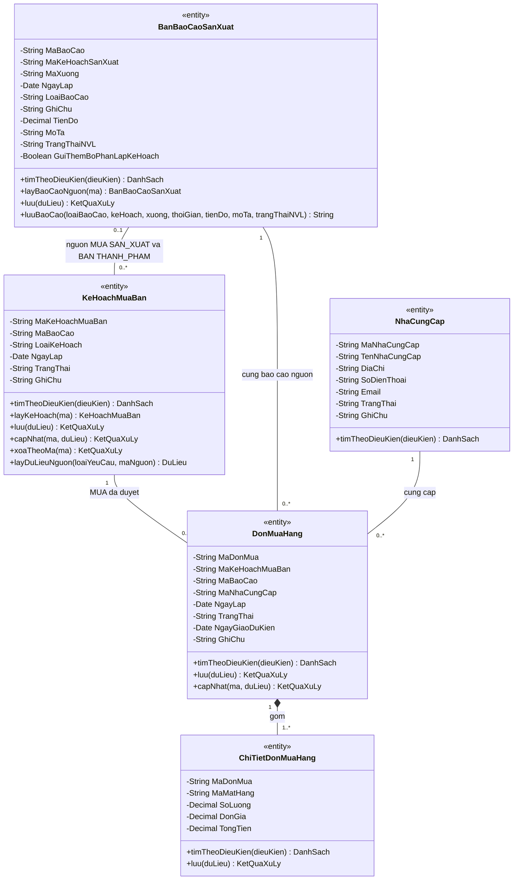
```mermaid
classDiagram
    direction TB
    class KeHoachMuaBan {
        <<entity>>
        -String MaKeHoachMuaBan
        -String MaBaoCao
        -String LoaiKeHoach
        -Date NgayLap
        -String TrangThai
        -String GhiChu
        +timTheoDieuKien(dieuKien) DanhSach
        +layKeHoach(ma) KeHoachMuaBan
        +luu(duLieu) KetQuaXuLy
        +capNhat(ma, duLieu) KetQuaXuLy
        +xoaTheoMa(ma) KetQuaXuLy
        +layDuLieuNguon(loaiYeuCau, maNguon) DuLieu
    }
    class BanBaoCaoSanXuat {
        <<entity>>
        -String MaBaoCao
        -String MaKeHoachSanXuat
        -String MaXuong
        -Date NgayLap
        -String LoaiBaoCao
        -String GhiChu
        -Decimal TienDo
        -String MoTa
        -String TrangThaiNVL
        -Boolean GuiThemBoPhanLapKeHoach
        +timTheoDieuKien(dieuKien) DanhSach
        +layBaoCaoNguon(ma) BanBaoCaoSanXuat
        +luu(duLieu) KetQuaXuLy
        +luuBaoCao(loaiBaoCao, keHoach, xuong, thoiGian, tienDo, moTa, trangThaiNVL) String
    }
    class DonMuaHang {
        <<entity>>
        -String MaDonMua
        -String MaKeHoachMuaBan
        -String MaBaoCao
        -String MaNhaCungCap
        -Date NgayLap
        -String TrangThai
        -Date NgayGiaoDuKien
        -String GhiChu
        +timTheoDieuKien(dieuKien) DanhSach
        +luu(duLieu) KetQuaXuLy
        +capNhat(ma, duLieu) KetQuaXuLy
    }
    class ChiTietDonMuaHang {
        <<entity>>
        -String MaDonMua
        -String MaMatHang
        -Decimal SoLuong
        -Decimal DonGia
        -Decimal TongTien
        +timTheoDieuKien(dieuKien) DanhSach
        +luu(duLieu) KetQuaXuLy
    }
    class NhaCungCap {
        <<entity>>
        -String MaNhaCungCap
        -String TenNhaCungCap
        -String DiaChi
        -String SoDienThoai
        -String Email
        -String TrangThai
        -String GhiChu
        +timTheoDieuKien(dieuKien) DanhSach
    }
    BanBaoCaoSanXuat "0..1" -- "0..*" KeHoachMuaBan : nguon MUA SAN_XUAT va BAN THANH_PHAM
    KeHoachMuaBan "1" -- "0..*" DonMuaHang : MUA da duyet
    BanBaoCaoSanXuat "1" -- "0..*" DonMuaHang : cung bao cao nguon
    NhaCungCap "1" -- "0..*" DonMuaHang : cung cap
    DonMuaHang "1" *-- "1..*" ChiTietDonMuaHang : gom
```

### 8. Yêu cầu nhập xuất

UC liên quan: UC-23, UC-24, UC-24.1, UC-24.2.

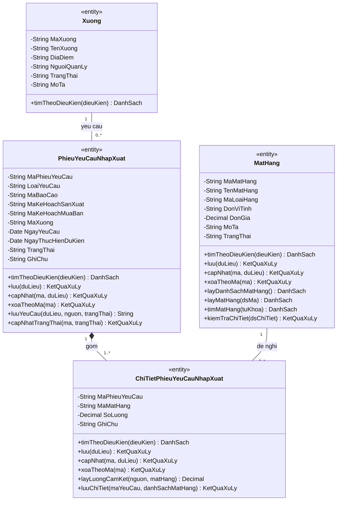
```mermaid
classDiagram
    direction TB
    class Xuong {
        <<entity>>
        -String MaXuong
        -String TenXuong
        -String DiaDiem
        -String NguoiQuanLy
        -String TrangThai
        -String MoTa
        +timTheoDieuKien(dieuKien) DanhSach
    }
    class PhieuYeuCauNhapXuat {
        <<entity>>
        -String MaPhieuYeuCau
        -String LoaiYeuCau
        -String MaBaoCao
        -String MaKeHoachSanXuat
        -String MaKeHoachMuaBan
        -String MaXuong
        -Date NgayYeuCau
        -Date NgayThucHienDuKien
        -String TrangThai
        -String GhiChu
        +timTheoDieuKien(dieuKien) DanhSach
        +luu(duLieu) KetQuaXuLy
        +capNhat(ma, duLieu) KetQuaXuLy
        +xoaTheoMa(ma) KetQuaXuLy
        +luuYeuCau(duLieu, nguon, trangThai) String
        +capNhatTrangThai(ma, trangThai) KetQuaXuLy
    }
    class ChiTietPhieuYeuCauNhapXuat {
        <<entity>>
        -String MaPhieuYeuCau
        -String MaMatHang
        -Decimal SoLuong
        -String GhiChu
        +timTheoDieuKien(dieuKien) DanhSach
        +luu(duLieu) KetQuaXuLy
        +capNhat(ma, duLieu) KetQuaXuLy
        +xoaTheoMa(ma) KetQuaXuLy
        +layLuongCamKet(nguon, matHang) Decimal
        +luuChiTiet(maYeuCau, danhSachMatHang) KetQuaXuLy
    }
    class MatHang {
        <<entity>>
        -String MaMatHang
        -String TenMatHang
        -String MaLoaiHang
        -String DonViTinh
        -Decimal DonGia
        -String MoTa
        -String TrangThai
        +timTheoDieuKien(dieuKien) DanhSach
        +luu(duLieu) KetQuaXuLy
        +capNhat(ma, duLieu) KetQuaXuLy
        +xoaTheoMa(ma) KetQuaXuLy
        +layDanhSachMatHang() DanhSach
        +layMatHang(dsMa) DanhSach
        +timMatHang(tuKhoa) DanhSach
        +kiemTraChiTiet(dsChiTiet) KetQuaXuLy
    }
    Xuong "1" -- "0..*" PhieuYeuCauNhapXuat : yeu cau
    PhieuYeuCauNhapXuat "1" *-- "1..*" ChiTietPhieuYeuCauNhapXuat : gom
    MatHang "1" -- "0..*" ChiTietPhieuYeuCauNhapXuat : de nghi
```

### 9. Phiếu nhập xuất kho

UC liên quan: UC-08, UC-09, UC-10, UC-11, UC-11.01, UC-11.02, UC-19, UC-20.

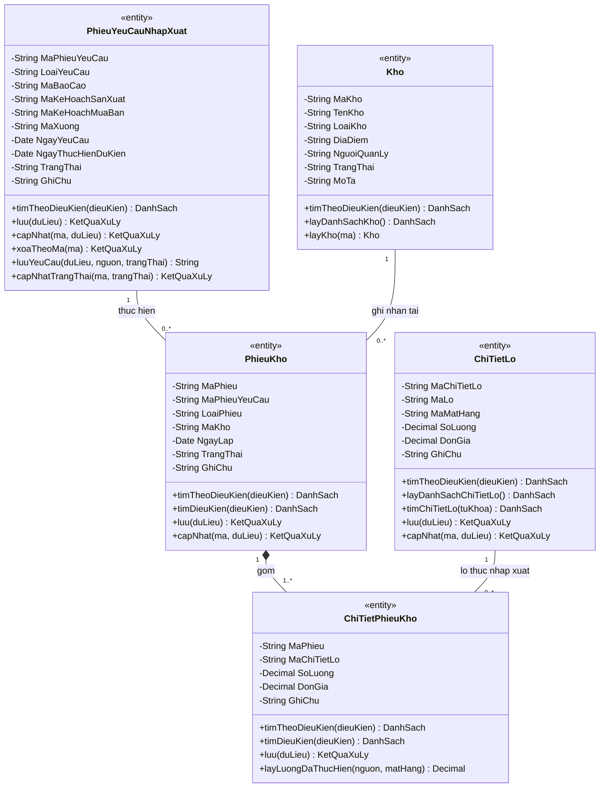
```mermaid
classDiagram
    direction TB
    class PhieuYeuCauNhapXuat {
        <<entity>>
        -String MaPhieuYeuCau
        -String LoaiYeuCau
        -String MaBaoCao
        -String MaKeHoachSanXuat
        -String MaKeHoachMuaBan
        -String MaXuong
        -Date NgayYeuCau
        -Date NgayThucHienDuKien
        -String TrangThai
        -String GhiChu
        +timTheoDieuKien(dieuKien) DanhSach
        +luu(duLieu) KetQuaXuLy
        +capNhat(ma, duLieu) KetQuaXuLy
        +xoaTheoMa(ma) KetQuaXuLy
        +luuYeuCau(duLieu, nguon, trangThai) String
        +capNhatTrangThai(ma, trangThai) KetQuaXuLy
    }
    class PhieuKho {
        <<entity>>
        -String MaPhieu
        -String MaPhieuYeuCau
        -String LoaiPhieu
        -String MaKho
        -Date NgayLap
        -String TrangThai
        -String GhiChu
        +timTheoDieuKien(dieuKien) DanhSach
        +timDieuKien(dieuKien) DanhSach
        +luu(duLieu) KetQuaXuLy
        +capNhat(ma, duLieu) KetQuaXuLy
    }
    class ChiTietPhieuKho {
        <<entity>>
        -String MaPhieu
        -String MaChiTietLo
        -Decimal SoLuong
        -Decimal DonGia
        -String GhiChu
        +timTheoDieuKien(dieuKien) DanhSach
        +timDieuKien(dieuKien) DanhSach
        +luu(duLieu) KetQuaXuLy
        +layLuongDaThucHien(nguon, matHang) Decimal
    }
    class ChiTietLo {
        <<entity>>
        -String MaChiTietLo
        -String MaLo
        -String MaMatHang
        -Decimal SoLuong
        -Decimal DonGia
        -String GhiChu
        +timTheoDieuKien(dieuKien) DanhSach
        +layDanhSachChiTietLo() DanhSach
        +timChiTietLo(tuKhoa) DanhSach
        +luu(duLieu) KetQuaXuLy
        +capNhat(ma, duLieu) KetQuaXuLy
    }
    class Kho {
        <<entity>>
        -String MaKho
        -String TenKho
        -String LoaiKho
        -String DiaDiem
        -String NguoiQuanLy
        -String TrangThai
        -String MoTa
        +timTheoDieuKien(dieuKien) DanhSach
        +layDanhSachKho() DanhSach
        +layKho(ma) Kho
    }
    PhieuYeuCauNhapXuat "1" -- "0..*" PhieuKho : thuc hien
    Kho "1" -- "0..*" PhieuKho : ghi nhan tai
    PhieuKho "1" *-- "1..*" ChiTietPhieuKho : gom
    ChiTietLo "1" -- "0..*" ChiTietPhieuKho : lo thuc nhap xuat
```

### 10. Lô hàng và phân loại

UC liên quan: UC-10, UC-22.

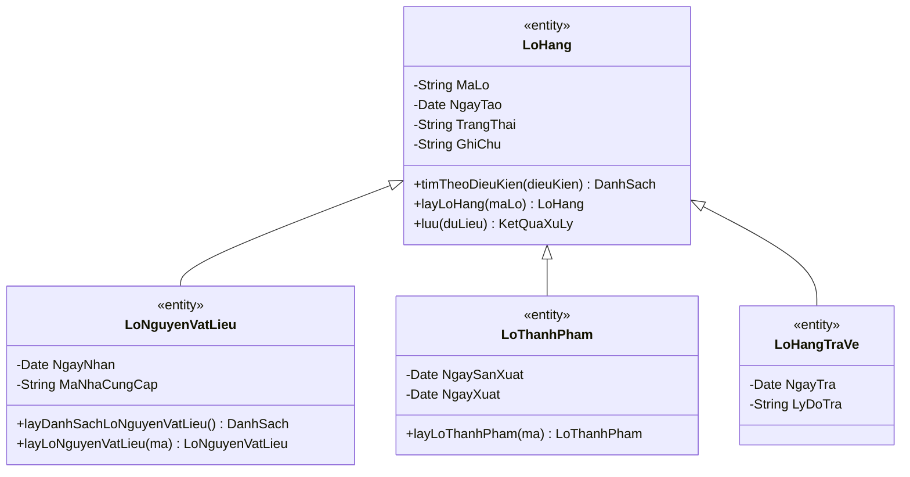
```mermaid
classDiagram
    direction TB
    class LoHang {
        <<entity>>
        -String MaLo
        -Date NgayTao
        -String TrangThai
        -String GhiChu
        +timTheoDieuKien(dieuKien) DanhSach
        +layLoHang(maLo) LoHang
        +luu(duLieu) KetQuaXuLy
    }
    class LoNguyenVatLieu {
        <<entity>>
        -Date NgayNhan
        -String MaNhaCungCap
        +layDanhSachLoNguyenVatLieu() DanhSach
        +layLoNguyenVatLieu(ma) LoNguyenVatLieu
    }
    class LoThanhPham {
        <<entity>>
        -Date NgaySanXuat
        -Date NgayXuat
        +layLoThanhPham(ma) LoThanhPham
    }
    class LoHangTraVe {
        <<entity>>
        -Date NgayTra
        -String LyDoTra
    }
    LoHang <|-- LoNguyenVatLieu
    LoHang <|-- LoThanhPham
    LoHang <|-- LoHangTraVe
```

### 11. Chi tiết lô và tồn kho

UC liên quan: UC-10, UC-11.01, UC-11.02, UC-18, UC-22.

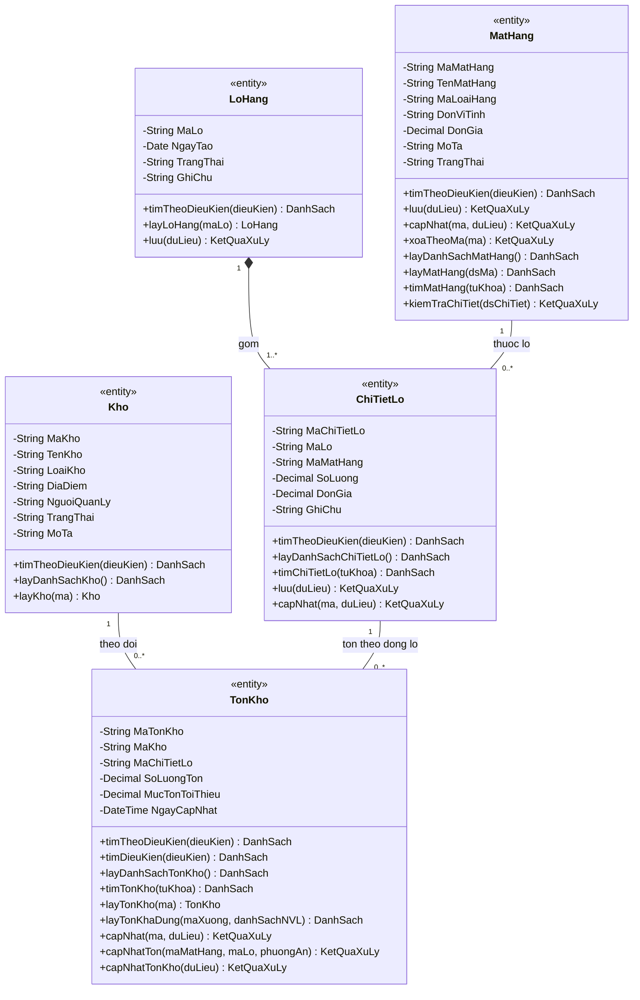
```mermaid
classDiagram
    direction TB
    class MatHang {
        <<entity>>
        -String MaMatHang
        -String TenMatHang
        -String MaLoaiHang
        -String DonViTinh
        -Decimal DonGia
        -String MoTa
        -String TrangThai
        +timTheoDieuKien(dieuKien) DanhSach
        +luu(duLieu) KetQuaXuLy
        +capNhat(ma, duLieu) KetQuaXuLy
        +xoaTheoMa(ma) KetQuaXuLy
        +layDanhSachMatHang() DanhSach
        +layMatHang(dsMa) DanhSach
        +timMatHang(tuKhoa) DanhSach
        +kiemTraChiTiet(dsChiTiet) KetQuaXuLy
    }
    class LoHang {
        <<entity>>
        -String MaLo
        -Date NgayTao
        -String TrangThai
        -String GhiChu
        +timTheoDieuKien(dieuKien) DanhSach
        +layLoHang(maLo) LoHang
        +luu(duLieu) KetQuaXuLy
    }
    class ChiTietLo {
        <<entity>>
        -String MaChiTietLo
        -String MaLo
        -String MaMatHang
        -Decimal SoLuong
        -Decimal DonGia
        -String GhiChu
        +timTheoDieuKien(dieuKien) DanhSach
        +layDanhSachChiTietLo() DanhSach
        +timChiTietLo(tuKhoa) DanhSach
        +luu(duLieu) KetQuaXuLy
        +capNhat(ma, duLieu) KetQuaXuLy
    }
    class Kho {
        <<entity>>
        -String MaKho
        -String TenKho
        -String LoaiKho
        -String DiaDiem
        -String NguoiQuanLy
        -String TrangThai
        -String MoTa
        +timTheoDieuKien(dieuKien) DanhSach
        +layDanhSachKho() DanhSach
        +layKho(ma) Kho
    }
    class TonKho {
        <<entity>>
        -String MaTonKho
        -String MaKho
        -String MaChiTietLo
        -Decimal SoLuongTon
        -Decimal MucTonToiThieu
        -DateTime NgayCapNhat
        +timTheoDieuKien(dieuKien) DanhSach
        +timDieuKien(dieuKien) DanhSach
        +layDanhSachTonKho() DanhSach
        +timTonKho(tuKhoa) DanhSach
        +layTonKho(ma) TonKho
        +layTonKhaDung(maXuong, danhSachNVL) DanhSach
        +capNhat(ma, duLieu) KetQuaXuLy
        +capNhatTon(maMatHang, maLo, phuongAn) KetQuaXuLy
        +capNhatTonKho(duLieu) KetQuaXuLy
    }
    LoHang "1" *-- "1..*" ChiTietLo : gom
    MatHang "1" -- "0..*" ChiTietLo : thuoc lo
    Kho "1" -- "0..*" TonKho : theo doi
    ChiTietLo "1" -- "0..*" TonKho : ton theo dong lo
```

### 12. Kiểm kê

UC liên quan: UC-13, UC-15, UC-16, UC-21, UC-28.

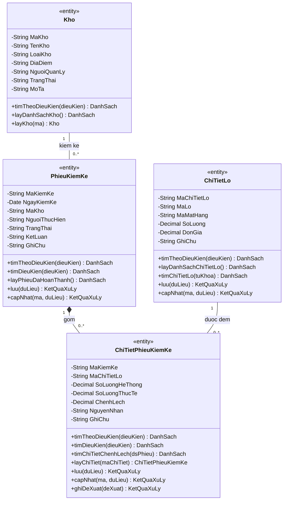
```mermaid
classDiagram
    direction TB
    class Kho {
        <<entity>>
        -String MaKho
        -String TenKho
        -String LoaiKho
        -String DiaDiem
        -String NguoiQuanLy
        -String TrangThai
        -String MoTa
        +timTheoDieuKien(dieuKien) DanhSach
        +layDanhSachKho() DanhSach
        +layKho(ma) Kho
    }
    class PhieuKiemKe {
        <<entity>>
        -String MaKiemKe
        -Date NgayKiemKe
        -String MaKho
        -String NguoiThucHien
        -String TrangThai
        -String KetLuan
        -String GhiChu
        +timTheoDieuKien(dieuKien) DanhSach
        +timDieuKien(dieuKien) DanhSach
        +layPhieuDaHoanThanh() DanhSach
        +luu(duLieu) KetQuaXuLy
        +capNhat(ma, duLieu) KetQuaXuLy
    }
    class ChiTietPhieuKiemKe {
        <<entity>>
        -String MaKiemKe
        -String MaChiTietLo
        -Decimal SoLuongHeThong
        -Decimal SoLuongThucTe
        -Decimal ChenhLech
        -String NguyenNhan
        -String GhiChu
        +timTheoDieuKien(dieuKien) DanhSach
        +timDieuKien(dieuKien) DanhSach
        +timChiTietChenhLech(dsPhieu) DanhSach
        +layChiTiet(maChiTiet) ChiTietPhieuKiemKe
        +luu(duLieu) KetQuaXuLy
        +capNhat(ma, duLieu) KetQuaXuLy
        +ghiDeXuat(deXuat) KetQuaXuLy
    }
    class ChiTietLo {
        <<entity>>
        -String MaChiTietLo
        -String MaLo
        -String MaMatHang
        -Decimal SoLuong
        -Decimal DonGia
        -String GhiChu
        +timTheoDieuKien(dieuKien) DanhSach
        +layDanhSachChiTietLo() DanhSach
        +timChiTietLo(tuKhoa) DanhSach
        +luu(duLieu) KetQuaXuLy
        +capNhat(ma, duLieu) KetQuaXuLy
    }
    Kho "1" -- "0..*" PhieuKiemKe : kiem ke
    PhieuKiemKe "1" *-- "0..*" ChiTietPhieuKiemKe : gom
    ChiTietLo "1" -- "0..*" ChiTietPhieuKiemKe : duoc dem
```

### 13. Kiểm tra QC/AC

UC liên quan: UC-12, UC-12.1, UC-12.2, UC-12.3.

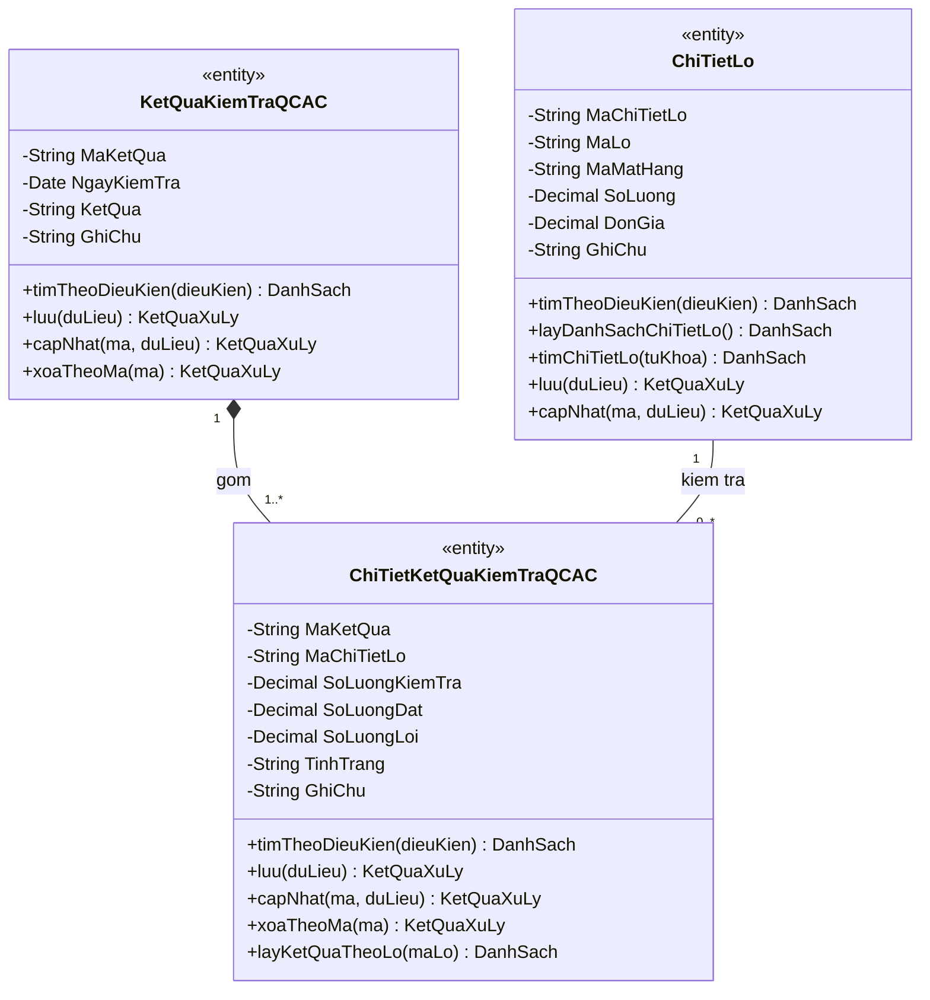
```mermaid
classDiagram
    direction TB
    class KetQuaKiemTraQCAC {
        <<entity>>
        -String MaKetQua
        -Date NgayKiemTra
        -String KetQua
        -String GhiChu
        +timTheoDieuKien(dieuKien) DanhSach
        +luu(duLieu) KetQuaXuLy
        +capNhat(ma, duLieu) KetQuaXuLy
        +xoaTheoMa(ma) KetQuaXuLy
    }
    class ChiTietKetQuaKiemTraQCAC {
        <<entity>>
        -String MaKetQua
        -String MaChiTietLo
        -Decimal SoLuongKiemTra
        -Decimal SoLuongDat
        -Decimal SoLuongLoi
        -String TinhTrang
        -String GhiChu
        +timTheoDieuKien(dieuKien) DanhSach
        +luu(duLieu) KetQuaXuLy
        +capNhat(ma, duLieu) KetQuaXuLy
        +xoaTheoMa(ma) KetQuaXuLy
        +layKetQuaTheoLo(maLo) DanhSach
    }
    class ChiTietLo {
        <<entity>>
        -String MaChiTietLo
        -String MaLo
        -String MaMatHang
        -Decimal SoLuong
        -Decimal DonGia
        -String GhiChu
        +timTheoDieuKien(dieuKien) DanhSach
        +layDanhSachChiTietLo() DanhSach
        +timChiTietLo(tuKhoa) DanhSach
        +luu(duLieu) KetQuaXuLy
        +capNhat(ma, duLieu) KetQuaXuLy
    }
    KetQuaKiemTraQCAC "1" *-- "1..*" ChiTietKetQuaKiemTraQCAC : gom
    ChiTietLo "1" -- "0..*" ChiTietKetQuaKiemTraQCAC : kiem tra
```

### 14. Báo cáo sản xuất và thành phẩm

UC liên quan: UC-34, UC-35.

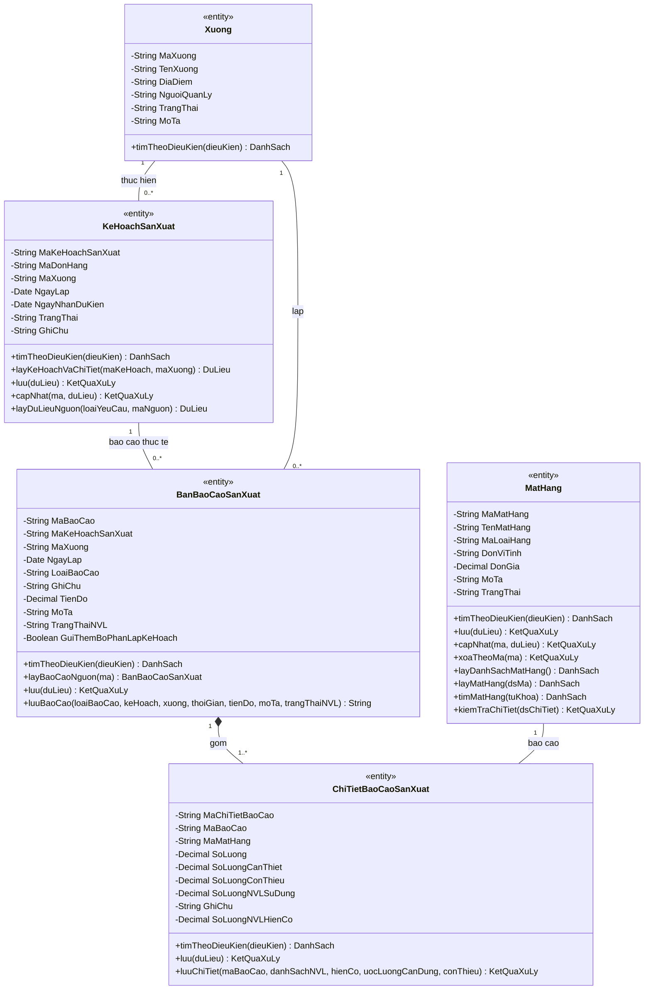
```mermaid
classDiagram
    direction TB
    class KeHoachSanXuat {
        <<entity>>
        -String MaKeHoachSanXuat
        -String MaDonHang
        -String MaXuong
        -Date NgayLap
        -Date NgayNhanDuKien
        -String TrangThai
        -String GhiChu
        +timTheoDieuKien(dieuKien) DanhSach
        +layKeHoachVaChiTiet(maKeHoach, maXuong) DuLieu
        +luu(duLieu) KetQuaXuLy
        +capNhat(ma, duLieu) KetQuaXuLy
        +layDuLieuNguon(loaiYeuCau, maNguon) DuLieu
    }
    class Xuong {
        <<entity>>
        -String MaXuong
        -String TenXuong
        -String DiaDiem
        -String NguoiQuanLy
        -String TrangThai
        -String MoTa
        +timTheoDieuKien(dieuKien) DanhSach
    }
    class BanBaoCaoSanXuat {
        <<entity>>
        -String MaBaoCao
        -String MaKeHoachSanXuat
        -String MaXuong
        -Date NgayLap
        -String LoaiBaoCao
        -String GhiChu
        -Decimal TienDo
        -String MoTa
        -String TrangThaiNVL
        -Boolean GuiThemBoPhanLapKeHoach
        +timTheoDieuKien(dieuKien) DanhSach
        +layBaoCaoNguon(ma) BanBaoCaoSanXuat
        +luu(duLieu) KetQuaXuLy
        +luuBaoCao(loaiBaoCao, keHoach, xuong, thoiGian, tienDo, moTa, trangThaiNVL) String
    }
    class ChiTietBaoCaoSanXuat {
        <<entity>>
        -String MaChiTietBaoCao
        -String MaBaoCao
        -String MaMatHang
        -Decimal SoLuong
        -Decimal SoLuongCanThiet
        -Decimal SoLuongConThieu
        -Decimal SoLuongNVLSuDung
        -String GhiChu
        -Decimal SoLuongNVLHienCo
        +timTheoDieuKien(dieuKien) DanhSach
        +luu(duLieu) KetQuaXuLy
        +luuChiTiet(maBaoCao, danhSachNVL, hienCo, uocLuongCanDung, conThieu) KetQuaXuLy
    }
    class MatHang {
        <<entity>>
        -String MaMatHang
        -String TenMatHang
        -String MaLoaiHang
        -String DonViTinh
        -Decimal DonGia
        -String MoTa
        -String TrangThai
        +timTheoDieuKien(dieuKien) DanhSach
        +luu(duLieu) KetQuaXuLy
        +capNhat(ma, duLieu) KetQuaXuLy
        +xoaTheoMa(ma) KetQuaXuLy
        +layDanhSachMatHang() DanhSach
        +layMatHang(dsMa) DanhSach
        +timMatHang(tuKhoa) DanhSach
        +kiemTraChiTiet(dsChiTiet) KetQuaXuLy
    }
    Xuong "1" -- "0..*" KeHoachSanXuat : thuc hien
    KeHoachSanXuat "1" -- "0..*" BanBaoCaoSanXuat : bao cao thuc te
    Xuong "1" -- "0..*" BanBaoCaoSanXuat : lap
    BanBaoCaoSanXuat "1" *-- "1..*" ChiTietBaoCaoSanXuat : gom
    MatHang "1" -- "0..*" ChiTietBaoCaoSanXuat : bao cao
```

### 15. Chi tiết lô trong báo cáo

UC liên quan: UC-35.

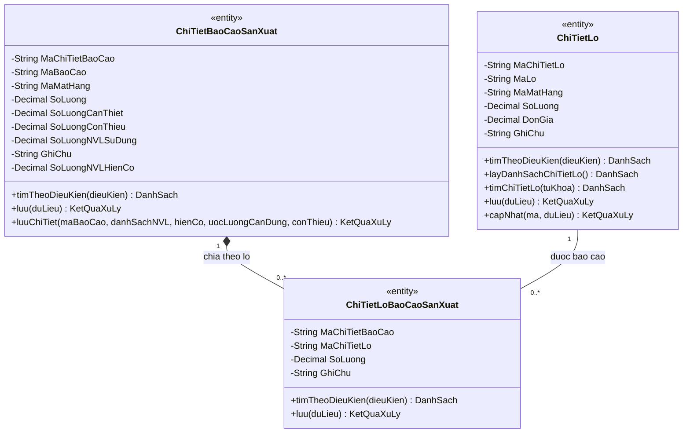
```mermaid
classDiagram
    direction TB
    class ChiTietBaoCaoSanXuat {
        <<entity>>
        -String MaChiTietBaoCao
        -String MaBaoCao
        -String MaMatHang
        -Decimal SoLuong
        -Decimal SoLuongCanThiet
        -Decimal SoLuongConThieu
        -Decimal SoLuongNVLSuDung
        -String GhiChu
        -Decimal SoLuongNVLHienCo
        +timTheoDieuKien(dieuKien) DanhSach
        +luu(duLieu) KetQuaXuLy
        +luuChiTiet(maBaoCao, danhSachNVL, hienCo, uocLuongCanDung, conThieu) KetQuaXuLy
    }
    class ChiTietLoBaoCaoSanXuat {
        <<entity>>
        -String MaChiTietBaoCao
        -String MaChiTietLo
        -Decimal SoLuong
        -String GhiChu
        +timTheoDieuKien(dieuKien) DanhSach
        +luu(duLieu) KetQuaXuLy
    }
    class ChiTietLo {
        <<entity>>
        -String MaChiTietLo
        -String MaLo
        -String MaMatHang
        -Decimal SoLuong
        -Decimal DonGia
        -String GhiChu
        +timTheoDieuKien(dieuKien) DanhSach
        +layDanhSachChiTietLo() DanhSach
        +timChiTietLo(tuKhoa) DanhSach
        +luu(duLieu) KetQuaXuLy
        +capNhat(ma, duLieu) KetQuaXuLy
    }
    ChiTietBaoCaoSanXuat "1" *-- "0..*" ChiTietLoBaoCaoSanXuat : chia theo lo
    ChiTietLo "1" -- "0..*" ChiTietLoBaoCaoSanXuat : duoc bao cao
```

### 16. Xử lý ngoại lệ

UC liên quan: UC-16, UC-17.

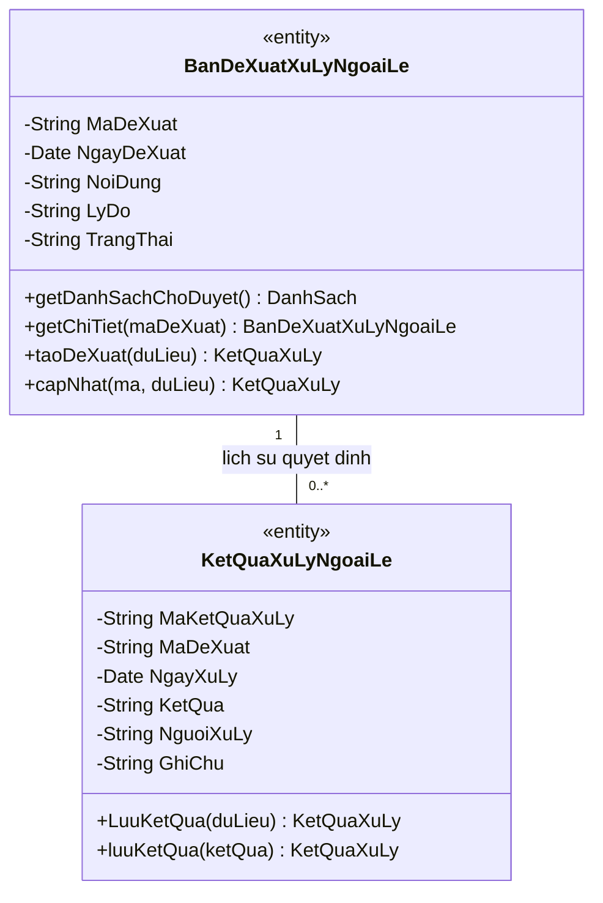
```mermaid
classDiagram
    direction TB
    class BanDeXuatXuLyNgoaiLe {
        <<entity>>
        -String MaDeXuat
        -Date NgayDeXuat
        -String NoiDung
        -String LyDo
        -String TrangThai
        +getDanhSachChoDuyet() DanhSach
        +getChiTiet(maDeXuat) BanDeXuatXuLyNgoaiLe
        +taoDeXuat(duLieu) KetQuaXuLy
        +capNhat(ma, duLieu) KetQuaXuLy
    }
    class KetQuaXuLyNgoaiLe {
        <<entity>>
        -String MaKetQuaXuLy
        -String MaDeXuat
        -Date NgayXuLy
        -String KetQua
        -String NguoiXuLy
        -String GhiChu
        +LuuKetQua(duLieu) KetQuaXuLy
        +luuKetQua(ketQua) KetQuaXuLy
    }
    BanDeXuatXuLyNgoaiLe "1" -- "0..*" KetQuaXuLyNgoaiLe : lich su quyet dinh
```

### 17. Công việc và phân công

UC liên quan: UC-13, UC-15, UC-25, UC-25.1, UC-25.2.

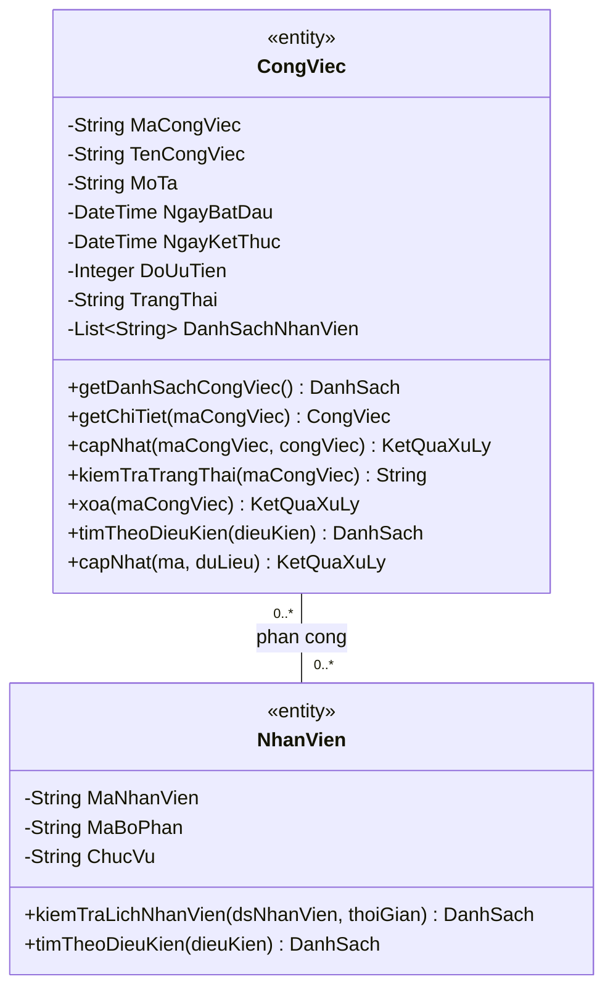
```mermaid
classDiagram
    direction TB
    class CongViec {
        <<entity>>
        -String MaCongViec
        -String TenCongViec
        -String MoTa
        -DateTime NgayBatDau
        -DateTime NgayKetThuc
        -Integer DoUuTien
        -String TrangThai
        -List~String~ DanhSachNhanVien
        +getDanhSachCongViec() DanhSach
        +getChiTiet(maCongViec) CongViec
        +capNhat(maCongViec, congViec) KetQuaXuLy
        +kiemTraTrangThai(maCongViec) String
        +xoa(maCongViec) KetQuaXuLy
        +timTheoDieuKien(dieuKien) DanhSach
        +capNhat(ma, duLieu) KetQuaXuLy
    }
    class NhanVien {
        <<entity>>
        -String MaNhanVien
        -String MaBoPhan
        -String ChucVu
        +kiemTraLichNhanVien(dsNhanVien, thoiGian) DanhSach
        +timTheoDieuKien(dieuKien) DanhSach
    }
    CongViec "0..*" -- "0..*" NhanVien : phan cong
```

## Quan hệ nối giữa các module

Các quan hệ đã xuất hiện trong hình module không lặp lại ở bảng này. `0..*` cho phép chưa phát sinh đối tượng; bản ghi chi tiết chỉ có ý nghĩa trong chứng từ cha. Bội số là diễn giải thiết kế của các association trong tài liệu, không phải bằng chứng ràng buộc đã triển khai.

| Lớp nguồn | Bội số nguồn | Lớp đích | Bội số đích | Quan hệ |
|---|---|---|---|---|
|MatHang|1|ChiTietDonMuaHang|0..*|mua|
|BanBaoCaoSanXuat|0..1|PhieuYeuCauNhapXuat|0..*|nguon theo nhanh|
|KeHoachSanXuat|0..1|PhieuYeuCauNhapXuat|0..*|nguon xuat NVL|
|KeHoachMuaBan|0..1|PhieuYeuCauNhapXuat|0..*|nguon import MUA BAN|
|NhaCungCap|1|LoNguyenVatLieu|0..*|giao|

## Các lớp boundary và controller

Tên lớp được chuẩn hóa về PascalCase không dấu; `GD_...`, `UI_...`, `Ctr_...` trên sequence được hiểu lần lượt là boundary và control tương ứng. Controller dùng chung được gom method của tất cả UC liên quan. Giao diện của UC con vẫn được giữ riêng để truy vết màn hình.

Mỗi hình dưới có tối đa năm lớp. Controller chỉ khai báo đầy đủ method trong hình đầu tiên của nhóm; những lần xuất hiện tiếp theo là cùng lớp đó. Method giao diện là thao tác trình bày/nhận dữ liệu, không phải truy cập entity trực tiếp. UC-11 chỉ chọn nhánh và chuyển sang UC-11.01/11.02 nên không tự thêm method truy cập dữ liệu.

### ControllerTaiKhoan

UC: UC-01.

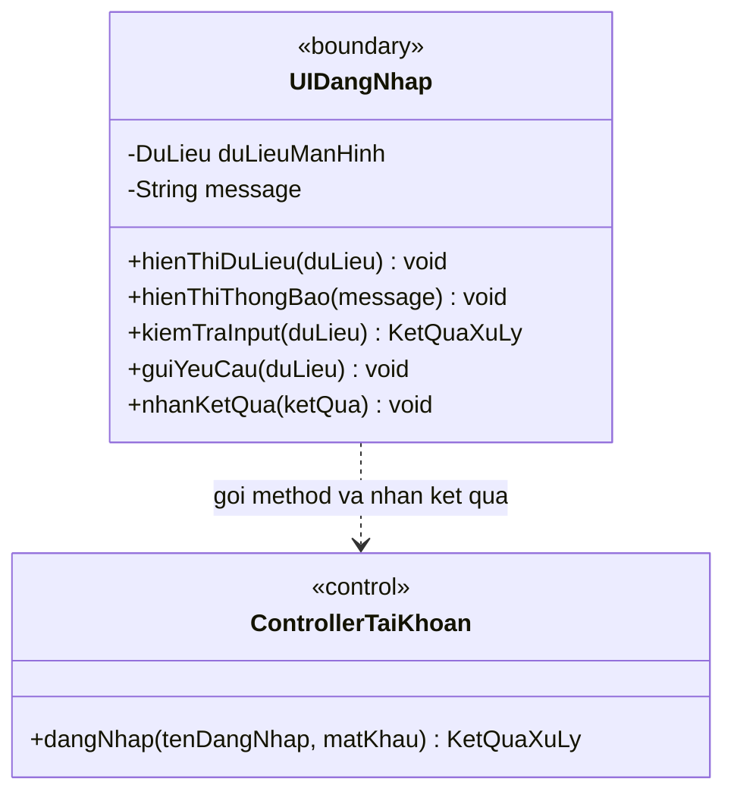
```mermaid
classDiagram
    direction TB
    class ControllerTaiKhoan {
        <<control>>
        +dangNhap(tenDangNhap, matKhau) KetQuaXuLy
    }
    class UIDangNhap {
        <<boundary>>
        -DuLieu duLieuManHinh
        -String message
        +hienThiDuLieu(duLieu) void
        +hienThiThongBao(message) void
        +kiemTraInput(duLieu) KetQuaXuLy
        +guiYeuCau(duLieu) void
        +nhanKetQua(ketQua) void
    }
    UIDangNhap ..> ControllerTaiKhoan : goi method va nhan ket qua
```

### ControllerDonHang

UC: UC-02, UC-03, UC-03.1, UC-29, UC-31.

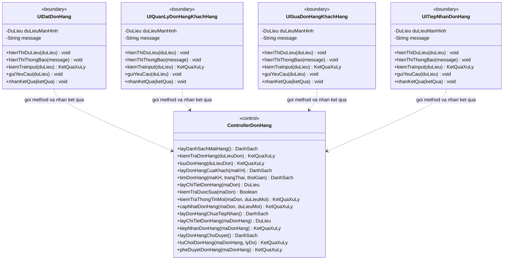
```mermaid
classDiagram
    direction TB
    class ControllerDonHang {
        <<control>>
        +layDanhSachMatHang() DanhSach
        +kiemTraDonHang(duLieuDon) KetQuaXuLy
        +luuDonHang(duLieuDon) KetQuaXuLy
        +layDonHangCuaKhach(maKH) DanhSach
        +timDonHang(maKH, trangThai, thoiGian) DanhSach
        +layChiTietDonHang(maDon) DuLieu
        +kiemTraDuocSua(maDon) Boolean
        +kiemTraThongTinMoi(maDon, duLieuMoi) KetQuaXuLy
        +capNhatDonHang(maDon, duLieuMoi) KetQuaXuLy
        +layDonHangChuaTiepNhan() DanhSach
        +layChiTietDonHang(maDonHang) DuLieu
        +tiepNhanDonHang(maDonHang) KetQuaXuLy
        +layDonHangChoDuyet() DanhSach
        +tuChoiDonHang(maDonHang, lyDo) KetQuaXuLy
        +pheDuyetDonHang(maDonHang) KetQuaXuLy
    }
    class UIDatDonHang {
        <<boundary>>
        -DuLieu duLieuManHinh
        -String message
        +hienThiDuLieu(duLieu) void
        +hienThiThongBao(message) void
        +kiemTraInput(duLieu) KetQuaXuLy
        +guiYeuCau(duLieu) void
        +nhanKetQua(ketQua) void
    }
    class UIQuanLyDonHangKhachHang {
        <<boundary>>
        -DuLieu duLieuManHinh
        -String message
        +hienThiDuLieu(duLieu) void
        +hienThiThongBao(message) void
        +kiemTraInput(duLieu) KetQuaXuLy
        +guiYeuCau(duLieu) void
        +nhanKetQua(ketQua) void
    }
    class UISuaDonHangKhachHang {
        <<boundary>>
        -DuLieu duLieuManHinh
        -String message
        +hienThiDuLieu(duLieu) void
        +hienThiThongBao(message) void
        +kiemTraInput(duLieu) KetQuaXuLy
        +guiYeuCau(duLieu) void
        +nhanKetQua(ketQua) void
    }
    class UITiepNhanDonHang {
        <<boundary>>
        -DuLieu duLieuManHinh
        -String message
        +hienThiDuLieu(duLieu) void
        +hienThiThongBao(message) void
        +kiemTraInput(duLieu) KetQuaXuLy
        +guiYeuCau(duLieu) void
        +nhanKetQua(ketQua) void
    }
    UIDatDonHang ..> ControllerDonHang : goi method va nhan ket qua
    UIQuanLyDonHangKhachHang ..> ControllerDonHang : goi method va nhan ket qua
    UISuaDonHangKhachHang ..> ControllerDonHang : goi method va nhan ket qua
    UITiepNhanDonHang ..> ControllerDonHang : goi method va nhan ket qua
```

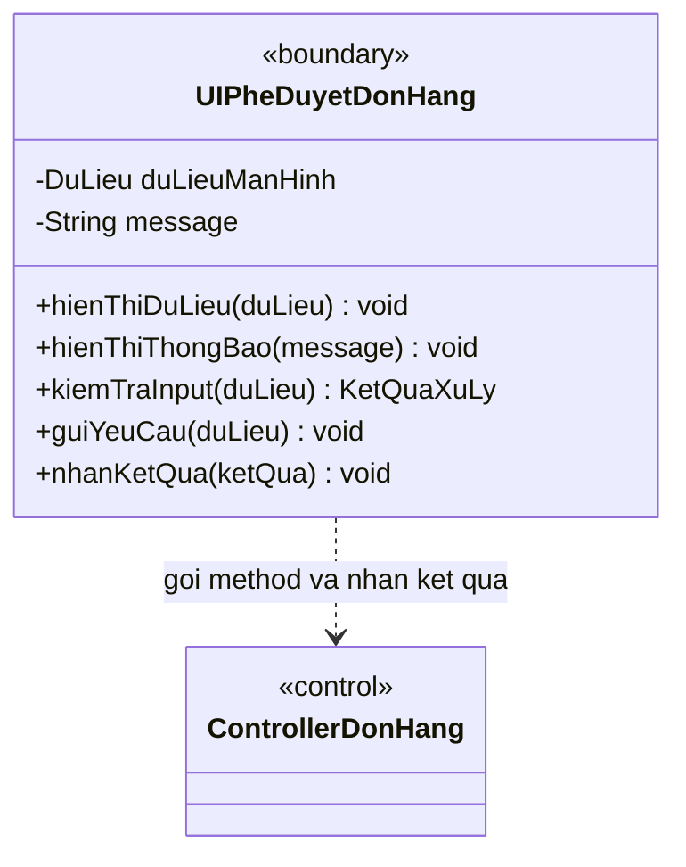
```mermaid
classDiagram
    direction TB
    class ControllerDonHang {
        <<control>>
    }
    class UIPheDuyetDonHang {
        <<boundary>>
        -DuLieu duLieuManHinh
        -String message
        +hienThiDuLieu(duLieu) void
        +hienThiThongBao(message) void
        +kiemTraInput(duLieu) KetQuaXuLy
        +guiYeuCau(duLieu) void
        +nhanKetQua(ketQua) void
    }
    UIPheDuyetDonHang ..> ControllerDonHang : goi method va nhan ket qua
```

### ControllerDanhMucKho

UC: UC-06, UC-06.1, UC-06.2, UC-06.3.

```mermaid
classDiagram
    direction TB
    class ControllerDanhMucKho {
        <<control>>
        +layDanhSachDanhMuc() DanhSach
        +layChiTietDanhMuc(maLoaiHang) DuLieu
        +layDuLieuThemDanhMuc() DuLieu
        +themDanhMuc(duLieuDanhMuc) KetQuaXuLy
        +layRangBuocDanhMuc(maLoaiHang) DuLieu
        +xoaDanhMuc(maLoaiHang) KetQuaXuLy
        +layDuLieuSuaDanhMuc(maLoaiHang) DuLieu
        +suaDanhMuc(maLoaiHang, duLieu) KetQuaXuLy
    }
    class UIQuanLyDanhMucKho {
        <<boundary>>
        -DuLieu duLieuManHinh
        -String message
        +hienThiDuLieu(duLieu) void
        +hienThiThongBao(message) void
        +kiemTraInput(duLieu) KetQuaXuLy
        +guiYeuCau(duLieu) void
        +nhanKetQua(ketQua) void
    }
    class UIThemDanhMucKho {
        <<boundary>>
        -DuLieu duLieuManHinh
        -String message
        +hienThiDuLieu(duLieu) void
        +hienThiThongBao(message) void
        +kiemTraInput(duLieu) KetQuaXuLy
        +guiYeuCau(duLieu) void
        +nhanKetQua(ketQua) void
    }
    class UIXoaDanhMucKho {
        <<boundary>>
        -DuLieu duLieuManHinh
        -String message
        +hienThiDuLieu(duLieu) void
        +hienThiThongBao(message) void
        +kiemTraInput(duLieu) KetQuaXuLy
        +guiYeuCau(duLieu) void
        +nhanKetQua(ketQua) void
    }
    class UISuaDanhMucKho {
        <<boundary>>
        -DuLieu duLieuManHinh
        -String message
        +hienThiDuLieu(duLieu) void
        +hienThiThongBao(message) void
        +kiemTraInput(duLieu) KetQuaXuLy
        +guiYeuCau(duLieu) void
        +nhanKetQua(ketQua) void
    }
    UIQuanLyDanhMucKho ..> ControllerDanhMucKho : goi method va nhan ket qua
    UIThemDanhMucKho ..> ControllerDanhMucKho : goi method va nhan ket qua
    UIXoaDanhMucKho ..> ControllerDanhMucKho : goi method va nhan ket qua
    UISuaDanhMucKho ..> ControllerDanhMucKho : goi method va nhan ket qua
```

### ControllerDuLieuDanhMucKho

UC: UC-07, UC-07.1, UC-07.2, UC-07.3.

```mermaid
classDiagram
    direction TB
    class ControllerDuLieuDanhMucKho {
        <<control>>
        +layDuLieuDanhMuc(maLoaiHang) DuLieu
        +timDuLieuDanhMuc(dieuKien) DanhSach
        +layChiTietMatHang(maMatHang) MatHang
        +layDuLieuThemMatHang(maLoaiHang) DuLieu
        +themMatHang(duLieuMatHang) KetQuaXuLy
        +layRangBuocMatHang(maMatHang) DuLieu
        +xoaMatHang(maMatHang) KetQuaXuLy
        +layDuLieuSuaMatHang(maMatHang) DuLieu
        +suaMatHang(maMatHang, duLieu) KetQuaXuLy
    }
    class UIQuanLyDuLieuDanhMucKho {
        <<boundary>>
        -DuLieu duLieuManHinh
        -String message
        +hienThiDuLieu(duLieu) void
        +hienThiThongBao(message) void
        +kiemTraInput(duLieu) KetQuaXuLy
        +guiYeuCau(duLieu) void
        +nhanKetQua(ketQua) void
    }
    class UIThemDuLieuDanhMucKho {
        <<boundary>>
        -DuLieu duLieuManHinh
        -String message
        +hienThiDuLieu(duLieu) void
        +hienThiThongBao(message) void
        +kiemTraInput(duLieu) KetQuaXuLy
        +guiYeuCau(duLieu) void
        +nhanKetQua(ketQua) void
    }
    class UIXoaDuLieuDanhMucKho {
        <<boundary>>
        -DuLieu duLieuManHinh
        -String message
        +hienThiDuLieu(duLieu) void
        +hienThiThongBao(message) void
        +kiemTraInput(duLieu) KetQuaXuLy
        +guiYeuCau(duLieu) void
        +nhanKetQua(ketQua) void
    }
    class UISuaDuLieuDanhMucKho {
        <<boundary>>
        -DuLieu duLieuManHinh
        -String message
        +hienThiDuLieu(duLieu) void
        +hienThiThongBao(message) void
        +kiemTraInput(duLieu) KetQuaXuLy
        +guiYeuCau(duLieu) void
        +nhanKetQua(ketQua) void
    }
    UIQuanLyDuLieuDanhMucKho ..> ControllerDuLieuDanhMucKho : goi method va nhan ket qua
    UIThemDuLieuDanhMucKho ..> ControllerDuLieuDanhMucKho : goi method va nhan ket qua
    UIXoaDuLieuDanhMucKho ..> ControllerDuLieuDanhMucKho : goi method va nhan ket qua
    UISuaDuLieuDanhMucKho ..> ControllerDuLieuDanhMucKho : goi method va nhan ket qua
```

### ControllerNhapKho

UC: UC-08, UC-10.

```mermaid
classDiagram
    direction TB
    class ControllerNhapKho {
        <<control>>
        +layDanhSachPhieuNhap() DanhSach
        +timPhieuNhap(dieuKien) DanhSach
        +layChiTietPhieuNhap(maPhieu) DuLieu
        +layYeuCauNhapChoXuLy() DanhSach
        +layChiTietYeuCauNhap(maYeuCau) DuLieu
        +nhapKho(duLieuNhapKho) KetQuaXuLy
        +xacNhanChenhLechNhap(duLieuChenhLech) KetQuaXuLy
    }
    class UIQuanLyNhapKho {
        <<boundary>>
        -DuLieu duLieuManHinh
        -String message
        +hienThiDuLieu(duLieu) void
        +hienThiThongBao(message) void
        +kiemTraInput(duLieu) KetQuaXuLy
        +guiYeuCau(duLieu) void
        +nhanKetQua(ketQua) void
    }
    class UINhapKho {
        <<boundary>>
        -DuLieu duLieuManHinh
        -String message
        +hienThiDuLieu(duLieu) void
        +hienThiThongBao(message) void
        +kiemTraInput(duLieu) KetQuaXuLy
        +guiYeuCau(duLieu) void
        +nhanKetQua(ketQua) void
    }
    UIQuanLyNhapKho ..> ControllerNhapKho : goi method va nhan ket qua
    UINhapKho ..> ControllerNhapKho : goi method va nhan ket qua
```

### ControllerXuatKho

UC: UC-09, UC-11, UC-11.01, UC-11.02.

```mermaid
classDiagram
    direction TB
    class ControllerXuatKho {
        <<control>>
        +layDanhSachPhieuXuat() DanhSach
        +timPhieuXuat(dieuKien) DanhSach
        +layChiTietPhieuXuat(maPhieu) DuLieu
        +layYeuCauXuatNVLChoXuLy() DanhSach
        +lapDuThaoXuatNVL(maYeuCau) DuLieu
        +guiDeXuatNgoaiLe(duLieuDeXuat) KetQuaXuLy
        +xuatNguyenVatLieu(duLieuXuatKho) KetQuaXuLy
        +layDonHangVaKeHoachBan() DuLieu
        +layLoThanhPhamKhaDung(dieuKien) DanhSach
        +xuatThanhPham(duLieuXuatKho) KetQuaXuLy
    }
    class UIQuanLyXuatKho {
        <<boundary>>
        -DuLieu duLieuManHinh
        -String message
        +hienThiDuLieu(duLieu) void
        +hienThiThongBao(message) void
        +kiemTraInput(duLieu) KetQuaXuLy
        +guiYeuCau(duLieu) void
        +nhanKetQua(ketQua) void
    }
    class UIXuatKho {
        <<boundary>>
        -DuLieu duLieuManHinh
        -String message
        +hienThiDuLieu(duLieu) void
        +hienThiThongBao(message) void
    }
    class UIXuatNguyenVatLieu {
        <<boundary>>
        -DuLieu duLieuManHinh
        -String message
        +hienThiDuLieu(duLieu) void
        +hienThiThongBao(message) void
        +kiemTraInput(duLieu) KetQuaXuLy
        +guiYeuCau(duLieu) void
        +nhanKetQua(ketQua) void
    }
    class UIXuatThanhPham {
        <<boundary>>
        -DuLieu duLieuManHinh
        -String message
        +hienThiDuLieu(duLieu) void
        +hienThiThongBao(message) void
        +kiemTraInput(duLieu) KetQuaXuLy
        +guiYeuCau(duLieu) void
        +nhanKetQua(ketQua) void
    }
    UIQuanLyXuatKho ..> ControllerXuatKho : goi method va nhan ket qua
    UIXuatKho ..> ControllerXuatKho : goi method va nhan ket qua
    UIXuatNguyenVatLieu ..> ControllerXuatKho : goi method va nhan ket qua
    UIXuatThanhPham ..> ControllerXuatKho : goi method va nhan ket qua
```

### ControllerKiemKe

UC: UC-13, UC-15, UC-28.

```mermaid
classDiagram
    direction TB
    class ControllerKiemKe {
        <<control>>
        +layDuLieuLapDotKiemKe() DuLieu
        +lapDotKiemKe(duLieuDotKiemKe) KetQuaXuLy
        +layDanhSachCanKiemKe(maCongViec) DanhSach
        +ghiNhanSoDem(maChiTiet, soLuongThucTe) KetQuaXuLy
        +dongBoDuLieuKiemKe(duLieuChuaLuu) KetQuaXuLy
        +luuTamKiemKe(maPhieuKiemKe) KetQuaXuLy
        +hoanThanhKhuVuc(maPhieuKiemKe, maKho) KetQuaXuLy
        +layDuLieuBienBanKiemKe(maPhieuKiemKe) DuLieu
        +layTrangThaiDotKiemKe(maPhieuKiemKe) String
        +luuTamKetLuanKiemKe(maPhieuKiemKe, noiDung) KetQuaXuLy
        +lapBienBanKiemKe(maPhieuKiemKe, noiDung) KetQuaXuLy
    }
    class UILapDotKiemKe {
        <<boundary>>
        -DuLieu duLieuManHinh
        -String message
        +hienThiDuLieu(duLieu) void
        +hienThiThongBao(message) void
        +kiemTraInput(duLieu) KetQuaXuLy
        +guiYeuCau(duLieu) void
        +nhanKetQua(ketQua) void
    }
    class UIThucHienKiemKe {
        <<boundary>>
        -DuLieu duLieuManHinh
        -String message
        +hienThiDuLieu(duLieu) void
        +hienThiThongBao(message) void
        +kiemTraInput(duLieu) KetQuaXuLy
        +guiYeuCau(duLieu) void
        +nhanKetQua(ketQua) void
    }
    class UILapBienBanKiemKe {
        <<boundary>>
        -DuLieu duLieuManHinh
        -String message
        +hienThiDuLieu(duLieu) void
        +hienThiThongBao(message) void
        +kiemTraInput(duLieu) KetQuaXuLy
        +guiYeuCau(duLieu) void
        +nhanKetQua(ketQua) void
    }
    UILapDotKiemKe ..> ControllerKiemKe : goi method va nhan ket qua
    UIThucHienKiemKe ..> ControllerKiemKe : goi method va nhan ket qua
    UILapBienBanKiemKe ..> ControllerKiemKe : goi method va nhan ket qua
```

### ControllerDonMuaHang

UC: UC-14.

```mermaid
classDiagram
    direction TB
    class ControllerDonMuaHang {
        <<control>>
        +layDanhSachDonMuaHang() DanhSach
    }
    class UIQuanLyDonHangMua {
        <<boundary>>
        -DuLieu duLieuManHinh
        -String message
        +hienThiDuLieu(duLieu) void
        +hienThiThongBao(message) void
        +kiemTraInput(duLieu) KetQuaXuLy
        +guiYeuCau(duLieu) void
        +nhanKetQua(ketQua) void
    }
    UIQuanLyDonHangMua ..> ControllerDonMuaHang : goi method va nhan ket qua
```

### ControllerYeuCauNhapXuat

UC: UC-23, UC-24, UC-24.1, UC-24.2.

```mermaid
classDiagram
    direction TB
    class ControllerYeuCauNhapXuat {
        <<control>>
        +importDuLieu(loaiYeuCau, maNguon, maLo) DuLieu
        +kiemTraNguonVaTinhLuongDuocPhep(nguon, ketQuaQC) DuLieu
        +guiYeuCauNhapXuat(duLieu, nguon) KetQuaXuLy
        +kiemTraDieuKienVaLuongConDuocPhep(duLieu) KetQuaXuLy
        +guiThongBaoDenKho(maYeuCau) void
        +layYeuCauCuaXuong(maXuong) DanhSach
        +layChiTietYeuCau(maYeuCau) DuLieu
        +layDuLieuSuaYeuCau(maYeuCau) DuLieu
        +suaYeuCau(maYeuCau, duLieu) KetQuaXuLy
        +layTrangThaiYeuCau(maYeuCau) DuLieu
        +huyYeuCau(maYeuCau) KetQuaXuLy
    }
    class UIYeuCauNhapXuat {
        <<boundary>>
        -DuLieu duLieuManHinh
        -String message
        +hienThiDuLieu(duLieu) void
        +hienThiThongBao(message) void
        +kiemTraInput(duLieu) KetQuaXuLy
        +guiYeuCau(duLieu) void
        +nhanKetQua(ketQua) void
    }
    class UIQuanLyYeuCauNhapXuat {
        <<boundary>>
        -DuLieu duLieuManHinh
        -String message
        +hienThiDuLieu(duLieu) void
        +hienThiThongBao(message) void
        +kiemTraInput(duLieu) KetQuaXuLy
        +guiYeuCau(duLieu) void
        +nhanKetQua(ketQua) void
    }
    class UISuaYeuCau {
        <<boundary>>
        -DuLieu duLieuManHinh
        -String message
        +hienThiDuLieu(duLieu) void
        +hienThiThongBao(message) void
        +kiemTraInput(duLieu) KetQuaXuLy
        +guiYeuCau(duLieu) void
        +nhanKetQua(ketQua) void
    }
    class UIXoaYeuCau {
        <<boundary>>
        -DuLieu duLieuManHinh
        -String message
        +hienThiDuLieu(duLieu) void
        +hienThiThongBao(message) void
        +kiemTraInput(duLieu) KetQuaXuLy
        +guiYeuCau(duLieu) void
        +nhanKetQua(ketQua) void
    }
    UIYeuCauNhapXuat ..> ControllerYeuCauNhapXuat : goi method va nhan ket qua
    UIQuanLyYeuCauNhapXuat ..> ControllerYeuCauNhapXuat : goi method va nhan ket qua
    UISuaYeuCau ..> ControllerYeuCauNhapXuat : goi method va nhan ket qua
    UIXoaYeuCau ..> ControllerYeuCauNhapXuat : goi method va nhan ket qua
```

### ControllerMuaHang

UC: UC-27.

```mermaid
classDiagram
    direction TB
    class ControllerMuaHang {
        <<control>>
        +layKeHoachMuaDaDuyet() DanhSach
        +layKeHoachVaBaoCaoNguon(maKeHoach) DuLieu
        +lapDonMuaHang(duLieuDonMua) KetQuaXuLy
    }
    class UIMuaHang {
        <<boundary>>
        -DuLieu duLieuManHinh
        -String message
        +hienThiDuLieu(duLieu) void
        +hienThiThongBao(message) void
        +kiemTraInput(duLieu) KetQuaXuLy
        +guiYeuCau(duLieu) void
        +nhanKetQua(ketQua) void
    }
    UIMuaHang ..> ControllerMuaHang : goi method va nhan ket qua
```

### ControllerKeHoach

UC: UC-04, UC-05, UC-05.1, UC-05.2, UC-32.

```mermaid
classDiagram
    direction TB
    class ControllerKeHoach {
        <<control>>
        +layBaoCaoSanXuatConThieu() DanhSach
        +lapKeHoachMua(duLieuKeHoach) KetQuaXuLy
        +lapKeHoachBan(duLieuKeHoach) KetQuaXuLy
        +lapKeHoachSanXuat(duLieuKeHoach) KetQuaXuLy
        +layDanhSachKeHoach() DanhSach
        +timKeHoach(dieuKien) DanhSach
        +layChiTietKeHoach(maKeHoach) DuLieu
        +layDuLieuSuaKeHoach(maKeHoach) DuLieu
        +suaKeHoach(maKeHoach, duLieu) KetQuaXuLy
        +layRangBuocKeHoach(maKeHoach) DuLieu
        +xoaKeHoach(maKeHoach) KetQuaXuLy
        +layKeHoachChoDuyet() DanhSach
        +xuLyKeHoach(ma, quyetDinh, lyDo) KetQuaXuLy
        +thongBaoTuChoi(ma, lyDo) void
    }
    class UILapKeHoachMuaBan {
        <<boundary>>
        -DuLieu duLieuManHinh
        -String message
        +hienThiDuLieu(duLieu) void
        +hienThiThongBao(message) void
        +kiemTraInput(duLieu) KetQuaXuLy
        +guiYeuCau(duLieu) void
        +nhanKetQua(ketQua) void
    }
    class UIQuanLyKeHoach {
        <<boundary>>
        -DuLieu duLieuManHinh
        -String message
        +hienThiDuLieu(duLieu) void
        +hienThiThongBao(message) void
        +kiemTraInput(duLieu) KetQuaXuLy
        +guiYeuCau(duLieu) void
        +nhanKetQua(ketQua) void
    }
    class UISuaKeHoach {
        <<boundary>>
        -DuLieu duLieuManHinh
        -String message
        +hienThiDuLieu(duLieu) void
        +hienThiThongBao(message) void
        +kiemTraInput(duLieu) KetQuaXuLy
        +guiYeuCau(duLieu) void
        +nhanKetQua(ketQua) void
    }
    class UIXoaKeHoach {
        <<boundary>>
        -DuLieu duLieuManHinh
        -String message
        +hienThiDuLieu(duLieu) void
        +hienThiThongBao(message) void
        +kiemTraInput(duLieu) KetQuaXuLy
        +guiYeuCau(duLieu) void
        +nhanKetQua(ketQua) void
    }
    UILapKeHoachMuaBan ..> ControllerKeHoach : goi method va nhan ket qua
    UIQuanLyKeHoach ..> ControllerKeHoach : goi method va nhan ket qua
    UISuaKeHoach ..> ControllerKeHoach : goi method va nhan ket qua
    UIXoaKeHoach ..> ControllerKeHoach : goi method va nhan ket qua
```

```mermaid
classDiagram
    direction TB
    class ControllerKeHoach {
        <<control>>
    }
    class UIPheDuyetKeHoachMuaBan {
        <<boundary>>
        -DuLieu duLieuManHinh
        -String message
        +hienThiDuLieu(duLieu) void
        +hienThiThongBao(message) void
        +kiemTraInput(duLieu) KetQuaXuLy
        +guiYeuCau(duLieu) void
        +nhanKetQua(ketQua) void
    }
    UIPheDuyetKeHoachMuaBan ..> ControllerKeHoach : goi method va nhan ket qua
```

### ControllerBaoCaoSanXuat

UC: UC-35, UC-34.

```mermaid
classDiagram
    direction TB
    class ControllerBaoCaoSanXuat {
        <<control>>
        +layDuLieuBaoCaoThanhPham(maKeHoach, maXuong) DuLieu
        +lapBaoCaoThanhPham(duLieuBaoCao) KetQuaXuLy
        +layDuLieuBaoCao(maKeHoach, maXuong) DuLieu
        +doiChieuNVL(NVLUocLuong, NVLHienCo) DuLieu
        +xacDinhTrangThaiNVL(canDung, khaDung) String
        +guiBaoCao(loaiBaoCao, duLieu, guiThemKeHoach) KetQuaXuLy
        +kiemTraQuyenVaKeHoach(maXuong, maKeHoach) Boolean
        +kiemTraTienDo(tienDo) Boolean
        +guiBaoCaoDenBanGiamDoc(maBaoCao) void
        +guiBaoCaoDenBoPhanLapKeHoach(maBaoCao) void
    }
    class UIBaoCaoThanhPham {
        <<boundary>>
        -DuLieu duLieuManHinh
        -String message
        +hienThiDuLieu(duLieu) void
        +hienThiThongBao(message) void
        +kiemTraInput(duLieu) KetQuaXuLy
        +guiYeuCau(duLieu) void
        +nhanKetQua(ketQua) void
    }
    class UIBaoCaoSanXuat {
        <<boundary>>
        -DuLieu duLieuManHinh
        -String message
        +hienThiDuLieu(duLieu) void
        +hienThiThongBao(message) void
        +kiemTraInput(duLieu) KetQuaXuLy
        +guiYeuCau(duLieu) void
        +nhanKetQua(ketQua) void
        +kiemTraInput(thoiGian, tienDo, NVL, moTa) KetQuaXuLy
        +chonGuiThemKeHoach(guiThem) void
    }
    UIBaoCaoThanhPham ..> ControllerBaoCaoSanXuat : goi method va nhan ket qua
    UIBaoCaoSanXuat ..> ControllerBaoCaoSanXuat : goi method va nhan ket qua
```

### ControllerQCAC

UC: UC-12, UC-12.1, UC-12.2, UC-12.3.

```mermaid
classDiagram
    direction TB
    class ControllerQCAC {
        <<control>>
        +layDanhSachKetQuaQCAC() DanhSach
        +timKetQuaQCAC(dieuKien) DanhSach
        +layChiTietKetQuaQCAC(maKetQua) DuLieu
        +ghiNhanKetQuaKhongDat(maKetQua) KetQuaXuLy
        +layDongLoCanKiemTra() DanhSach
        +themKetQuaQCAC(duLieuKiemTra) KetQuaXuLy
        +layDuLieuSuaKetQuaQCAC(maKetQua) DuLieu
        +suaKetQuaQCAC(maKetQua, duLieu) KetQuaXuLy
        +layRangBuocKetQuaQCAC(maKetQua) DuLieu
        +xoaKetQuaQCAC(maKetQua) KetQuaXuLy
    }
    class UIQuanLyKetQuaKiemTraQCAC {
        <<boundary>>
        -DuLieu duLieuManHinh
        -String message
        +hienThiDuLieu(duLieu) void
        +hienThiThongBao(message) void
        +kiemTraInput(duLieu) KetQuaXuLy
        +guiYeuCau(duLieu) void
        +nhanKetQua(ketQua) void
    }
    class UIThemKetQuaKiemTraQCAC {
        <<boundary>>
        -DuLieu duLieuManHinh
        -String message
        +hienThiDuLieu(duLieu) void
        +hienThiThongBao(message) void
        +kiemTraInput(duLieu) KetQuaXuLy
        +guiYeuCau(duLieu) void
        +nhanKetQua(ketQua) void
    }
    class UISuaKetQuaKiemTraQCAC {
        <<boundary>>
        -DuLieu duLieuManHinh
        -String message
        +hienThiDuLieu(duLieu) void
        +hienThiThongBao(message) void
        +kiemTraInput(duLieu) KetQuaXuLy
        +guiYeuCau(duLieu) void
        +nhanKetQua(ketQua) void
    }
    class UIXoaKetQuaKiemTraQCAC {
        <<boundary>>
        -DuLieu duLieuManHinh
        -String message
        +hienThiDuLieu(duLieu) void
        +hienThiThongBao(message) void
        +kiemTraInput(duLieu) KetQuaXuLy
        +guiYeuCau(duLieu) void
        +nhanKetQua(ketQua) void
    }
    UIQuanLyKetQuaKiemTraQCAC ..> ControllerQCAC : goi method va nhan ket qua
    UIThemKetQuaKiemTraQCAC ..> ControllerQCAC : goi method va nhan ket qua
    UISuaKetQuaKiemTraQCAC ..> ControllerQCAC : goi method va nhan ket qua
    UIXoaKetQuaKiemTraQCAC ..> ControllerQCAC : goi method va nhan ket qua
```

### ControllerXuLyChenhLech

UC: UC-16.

```mermaid
classDiagram
    direction TB
    class ControllerXuLyChenhLech {
        <<control>>
        +layDanhSachChenhLech() DanhSach
        +layChiTietChenhLech(maChiTiet) DuLieu
        +luuDeXuat(maChiTiet, deXuat) KetQuaXuLy
        +guiDeXuatNgoaiLe(maChiTiet) KetQuaXuLy
        +xacNhanXuLy(maChiTiet) KetQuaXuLy
    }
    class UIXuLyChenhLechKiemKe {
        <<boundary>>
        -DuLieu duLieuManHinh
        -String message
        +hienThiDuLieu(duLieu) void
        +hienThiThongBao(message) void
        +kiemTraInput(duLieu) KetQuaXuLy
        +guiYeuCau(duLieu) void
        +nhanKetQua(ketQua) void
    }
    UIXuLyChenhLechKiemKe ..> ControllerXuLyChenhLech : goi method va nhan ket qua
```

### ControllerPheDuyetDeXuat

UC: UC-17.

```mermaid
classDiagram
    direction TB
    class ControllerPheDuyetDeXuat {
        <<control>>
        +getDanhSachChoDuyet() DanhSach
        +getChiTietDeXuat(maDeXuat) DuLieu
        +xuLyPheDuyet(maDeXuat) KetQuaXuLy
        +xuLyTuChoi(maDeXuat, lyDo) KetQuaXuLy
    }
    class UIPheDuyetDeXuat {
        <<boundary>>
        -DuLieu duLieuManHinh
        -String message
        +hienThiDuLieu(duLieu) void
        +hienThiThongBao(message) void
        +kiemTraInput(duLieu) KetQuaXuLy
        +guiYeuCau(duLieu) void
        +nhanKetQua(ketQua) void
    }
    UIPheDuyetDeXuat ..> ControllerPheDuyetDeXuat : goi method va nhan ket qua
```

### ControllerTonKho

UC: UC-18.

```mermaid
classDiagram
    direction TB
    class ControllerTonKho {
        <<control>>
        +getDanhSach(dieuKienLoc) DanhSach
        +getHoSoXuatKho(dieuKien) DuLieu
        +xuatBaoCao(dsTonKho) TepBaoCao
    }
    class UIXemDanhSachHangTonKho {
        <<boundary>>
        -DuLieu duLieuManHinh
        -String message
        +hienThiDuLieu(duLieu) void
        +hienThiThongBao(message) void
        +kiemTraInput(duLieu) KetQuaXuLy
        +guiYeuCau(duLieu) void
        +nhanKetQua(ketQua) void
    }
    UIXemDanhSachHangTonKho ..> ControllerTonKho : goi method va nhan ket qua
```

### ControllerHoSoXuatKho

UC: UC-19.

```mermaid
classDiagram
    direction TB
    class ControllerHoSoXuatKho {
        <<control>>
        +getDanhSach(dieuKienLoc) DanhSach
        +getHoSoXuatKho(dieuKien) DuLieu
        +xuatBaoCao(dsHoSo) TepBaoCao
    }
    class UIXemHoSoXuatKho {
        <<boundary>>
        -DuLieu duLieuManHinh
        -String message
        +hienThiDuLieu(duLieu) void
        +hienThiThongBao(message) void
        +kiemTraInput(duLieu) KetQuaXuLy
        +guiYeuCau(duLieu) void
        +nhanKetQua(ketQua) void
    }
    UIXemHoSoXuatKho ..> ControllerHoSoXuatKho : goi method va nhan ket qua
```

### ControllerHoSoNhapKho

UC: UC-20.

```mermaid
classDiagram
    direction TB
    class ControllerHoSoNhapKho {
        <<control>>
        +getDanhSach(dieuKienLoc) DanhSach
        +getHoSoNhapKho(dieuKien) DuLieu
        +xuatBaoCao(dsHoSo) TepBaoCao
    }
    class UIXemHoSoNhapKho {
        <<boundary>>
        -DuLieu duLieuManHinh
        -String message
        +hienThiDuLieu(duLieu) void
        +hienThiThongBao(message) void
        +kiemTraInput(duLieu) KetQuaXuLy
        +guiYeuCau(duLieu) void
        +nhanKetQua(ketQua) void
    }
    UIXemHoSoNhapKho ..> ControllerHoSoNhapKho : goi method va nhan ket qua
```

### ControllerBaoCaoKiemKe

UC: UC-21.

```mermaid
classDiagram
    direction TB
    class ControllerBaoCaoKiemKe {
        <<control>>
        +layDieuKienLocKiemKe() DuLieu
        +timDieuKien(dieuKien) DanhSach
        +xuatBaoCao(dsBaoCao) TepBaoCao
    }
    class UIXemBaoCaoKiemKe {
        <<boundary>>
        -DuLieu duLieuManHinh
        -String message
        +hienThiDuLieu(duLieu) void
        +hienThiThongBao(message) void
        +kiemTraInput(duLieu) KetQuaXuLy
        +guiYeuCau(duLieu) void
        +nhanKetQua(ketQua) void
    }
    UIXemBaoCaoKiemKe ..> ControllerBaoCaoKiemKe : goi method va nhan ket qua
```

### ControllerTraCuuKho

UC: UC-22.

```mermaid
classDiagram
    direction TB
    class ControllerTraCuuKho {
        <<control>>
        +layDuLieuTraCuu() DuLieu
        +traCuuDuLieuKho(tuKhoa) DanhSach
        +layChiTietDuLieuKho(ma, loaiDuLieu) DuLieu
    }
    class UITraCuuDuLieuTrongKho {
        <<boundary>>
        -DuLieu duLieuManHinh
        -String message
        +hienThiDuLieu(duLieu) void
        +hienThiThongBao(message) void
        +kiemTraInput(duLieu) KetQuaXuLy
        +guiYeuCau(duLieu) void
        +nhanKetQua(ketQua) void
    }
    UITraCuuDuLieuTrongKho ..> ControllerTraCuuKho : goi method va nhan ket qua
```

### ControllerCongViec

UC: UC-25, UC-25.1, UC-25.2.

```mermaid
classDiagram
    direction TB
    class ControllerCongViec {
        <<control>>
        +getDanhSach() DanhSach
        +getChiTiet(maCongViec) DuLieu
        +kiemTraDuLieuNhap(congViec) KetQuaXuLy
        +kiemTraLichNhanVien(dsNhanVienBoSung, thoiGianThucHien) DanhSach
        +capNhat(maCongViec, congViec) KetQuaXuLy
        +kiemTraTrangThai(maCongViec) String
        +xoa(maCongViec) KetQuaXuLy
    }
    class UIQuanLyCongViec {
        <<boundary>>
        -DuLieu duLieuManHinh
        -String message
        +hienThiDuLieu(duLieu) void
        +hienThiThongBao(message) void
        +kiemTraInput(duLieu) KetQuaXuLy
        +guiYeuCau(duLieu) void
        +nhanKetQua(ketQua) void
    }
    class UIChinhSuaCongViec {
        <<boundary>>
        -DuLieu duLieuManHinh
        -String message
        +hienThiDuLieu(duLieu) void
        +hienThiThongBao(message) void
        +kiemTraInput(duLieu) KetQuaXuLy
        +guiYeuCau(duLieu) void
        +nhanKetQua(ketQua) void
    }
    class UIXoaCongViec {
        <<boundary>>
        -DuLieu duLieuManHinh
        -String message
        +hienThiDuLieu(duLieu) void
        +hienThiThongBao(message) void
        +kiemTraInput(duLieu) KetQuaXuLy
        +guiYeuCau(duLieu) void
        +nhanKetQua(ketQua) void
    }
    UIQuanLyCongViec ..> ControllerCongViec : goi method va nhan ket qua
    UIChinhSuaCongViec ..> ControllerCongViec : goi method va nhan ket qua
    UIXoaCongViec ..> ControllerCongViec : goi method va nhan ket qua
```

## Đối chiếu UC và phụ thuộc controller entity

Dependency trong bảng tương đương `Controller ..> Entity` trong UML. Bảng giữ đầy đủ phụ thuộc mà không gom quá nhiều lớp vào một hình ngang. Controller gọi method trên entity, nhận dữ liệu/kết quả, sau đó trả về boundary; message trả về không tạo một entity ThongBao mới.

| UC | Boundary | Controller | Entity sử dụng | Nguồn ảnh trong Word |
|---|---|---|---|---|
|UC-01|UIDangNhap|ControllerTaiKhoan|NguoiDung, VaiTro|Tuan6: image80.png|
|UC-02|UIDatDonHang|ControllerDonHang|DonHang, ChiTietDonHang, MatHang, KhachHang|BaoCaoGK: image88.jpg|
|UC-03|UIQuanLyDonHangKhachHang|ControllerDonHang|DonHang, ChiTietDonHang, MatHang, KhachHang|BaoCaoGK: image89.jpg|
|UC-03.1|UISuaDonHangKhachHang|ControllerDonHang|DonHang, ChiTietDonHang|BaoCaoGK: image90.jpg|
|UC-29|UITiepNhanDonHang|ControllerDonHang|DonHang, ChiTietDonHang, MatHang, KhachHang|Tuan6: image20.png, image29.png|
|UC-31|UIPheDuyetKeHoachSanXuat|ControllerKeHoachSanXuat|KeHoachSanXuat, ChiTietKeHoachSanXuat, DonHang, ChiTietDonHang, Xuong|Duyệt KHSX, tự cập nhật đơn nguồn; tham chiếu ảnh cũ: Tuan6 image21.png, image27.png|
|UC-06|UIQuanLyDanhMucKho|ControllerDanhMucKho|LoaiHang, MatHang|Tuan6: image19.png|
|UC-06.1|UIThemDanhMucKho|ControllerDanhMucKho|LoaiHang|Tuan6: image34.png|
|UC-06.2|UIXoaDanhMucKho|ControllerDanhMucKho|LoaiHang, MatHang|Tuan6: image37.png|
|UC-06.3|UISuaDanhMucKho|ControllerDanhMucKho|LoaiHang|Tuan6: image36.png|
|UC-07|UIQuanLyDuLieuDanhMucKho|ControllerDuLieuDanhMucKho|LoaiHang, MatHang|Tuan6: image35.png, image86.png|
|UC-07.1|UIThemDuLieuDanhMucKho|ControllerDuLieuDanhMucKho|LoaiHang, MatHang|Tuan6: image89.png|
|UC-07.2|UIXoaDuLieuDanhMucKho|ControllerDuLieuDanhMucKho|MatHang, ChiTietLo, TonKho|Tuan6: image58.png, image38.png|
|UC-07.3|UISuaDuLieuDanhMucKho|ControllerDuLieuDanhMucKho|MatHang, LoaiHang|Tuan6: image83.png, image47.png|
|UC-08|UIQuanLyNhapKho|ControllerNhapKho|PhieuKho, ChiTietPhieuKho, ChiTietLo, MatHang|Tuan6: image84.png, image70.png|
|UC-09|UIQuanLyXuatKho|ControllerXuatKho|PhieuKho, ChiTietPhieuKho, ChiTietLo, MatHang|Tuan6: image94.png, image16.png|
|UC-13|UILapDotKiemKe|ControllerKiemKe|CongViec, NhanVien, Kho, PhieuKiemKe|Tuan6: image68.png, image24.png|
|UC-14|UIQuanLyDonHangMua|ControllerDonMuaHang|DonMuaHang, NhaCungCap|Tuan6: image23.png|
|UC-23|UIYeuCauNhapXuat|ControllerYeuCauNhapXuat|PhieuYeuCauNhapXuat, ChiTietPhieuYeuCauNhapXuat, KeHoachMuaBan, KeHoachSanXuat, PhieuKho, KetQuaKiemTraQCAC, ChiTietKetQuaKiemTraQCAC, ChiTietPhieuKho|Tuan6: image96.png, image66.png, image92.png|
|UC-24|UIQuanLyYeuCauNhapXuat|ControllerYeuCauNhapXuat|PhieuYeuCauNhapXuat, ChiTietPhieuYeuCauNhapXuat, Xuong, MatHang|Tuan6: image30.png, image28.png|
|UC-24.1|UISuaYeuCau|ControllerYeuCauNhapXuat|PhieuYeuCauNhapXuat, ChiTietPhieuYeuCauNhapXuat, PhieuKho|Tuan6: image2.png, image4.png|
|UC-24.2|UIXoaYeuCau|ControllerYeuCauNhapXuat|PhieuYeuCauNhapXuat, PhieuKho|Tuan6: image8.png, image12.png|
|UC-27|UIMuaHang|ControllerMuaHang|KeHoachMuaBan, ChiTietKeHoachMuaBan, BanBaoCaoSanXuat, ChiTietBaoCaoSanXuat, MatHang, NhaCungCap, DonMuaHang, ChiTietDonMuaHang|Tuan6: image3.png, image13.png|
|UC-04|UILapKeHoachMuaBan|ControllerKeHoach|KeHoachMuaBan, ChiTietKeHoachMuaBan, BanBaoCaoSanXuat, ChiTietBaoCaoSanXuat, KeHoachSanXuat, ChiTietKeHoachSanXuat, DonHang, ChiTietDonHang, Xuong, MatHang, TonKho, ChiTietLo, KetQuaKiemTraQCAC, ChiTietKetQuaKiemTraQCAC|Tuan6: image7.png, image6.png|
|UC-05|UIQuanLyKeHoach|ControllerKeHoach|KeHoachMuaBan, ChiTietKeHoachMuaBan, BanBaoCaoSanXuat, MatHang|Tuan6: image5.png, image1.png|
|UC-05.1|UISuaKeHoach|ControllerKeHoach|KeHoachMuaBan, ChiTietKeHoachMuaBan, BanBaoCaoSanXuat|Tuan6: image41.png, image43.png|
|UC-05.2|UIXoaKeHoach|ControllerKeHoach|KeHoachMuaBan, ChiTietKeHoachMuaBan, DonMuaHang|Tuan6: image53.png, image54.png|
|UC-32|UIPheDuyetKeHoachMuaBan|ControllerKeHoach|KeHoachMuaBan, ChiTietKeHoachMuaBan, BanBaoCaoSanXuat, ChiTietBaoCaoSanXuat, MatHang|BaoCaoGK: image87.jpg|
|UC-10|UINhapKho|ControllerNhapKho|PhieuYeuCauNhapXuat, ChiTietPhieuYeuCauNhapXuat, PhieuKho, ChiTietPhieuKho, LoHang, LoNguyenVatLieu, LoThanhPham, ChiTietLo, MatHang, Kho, TonKho, KetQuaKiemTraQCAC, ChiTietKetQuaKiemTraQCAC|Tuan6: image46.png|
|UC-11|UIXuatKho|ControllerXuatKho||Tuan6: image44.png|
|UC-11.01|UIXuatNguyenVatLieu|ControllerXuatKho|PhieuYeuCauNhapXuat, ChiTietPhieuYeuCauNhapXuat, BanBaoCaoSanXuat, ChiTietBaoCaoSanXuat, PhieuKho, ChiTietPhieuKho, ChiTietLo, TonKho, BanDeXuatXuLyNgoaiLe, LoNguyenVatLieu|Tuan6: image45.png|
|UC-11.02|UIXuatThanhPham|ControllerXuatKho|DonHang, ChiTietDonHang, KeHoachMuaBan, ChiTietKeHoachMuaBan, PhieuKho, ChiTietPhieuKho, LoThanhPham, ChiTietLo, TonKho|Tuan6: image59.png|
|UC-35|UIBaoCaoThanhPham|ControllerBaoCaoSanXuat|BanBaoCaoSanXuat, ChiTietBaoCaoSanXuat, ChiTietLoBaoCaoSanXuat, KeHoachSanXuat, ChiTietKeHoachSanXuat, Xuong, MatHang, ChiTietLo, PhieuKho, ChiTietPhieuKho|Tuan6: image56.png|
|UC-12|UIQuanLyKetQuaKiemTraQCAC|ControllerQCAC|KetQuaKiemTraQCAC, ChiTietKetQuaKiemTraQCAC, LoHang, ChiTietLo, MatHang, BanDeXuatXuLyNgoaiLe|Tuan6: image39.png, image42.png|
|UC-12.1|UIThemKetQuaKiemTraQCAC|ControllerQCAC|KetQuaKiemTraQCAC, ChiTietKetQuaKiemTraQCAC, ChiTietLo, PhieuKho, BanDeXuatXuLyNgoaiLe|Tuan6: image11.png, image65.png|
|UC-12.2|UISuaKetQuaKiemTraQCAC|ControllerQCAC|KetQuaKiemTraQCAC, ChiTietKetQuaKiemTraQCAC, ChiTietLo|Tuan6: image40.png, image10.png|
|UC-12.3|UIXoaKetQuaKiemTraQCAC|ControllerQCAC|KetQuaKiemTraQCAC, ChiTietKetQuaKiemTraQCAC, PhieuKho, BanDeXuatXuLyNgoaiLe|Tuan6: image50.png, image76.png|
|UC-34|UIBaoCaoSanXuat|ControllerBaoCaoSanXuat|KeHoachSanXuat, ChiTietKeHoachSanXuat, Xuong, TonKho, ChiTietLo, MatHang, BanBaoCaoSanXuat, ChiTietBaoCaoSanXuat|Tuan6: image75.png, image95.png|
|UC-15|UIThucHienKiemKe|ControllerKiemKe|CongViec, PhieuKiemKe, ChiTietPhieuKiemKe, Kho, TonKho, ChiTietLo, MatHang|Tuan6: image32.png, image22.png|
|UC-28|UILapBienBanKiemKe|ControllerKiemKe|PhieuKiemKe, ChiTietPhieuKiemKe, Kho, MatHang, ChiTietLo|Tuan6: image73.png|
|UC-16|UIXuLyChenhLechKiemKe|ControllerXuLyChenhLech|PhieuKiemKe, ChiTietPhieuKiemKe, MatHang, LoaiHang, LoHang, BanDeXuatXuLyNgoaiLe, KetQuaXuLyNgoaiLe, TonKho|BaoCaoGK: image92.jpg|
|UC-17|UIPheDuyetDeXuat|ControllerPheDuyetDeXuat|BanDeXuatXuLyNgoaiLe, MatHang, LoaiHang, ChiTietKetQuaKiemTraQCAC, ChiTietPhieuKiemKe, KetQuaXuLyNgoaiLe, TonKho|BaoCaoGK: image38.jpg|
|UC-18|UIXemDanhSachHangTonKho|ControllerTonKho|TonKho, MatHang, ChiTietLo, LoHang, Kho|BaoCaoGK: image39.jpg|
|UC-19|UIXemHoSoXuatKho|ControllerHoSoXuatKho|PhieuKho, ChiTietPhieuKho, MatHang, ChiTietLo, Kho|BaoCaoGK: image40.jpg|
|UC-20|UIXemHoSoNhapKho|ControllerHoSoNhapKho|PhieuKho, ChiTietPhieuKho, MatHang, ChiTietLo, Kho|BaoCaoGK: image41.jpg|
|UC-21|UIXemBaoCaoKiemKe|ControllerBaoCaoKiemKe|PhieuKiemKe, ChiTietPhieuKiemKe, Kho, ChiTietLo, MatHang|BaoCaoGK: image42.jpg|
|UC-22|UITraCuuDuLieuTrongKho|ControllerTraCuuKho|Kho, LoaiHang, MatHang, TonKho, ChiTietLo, LoNguyenVatLieu, LoThanhPham|BaoCaoGK: image91.jpg|
|UC-25|UIQuanLyCongViec|ControllerCongViec|CongViec, NhanVien|BaoCaoGK: image43.jpg|
|UC-25.1|UIChinhSuaCongViec|ControllerCongViec|CongViec, NhanVien|BaoCaoGK: image44.jpg|
|UC-25.2|UIXoaCongViec|ControllerCongViec|CongViec|BaoCaoGK: image45.jpg|

## Quy tắc gắn với thiết kế lớp

| Nội dung | Lớp hoặc method liên quan |
|---|---|
| Tiếp nhận cập nhật đơn hàng hiện có | ControllerDonHang.tiepNhanDonHang; DonHang.capNhat |
| Thành phẩm và NVL nằm chung chi tiết kế hoạch | ChiTietKeHoachSanXuat.LoaiChiTiet; không thêm ChiTietNguyenVatLieuKeHoach |
| Dự phòng NVL 10% chỉ tính một lần | ControllerKeHoach khi lập dự kiến; không cộng lại ở ControllerMuaHang |
| MUA dựa trên phần thiếu thực tế, cùng báo cáo nguồn trên đơn mua | KeHoachMuaBan.MaBaoCao; DonMuaHang.MaBaoCao; ControllerMuaHang.lapDonMuaHang |
| Một lô chứa nhiều mặt hàng | LoHang hợp thành ChiTietLo; mỗi ChiTietLo tham chiếu một MatHang |
| QC theo từng dòng lô, đạt + lỗi = lượng kiểm tra | ChiTietKetQuaKiemTraQCAC; ControllerQCAC kiểm tra trước khi lưu |
| Chỉ phần đạt đủ điều kiện nhập/tính tồn khả dụng | ControllerNhapKho đối chiếu QC, ChiTietLo và TonKho |
| Lượng đề nghị khác lượng/lô thực xuất | ChiTietPhieuYeuCauNhapXuat.SoLuong và ChiTietPhieuKho.SoLuong, MaChiTietLo |
| Chặn yêu cầu trùng/vượt phần còn được phép | ControllerYeuCauNhapXuat.kiemTraDieuKienVaLuongConDuocPhep; layLuongCamKet và layLuongDaThucHien |
| Hồ sơ nhập/xuất là dữ liệu tổng hợp | ControllerHoSoNhapKho, ControllerHoSoXuatKho truy vấn PhieuKho và chi tiết; không thêm HoSoNhapKho/HoSoXuatKho entity |
| Kết luận kiểm kê nằm trên phiếu kiểm kê | PhieuKiemKe.KetLuan, GhiChu; ControllerKiemKe.lapBienBanKiemKe |
| UC-34 chỉ khi 0 ≤ tiến độ < 100%, đủ hoặc thiếu NVL đều được báo cáo | ControllerBaoCaoSanXuat.kiemTraTienDo; BanBaoCaoSanXuat.LoaiBaoCao = SAN_XUAT |
| UC-34 mặc định gửi Ban giám đốc; chỉ gửi BP lập kế hoạch khi chủ xưởng chọn thêm | guiBaoCaoDenBanGiamDoc; guiBaoCaoDenBoPhanLapKeHoach |
| UC-35 báo cáo hoàn thành, tách khỏi UC-34 | Cùng BanBaoCaoSanXuat với LoaiBaoCao = THANH_PHAM |
| Không xóa dữ liệu đã có giao dịch/ràng buộc không cho phép | Controller kiểm tra ràng buộc/trạng thái trước khi gọi xoaTheoMa hoặc huyYeuCau |
| Quyết định ngoại lệ có lịch sử riêng | BanDeXuatXuLyNgoaiLe liên kết nhiều KetQuaXuLyNgoaiLe; người xử lý và thời điểm nằm trên kết quả |

Các hình chưa đủ để xác nhận giao dịch nguyên tử, khóa đồng thời, lưu giữ chỗ, điều kiện chuyển trạng thái đầy đủ hoặc cơ chế chuyển thông báo bền vững. Những nội dung này cần chốt trước triển khai; bản class diagram không coi chúng là đã hoàn thành.

## Sơ đồ phụ thuộc giữa controller và entity

Các lớp trong phần này là tham chiếu đến định nghĩa đầy đủ ở trên. Phụ thuộc được chia tối đa bốn entity mỗi hình để không kéo ngang; mũi tên nét đứt UML thể hiện sử dụng lớp, không biểu diễn return như sequence.

### ControllerTaiKhoan

```mermaid
classDiagram
    direction TB
    class ControllerTaiKhoan {
        <<control>>
    }
    class NguoiDung {
        <<entity>>
    }
    class VaiTro {
        <<entity>>
    }
    ControllerTaiKhoan ..> NguoiDung : truy xuat va nhan ket qua
    ControllerTaiKhoan ..> VaiTro : truy xuat va nhan ket qua
```

### ControllerDonHang

```mermaid
classDiagram
    direction TB
    class ControllerDonHang {
        <<control>>
    }
    class DonHang {
        <<entity>>
    }
    class ChiTietDonHang {
        <<entity>>
    }
    class MatHang {
        <<entity>>
    }
    class KhachHang {
        <<entity>>
    }
    ControllerDonHang ..> DonHang : truy xuat va nhan ket qua
    ControllerDonHang ..> ChiTietDonHang : truy xuat va nhan ket qua
    ControllerDonHang ..> MatHang : truy xuat va nhan ket qua
    ControllerDonHang ..> KhachHang : truy xuat va nhan ket qua
```

```mermaid
classDiagram
    direction TB
    class ControllerDonHang {
        <<control>>
    }
    class KeHoachSanXuat {
        <<entity>>
    }
    class ChiTietKeHoachSanXuat {
        <<entity>>
    }
    class Xuong {
        <<entity>>
    }
    ControllerDonHang ..> KeHoachSanXuat : truy xuat va nhan ket qua
    ControllerDonHang ..> ChiTietKeHoachSanXuat : truy xuat va nhan ket qua
    ControllerDonHang ..> Xuong : truy xuat va nhan ket qua
```

### ControllerDanhMucKho

```mermaid
classDiagram
    direction TB
    class ControllerDanhMucKho {
        <<control>>
    }
    class LoaiHang {
        <<entity>>
    }
    class MatHang {
        <<entity>>
    }
    ControllerDanhMucKho ..> LoaiHang : truy xuat va nhan ket qua
    ControllerDanhMucKho ..> MatHang : truy xuat va nhan ket qua
```

### ControllerDuLieuDanhMucKho

```mermaid
classDiagram
    direction TB
    class ControllerDuLieuDanhMucKho {
        <<control>>
    }
    class LoaiHang {
        <<entity>>
    }
    class MatHang {
        <<entity>>
    }
    class ChiTietLo {
        <<entity>>
    }
    class TonKho {
        <<entity>>
    }
    ControllerDuLieuDanhMucKho ..> LoaiHang : truy xuat va nhan ket qua
    ControllerDuLieuDanhMucKho ..> MatHang : truy xuat va nhan ket qua
    ControllerDuLieuDanhMucKho ..> ChiTietLo : truy xuat va nhan ket qua
    ControllerDuLieuDanhMucKho ..> TonKho : truy xuat va nhan ket qua
```

### ControllerNhapKho

```mermaid
classDiagram
    direction TB
    class ControllerNhapKho {
        <<control>>
    }
    class PhieuKho {
        <<entity>>
    }
    class ChiTietPhieuKho {
        <<entity>>
    }
    class ChiTietLo {
        <<entity>>
    }
    class MatHang {
        <<entity>>
    }
    ControllerNhapKho ..> PhieuKho : truy xuat va nhan ket qua
    ControllerNhapKho ..> ChiTietPhieuKho : truy xuat va nhan ket qua
    ControllerNhapKho ..> ChiTietLo : truy xuat va nhan ket qua
    ControllerNhapKho ..> MatHang : truy xuat va nhan ket qua
```

```mermaid
classDiagram
    direction TB
    class ControllerNhapKho {
        <<control>>
    }
    class PhieuYeuCauNhapXuat {
        <<entity>>
    }
    class ChiTietPhieuYeuCauNhapXuat {
        <<entity>>
    }
    class LoHang {
        <<entity>>
    }
    class LoNguyenVatLieu {
        <<entity>>
    }
    ControllerNhapKho ..> PhieuYeuCauNhapXuat : truy xuat va nhan ket qua
    ControllerNhapKho ..> ChiTietPhieuYeuCauNhapXuat : truy xuat va nhan ket qua
    ControllerNhapKho ..> LoHang : truy xuat va nhan ket qua
    ControllerNhapKho ..> LoNguyenVatLieu : truy xuat va nhan ket qua
```

```mermaid
classDiagram
    direction TB
    class ControllerNhapKho {
        <<control>>
    }
    class LoThanhPham {
        <<entity>>
    }
    class Kho {
        <<entity>>
    }
    class TonKho {
        <<entity>>
    }
    class KetQuaKiemTraQCAC {
        <<entity>>
    }
    ControllerNhapKho ..> LoThanhPham : truy xuat va nhan ket qua
    ControllerNhapKho ..> Kho : truy xuat va nhan ket qua
    ControllerNhapKho ..> TonKho : truy xuat va nhan ket qua
    ControllerNhapKho ..> KetQuaKiemTraQCAC : truy xuat va nhan ket qua
```

```mermaid
classDiagram
    direction TB
    class ControllerNhapKho {
        <<control>>
    }
    class ChiTietKetQuaKiemTraQCAC {
        <<entity>>
    }
    ControllerNhapKho ..> ChiTietKetQuaKiemTraQCAC : truy xuat va nhan ket qua
```

### ControllerXuatKho

```mermaid
classDiagram
    direction TB
    class ControllerXuatKho {
        <<control>>
    }
    class PhieuKho {
        <<entity>>
    }
    class ChiTietPhieuKho {
        <<entity>>
    }
    class ChiTietLo {
        <<entity>>
    }
    class MatHang {
        <<entity>>
    }
    ControllerXuatKho ..> PhieuKho : truy xuat va nhan ket qua
    ControllerXuatKho ..> ChiTietPhieuKho : truy xuat va nhan ket qua
    ControllerXuatKho ..> ChiTietLo : truy xuat va nhan ket qua
    ControllerXuatKho ..> MatHang : truy xuat va nhan ket qua
```

```mermaid
classDiagram
    direction TB
    class ControllerXuatKho {
        <<control>>
    }
    class PhieuYeuCauNhapXuat {
        <<entity>>
    }
    class ChiTietPhieuYeuCauNhapXuat {
        <<entity>>
    }
    class BanBaoCaoSanXuat {
        <<entity>>
    }
    class ChiTietBaoCaoSanXuat {
        <<entity>>
    }
    ControllerXuatKho ..> PhieuYeuCauNhapXuat : truy xuat va nhan ket qua
    ControllerXuatKho ..> ChiTietPhieuYeuCauNhapXuat : truy xuat va nhan ket qua
    ControllerXuatKho ..> BanBaoCaoSanXuat : truy xuat va nhan ket qua
    ControllerXuatKho ..> ChiTietBaoCaoSanXuat : truy xuat va nhan ket qua
```

```mermaid
classDiagram
    direction TB
    class ControllerXuatKho {
        <<control>>
    }
    class TonKho {
        <<entity>>
    }
    class BanDeXuatXuLyNgoaiLe {
        <<entity>>
    }
    class LoNguyenVatLieu {
        <<entity>>
    }
    class DonHang {
        <<entity>>
    }
    ControllerXuatKho ..> TonKho : truy xuat va nhan ket qua
    ControllerXuatKho ..> BanDeXuatXuLyNgoaiLe : truy xuat va nhan ket qua
    ControllerXuatKho ..> LoNguyenVatLieu : truy xuat va nhan ket qua
    ControllerXuatKho ..> DonHang : truy xuat va nhan ket qua
```

```mermaid
classDiagram
    direction TB
    class ControllerXuatKho {
        <<control>>
    }
    class ChiTietDonHang {
        <<entity>>
    }
    class KeHoachMuaBan {
        <<entity>>
    }
    class ChiTietKeHoachMuaBan {
        <<entity>>
    }
    class LoThanhPham {
        <<entity>>
    }
    ControllerXuatKho ..> ChiTietDonHang : truy xuat va nhan ket qua
    ControllerXuatKho ..> KeHoachMuaBan : truy xuat va nhan ket qua
    ControllerXuatKho ..> ChiTietKeHoachMuaBan : truy xuat va nhan ket qua
    ControllerXuatKho ..> LoThanhPham : truy xuat va nhan ket qua
```

### ControllerKiemKe

```mermaid
classDiagram
    direction TB
    class ControllerKiemKe {
        <<control>>
    }
    class CongViec {
        <<entity>>
    }
    class NhanVien {
        <<entity>>
    }
    class Kho {
        <<entity>>
    }
    class PhieuKiemKe {
        <<entity>>
    }
    ControllerKiemKe ..> CongViec : truy xuat va nhan ket qua
    ControllerKiemKe ..> NhanVien : truy xuat va nhan ket qua
    ControllerKiemKe ..> Kho : truy xuat va nhan ket qua
    ControllerKiemKe ..> PhieuKiemKe : truy xuat va nhan ket qua
```

```mermaid
classDiagram
    direction TB
    class ControllerKiemKe {
        <<control>>
    }
    class ChiTietPhieuKiemKe {
        <<entity>>
    }
    class TonKho {
        <<entity>>
    }
    class ChiTietLo {
        <<entity>>
    }
    class MatHang {
        <<entity>>
    }
    ControllerKiemKe ..> ChiTietPhieuKiemKe : truy xuat va nhan ket qua
    ControllerKiemKe ..> TonKho : truy xuat va nhan ket qua
    ControllerKiemKe ..> ChiTietLo : truy xuat va nhan ket qua
    ControllerKiemKe ..> MatHang : truy xuat va nhan ket qua
```

### ControllerDonMuaHang

```mermaid
classDiagram
    direction TB
    class ControllerDonMuaHang {
        <<control>>
    }
    class DonMuaHang {
        <<entity>>
    }
    class NhaCungCap {
        <<entity>>
    }
    ControllerDonMuaHang ..> DonMuaHang : truy xuat va nhan ket qua
    ControllerDonMuaHang ..> NhaCungCap : truy xuat va nhan ket qua
```

### ControllerYeuCauNhapXuat

```mermaid
classDiagram
    direction TB
    class ControllerYeuCauNhapXuat {
        <<control>>
    }
    class PhieuYeuCauNhapXuat {
        <<entity>>
    }
    class ChiTietPhieuYeuCauNhapXuat {
        <<entity>>
    }
    class KeHoachMuaBan {
        <<entity>>
    }
    class KeHoachSanXuat {
        <<entity>>
    }
    ControllerYeuCauNhapXuat ..> PhieuYeuCauNhapXuat : truy xuat va nhan ket qua
    ControllerYeuCauNhapXuat ..> ChiTietPhieuYeuCauNhapXuat : truy xuat va nhan ket qua
    ControllerYeuCauNhapXuat ..> KeHoachMuaBan : truy xuat va nhan ket qua
    ControllerYeuCauNhapXuat ..> KeHoachSanXuat : truy xuat va nhan ket qua
```

```mermaid
classDiagram
    direction TB
    class ControllerYeuCauNhapXuat {
        <<control>>
    }
    class PhieuKho {
        <<entity>>
    }
    class KetQuaKiemTraQCAC {
        <<entity>>
    }
    class ChiTietKetQuaKiemTraQCAC {
        <<entity>>
    }
    class ChiTietPhieuKho {
        <<entity>>
    }
    ControllerYeuCauNhapXuat ..> PhieuKho : truy xuat va nhan ket qua
    ControllerYeuCauNhapXuat ..> KetQuaKiemTraQCAC : truy xuat va nhan ket qua
    ControllerYeuCauNhapXuat ..> ChiTietKetQuaKiemTraQCAC : truy xuat va nhan ket qua
    ControllerYeuCauNhapXuat ..> ChiTietPhieuKho : truy xuat va nhan ket qua
```

```mermaid
classDiagram
    direction TB
    class ControllerYeuCauNhapXuat {
        <<control>>
    }
    class Xuong {
        <<entity>>
    }
    class MatHang {
        <<entity>>
    }
    ControllerYeuCauNhapXuat ..> Xuong : truy xuat va nhan ket qua
    ControllerYeuCauNhapXuat ..> MatHang : truy xuat va nhan ket qua
```

### ControllerMuaHang

```mermaid
classDiagram
    direction TB
    class ControllerMuaHang {
        <<control>>
    }
    class KeHoachMuaBan {
        <<entity>>
    }
    class ChiTietKeHoachMuaBan {
        <<entity>>
    }
    class BanBaoCaoSanXuat {
        <<entity>>
    }
    class ChiTietBaoCaoSanXuat {
        <<entity>>
    }
    ControllerMuaHang ..> KeHoachMuaBan : truy xuat va nhan ket qua
    ControllerMuaHang ..> ChiTietKeHoachMuaBan : truy xuat va nhan ket qua
    ControllerMuaHang ..> BanBaoCaoSanXuat : truy xuat va nhan ket qua
    ControllerMuaHang ..> ChiTietBaoCaoSanXuat : truy xuat va nhan ket qua
```

```mermaid
classDiagram
    direction TB
    class ControllerMuaHang {
        <<control>>
    }
    class MatHang {
        <<entity>>
    }
    class NhaCungCap {
        <<entity>>
    }
    class DonMuaHang {
        <<entity>>
    }
    class ChiTietDonMuaHang {
        <<entity>>
    }
    ControllerMuaHang ..> MatHang : truy xuat va nhan ket qua
    ControllerMuaHang ..> NhaCungCap : truy xuat va nhan ket qua
    ControllerMuaHang ..> DonMuaHang : truy xuat va nhan ket qua
    ControllerMuaHang ..> ChiTietDonMuaHang : truy xuat va nhan ket qua
```

### ControllerKeHoach

```mermaid
classDiagram
    direction TB
    class ControllerKeHoach {
        <<control>>
    }
    class KeHoachMuaBan {
        <<entity>>
    }
    class ChiTietKeHoachMuaBan {
        <<entity>>
    }
    class BanBaoCaoSanXuat {
        <<entity>>
    }
    class ChiTietBaoCaoSanXuat {
        <<entity>>
    }
    ControllerKeHoach ..> KeHoachMuaBan : truy xuat va nhan ket qua
    ControllerKeHoach ..> ChiTietKeHoachMuaBan : truy xuat va nhan ket qua
    ControllerKeHoach ..> BanBaoCaoSanXuat : truy xuat va nhan ket qua
    ControllerKeHoach ..> ChiTietBaoCaoSanXuat : truy xuat va nhan ket qua
```

```mermaid
classDiagram
    direction TB
    class ControllerKeHoach {
        <<control>>
    }
    class KeHoachSanXuat {
        <<entity>>
    }
    class ChiTietKeHoachSanXuat {
        <<entity>>
    }
    class DonHang {
        <<entity>>
    }
    class ChiTietDonHang {
        <<entity>>
    }
    ControllerKeHoach ..> KeHoachSanXuat : truy xuat va nhan ket qua
    ControllerKeHoach ..> ChiTietKeHoachSanXuat : truy xuat va nhan ket qua
    ControllerKeHoach ..> DonHang : truy xuat va nhan ket qua
    ControllerKeHoach ..> ChiTietDonHang : truy xuat va nhan ket qua
```

```mermaid
classDiagram
    direction TB
    class ControllerKeHoach {
        <<control>>
    }
    class Xuong {
        <<entity>>
    }
    class MatHang {
        <<entity>>
    }
    class TonKho {
        <<entity>>
    }
    class ChiTietLo {
        <<entity>>
    }
    ControllerKeHoach ..> Xuong : truy xuat va nhan ket qua
    ControllerKeHoach ..> MatHang : truy xuat va nhan ket qua
    ControllerKeHoach ..> TonKho : truy xuat va nhan ket qua
    ControllerKeHoach ..> ChiTietLo : truy xuat va nhan ket qua
```

```mermaid
classDiagram
    direction TB
    class ControllerKeHoach {
        <<control>>
    }
    class KetQuaKiemTraQCAC {
        <<entity>>
    }
    class ChiTietKetQuaKiemTraQCAC {
        <<entity>>
    }
    class DonMuaHang {
        <<entity>>
    }
    ControllerKeHoach ..> KetQuaKiemTraQCAC : truy xuat va nhan ket qua
    ControllerKeHoach ..> ChiTietKetQuaKiemTraQCAC : truy xuat va nhan ket qua
    ControllerKeHoach ..> DonMuaHang : truy xuat va nhan ket qua
```

### ControllerBaoCaoSanXuat

```mermaid
classDiagram
    direction TB
    class ControllerBaoCaoSanXuat {
        <<control>>
    }
    class BanBaoCaoSanXuat {
        <<entity>>
    }
    class ChiTietBaoCaoSanXuat {
        <<entity>>
    }
    class ChiTietLoBaoCaoSanXuat {
        <<entity>>
    }
    class KeHoachSanXuat {
        <<entity>>
    }
    ControllerBaoCaoSanXuat ..> BanBaoCaoSanXuat : truy xuat va nhan ket qua
    ControllerBaoCaoSanXuat ..> ChiTietBaoCaoSanXuat : truy xuat va nhan ket qua
    ControllerBaoCaoSanXuat ..> ChiTietLoBaoCaoSanXuat : truy xuat va nhan ket qua
    ControllerBaoCaoSanXuat ..> KeHoachSanXuat : truy xuat va nhan ket qua
```

```mermaid
classDiagram
    direction TB
    class ControllerBaoCaoSanXuat {
        <<control>>
    }
    class ChiTietKeHoachSanXuat {
        <<entity>>
    }
    class Xuong {
        <<entity>>
    }
    class MatHang {
        <<entity>>
    }
    class ChiTietLo {
        <<entity>>
    }
    ControllerBaoCaoSanXuat ..> ChiTietKeHoachSanXuat : truy xuat va nhan ket qua
    ControllerBaoCaoSanXuat ..> Xuong : truy xuat va nhan ket qua
    ControllerBaoCaoSanXuat ..> MatHang : truy xuat va nhan ket qua
    ControllerBaoCaoSanXuat ..> ChiTietLo : truy xuat va nhan ket qua
```

```mermaid
classDiagram
    direction TB
    class ControllerBaoCaoSanXuat {
        <<control>>
    }
    class PhieuKho {
        <<entity>>
    }
    class ChiTietPhieuKho {
        <<entity>>
    }
    class TonKho {
        <<entity>>
    }
    ControllerBaoCaoSanXuat ..> PhieuKho : truy xuat va nhan ket qua
    ControllerBaoCaoSanXuat ..> ChiTietPhieuKho : truy xuat va nhan ket qua
    ControllerBaoCaoSanXuat ..> TonKho : truy xuat va nhan ket qua
```

### ControllerQCAC

```mermaid
classDiagram
    direction TB
    class ControllerQCAC {
        <<control>>
    }
    class KetQuaKiemTraQCAC {
        <<entity>>
    }
    class ChiTietKetQuaKiemTraQCAC {
        <<entity>>
    }
    class LoHang {
        <<entity>>
    }
    class ChiTietLo {
        <<entity>>
    }
    ControllerQCAC ..> KetQuaKiemTraQCAC : truy xuat va nhan ket qua
    ControllerQCAC ..> ChiTietKetQuaKiemTraQCAC : truy xuat va nhan ket qua
    ControllerQCAC ..> LoHang : truy xuat va nhan ket qua
    ControllerQCAC ..> ChiTietLo : truy xuat va nhan ket qua
```

```mermaid
classDiagram
    direction TB
    class ControllerQCAC {
        <<control>>
    }
    class MatHang {
        <<entity>>
    }
    class BanDeXuatXuLyNgoaiLe {
        <<entity>>
    }
    class PhieuKho {
        <<entity>>
    }
    ControllerQCAC ..> MatHang : truy xuat va nhan ket qua
    ControllerQCAC ..> BanDeXuatXuLyNgoaiLe : truy xuat va nhan ket qua
    ControllerQCAC ..> PhieuKho : truy xuat va nhan ket qua
```

### ControllerXuLyChenhLech

```mermaid
classDiagram
    direction TB
    class ControllerXuLyChenhLech {
        <<control>>
    }
    class PhieuKiemKe {
        <<entity>>
    }
    class ChiTietPhieuKiemKe {
        <<entity>>
    }
    class MatHang {
        <<entity>>
    }
    class LoaiHang {
        <<entity>>
    }
    ControllerXuLyChenhLech ..> PhieuKiemKe : truy xuat va nhan ket qua
    ControllerXuLyChenhLech ..> ChiTietPhieuKiemKe : truy xuat va nhan ket qua
    ControllerXuLyChenhLech ..> MatHang : truy xuat va nhan ket qua
    ControllerXuLyChenhLech ..> LoaiHang : truy xuat va nhan ket qua
```

```mermaid
classDiagram
    direction TB
    class ControllerXuLyChenhLech {
        <<control>>
    }
    class LoHang {
        <<entity>>
    }
    class BanDeXuatXuLyNgoaiLe {
        <<entity>>
    }
    class KetQuaXuLyNgoaiLe {
        <<entity>>
    }
    class TonKho {
        <<entity>>
    }
    ControllerXuLyChenhLech ..> LoHang : truy xuat va nhan ket qua
    ControllerXuLyChenhLech ..> BanDeXuatXuLyNgoaiLe : truy xuat va nhan ket qua
    ControllerXuLyChenhLech ..> KetQuaXuLyNgoaiLe : truy xuat va nhan ket qua
    ControllerXuLyChenhLech ..> TonKho : truy xuat va nhan ket qua
```

### ControllerPheDuyetDeXuat

```mermaid
classDiagram
    direction TB
    class ControllerPheDuyetDeXuat {
        <<control>>
    }
    class BanDeXuatXuLyNgoaiLe {
        <<entity>>
    }
    class MatHang {
        <<entity>>
    }
    class LoaiHang {
        <<entity>>
    }
    class ChiTietKetQuaKiemTraQCAC {
        <<entity>>
    }
    ControllerPheDuyetDeXuat ..> BanDeXuatXuLyNgoaiLe : truy xuat va nhan ket qua
    ControllerPheDuyetDeXuat ..> MatHang : truy xuat va nhan ket qua
    ControllerPheDuyetDeXuat ..> LoaiHang : truy xuat va nhan ket qua
    ControllerPheDuyetDeXuat ..> ChiTietKetQuaKiemTraQCAC : truy xuat va nhan ket qua
```

```mermaid
classDiagram
    direction TB
    class ControllerPheDuyetDeXuat {
        <<control>>
    }
    class ChiTietPhieuKiemKe {
        <<entity>>
    }
    class KetQuaXuLyNgoaiLe {
        <<entity>>
    }
    class TonKho {
        <<entity>>
    }
    ControllerPheDuyetDeXuat ..> ChiTietPhieuKiemKe : truy xuat va nhan ket qua
    ControllerPheDuyetDeXuat ..> KetQuaXuLyNgoaiLe : truy xuat va nhan ket qua
    ControllerPheDuyetDeXuat ..> TonKho : truy xuat va nhan ket qua
```

### ControllerTonKho

```mermaid
classDiagram
    direction TB
    class ControllerTonKho {
        <<control>>
    }
    class TonKho {
        <<entity>>
    }
    class MatHang {
        <<entity>>
    }
    class ChiTietLo {
        <<entity>>
    }
    class LoHang {
        <<entity>>
    }
    ControllerTonKho ..> TonKho : truy xuat va nhan ket qua
    ControllerTonKho ..> MatHang : truy xuat va nhan ket qua
    ControllerTonKho ..> ChiTietLo : truy xuat va nhan ket qua
    ControllerTonKho ..> LoHang : truy xuat va nhan ket qua
```

```mermaid
classDiagram
    direction TB
    class ControllerTonKho {
        <<control>>
    }
    class Kho {
        <<entity>>
    }
    ControllerTonKho ..> Kho : truy xuat va nhan ket qua
```

### ControllerHoSoXuatKho

```mermaid
classDiagram
    direction TB
    class ControllerHoSoXuatKho {
        <<control>>
    }
    class PhieuKho {
        <<entity>>
    }
    class ChiTietPhieuKho {
        <<entity>>
    }
    class MatHang {
        <<entity>>
    }
    class ChiTietLo {
        <<entity>>
    }
    ControllerHoSoXuatKho ..> PhieuKho : truy xuat va nhan ket qua
    ControllerHoSoXuatKho ..> ChiTietPhieuKho : truy xuat va nhan ket qua
    ControllerHoSoXuatKho ..> MatHang : truy xuat va nhan ket qua
    ControllerHoSoXuatKho ..> ChiTietLo : truy xuat va nhan ket qua
```

```mermaid
classDiagram
    direction TB
    class ControllerHoSoXuatKho {
        <<control>>
    }
    class Kho {
        <<entity>>
    }
    ControllerHoSoXuatKho ..> Kho : truy xuat va nhan ket qua
```

### ControllerHoSoNhapKho

```mermaid
classDiagram
    direction TB
    class ControllerHoSoNhapKho {
        <<control>>
    }
    class PhieuKho {
        <<entity>>
    }
    class ChiTietPhieuKho {
        <<entity>>
    }
    class MatHang {
        <<entity>>
    }
    class ChiTietLo {
        <<entity>>
    }
    ControllerHoSoNhapKho ..> PhieuKho : truy xuat va nhan ket qua
    ControllerHoSoNhapKho ..> ChiTietPhieuKho : truy xuat va nhan ket qua
    ControllerHoSoNhapKho ..> MatHang : truy xuat va nhan ket qua
    ControllerHoSoNhapKho ..> ChiTietLo : truy xuat va nhan ket qua
```

```mermaid
classDiagram
    direction TB
    class ControllerHoSoNhapKho {
        <<control>>
    }
    class Kho {
        <<entity>>
    }
    ControllerHoSoNhapKho ..> Kho : truy xuat va nhan ket qua
```

### ControllerBaoCaoKiemKe

```mermaid
classDiagram
    direction TB
    class ControllerBaoCaoKiemKe {
        <<control>>
    }
    class PhieuKiemKe {
        <<entity>>
    }
    class ChiTietPhieuKiemKe {
        <<entity>>
    }
    class Kho {
        <<entity>>
    }
    class ChiTietLo {
        <<entity>>
    }
    ControllerBaoCaoKiemKe ..> PhieuKiemKe : truy xuat va nhan ket qua
    ControllerBaoCaoKiemKe ..> ChiTietPhieuKiemKe : truy xuat va nhan ket qua
    ControllerBaoCaoKiemKe ..> Kho : truy xuat va nhan ket qua
    ControllerBaoCaoKiemKe ..> ChiTietLo : truy xuat va nhan ket qua
```

```mermaid
classDiagram
    direction TB
    class ControllerBaoCaoKiemKe {
        <<control>>
    }
    class MatHang {
        <<entity>>
    }
    ControllerBaoCaoKiemKe ..> MatHang : truy xuat va nhan ket qua
```

### ControllerTraCuuKho

```mermaid
classDiagram
    direction TB
    class ControllerTraCuuKho {
        <<control>>
    }
    class Kho {
        <<entity>>
    }
    class LoaiHang {
        <<entity>>
    }
    class MatHang {
        <<entity>>
    }
    class TonKho {
        <<entity>>
    }
    ControllerTraCuuKho ..> Kho : truy xuat va nhan ket qua
    ControllerTraCuuKho ..> LoaiHang : truy xuat va nhan ket qua
    ControllerTraCuuKho ..> MatHang : truy xuat va nhan ket qua
    ControllerTraCuuKho ..> TonKho : truy xuat va nhan ket qua
```

```mermaid
classDiagram
    direction TB
    class ControllerTraCuuKho {
        <<control>>
    }
    class ChiTietLo {
        <<entity>>
    }
    class LoNguyenVatLieu {
        <<entity>>
    }
    class LoThanhPham {
        <<entity>>
    }
    ControllerTraCuuKho ..> ChiTietLo : truy xuat va nhan ket qua
    ControllerTraCuuKho ..> LoNguyenVatLieu : truy xuat va nhan ket qua
    ControllerTraCuuKho ..> LoThanhPham : truy xuat va nhan ket qua
```

### ControllerCongViec

```mermaid
classDiagram
    direction TB
    class ControllerCongViec {
        <<control>>
    }
    class CongViec {
        <<entity>>
    }
    class NhanVien {
        <<entity>>
    }
    ControllerCongViec ..> CongViec : truy xuat va nhan ket qua
    ControllerCongViec ..> NhanVien : truy xuat va nhan ket qua
```
