### Domain Model

> **Quy ước chung**
> - Số lượng cần thiết (kế hoạch, báo cáo) tính theo **mặt hàng**, kèm đơn vị tính của mặt hàng. Ví dụ: 10 kg đường.
> - **Lô chỉ là thông tin chi tiết đi kèm** khi thực tế phát sinh. Ví dụ: 4 kg đường lô A + 6 kg đường lô B.
> - Chuỗi quan hệ của lô: **Mặt hàng → Chi tiết lô ← Lô hàng**. Mọi bảng chi tiết, tồn kho hay phiếu liên quan đến lô đều tham chiếu `MaChiTietLo`.

---

> **Cập nhật 09/10/2026:** thiết kế chứng từ theo luồng anh Thái xác nhận trong cuộc trao đổi. Đây là chỉnh sửa domain, chưa phải migration/schema đã triển khai. Các đặc tả UC/SRS/API/CSDL cũ còn cần đồng bộ sau; không đánh lại mã UC.
>
> Giữ nguyên nhóm 1–4, 8–10 và nghiệp vụ ngoài luồng đặt hàng–sản xuất–mua NVL–QC. Phê duyệt kế hoạch lưu trên kế hoạch; yêu cầu mua nằm trong báo cáo thiếu; nhập/trả dùng chung phiếu kho; phân công QC dùng công việc hiện có.

1. Nhóm Tài khoản / Người dùng

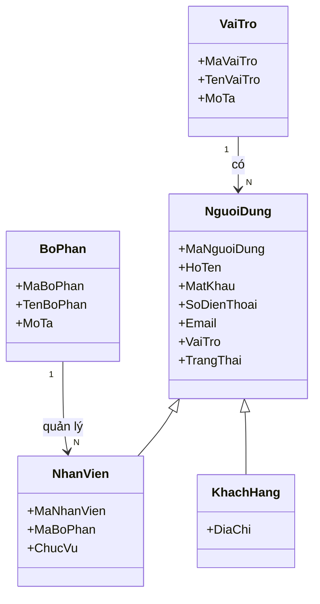

2. Nhóm Đơn hàng khách hàng

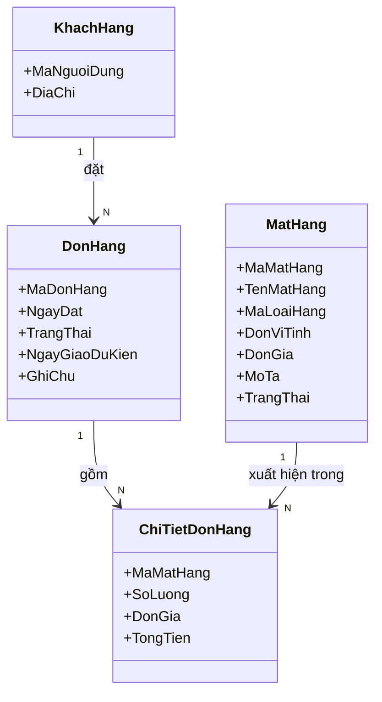

3. Nhóm Mặt hàng / Loại hàng

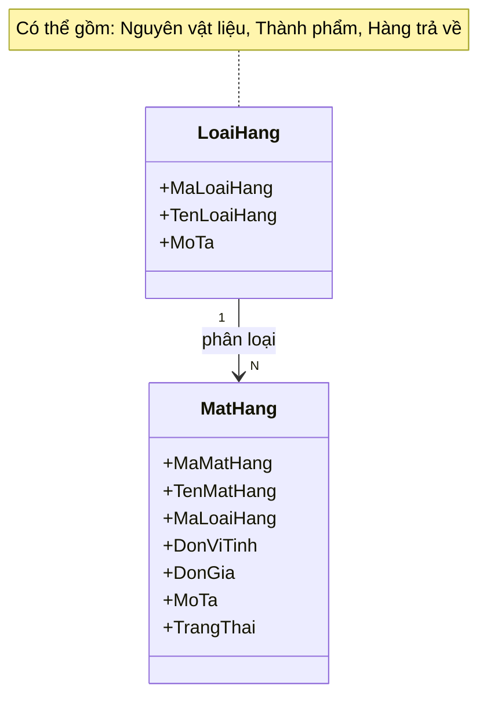

4. Nhóm Xưởng / Nhà cung cấp

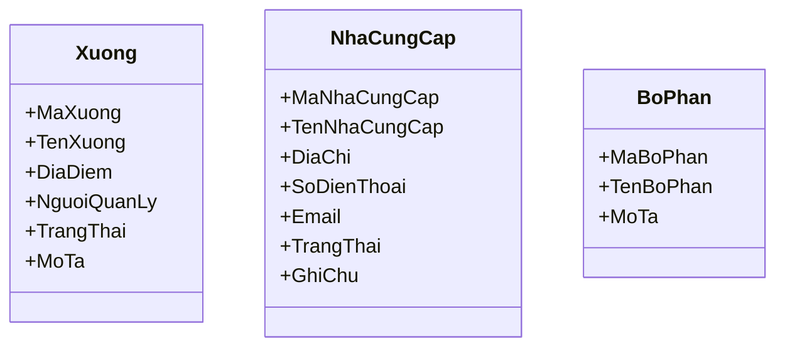

5. Nhóm Kế hoạch sản xuất

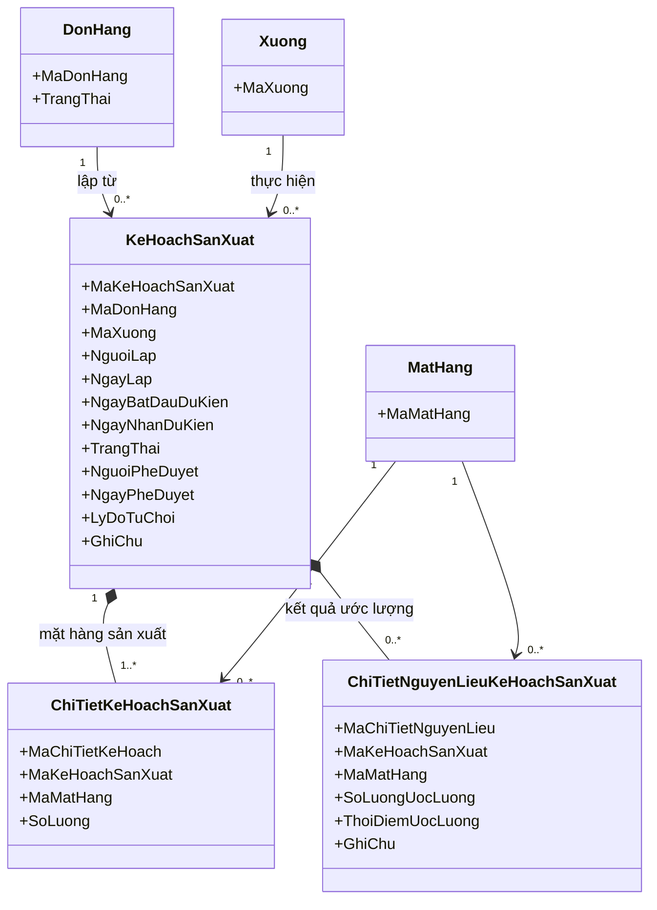

- Giữ một kế hoạch cho mỗi xưởng được phân công; một đơn có thể chia nhiều kế hoạch, tổng số lượng không vượt đơn hàng.
- Chủ xưởng chạy thuật toán ước lượng NVL từ kế hoạch. Lưu kết quả theo từng mặt hàng trong `ChiTietNguyenLieuKeHoachSanXuat`; thuật toán sẽ thiết kế sau, không giả định định mức/BOM.
- Chi tiết nguyên liệu là dữ liệu thuộc kế hoạch, không phải một chứng từ riêng. Có thể chưa có khi kế hoạch vừa lập.
- Phê duyệt được lưu ngay trên kế hoạch; không tạo phiếu phê duyệt kế hoạch riêng.
- `DonHang`: Chờ tiếp nhận → Đã tiếp nhận, chờ phê duyệt → Đã phê duyệt, chờ sản xuất → Đang sản xuất. Chỉ cập nhật từ kế hoạch đã duyệt/đã bắt đầu; nếu chia nhiều kế hoạch phải xét tiến độ toàn đơn.

6. Nhóm Kế hoạch mua NVL và Đơn mua hàng

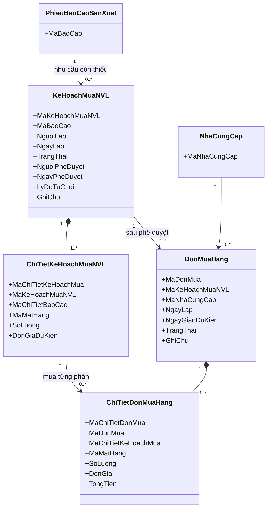

- Kế hoạch mua lấy số lượng từ **phần thiếu đã cộng 10%** trong báo cáo; không lấy toàn bộ nhu cầu ước lượng và không cộng 10% lần nữa.
- Không lập thêm phiếu yêu cầu mua: `PhieuBaoCaoSanXuat` đã chứa yêu cầu và ghi chú mua bổ sung.
- Một báo cáo có thể phát sinh nhiều kế hoạch mua từng phần; một kế hoạch có thể có nhiều đơn mua theo NCC. Tổng lượng mua/phân bổ đang hiệu lực không vượt lượng được duyệt và không mua trùng cùng nhu cầu.
- Tên `KeHoachMuaNVL` thay cho nhánh mua của `KeHoachMuaBan`. Nhánh kế hoạch bán có trong UC-04 và các luồng giao hàng ngoài phạm vi vẫn giữ thiết kế hiện hành; không xóa nghiệp vụ bán theo thay đổi này.

7. Nhóm Phiếu yêu cầu xuất/nhập và Phiếu kho

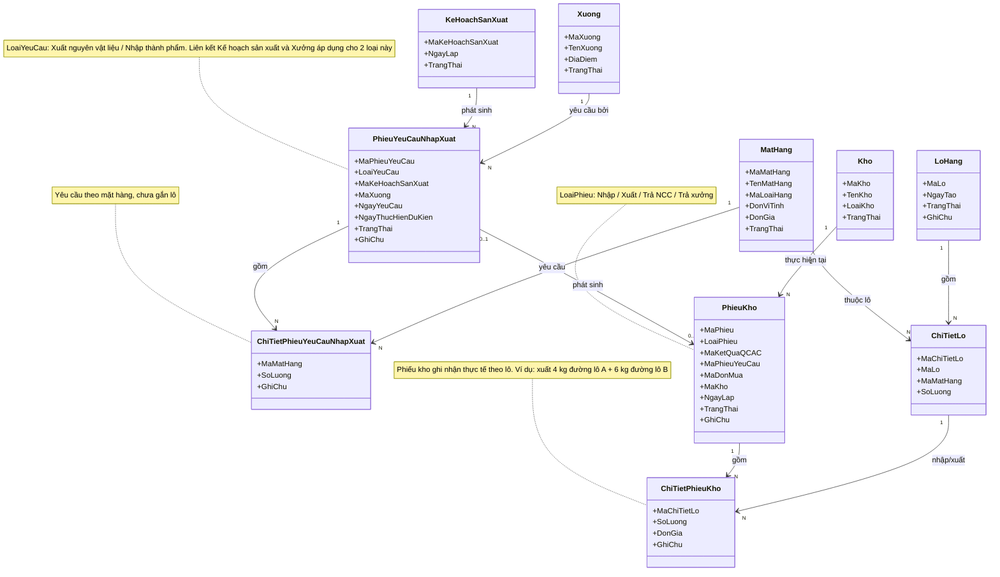

- Yêu cầu xuất NVL cho xưởng lấy từ `KeHoachSanXuat`, không dùng báo cáo thiếu NVL làm phiếu xuất.
- Khi QC/AC kết luận, `PhieuKho` nhập phần đạt và ghi nhận trả phần lỗi được tạo ngay từ `KetQuaKiemTraQCAC`; không bắt buộc tạo thêm yêu cầu nhập rồi chờ một vòng duyệt.
- Phiếu trả dùng chung `PhieuKho`, không tạo entity `PhieuTraHang` riêng. Hàng lỗi bị trả trước nhập không tăng rồi giảm tồn; phiếu trả ghi nhận lượng trả thực tế. Nếu hàng đã nằm trong kho thì phiếu trả mới giảm tồn thực tế tương ứng.
- `MaKetQuaQCAC`, `MaPhieuYeuCau`, `MaDonMua` là tham chiếu tùy nguồn. Phiếu nhập/trả theo QC bắt buộc có kết quả QC; phiếu xuất theo yêu cầu có yêu cầu nguồn.
- Hồ sơ nhập/xuất là dữ liệu tổng hợp từ phiếu kho, không cần thêm chứng từ hồ sơ riêng.

8. Nhóm Lô hàng

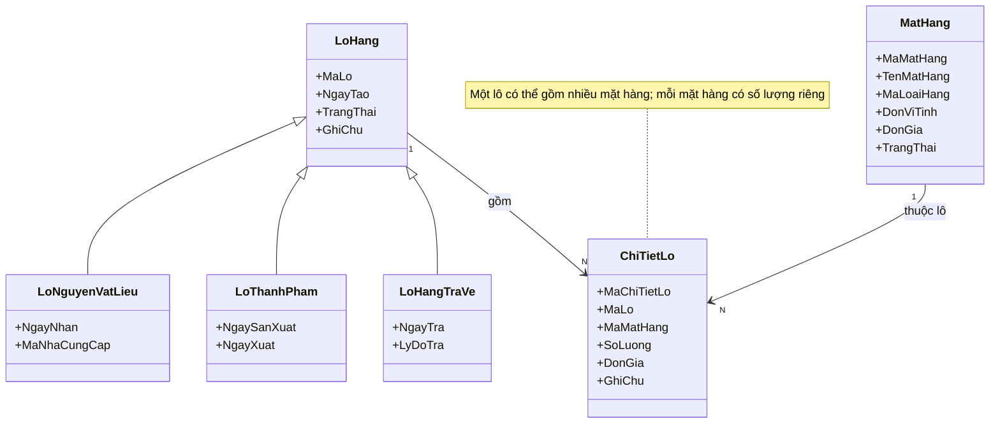

9. Nhóm Kho và Tồn kho

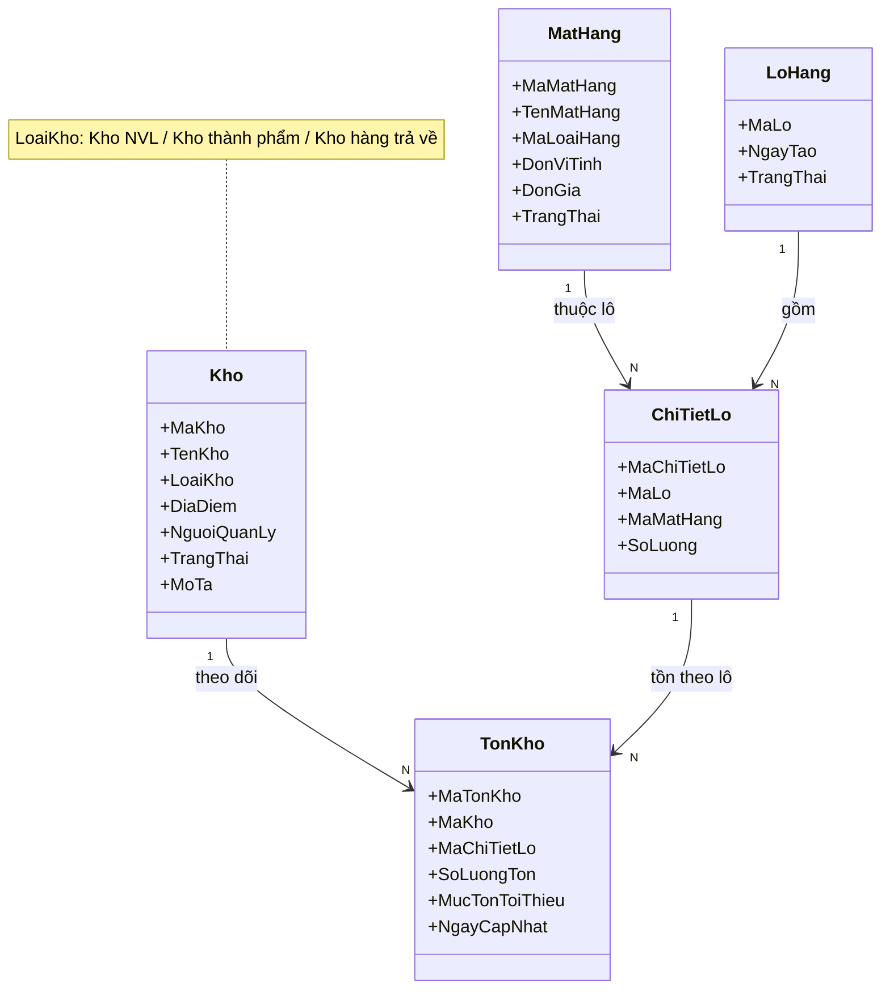

10. Nhóm Phiếu kiểm kê

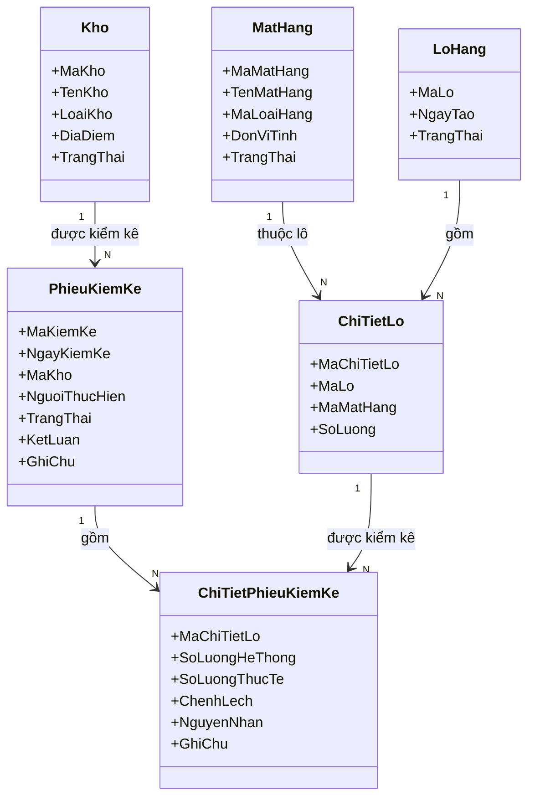

11. Nhóm Kiểm tra QC/AC

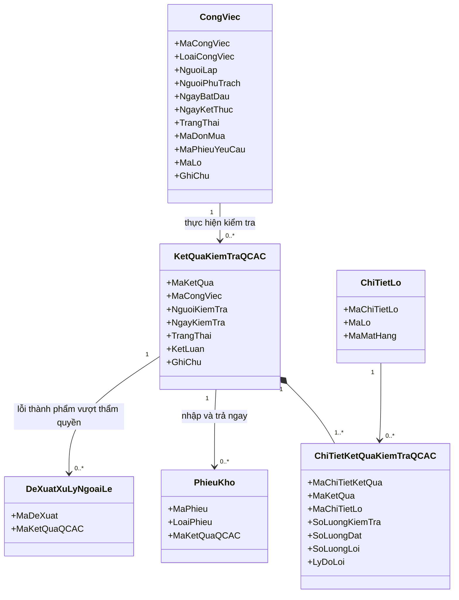

- Quản lý lập/phân công công việc kiểm tra QC/AC. Tái sử dụng `CongViec` đã được UC-25 quản lý, không thêm chứng từ đợt QC riêng. Các thuộc tính trên chỉ là phần liên quan QC; các thuộc tính và luồng công việc khác giữ nguyên.
- Công việc có loại `KIEM_TRA_QCAC`; không dùng `PhieuKiemKe` để lưu kết quả kiểm tra chất lượng. Nguồn kiểm tra là đơn mua/lô NVL hoặc lô thành phẩm/yêu cầu nhập tương ứng.
- `SoLuongKiemTra = SoLuongDat + SoLuongLoi`; tất cả số lượng không âm. Ví dụ kiểm tra 13, đạt 10, lỗi 3 → nhập 10, trả 3 ngay khi kết luận.
- NVL: trả phần lỗi cho NCC và gửi kết quả cho quản lý xem; không đi qua luồng phê duyệt ngoại lệ thành phẩm.
- Thành phẩm: nhập phần đạt, trả phần lỗi về xưởng; quản lý xử lý phần lỗi hoặc lập đề xuất cho giám đốc nếu vượt thẩm quyền.
- Kết luận QC, sinh phiếu nhập/trả và cập nhật tồn/tiến độ nguồn trong cùng lần xác nhận. Không thực hiện lặp khi gửi lại yêu cầu. Phiếu kho lưu người thực hiện nhập/trả thực tế.
- Kết quả đã sinh phiếu kho không được sửa/xóa trực tiếp làm lệch tồn; điều chỉnh phải có dấu vết và chứng từ điều chỉnh tương ứng.

12. Nhóm Báo cáo thiếu NVL và Báo cáo thành phẩm

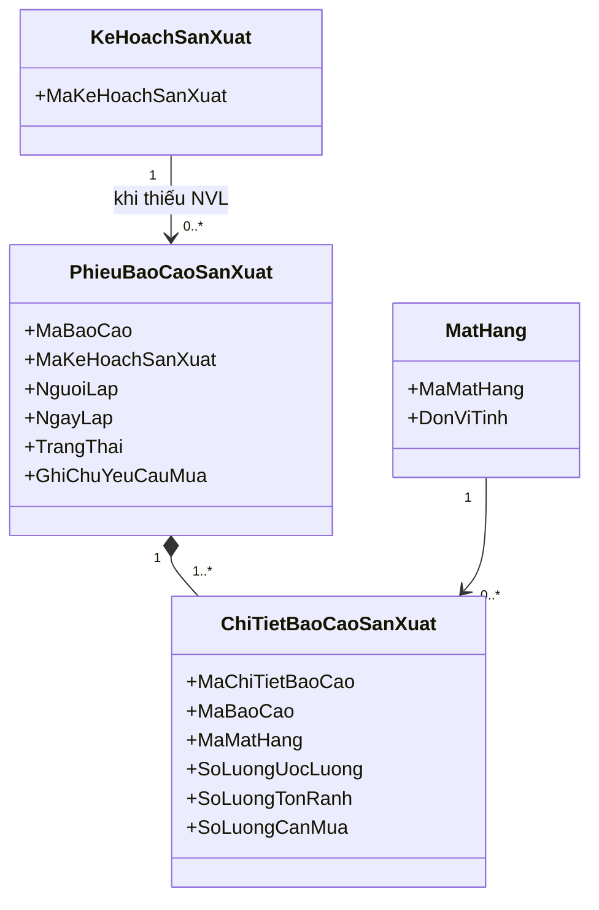

- Chỉ lập phiếu khi có ít nhất một loại NVL thiếu. Phiếu có thể hiển thị toàn bộ nhu cầu để đối chiếu, nhưng chỉ dòng có lượng cần mua lớn hơn 0 được chuyển sang kế hoạch mua.
- Mỗi dòng ghi đúng ba số lượng: ước lượng bằng thuật toán, tồn kho đang rảnh tại thời điểm lập, lượng cần mua. Không chia báo cáo nhu cầu này theo lô.
- `SoLuongCanMua = max(0, SoLuongUocLuong - SoLuongTonRanh) × 1,10`, áp dụng riêng từng loại NVL và làm tròn theo đơn vị mua. Ví dụ cần 100 kg, đang rảnh 60 kg → mua 44 kg.
- Tồn đang rảnh là tồn chưa phân bổ cho kế hoạch khác. Đây là dữ liệu tra cứu từ tồn kho và phân bổ, không tạo chứng từ tồn rảnh riêng. Các khoản giữ NVL đang hiệu lực phải được tính khi tra cứu và kiểm tra lại trước khi xuất; lưu số tồn tại thời điểm lập báo cáo để truy vết.
- Báo cáo tham chiếu kế hoạch nên suy ra được đơn hàng và xưởng; không cần lặp các tham chiếu này.

### Báo cáo thành phẩm ngoài phần báo cáo thiếu NVL

Giữ UC-35 và dữ liệu thực tế sản xuất, không bỏ thông tin NVL đã dùng hoặc chi tiết lô. Chuẩn hóa riêng tên `BaoCaoThanhPham`, `ChiTietBaoCaoThanhPham`, `ChiTietLoBaoCaoThanhPham` từ nhánh thành phẩm của báo cáo cũ:

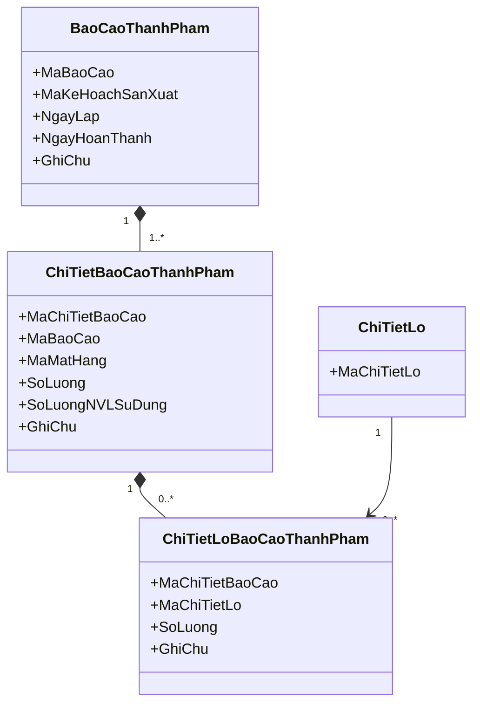

Dòng thành phẩm ghi lượng hoàn thành; dòng NVL ghi lượng thực dùng và giữ phân bổ lô thực tế. Không cộng trực tiếp các loại NVL khác đơn vị vào một số tổng. Ngày sản xuất/hạn dùng của lô giữ tại dữ liệu lô hiện hành. Báo cáo này không thay thế phiếu báo cáo thiếu NVL.

13. Nhóm Xử lý ngoại lệ

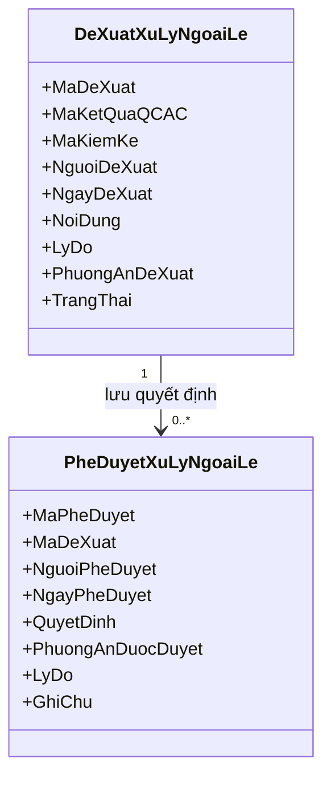

- Thống nhất tên `DeXuatXuLyNgoaiLe` và `PheDuyetXuLyNgoaiLe`; bản cũ khai báo tên khác trong sơ đồ nhóm và tổng thể.
- Đề xuất lỗi thành phẩm tham chiếu kết quả QC; đề xuất chênh lệch kiểm kê giữ nguồn kiểm kê hiện hành. Mỗi đề xuất xác định rõ một loại nguồn.
- Quản lý chỉ tạo đề xuất khi vượt thẩm quyền; không tạo phiếu đề xuất riêng cho mọi lần kiểm tra.
- Phê duyệt là quyết định, không đồng nhất với kết quả thực hiện xử lý. Thông tin thực hiện vẫn được ghi nhận trên công việc/phiếu kho liên quan.

14. Quan hệ tổng quan chứng từ trong luồng điều chỉnh

Sơ đồ này chỉ thể hiện chứng từ của luồng đang chỉnh; các sơ đồ tài khoản, danh mục, xưởng, NCC, kho, lô và kiểm kê phía trên vẫn thuộc domain đầy đủ.

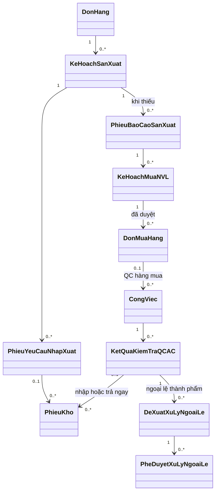
