### Domain Model

> **Quy ước chung**
> - Số lượng cần thiết (kế hoạch, báo cáo) tính theo **mặt hàng**, kèm đơn vị tính của mặt hàng. Ví dụ: 10 kg đường.
> - **Lô chỉ là thông tin chi tiết đi kèm** khi thực tế phát sinh. Ví dụ: 4 kg đường lô A + 6 kg đường lô B.
> - Chuỗi quan hệ của lô: **Mặt hàng → Chi tiết lô ← Lô hàng**. Mọi bảng chi tiết, tồn kho hay phiếu liên quan đến lô đều tham chiếu `MaChiTietLo`.

---

1. Nhóm Tài khoản / Người dùng

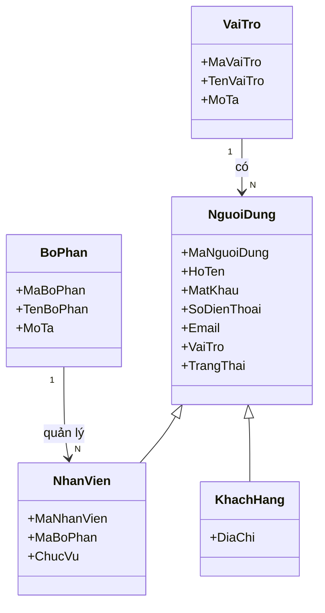

2. Nhóm Đơn hàng khách hàng

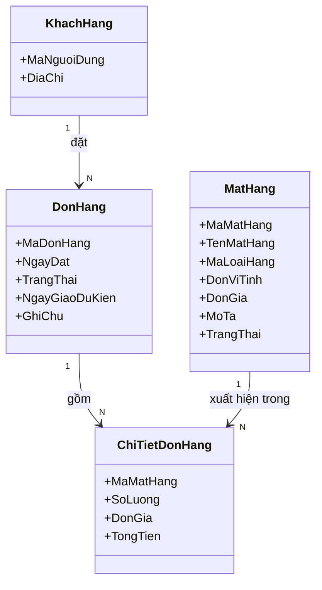

3. Nhóm Mặt hàng / Loại hàng

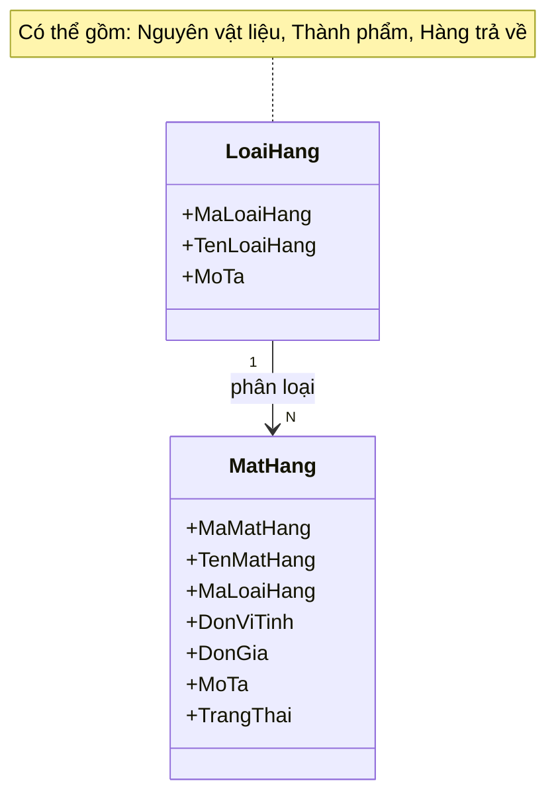

4. Nhóm Xưởng / Nhà cung cấp

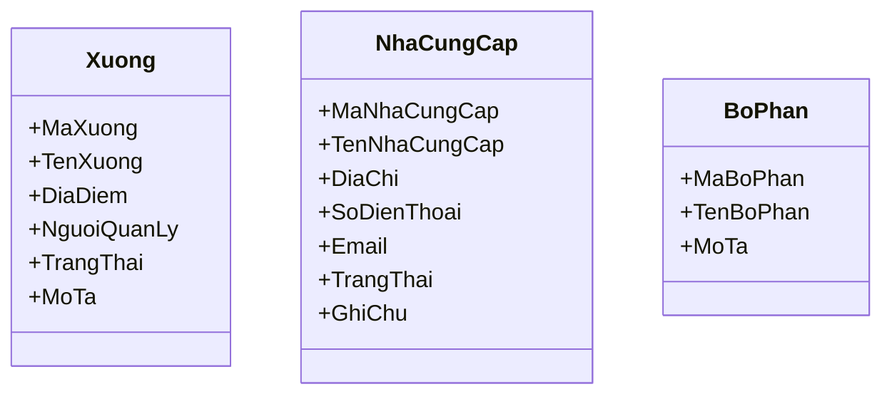

5. Nhóm Kế hoạch sản xuất

6. Nhóm Kế hoạch mua / bán và Đơn mua hàng

Kế hoạch mua được phát sinh từ Kế hoạch sản xuất, không phụ thuộc vào khách hàng hay đơn hàng.

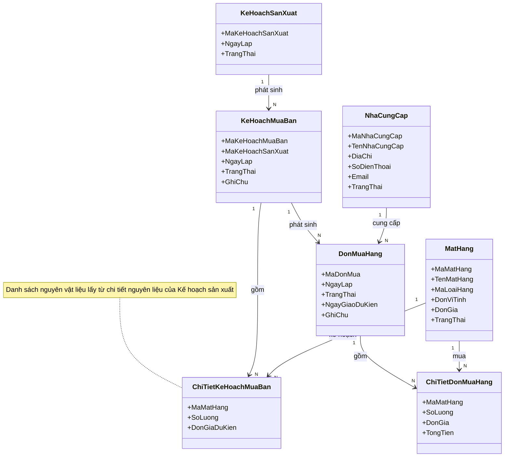

7. Nhóm Phiếu yêu cầu xuất/nhập và Phiếu kho

8. Nhóm Lô hàng

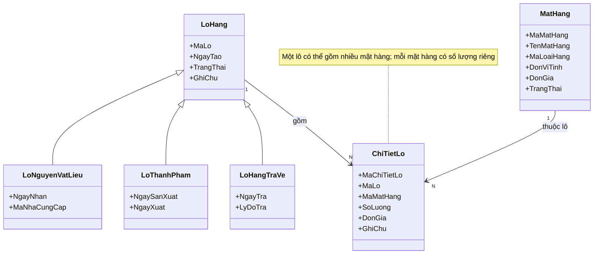

9. Nhóm Kho và Tồn kho

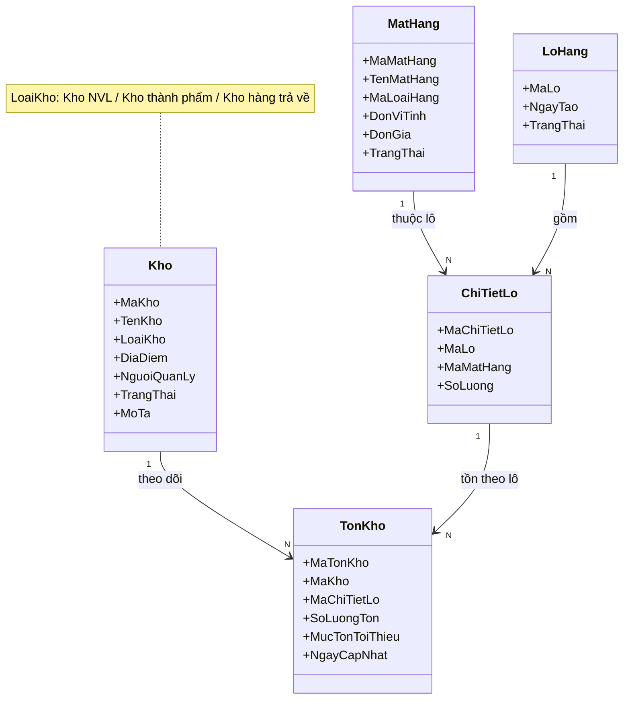

10. Nhóm Phiếu kiểm kê

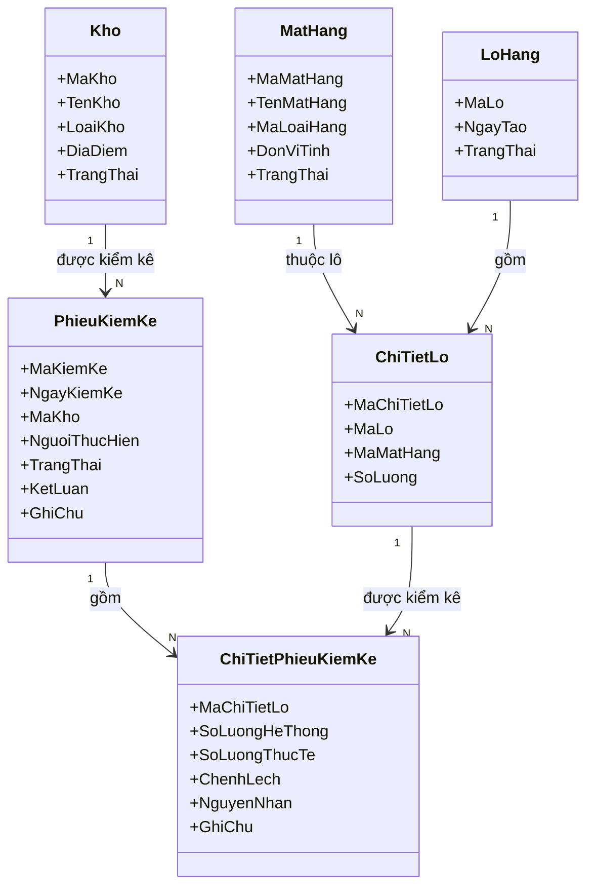

11. Nhóm Kiểm tra QC/AC

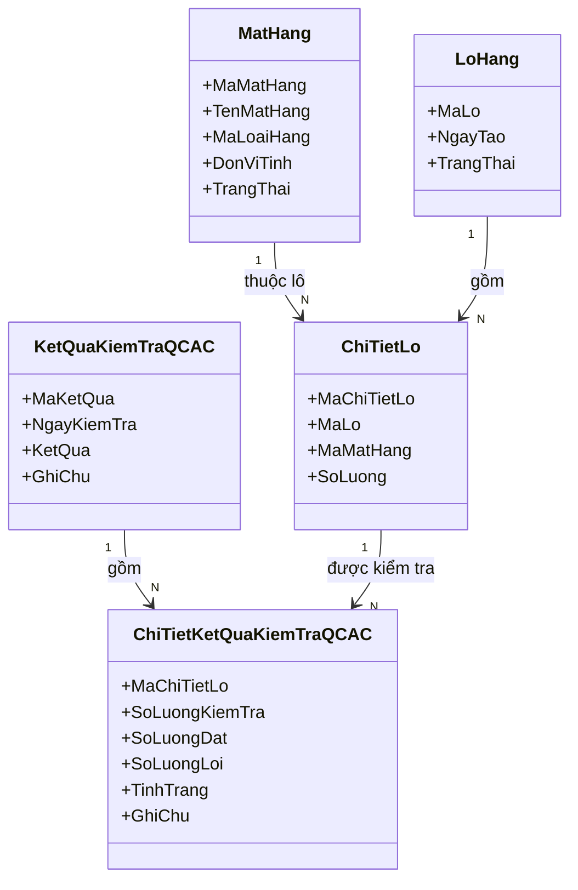

12. Nhóm Báo cáo sản xuất / Thành phẩm

Số lượng cần thiết và số lượng NVL sử dụng được tính **theo mặt hàng** (kèm đơn vị tính). Phần chia theo lô nằm ở bảng chi tiết riêng `ChiTietLoBaoCaoSanXuat`.

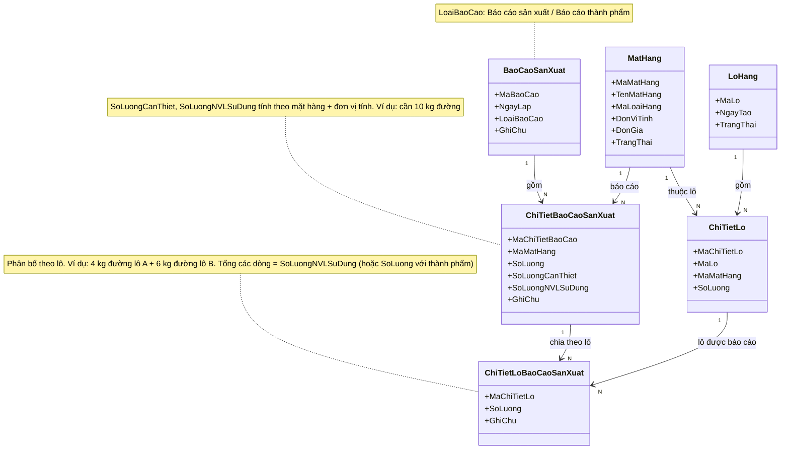

13. Nhóm Xử lý ngoại lệ

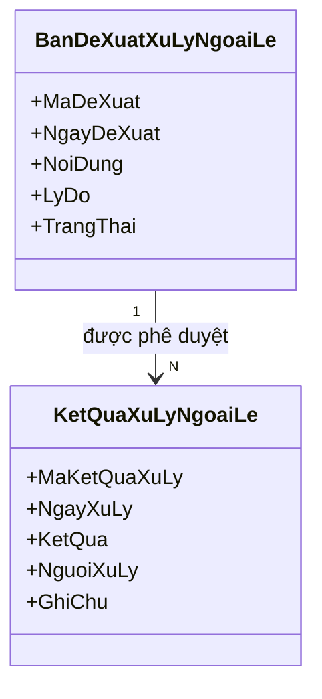

14. Sơ đồ tổng thể

```mermaid
classDiagram

    class NguoiDung {
        +MaNguoiDung
        +HoTen
        +MatKhau
        +SoDienThoai
        +Email
        +VaiTro
        +TrangThai
    }

    class NhanVien {
        +MaNhanVien
        +MaBoPhan
        +ChucVu
    }

    class KhachHang {
        +DiaChi
    }

    class VaiTro {
        +MaVaiTro
        +TenVaiTro
        +MoTa
    }

    class BoPhan {
        +MaBoPhan
        +TenBoPhan
        +MoTa
    }

    class DonHang {
        +MaDonHang
        +NgayDat
        +TrangThai
        +NgayGiaoDuKien
        +GhiChu
    }

    class ChiTietDonHang {
        +MaMatHang
        +SoLuong
        +DonGia
        +TongTien
    }

    class MatHang {
        +MaMatHang
        +TenMatHang
        +MaLoaiHang
        +DonViTinh
        +DonGia
        +MoTa
        +TrangThai
    }

    class LoaiHang {
        +MaLoaiHang
        +TenLoaiHang
        +MoTa
    }

    class Xuong {
        +MaXuong
        +TenXuong
        +DiaDiem
        +NguoiQuanLy
        +TrangThai
    }

    class NhaCungCap {
        +MaNhaCungCap
        +TenNhaCungCap
        +DiaChi
        +SoDienThoai
        +Email
        +TrangThai
    }

    class KeHoachSanXuat {
        +MaKeHoachSanXuat
        +NgayLap
        +NgayNhanDuKien
        +TrangThai
        +GhiChu
    }

    class ChiTietKeHoachSanXuat {
        +MaMatHang
        +SoLuong
    }

    class ChiTietNguyenLieuKeHoachSanXuat {
        +MaMatHang
        +SoLuongCanThiet
        +GhiChu
    }

    class KeHoachMuaBan {
        +MaKeHoachMuaBan
        +MaKeHoachSanXuat
        +NgayLap
        +TrangThai
        +GhiChu
    }

    class ChiTietKeHoachMuaBan {
        +MaMatHang
        +SoLuong
        +DonGiaDuKien
    }

    class DonMuaHang {
        +MaDonMua
        +NgayLap
        +TrangThai
        +NgayGiaoDuKien
        +GhiChu
    }

    class ChiTietDonMuaHang {
        +MaMatHang
        +SoLuong
        +DonGia
        +TongTien
    }

    class PhieuYeuCauNhapXuat {
        +MaPhieuYeuCau
        +LoaiYeuCau
        +MaKeHoachSanXuat
        +MaXuong
        +NgayYeuCau
        +NgayThucHienDuKien
        +TrangThai
        +GhiChu
    }

    class ChiTietPhieuYeuCauNhapXuat {
        +MaMatHang
        +SoLuong
        +GhiChu
    }

    class PhieuKho {
        +MaPhieu
        +LoaiPhieu
        +MaKho
        +NgayLap
        +TrangThai
        +GhiChu
    }

    class ChiTietPhieuKho {
        +MaChiTietLo
        +SoLuong
        +DonGia
        +GhiChu
    }

    class LoHang {
        +MaLo
        +NgayTao
        +TrangThai
        +GhiChu
    }

    class LoNguyenVatLieu {
        +NgayNhan
        +MaNhaCungCap
    }

    class LoThanhPham {
        +NgaySanXuat
        +NgayXuat
    }

    class LoHangTraVe {
        +NgayTra
        +LyDoTra
    }

    class ChiTietLo {
        +MaChiTietLo
        +MaLo
        +MaMatHang
        +SoLuong
        +DonGia
        +GhiChu
    }

    class Kho {
        +MaKho
        +TenKho
        +LoaiKho
        +DiaDiem
        +NguoiQuanLy
        +TrangThai
    }

    class TonKho {
        +MaTonKho
        +MaKho
        +MaChiTietLo
        +SoLuongTon
        +MucTonToiThieu
        +NgayCapNhat
    }

    class PhieuKiemKe {
        +MaKiemKe
        +NgayKiemKe
        +MaKho
        +NguoiThucHien
        +TrangThai
        +KetLuan
    }

    class ChiTietPhieuKiemKe {
        +MaChiTietLo
        +SoLuongHeThong
        +SoLuongThucTe
        +ChenhLech
        +NguyenNhan
    }

    class KetQuaKiemTraQCAC {
        +MaKetQua
        +NgayKiemTra
        +KetQua
        +GhiChu
    }

    class ChiTietKetQuaKiemTraQCAC {
        +MaChiTietLo
        +SoLuongKiemTra
        +SoLuongDat
        +SoLuongLoi
        +TinhTrang
    }

    class BaoCaoSanXuat {
        +MaBaoCao
        +NgayLap
        +LoaiBaoCao
        +GhiChu
    }

    class ChiTietBaoCaoSanXuat {
        +MaChiTietBaoCao
        +MaMatHang
        +SoLuong
        +SoLuongCanThiet
        +SoLuongNVLSuDung
    }

    class ChiTietLoBaoCaoSanXuat {
        +MaChiTietLo
        +SoLuong
    }

    class BanDeXuatXuLyNgoaiLe {
        +MaDeXuat
        +NgayDeXuat
        +NoiDung
        +LyDo
        +TrangThai
    }

    class KetQuaXuLyNgoaiLe {
        +MaKetQuaXuLy
        +NgayXuLy
        +KetQua
        +NguoiXuLy
        +GhiChu
    }

    NguoiDung <|-- NhanVien
    NguoiDung <|-- KhachHang

    VaiTro "1" --> "N" NguoiDung : có
    BoPhan "1" --> "N" NhanVien : có

    LoaiHang "1" --> "N" MatHang : phân loại

    KhachHang "1" --> "N" DonHang : đặt
    DonHang "1" --> "N" ChiTietDonHang : gồm
    MatHang "1" --> "N" ChiTietDonHang : xuất hiện trong

    DonHang "1" --> "N" KeHoachSanXuat : phát sinh
    Xuong "1" --> "N" KeHoachSanXuat : thực hiện tại
    KeHoachSanXuat "1" --> "N" ChiTietKeHoachSanXuat : gồm
    MatHang "1" --> "N" ChiTietKeHoachSanXuat : sản xuất
    KeHoachSanXuat "1" --> "N" ChiTietNguyenLieuKeHoachSanXuat : cần nguyên liệu
    MatHang "1" --> "N" ChiTietNguyenLieuKeHoachSanXuat : là nguyên liệu

    KeHoachSanXuat "1" --> "N" KeHoachMuaBan : phát sinh
    KeHoachMuaBan "1" --> "N" ChiTietKeHoachMuaBan : gồm
    MatHang "1" --> "N" ChiTietKeHoachMuaBan : kế hoạch
    KeHoachMuaBan "1" --> "N" DonMuaHang : phát sinh
    NhaCungCap "1" --> "N" DonMuaHang : cung cấp
    DonMuaHang "1" --> "N" ChiTietDonMuaHang : gồm
    MatHang "1" --> "N" ChiTietDonMuaHang : mua

    KeHoachSanXuat "1" --> "N" PhieuYeuCauNhapXuat : phát sinh
    Xuong "1" --> "N" PhieuYeuCauNhapXuat : yêu cầu bởi
    PhieuYeuCauNhapXuat "1" --> "N" ChiTietPhieuYeuCauNhapXuat : gồm
    MatHang "1" --> "N" ChiTietPhieuYeuCauNhapXuat : yêu cầu
    PhieuYeuCauNhapXuat "1" --> "N" PhieuKho : phát sinh
    Kho "1" --> "N" PhieuKho : thực hiện tại
    PhieuKho "1" --> "N" ChiTietPhieuKho : gồm
    ChiTietLo "1" --> "N" ChiTietPhieuKho : nhập/xuất

    LoHang <|-- LoNguyenVatLieu
    LoHang <|-- LoThanhPham
    LoHang <|-- LoHangTraVe

    LoHang "1" --> "N" ChiTietLo : gồm
    MatHang "1" --> "N" ChiTietLo : thuộc lô

    Kho "1" --> "N" TonKho : theo dõi
    ChiTietLo "1" --> "N" TonKho : tồn theo lô

    Kho "1" --> "N" PhieuKiemKe : được kiểm kê
    PhieuKiemKe "1" --> "N" ChiTietPhieuKiemKe : gồm
    ChiTietLo "1" --> "N" ChiTietPhieuKiemKe : được kiểm kê

    KetQuaKiemTraQCAC "1" --> "N" ChiTietKetQuaKiemTraQCAC : gồm
    ChiTietLo "1" --> "N" ChiTietKetQuaKiemTraQCAC : được kiểm tra

    BaoCaoSanXuat "1" --> "N" ChiTietBaoCaoSanXuat : gồm
    MatHang "1" --> "N" ChiTietBaoCaoSanXuat : báo cáo
    ChiTietBaoCaoSanXuat "1" --> "N" ChiTietLoBaoCaoSanXuat : chia theo lô
    ChiTietLo "1" --> "N" ChiTietLoBaoCaoSanXuat : lô được báo cáo

    DeXuatXuLyNgoaiLe "1" --> "N" PheDuyetXuLyNgoaiLe : được phê duyệt
```
