# Domain Model đã chỉnh sửa

Kế hoạch sản xuất là dự kiến ban đầu, phát sinh từ đơn hàng và phân công cho xưởng. `ChiTietKeHoachSanXuat` chứa cả dòng thành phẩm và dòng NVL cần/còn thiếu, phân biệt bằng `LoaiChiTiet`; không có entity chi tiết NVL kế hoạch riêng.

Xưởng đối chiếu kế hoạch với tồn kho để lập báo cáo sản xuất thực tế. Báo cáo sản xuất liên kết kế hoạch sản xuất, làm nguồn lập kế hoạch MUA, đơn mua NVL và yêu cầu xuất NVL cho sản xuất. Đơn mua vẫn liên kết kế hoạch MUA đã phê duyệt và đồng thời tham chiếu chính báo cáo nguồn đó.

Báo cáo thành phẩm ghi nhận kết quả sản xuất thực tế và làm nguồn lập kế hoạch BAN. Hai loại báo cáo tiếp tục dùng chung `BanBaoCaoSanXuat`, phân biệt bằng `LoaiBaoCao`; hai loại kế hoạch dùng chung `KeHoachMuaBan`, phân biệt bằng `LoaiKeHoach`. Các quan hệ có điều kiện theo loại phải được kiểm tra khi triển khai.

Trong sơ đồ, `N` biểu diễn nhiều. Các trường liên kết `MaBaoCao` tham chiếu báo cáo nguồn; số lượng báo cáo là dữ liệu thực tế, còn số lượng trong kế hoạch sản xuất là dự kiến. Các nhóm ngoài phạm vi sửa được giữ nguyên; tên báo cáo và xử lý ngoại lệ trong sơ đồ tổng thể được thống nhất với các nhóm chi tiết của file nguồn.

1. Nhóm Tài khoản / Người dùng

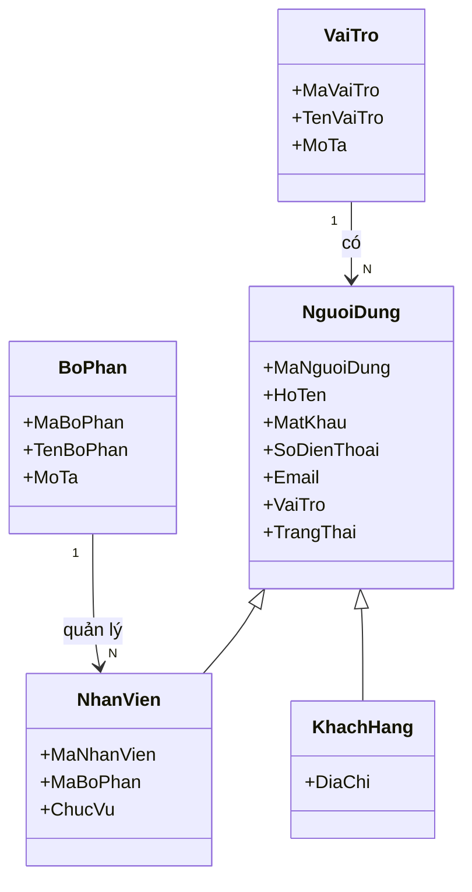

2. Nhóm Đơn hàng khách hàng

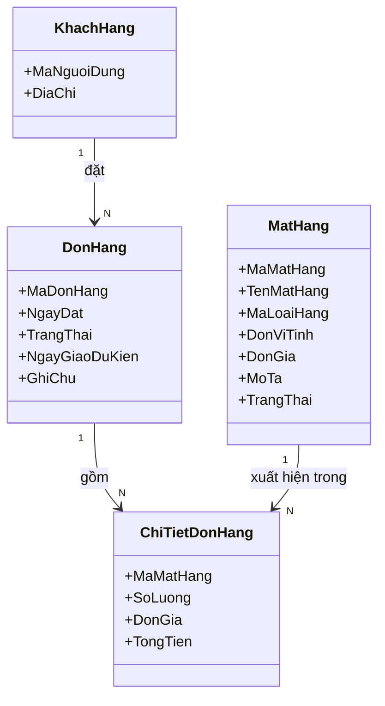

3. Nhóm Mặt hàng / Loại hàng

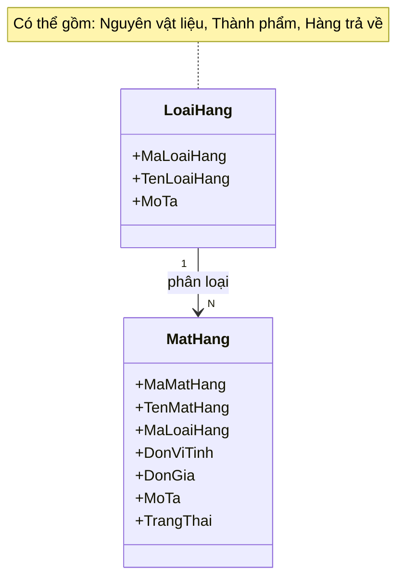

4. Nhóm Xưởng / Nhà cung cấp

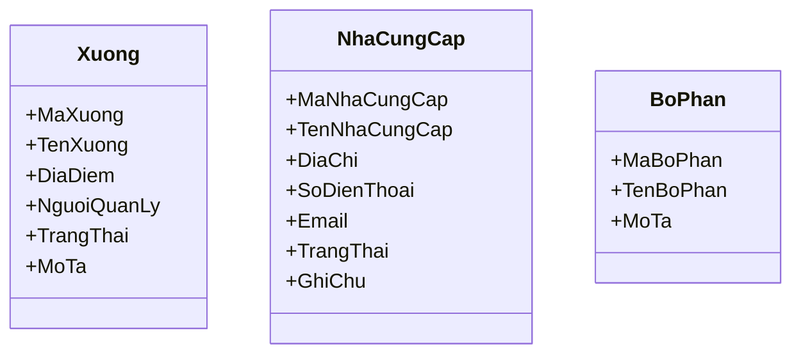

5. Nhóm Kế hoạch sản xuất

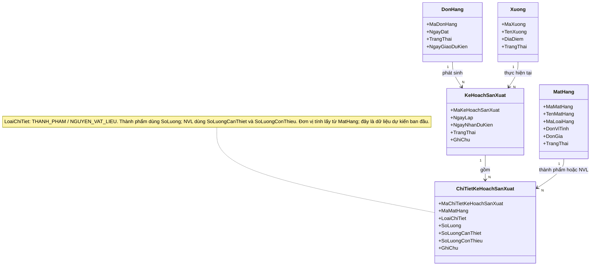

6. Nhóm Kế hoạch mua / bán và Đơn mua hàng

Kế hoạch mua lấy nhu cầu thiếu thực tế từ báo cáo sản xuất; kế hoạch bán lấy thành phẩm thực tế từ báo cáo thành phẩm. Hai loại báo cáo dùng chung BanBaoCaoSanXuat, phân biệt bằng LoaiBaoCao.

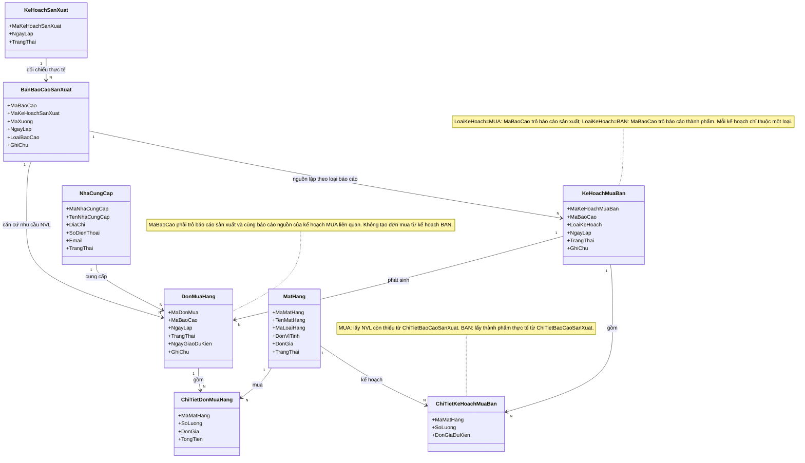

7. Nhóm Phiếu yêu cầu xuất/nhập và Phiếu kho

8. Nhóm Lô hàng

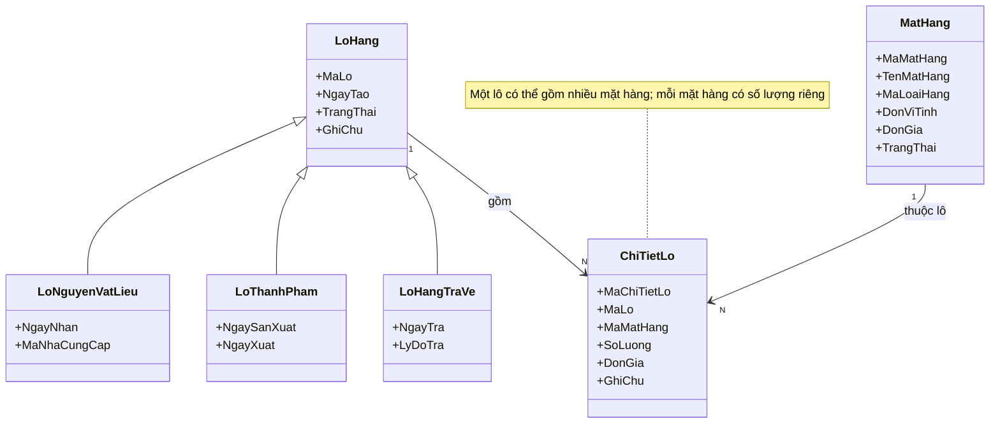

9. Nhóm Kho và Tồn kho

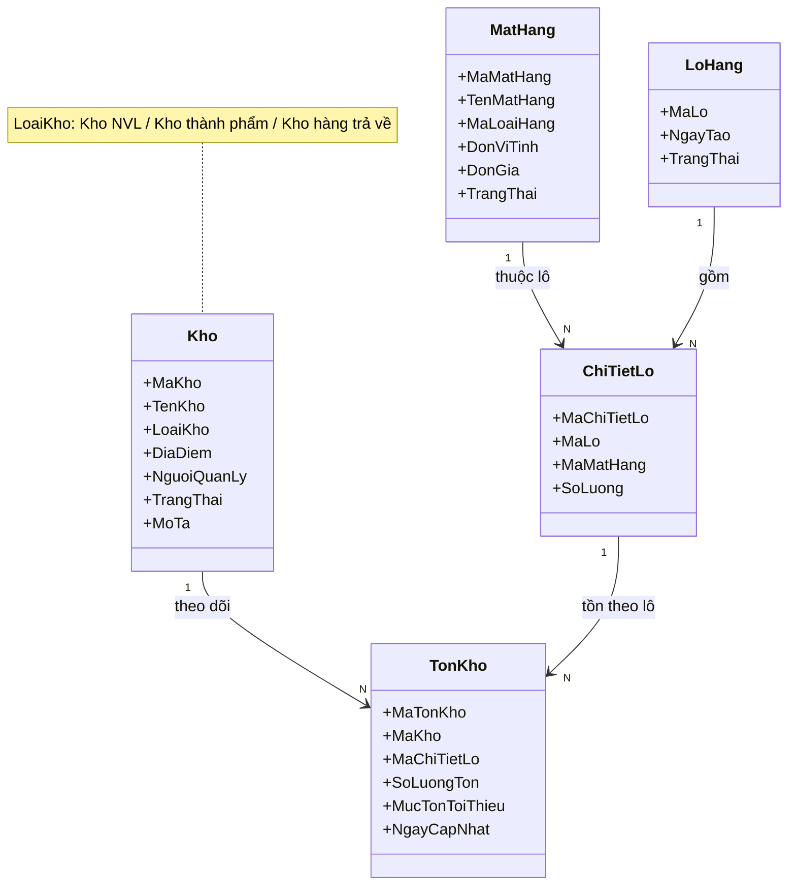

10. Nhóm Phiếu kiểm kê

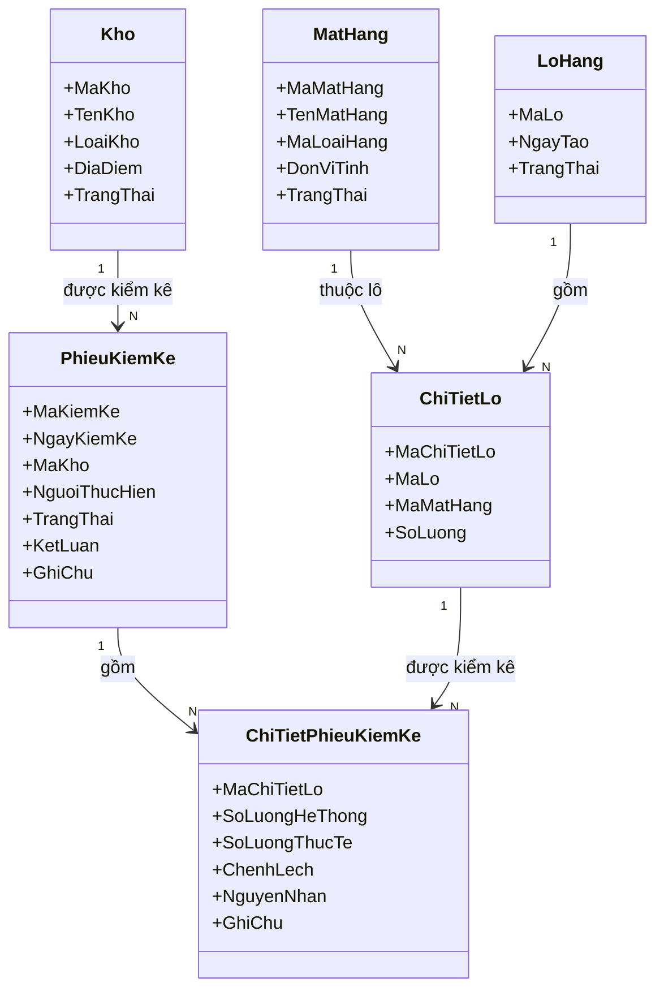

11. Nhóm Kiểm tra QC/AC

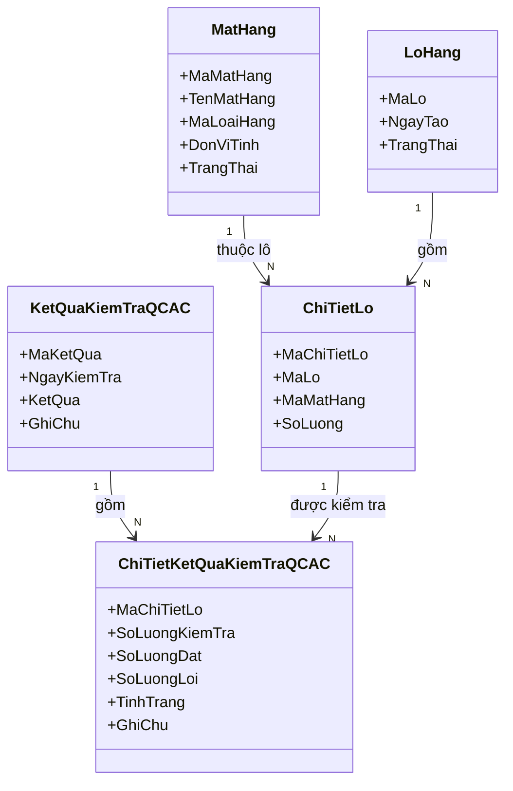

12. Nhóm Báo cáo sản xuất / Thành phẩm

Số lượng cần thiết và số lượng NVL sử dụng được tính **theo mặt hàng** (kèm đơn vị tính). Phần chia theo lô nằm ở bảng chi tiết riêng `ChiTietLoBaoCaoSanXuat`.

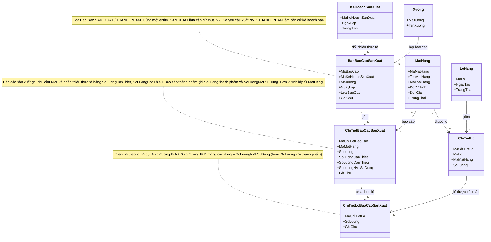

13. Nhóm Xử lý ngoại lệ

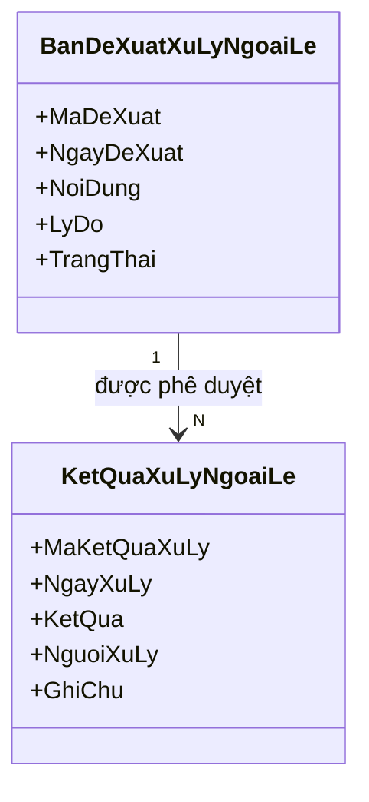

14. Sơ đồ tổng thể

