# Domain Model

Kế hoạch sản xuất là dự kiến ban đầu, phát sinh từ đơn hàng và phân công cho xưởng. `ChiTietKeHoachSanXuat` chứa cả dòng thành phẩm và dòng NVL cần/còn thiếu, phân biệt bằng `LoaiChiTiet`; không có entity chi tiết NVL kế hoạch riêng.

Xưởng đối chiếu kế hoạch với tồn kho để lập báo cáo sản xuất thực tế. Báo cáo sản xuất liên kết kế hoạch sản xuất, làm nguồn lập kế hoạch MUA, đơn mua NVL và yêu cầu xuất NVL cho sản xuất. Đơn mua vẫn liên kết kế hoạch MUA đã phê duyệt và đồng thời tham chiếu chính báo cáo nguồn đó.

Báo cáo thành phẩm ghi nhận kết quả sản xuất thực tế và làm nguồn lập kế hoạch BAN. Hai loại báo cáo tiếp tục dùng chung `BanBaoCaoSanXuat`, phân biệt bằng `LoaiBaoCao`; hai loại kế hoạch dùng chung `KeHoachMuaBan`, phân biệt bằng `LoaiKeHoach`. Các quan hệ có điều kiện theo loại phải được kiểm tra khi triển khai.

Trong sơ đồ, `N` biểu diễn nhiều. Các trường liên kết `MaBaoCao` tham chiếu báo cáo nguồn; số lượng báo cáo là dữ liệu thực tế, còn số lượng trong kế hoạch sản xuất là dự kiến. Các nhóm ngoài phạm vi sửa được giữ nguyên; tên báo cáo và xử lý ngoại lệ trong sơ đồ tổng thể được thống nhất với các nhóm chi tiết của file nguồn.

# Quy trình nghiệp vụ quản lý kho và sản xuất

Khách hàng đăng nhập vào hệ thống và thực hiện đặt đơn hàng tại **UC-02**. Hệ thống ghi nhận thông tin đơn hàng trong `DonHang`, còn mặt hàng, số lượng và đơn giá được lưu trong `ChiTietDonHang`. Khách hàng sử dụng **UC-03** để xem, quản lý đơn hàng và **UC-03.1** để sửa đơn trong trạng thái được phép chỉnh sửa. Bộ phận lập kế hoạch thực hiện **UC-29** để tiếp nhận đơn, kiểm tra thông tin và xác định nhu cầu sản xuất; việc tiếp nhận cập nhật trên đơn hàng hiện có, không tạo thêm phiếu tiếp nhận riêng.

Sau khi tiếp nhận đơn hàng, bộ phận lập kế hoạch lập kế hoạch sản xuất dự kiến dựa trên `DonHang` và `ChiTietDonHang`, đồng thời xác định xưởng thực hiện trong `Xuong`. Kế hoạch được lưu trong `KeHoachSanXuat`; các dòng thành phẩm cần sản xuất và NVL dự kiến cần sử dụng được lưu chung trong `ChiTietKeHoachSanXuat`, phân biệt bằng `LoaiChiTiet`. Dòng thành phẩm ghi số lượng cần sản xuất; dòng NVL ghi số lượng cần thiết và số lượng còn thiếu dự kiến. Nhu cầu NVL được ước lượng bằng thuật toán, cộng thêm 10% cho từng loại NVL; đơn vị tính lấy từ `MatHang`. Không tạo entity chi tiết NVL kế hoạch riêng. Ban giám đốc thực hiện **UC-31** để xem xét, phê duyệt đơn hàng và kế hoạch sản xuất liên quan. Kế hoạch sản xuất là căn cứ định hướng ban đầu, không thay thế báo cáo nhu cầu thực tế của xưởng.

Khi nhận kế hoạch đã được phê duyệt, chủ xưởng thực hiện **UC-22** để tra cứu NVL đang có trong kho, sử dụng dữ liệu từ `TonKho`, `ChiTietLo` và `MatHang`. Việc đối chiếu sử dụng lượng tồn khả dụng, tức phần tồn đang rảnh có thể cấp cho đợt sản xuất, không tính phần đã dành cho nhu cầu khác. Chủ xưởng đối chiếu lượng NVL cần thiết với lượng tồn khả dụng để xác định lượng có thể sử dụng và lượng còn thiếu. Sau đó, chủ xưởng thực hiện **UC-34** để lập báo cáo sản xuất trong `BanBaoCaoSanXuat`, với `LoaiBaoCao=SAN_XUAT`, tham chiếu `KeHoachSanXuat` và `Xuong`. Từng mặt hàng, lượng NVL cần thiết và lượng còn thiếu thực tế được lưu trong `ChiTietBaoCaoSanXuat`. Báo cáo này được lập cả khi đủ và khi thiếu NVL; trường hợp đủ NVL thì số lượng còn thiếu bằng 0. Báo cáo sản xuất là căn cứ thực tế để đề nghị mua bổ sung và lập yêu cầu xuất NVL cho xưởng.

Nếu báo cáo sản xuất có NVL còn thiếu, bộ phận lập kế hoạch thực hiện **UC-04** để lập kế hoạch mua bổ sung. Kế hoạch được lưu trong `KeHoachMuaBan`, có `LoaiKeHoach=MUA` và tham chiếu báo cáo sản xuất nguồn bằng `MaBaoCao`; danh sách NVL và số lượng cần mua được lưu trong `ChiTietKeHoachMuaBan`. Nhu cầu mua lấy từ phần thiếu thực tế của báo cáo sản xuất, không lấy trực tiếp từ kế hoạch sản xuất ban đầu và không cộng thêm 10% lần nữa nếu lượng cần thiết đã bao gồm phần dự phòng. **UC-05, UC-05.1 và UC-05.2** dùng để quản lý, sửa hoặc xóa kế hoạch trong trạng thái được phép. Ban giám đốc thực hiện **UC-32** để phê duyệt kế hoạch mua. Nếu báo cáo không có NVL còn thiếu thì không phát sinh kế hoạch mua bổ sung cho nhu cầu đó.

Sau khi kế hoạch mua được phê duyệt, bộ phận mua hàng thực hiện **UC-27** để tạo đơn mua NVL trong `DonMuaHang`, với các dòng mua lưu trong `ChiTietDonMuaHang`. Đơn mua liên kết kế hoạch mua đã duyệt và đồng thời tham chiếu báo cáo sản xuất làm phát sinh nhu cầu. Báo cáo được tham chiếu trên đơn mua phải trùng với báo cáo nguồn của kế hoạch mua; chỉ kế hoạch loại MUA mới được dùng để tạo đơn mua NVL. Thông tin nhà cung cấp lấy từ `NhaCungCap`, còn giá mua và điều kiện giao hàng được bổ sung khi lập đơn. Bộ phận mua hàng sử dụng **UC-14** để xem và quản lý đơn mua.

Khi nhà cung cấp giao NVL, thông tin hàng thực nhận được đối chiếu với đơn mua và ghi nhận bằng `LoHang`, `LoNguyenVatLieu` và `ChiTietLo`. Bộ phận QC/AC thực hiện **UC-12.1** để ghi kết quả kiểm tra vào `KetQuaKiemTraQCAC` và `ChiTietKetQuaKiemTraQCAC`, xác định lượng kiểm tra, lượng đạt và lượng lỗi của từng dòng lô. **UC-12, UC-12.2 và UC-12.3** phục vụ quản lý, sửa và xóa kết quả theo trạng thái cho phép. Ngay khi có kết luận QC/AC, phần NVL đạt được chuyển sang bước nhập kho tại **UC-10**, tạo `PhieuKho` loại nhập và `ChiTietPhieuKho`, sau đó cập nhật `TonKho`. Phần không đạt được xử lý trả nhà cung cấp ngay theo kết luận kiểm tra, không đưa vào tồn khả dụng cho sản xuất. Nếu có tình huống cần xử lý ngoại lệ, quản lý lập đề xuất để Ban giám đốc xem xét tại **UC-17**.

Khi cần NVL để sản xuất, chủ xưởng thực hiện **UC-23** để lập yêu cầu xuất dựa trên dữ liệu trong báo cáo sản xuất thực tế. Yêu cầu được lưu trong `PhieuYeuCauNhapXuat`, tham chiếu báo cáo bằng `MaBaoCao` và xưởng nhận bằng `MaXuong`; các mặt hàng và lượng yêu cầu được lưu trong `ChiTietPhieuYeuCauNhapXuat`. Không lấy trực tiếp lượng xuất từ kế hoạch sản xuất dự kiến. Lượng yêu cầu từng lần phải đối chiếu với nhu cầu thực tế trong báo cáo và lượng đã được cấp, tránh yêu cầu trùng. **UC-24, UC-24.1 và UC-24.2** phục vụ quản lý, sửa và hủy hoặc xóa yêu cầu trong trạng thái được phép. Nhân viên kho thực hiện **UC-11.01** để xuất NVL theo yêu cầu, chọn các lô thực xuất, tạo `PhieuKho` loại xuất và `ChiTietPhieuKho`, đồng thời cập nhật giảm tồn kho. Phiếu yêu cầu ghi lượng đề nghị; phiếu kho ghi lượng và lô thực tế đã xuất. Việc xuất chỉ thực hiện với lượng tồn khả dụng đủ điều kiện.

Sau khi sản xuất hoàn thành, chủ xưởng thực hiện **UC-35** để lập báo cáo thành phẩm. Báo cáo tiếp tục được lưu trong `BanBaoCaoSanXuat`, nhưng có `LoaiBaoCao=THANH_PHAM`, tham chiếu kế hoạch sản xuất và xưởng thực hiện. `ChiTietBaoCaoSanXuat` ghi lượng thành phẩm thực tế và lượng NVL đã sử dụng; trường hợp cần theo dõi NVL hoặc thành phẩm theo lô thì sử dụng `ChiTietLoBaoCaoSanXuat`. Thành phẩm được ghi nhận bằng `LoHang`, `LoThanhPham` và `ChiTietLo`. QC/AC kiểm tra chất lượng thành phẩm trước khi nhập kho. Chủ xưởng có thể lập yêu cầu nhập thành phẩm tại **UC-23**, tham chiếu báo cáo thành phẩm; nhân viên kho thực hiện **UC-10** để ghi nhận phần thành phẩm đạt chất lượng bằng phiếu nhập và cập nhật tồn kho. Phần thành phẩm lỗi được xử lý theo kết luận QC/AC hoặc trình phê duyệt ngoại lệ khi cần.

Bộ phận lập kế hoạch sử dụng báo cáo thành phẩm để lập kế hoạch bán tại **UC-04**. Kế hoạch bán được lưu trong `KeHoachMuaBan`, có `LoaiKeHoach=BAN`, tham chiếu báo cáo thành phẩm nguồn; danh sách thành phẩm và số lượng dự kiến bán nằm trong `ChiTietKeHoachMuaBan`. Khi xác định lượng có thể bán và giao, bộ phận lập kế hoạch đối chiếu kết quả sản xuất với lượng thành phẩm đạt chất lượng, đã nhập kho và còn khả dụng. Kế hoạch bán được quản lý tại **UC-05, UC-05.1, UC-05.2** và trình Ban giám đốc phê duyệt tại **UC-32**. Như vậy, kế hoạch MUA lấy nguồn từ báo cáo sản xuất, còn kế hoạch BAN lấy nguồn từ báo cáo thành phẩm; hai trường hợp dùng chung entity nhưng phải kiểm tra đúng loại báo cáo nguồn.

Khi giao thành phẩm cho khách hàng, nhân viên kho thực hiện **UC-11.02**, đối chiếu đơn hàng, các dòng hàng và kế hoạch bán đã được phê duyệt, lựa chọn lô thành phẩm đạt chất lượng còn khả dụng để lập `PhieuKho` loại xuất và `ChiTietPhieuKho`. Hệ thống ghi nhận lượng giao thực tế, cập nhật tồn kho và trạng thái thực hiện đơn hàng tương ứng. Quản lý kho sử dụng **UC-08** và **UC-09** để quản lý phiếu nhập, phiếu xuất. Ban giám đốc và chủ xưởng sử dụng **UC-19** và **UC-20** để xem hồ sơ xuất, nhập kho được tổng hợp từ các phiếu; không tạo entity hồ sơ riêng.

Ngoài luồng mua NVL, sản xuất và giao thành phẩm, Ban giám đốc thực hiện **UC-13** để lập đợt kiểm kê. Ban kiểm kê thực hiện **UC-15** để ghi số đếm thực tế và đối chiếu tồn hệ thống trong `PhieuKiemKe`, `ChiTietPhieuKiemKe`. Ban kiểm kê hoặc bộ phận QC/AC thực hiện **UC-28** để lập biên bản từ kết quả kiểm kê; với domain hiện tại, nội dung kết luận và ghi chú được lưu trên phiếu kiểm kê, không tạo thêm entity biên bản. Quản lý kho thực hiện **UC-16** để xử lý chênh lệch. Nếu chênh lệch hoặc hàng lỗi cần Ban giám đốc quyết định, đề xuất được lưu trong `BanDeXuatXuLyNgoaiLe`, kết quả phê duyệt tại **UC-17** được lưu trong `KetQuaXuLyNgoaiLe`. Ban giám đốc sử dụng **UC-18** để xem danh sách tồn kho và **UC-21** để xem báo cáo kiểm kê. Các chức năng quản lý danh mục kho, dữ liệu danh mục và công việc tiếp tục hoạt động độc lập theo đặc tả hiện có.

1. Nhóm Tài khoản / Người dùng

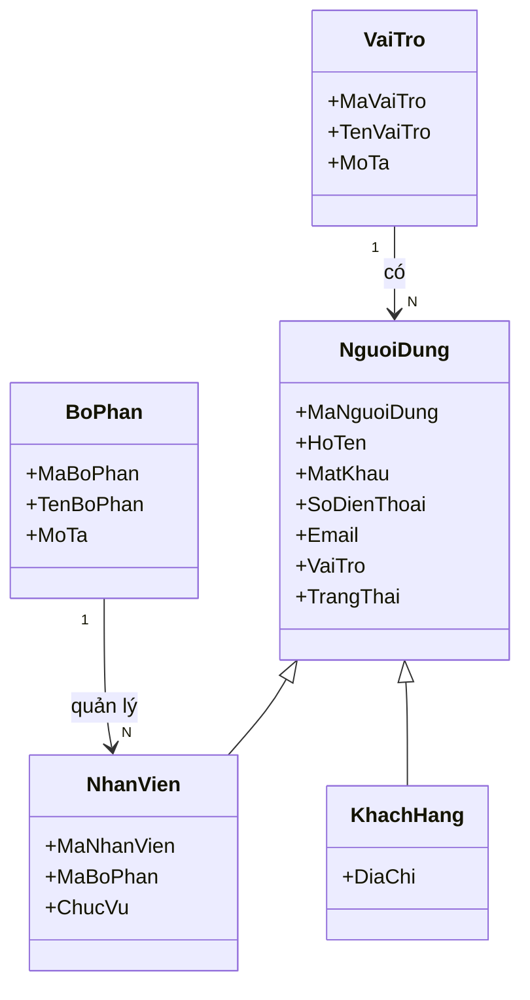

2. Nhóm Đơn hàng khách hàng

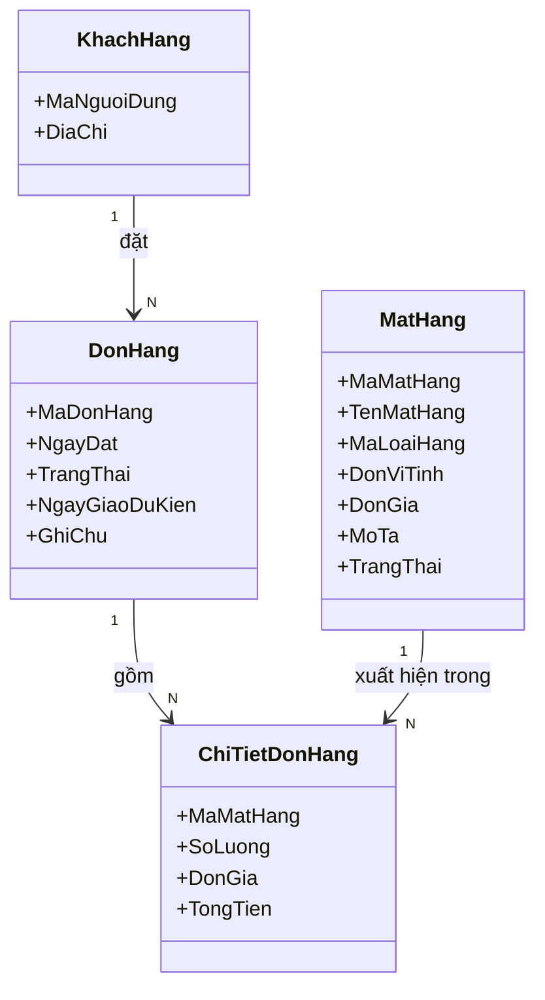

3. Nhóm Mặt hàng / Loại hàng

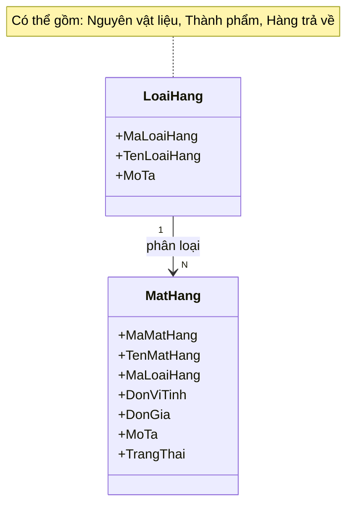

4. Nhóm Xưởng / Nhà cung cấp

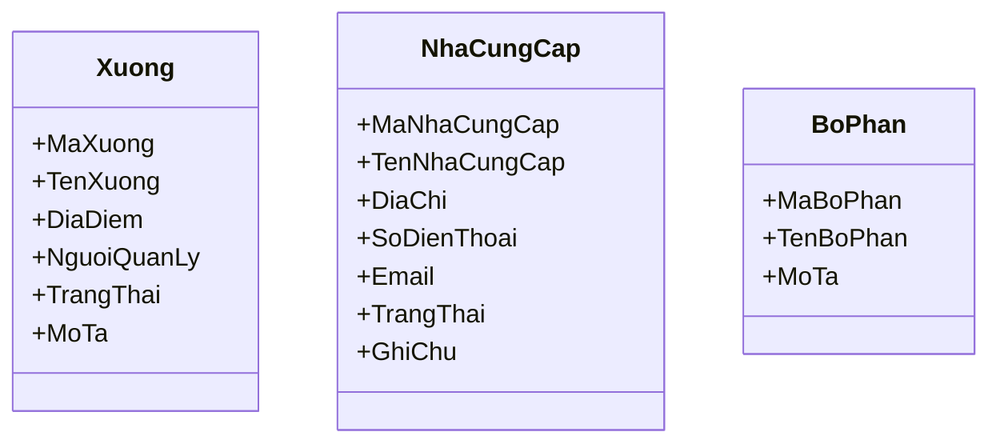

5. Nhóm Kế hoạch sản xuất

6. Nhóm Kế hoạch mua / bán và Đơn mua hàng

Kế hoạch mua lấy nhu cầu thiếu thực tế từ báo cáo sản xuất; kế hoạch bán lấy thành phẩm thực tế từ báo cáo thành phẩm. Hai loại báo cáo dùng chung BanBaoCaoSanXuat, phân biệt bằng LoaiBaoCao.

7. Nhóm Phiếu yêu cầu xuất/nhập và Phiếu kho

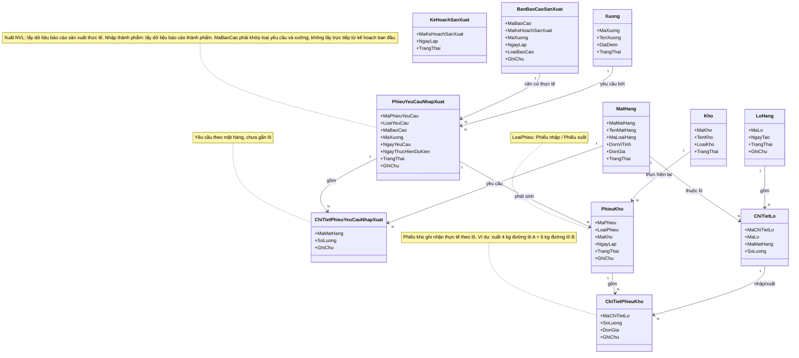

8. Nhóm Lô hàng

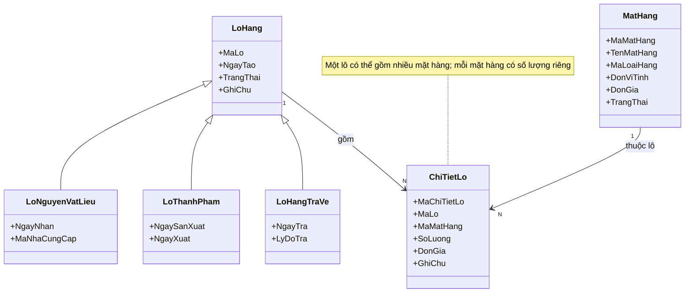

9. Nhóm Kho và Tồn kho

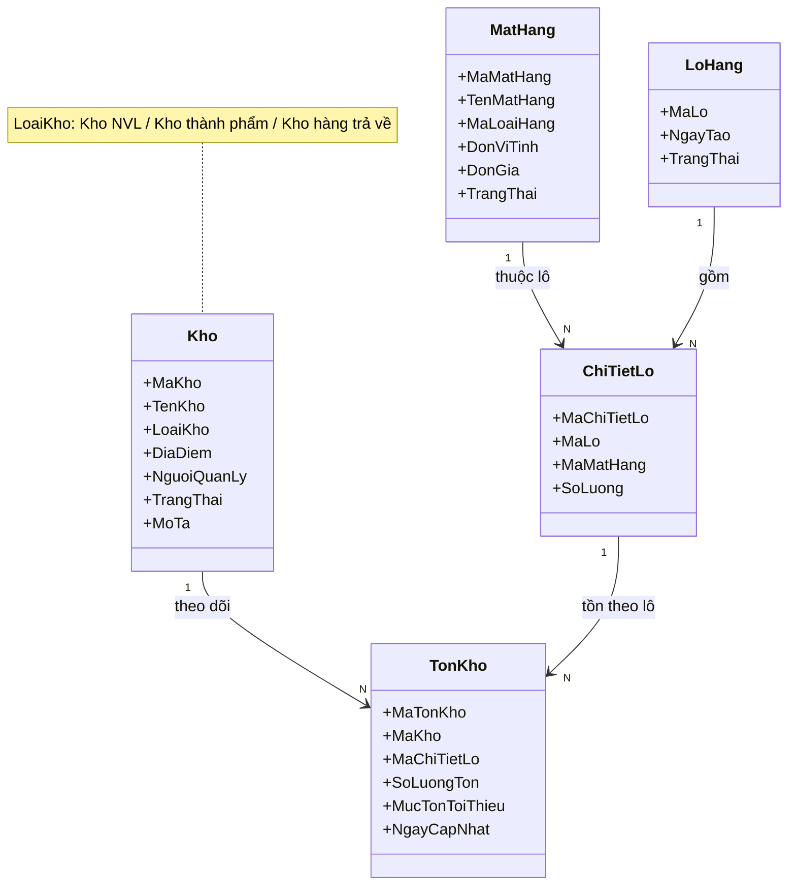

10. Nhóm Phiếu kiểm kê

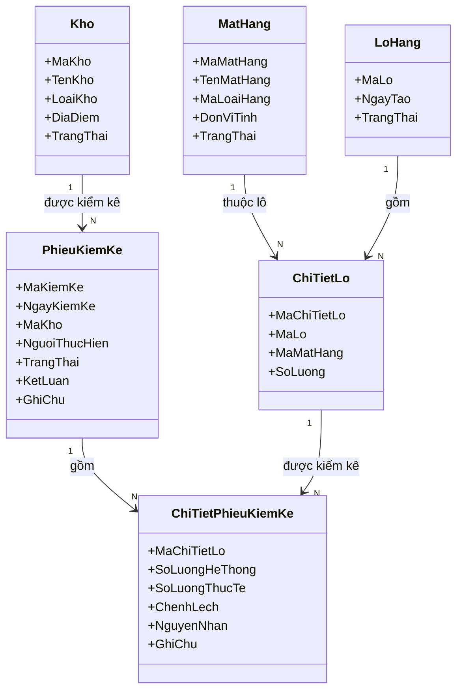

11. Nhóm Kiểm tra QC/AC

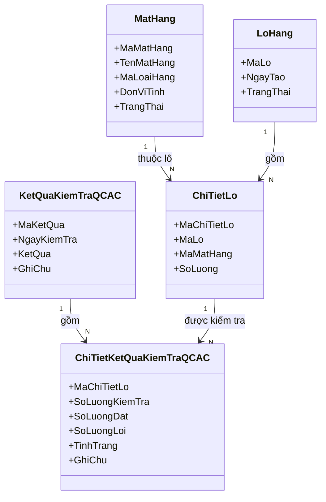

12. Nhóm Báo cáo sản xuất / Thành phẩm

Số lượng cần thiết và số lượng NVL sử dụng được tính **theo mặt hàng** (kèm đơn vị tính). Phần chia theo lô nằm ở bảng chi tiết riêng `ChiTietLoBaoCaoSanXuat`.

13. Nhóm Xử lý ngoại lệ

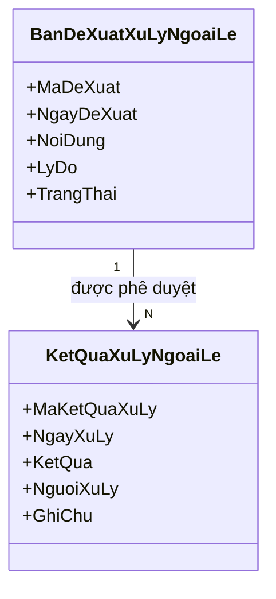

14. Sơ đồ tổng thể

```mermaid
classDiagram

    class NguoiDung {
        +MaNguoiDung
        +HoTen
        +MatKhau
        +SoDienThoai
        +Email
        +VaiTro
        +TrangThai
    }

    class NhanVien {
        +MaNhanVien
        +MaBoPhan
        +ChucVu
    }

    class KhachHang {
        +DiaChi
    }

    class VaiTro {
        +MaVaiTro
        +TenVaiTro
        +MoTa
    }

    class BoPhan {
        +MaBoPhan
        +TenBoPhan
        +MoTa
    }

    class DonHang {
        +MaDonHang
        +NgayDat
        +TrangThai
        +NgayGiaoDuKien
        +GhiChu
    }

    class ChiTietDonHang {
        +MaMatHang
        +SoLuong
        +DonGia
        +TongTien
    }

    class MatHang {
        +MaMatHang
        +TenMatHang
        +MaLoaiHang
        +DonViTinh
        +DonGia
        +MoTa
        +TrangThai
    }

    class LoaiHang {
        +MaLoaiHang
        +TenLoaiHang
        +MoTa
    }

    class Xuong {
        +MaXuong
        +TenXuong
        +DiaDiem
        +NguoiQuanLy
        +TrangThai
    }

    class NhaCungCap {
        +MaNhaCungCap
        +TenNhaCungCap
        +DiaChi
        +SoDienThoai
        +Email
        +TrangThai
    }

    class KeHoachSanXuat {
        +MaKeHoachSanXuat
        +NgayLap
        +NgayNhanDuKien
        +TrangThai
        +GhiChu
    }

    class ChiTietKeHoachSanXuat {
        +MaChiTietKeHoachSanXuat
        +MaMatHang
        +LoaiChiTiet
        +SoLuong
        +SoLuongCanThiet
        +SoLuongConThieu
        +GhiChu
    }

    class KeHoachMuaBan {
        +MaKeHoachMuaBan
        +MaBaoCao
        +LoaiKeHoach
        +NgayLap
        +TrangThai
        +GhiChu
    }

    class ChiTietKeHoachMuaBan {
        +MaMatHang
        +SoLuong
        +DonGiaDuKien
    }

    class DonMuaHang {
        +MaDonMua
        +MaBaoCao
        +NgayLap
        +TrangThai
        +NgayGiaoDuKien
        +GhiChu
    }

    class ChiTietDonMuaHang {
        +MaMatHang
        +SoLuong
        +DonGia
        +TongTien
    }

    class PhieuYeuCauNhapXuat {
        +MaPhieuYeuCau
        +LoaiYeuCau
        +MaBaoCao
        +MaXuong
        +NgayYeuCau
        +NgayThucHienDuKien
        +TrangThai
        +GhiChu
    }

    class ChiTietPhieuYeuCauNhapXuat {
        +MaMatHang
        +SoLuong
        +GhiChu
    }

    class PhieuKho {
        +MaPhieu
        +LoaiPhieu
        +MaKho
        +NgayLap
        +TrangThai
        +GhiChu
    }

    class ChiTietPhieuKho {
        +MaChiTietLo
        +SoLuong
        +DonGia
        +GhiChu
    }

    class LoHang {
        +MaLo
        +NgayTao
        +TrangThai
        +GhiChu
    }

    class LoNguyenVatLieu {
        +NgayNhan
        +MaNhaCungCap
    }

    class LoThanhPham {
        +NgaySanXuat
        +NgayXuat
    }

    class LoHangTraVe {
        +NgayTra
        +LyDoTra
    }

    class ChiTietLo {
        +MaChiTietLo
        +MaLo
        +MaMatHang
        +SoLuong
        +DonGia
        +GhiChu
    }

    class Kho {
        +MaKho
        +TenKho
        +LoaiKho
        +DiaDiem
        +NguoiQuanLy
        +TrangThai
    }

    class TonKho {
        +MaTonKho
        +MaKho
        +MaChiTietLo
        +SoLuongTon
        +MucTonToiThieu
        +NgayCapNhat
    }

    class PhieuKiemKe {
        +MaKiemKe
        +NgayKiemKe
        +MaKho
        +NguoiThucHien
        +TrangThai
        +KetLuan
    }

    class ChiTietPhieuKiemKe {
        +MaChiTietLo
        +SoLuongHeThong
        +SoLuongThucTe
        +ChenhLech
        +NguyenNhan
    }

    class KetQuaKiemTraQCAC {
        +MaKetQua
        +NgayKiemTra
        +KetQua
        +GhiChu
    }

    class ChiTietKetQuaKiemTraQCAC {
        +MaChiTietLo
        +SoLuongKiemTra
        +SoLuongDat
        +SoLuongLoi
        +TinhTrang
    }

    class BanBaoCaoSanXuat {
        +MaBaoCao
        +MaKeHoachSanXuat
        +MaXuong
        +NgayLap
        +LoaiBaoCao
        +GhiChu
    }

    class ChiTietBaoCaoSanXuat {
        +MaChiTietBaoCao
        +MaMatHang
        +SoLuong
        +SoLuongCanThiet
        +SoLuongConThieu
        +SoLuongNVLSuDung
    }

    class ChiTietLoBaoCaoSanXuat {
        +MaChiTietLo
        +SoLuong
    }

    class BanDeXuatXuLyNgoaiLe {
        +MaDeXuat
        +NgayDeXuat
        +NoiDung
        +LyDo
        +TrangThai
    }

    class KetQuaXuLyNgoaiLe {
        +MaKetQuaXuLy
        +NgayXuLy
        +KetQua
        +NguoiXuLy
        +GhiChu
    }

    NguoiDung <|-- NhanVien
    NguoiDung <|-- KhachHang

    VaiTro "1" --> "N" NguoiDung : có
    BoPhan "1" --> "N" NhanVien : có

    LoaiHang "1" --> "N" MatHang : phân loại

    KhachHang "1" --> "N" DonHang : đặt
    DonHang "1" --> "N" ChiTietDonHang : gồm
    MatHang "1" --> "N" ChiTietDonHang : xuất hiện trong

    DonHang "1" --> "N" KeHoachSanXuat : phát sinh
    Xuong "1" --> "N" KeHoachSanXuat : thực hiện tại
    KeHoachSanXuat "1" --> "N" ChiTietKeHoachSanXuat : gồm
    MatHang "1" --> "N" ChiTietKeHoachSanXuat : thành phẩm hoặc NVL

    KeHoachSanXuat "1" --> "N" BanBaoCaoSanXuat : đối chiếu thực tế
    BanBaoCaoSanXuat "1" --> "N" KeHoachMuaBan : nguồn lập theo loại báo cáo
    BanBaoCaoSanXuat "1" --> "N" DonMuaHang : căn cứ nhu cầu NVL
    KeHoachMuaBan "1" --> "N" ChiTietKeHoachMuaBan : gồm
    MatHang "1" --> "N" ChiTietKeHoachMuaBan : kế hoạch
    KeHoachMuaBan "1" --> "N" DonMuaHang : phát sinh
    NhaCungCap "1" --> "N" DonMuaHang : cung cấp
    DonMuaHang "1" --> "N" ChiTietDonMuaHang : gồm
    MatHang "1" --> "N" ChiTietDonMuaHang : mua

    BanBaoCaoSanXuat "1" --> "N" PhieuYeuCauNhapXuat : căn cứ thực tế
    Xuong "1" --> "N" PhieuYeuCauNhapXuat : yêu cầu bởi
    PhieuYeuCauNhapXuat "1" --> "N" ChiTietPhieuYeuCauNhapXuat : gồm
    MatHang "1" --> "N" ChiTietPhieuYeuCauNhapXuat : yêu cầu
    PhieuYeuCauNhapXuat "1" --> "N" PhieuKho : phát sinh
    Kho "1" --> "N" PhieuKho : thực hiện tại
    PhieuKho "1" --> "N" ChiTietPhieuKho : gồm
    ChiTietLo "1" --> "N" ChiTietPhieuKho : nhập/xuất

    LoHang <|-- LoNguyenVatLieu
    LoHang <|-- LoThanhPham
    LoHang <|-- LoHangTraVe

    LoHang "1" --> "N" ChiTietLo : gồm
    MatHang "1" --> "N" ChiTietLo : thuộc lô

    Kho "1" --> "N" TonKho : theo dõi
    ChiTietLo "1" --> "N" TonKho : tồn theo lô

    Kho "1" --> "N" PhieuKiemKe : được kiểm kê
    PhieuKiemKe "1" --> "N" ChiTietPhieuKiemKe : gồm
    ChiTietLo "1" --> "N" ChiTietPhieuKiemKe : được kiểm kê

    KetQuaKiemTraQCAC "1" --> "N" ChiTietKetQuaKiemTraQCAC : gồm
    ChiTietLo "1" --> "N" ChiTietKetQuaKiemTraQCAC : được kiểm tra

    Xuong "1" --> "N" BanBaoCaoSanXuat : lập báo cáo
    BanBaoCaoSanXuat "1" --> "N" ChiTietBaoCaoSanXuat : gồm
    MatHang "1" --> "N" ChiTietBaoCaoSanXuat : báo cáo
    ChiTietBaoCaoSanXuat "1" --> "N" ChiTietLoBaoCaoSanXuat : chia theo lô
    ChiTietLo "1" --> "N" ChiTietLoBaoCaoSanXuat : lô được báo cáo

    BanDeXuatXuLyNgoaiLe "1" --> "N" KetQuaXuLyNgoaiLe : được phê duyệt
    note for ChiTietKeHoachSanXuat "Gồm thành phẩm và NVL dự kiến; NVL cần và còn thiếu nằm ngay trong entity này."
    note for BanBaoCaoSanXuat "SAN_XUAT: căn cứ mua và xuất NVL. THANH_PHAM: căn cứ kế hoạch bán."
    note for KeHoachMuaBan "MUA dùng báo cáo SAN_XUAT; BAN dùng báo cáo THANH_PHAM."
    note for DonMuaHang "Liên kết báo cáo SAN_XUAT; phải khớp báo cáo nguồn của kế hoạch MUA."
    note for PhieuYeuCauNhapXuat "Xuất NVL lấy dữ liệu báo cáo SAN_XUAT; không lấy trực tiếp từ kế hoạch sản xuất."
```
