### Domain Model

---

Sau khi khách hàng đặt hàng tại **UC-02**, hệ thống tạo **đơn hàng khách hàng**, lưu trong `DonHang`; danh sách mặt hàng, số lượng và đơn giá lưu trong `ChiTietDonHang`. Dữ liệu tạo đơn lấy từ mặt hàng khách chọn trong `MatHang` và thông tin khách nhập. **UC-03, UC-03.1** dùng lại đơn này để xem và sửa; **UC-29** dùng đơn này để tiếp nhận, không tạo một phiếu tiếp nhận riêng.

Bộ phận lập kế hoạch dựa trên `DonHang`, `ChiTietDonHang` để lập **kế hoạch sản xuất**, lưu trong `KeHoachSanXuat`. Các thành phẩm cần sản xuất lưu trong `ChiTietKeHoachSanXuat`; danh sách NVL cần thiết lưu trong `ChiTietNguyenLieuKeHoachSanXuat`; xưởng thực hiện lấy từ `Xuong`. **Domain cũ đã có quan hệ đơn hàng → kế hoạch sản xuất, nhưng đặc tả chưa có bước tạo kế hoạch đầy đủ**; theo luồng anh mô tả, bước này nằm sau tiếp nhận tại UC-29. **UC-31** xem đơn và kế hoạch liên quan để phê duyệt; không cần tạo thêm phiếu phê duyệt riêng.

Chủ xưởng nhận kế hoạch sản xuất, lấy nhu cầu NVL từ `ChiTietNguyenLieuKeHoachSanXuat` và tra cứu tồn kho tại **UC-22**, sử dụng `TonKho`, `ChiTietLo`, `MatHang`. Nếu thiếu NVL, chủ xưởng lập **phiếu báo cáo sản xuất tại UC-34**. Trong domain cũ, phiếu này được lưu bằng `BanBaoCaoSanXuat`, còn từng mặt hàng và số lượng báo cáo lưu trong `ChiTietBaoCaoSanXuat`. Nguồn lập phiếu là kế hoạch sản xuất, nhu cầu NVL và kết quả tra cứu tồn kho. **Domain cũ chưa có đủ trường riêng cho tồn đang rảnh và lượng thiếu cộng 10%**, nên phần đó cần bổ sung nếu dùng theo luồng anh đã chốt.

Bộ phận lập kế hoạch sử dụng nhu cầu mua bổ sung để lập **kế hoạch mua NVL tại UC-04**. Trong domain cũ, kế hoạch này vẫn tên là `KeHoachMuaBan`, danh sách NVL cần mua nằm trong `ChiTietKeHoachMuaBan`. **Quan hệ hiện có trong domain là `KeHoachSanXuat` → `KeHoachMuaBan`; chưa có quan hệ từ báo cáo sản xuất sang kế hoạch mua.** Nếu anh muốn kế hoạch mua lấy từ phần thiếu trong báo cáo thì cần bổ sung liên kết đó. **UC-05, UC-05.1, UC-05.2** dùng kế hoạch đã tạo để xem, sửa, xóa; **UC-32** phê duyệt chính kế hoạch này.

Sau khi kế hoạch mua được duyệt, bộ phận mua hàng thực hiện **UC-27** để tạo **đơn mua NVL**, lưu trong `DonMuaHang`, các dòng hàng mua lưu trong `ChiTietDonMuaHang`. Nguồn tạo đơn là `KeHoachMuaBan`, `ChiTietKeHoachMuaBan`; thông tin NCC lấy từ `NhaCungCap`, còn giá và điều kiện giao hàng do bộ phận mua hàng bổ sung. **UC-14** xem/quản lý đơn mua này. Domain cũ không có một entity “phiếu yêu cầu mua” riêng.

Khi NCC giao hàng, cần ghi nhận **lô NVL** bằng `LoHang`, `LoNguyenVatLieu`, `ChiTietLo` để QC/AC có dữ liệu kiểm tra. Thông tin thực nhận được đối chiếu với đơn mua. **Domain cũ có các entity lô nhưng chưa nối rõ đơn mua → lô nhận, và đặc tả chưa xác định đầy đủ bước tạo lô.** QC/AC thực hiện **UC-12.1** để tạo **kết quả kiểm tra chất lượng**, lưu trong `KetQuaKiemTraQCAC`; lượng kiểm tra, lượng đạt và lượng lỗi của từng dòng lô lưu trong `ChiTietKetQuaKiemTraQCAC`. **UC-12, UC-12.2, UC-12.3** sử dụng kết quả này để xem, sửa, xóa.

Phần NVL đạt được nhập kho bằng **phiếu nhập kho**, lưu trong `PhieuKho` với loại phiếu nhập; từng dòng thực nhập lưu trong `ChiTietPhieuKho`, sau đó cập nhật `TonKho`. **UC-10** tạo phiếu nhập từ kết quả QC đạt, chi tiết lô và thông tin kho thực nhập; **UC-08** quản lý phiếu đã tạo, **UC-20** tổng hợp phiếu để xem hồ sơ nhập. Theo yêu cầu mới của anh, việc nhập diễn ra ngay khi kết luận QC, nhưng **domain cũ chưa có liên kết kết quả QC → phiếu kho và chưa có chứng từ riêng ghi nhận trả NCC**.

Khi cần xuất NVL cho xưởng, chủ xưởng thực hiện **UC-23** để lập **phiếu yêu cầu xuất**, lưu trong `PhieuYeuCauNhapXuat`, danh sách mặt hàng cần xuất lưu trong `ChiTietPhieuYeuCauNhapXuat`. Theo domain cũ, nguồn tạo yêu cầu là `KeHoachSanXuat` và xưởng được phân công. **UC-24, UC-24.1, UC-24.2** sử dụng yêu cầu này để xem, sửa, hủy. Nhân viên kho thực hiện **UC-11.01** từ yêu cầu đó, chọn các lô thực xuất và tạo `PhieuKho` loại xuất cùng `ChiTietPhieuKho`, đồng thời trừ `TonKho`. Như vậy, **phiếu yêu cầu ghi lượng muốn xuất; phiếu kho ghi lượng và lô thực sự đã xuất**.

Khi sản xuất xong, chủ xưởng thực hiện **UC-35** để lập **báo cáo thành phẩm**. Domain cũ dùng chung `BanBaoCaoSanXuat` cho cả báo cáo sản xuất và báo cáo thành phẩm, phân biệt bằng `LoaiBaoCao`. Các mặt hàng, lượng thành phẩm và NVL đã dùng nằm trong `ChiTietBaoCaoSanXuat`; nếu cần ghi rõ dùng NVL từ lô nào thì lưu trong `ChiTietLoBaoCaoSanXuat`. Nguồn báo cáo là kết quả sản xuất thực tế và các lô liên quan. Thành phẩm được ghi nhận bằng `LoHang`, `LoThanhPham`, `ChiTietLo`, sau đó QC/AC kiểm tra và tiếp tục tạo `KetQuaKiemTraQCAC`, `ChiTietKetQuaKiemTraQCAC`.

Nếu quản lý cần trình giám đốc xử lý ngoại lệ thì tạo **đề xuất xử lý ngoại lệ** từ phần hàng lỗi trong kết quả QC hoặc chênh lệch kiểm kê. **UC-17** sử dụng đề xuất đó để phê duyệt. Riêng phần này, **domain cũ đang không thống nhất tên**: sơ đồ nhóm ghi `BanDeXuatXuLyNgoaiLe`, `KetQuaXuLyNgoaiLe`, còn đường nối tổng thể và Word ghi `DeXuatXuLyNgoaiLe`, `PheDuyetXuLyNgoaiLe`. Đây là cùng phần nghiệp vụ đang bị lệch tên, không phải bốn loại giấy tờ khác nhau.

Khi giao thành phẩm cho khách, **UC-11.02** lấy dữ liệu từ `DonHang`, `ChiTietDonHang`, có thể kèm `PhieuYeuCauNhapXuat`, rồi lấy lô thành phẩm đạt chất lượng để lập `PhieuKho` loại xuất và `ChiTietPhieuKho`. **UC-09** quản lý phiếu xuất; **UC-19** tổng hợp để xem hồ sơ xuất. Hồ sơ nhập/xuất là dữ liệu tổng hợp từ các phiếu này, domain cũ không có entity hồ sơ riêng.

Ngoài luồng sản xuất, **UC-13** lập đợt kiểm kê; **UC-15** ghi số đếm thực tế vào **phiếu kiểm kê**, trong domain cũ tên là `PhieuKiemKe`, `ChiTietPhieuKiemKe`. Nguồn dữ liệu gồm kho, từng dòng lô, tồn hệ thống và số lượng thực đếm. **UC-28** dùng kết quả đó để lập biên bản; domain cũ chưa có entity biên bản riêng nên nội dung kết luận nằm trên phiếu kiểm kê. **UC-16** dùng các dòng chênh lệch để xử lý, **UC-21** tổng hợp để xem báo cáo kiểm kê.

1. Nhóm Tài khoản / Người dùng

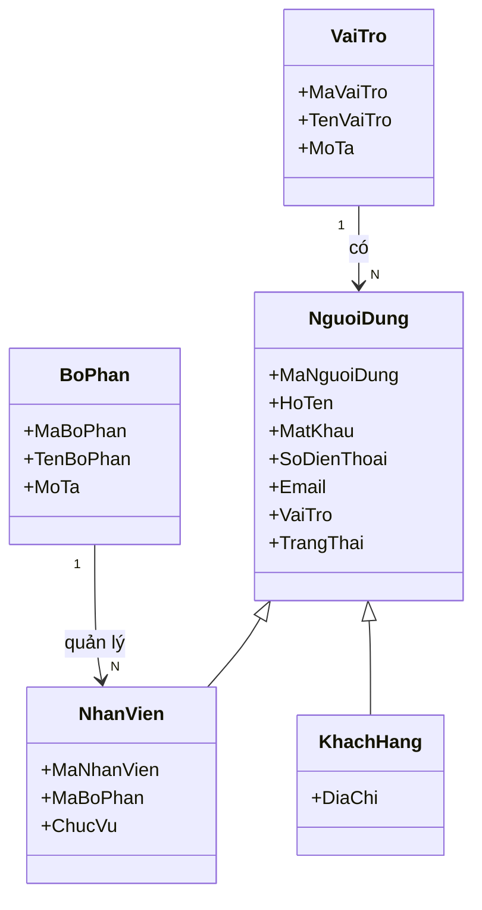

2. Nhóm Đơn hàng khách hàng

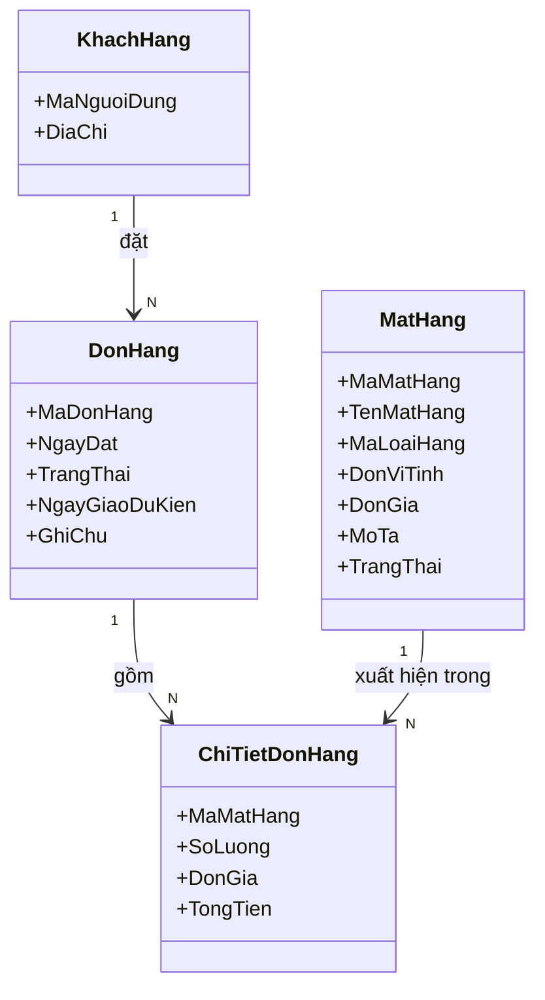

3. Nhóm Mặt hàng / Loại hàng

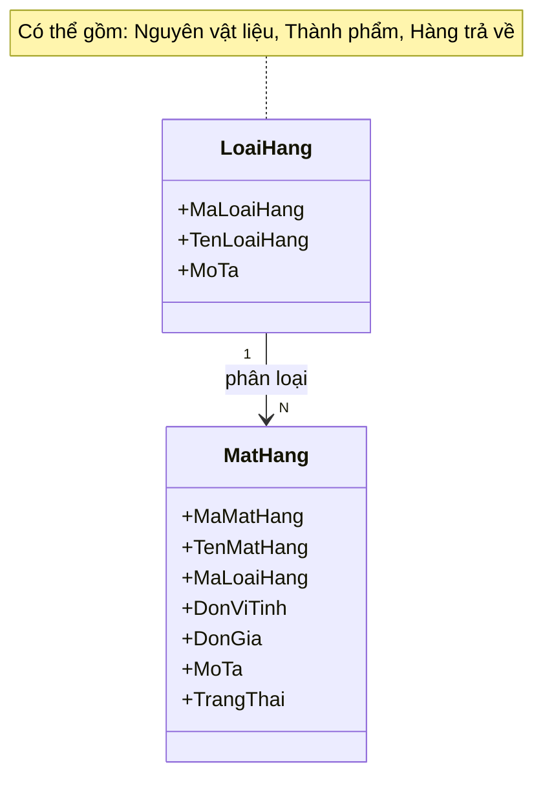

4. Nhóm Xưởng / Nhà cung cấp

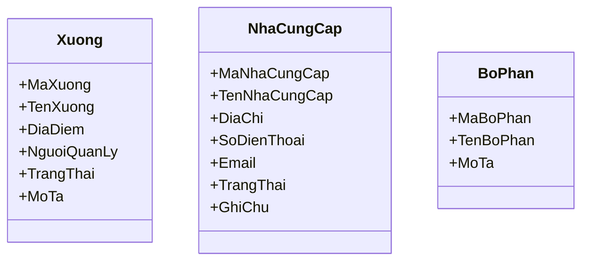

5. Nhóm Kế hoạch sản xuất

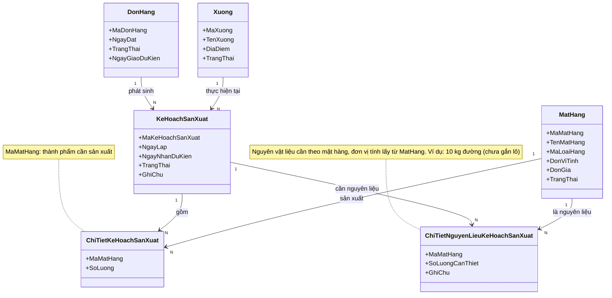

6. Nhóm Kế hoạch mua / bán và Đơn mua hàng

Kế hoạch mua được phát sinh từ Kế hoạch sản xuất, không phụ thuộc vào khách hàng hay đơn hàng.

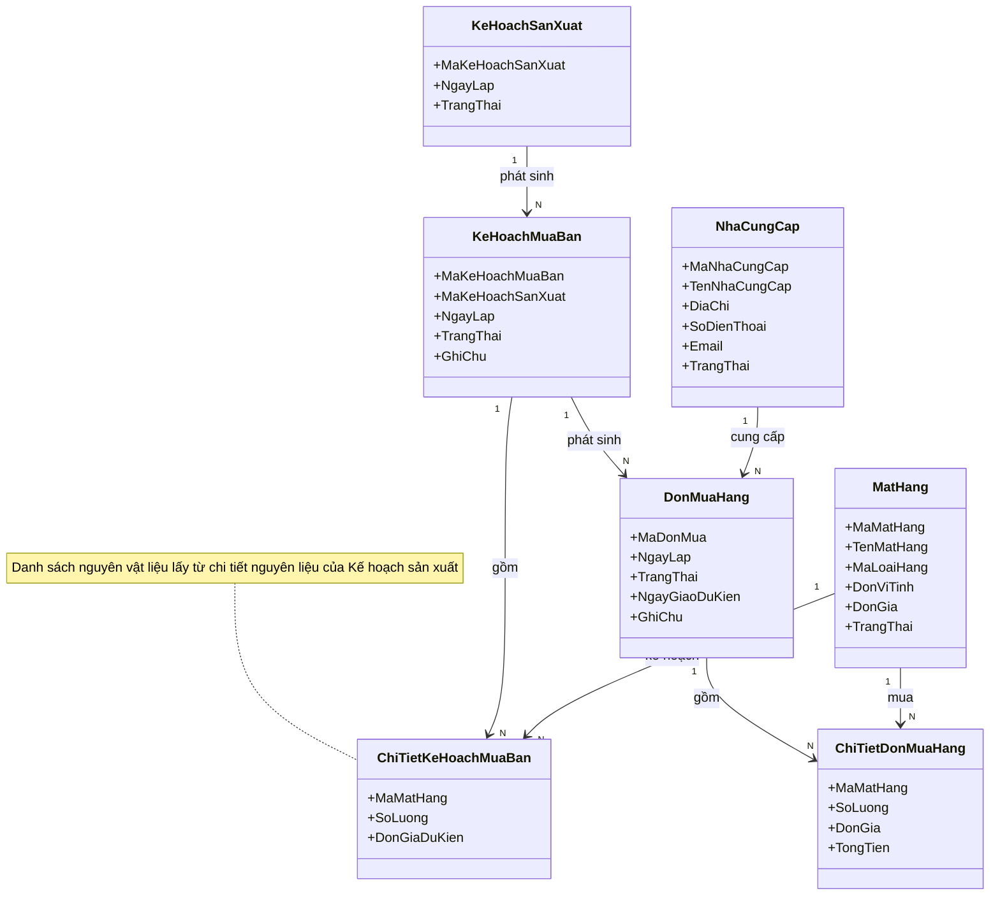

7. Nhóm Phiếu yêu cầu xuất/nhập và Phiếu kho

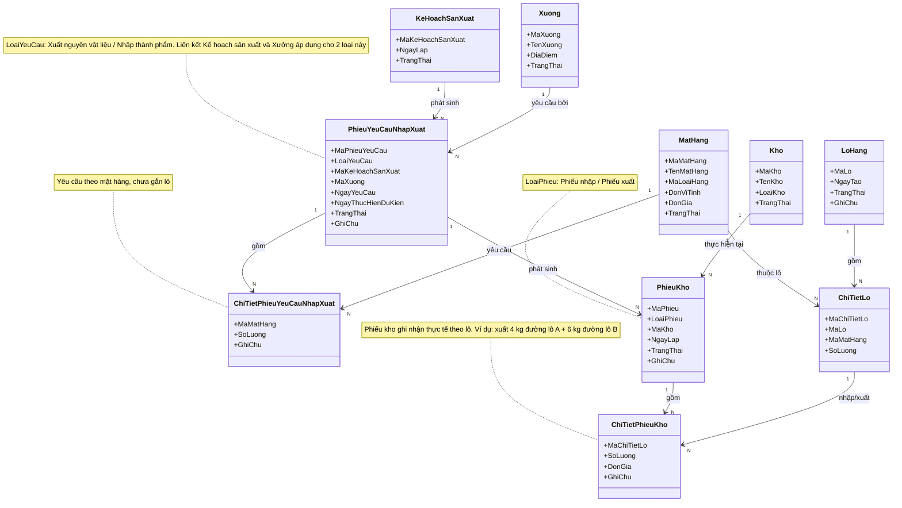

8. Nhóm Lô hàng

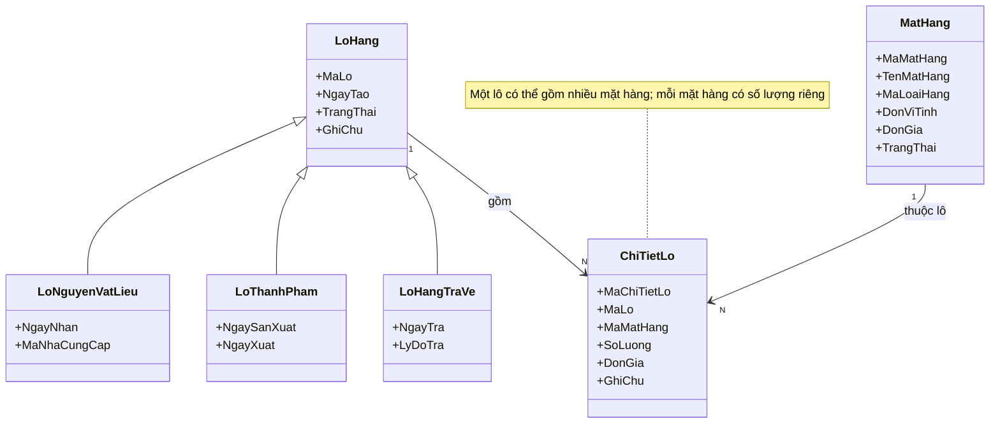

9. Nhóm Kho và Tồn kho

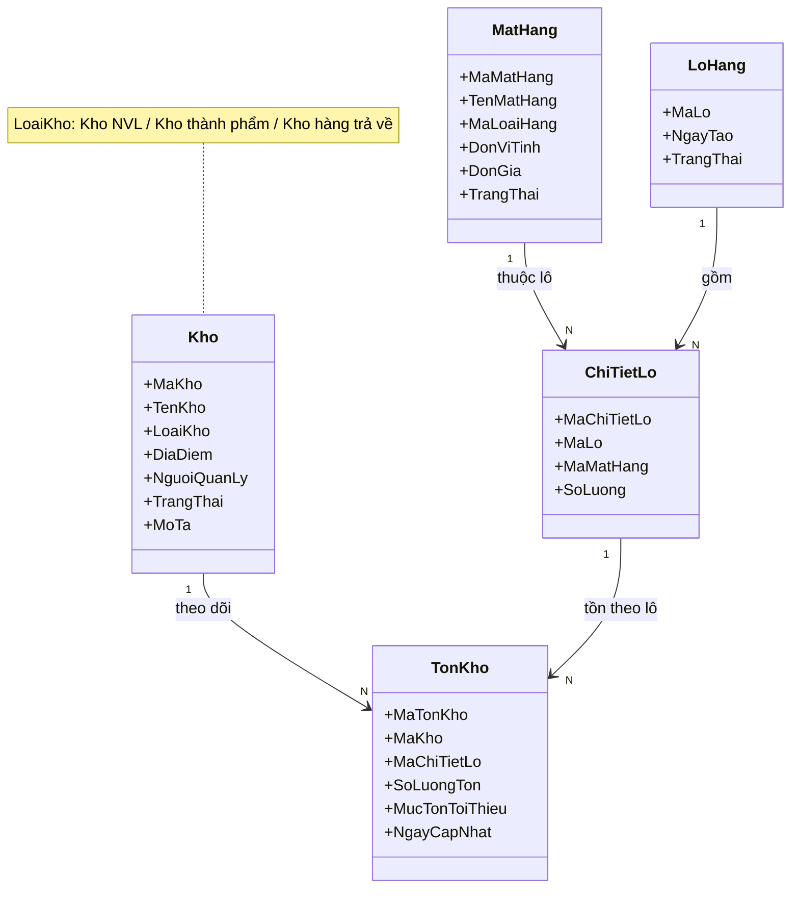

10. Nhóm Phiếu kiểm kê

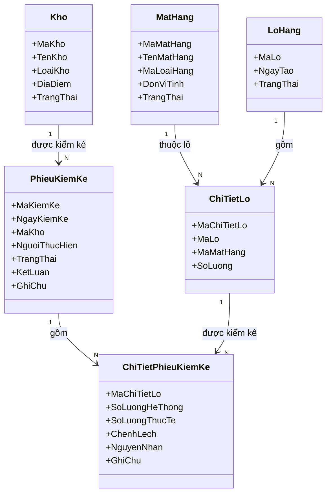

11. Nhóm Kiểm tra QC/AC

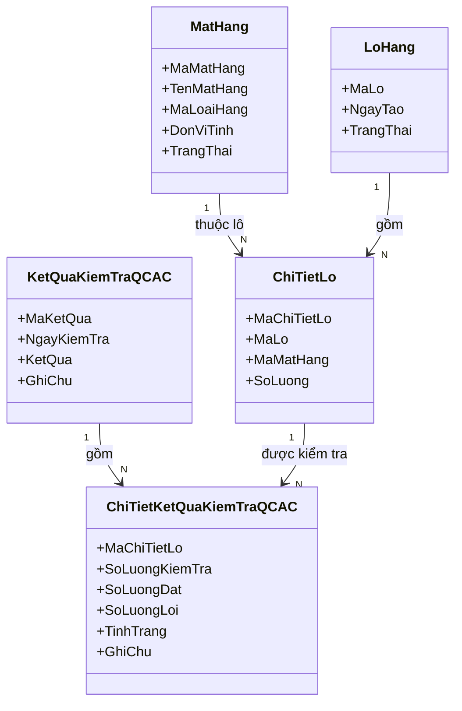

12. Nhóm Báo cáo sản xuất / Thành phẩm

Số lượng cần thiết và số lượng NVL sử dụng được tính **theo mặt hàng** (kèm đơn vị tính). Phần chia theo lô nằm ở bảng chi tiết riêng `ChiTietLoBaoCaoSanXuat`.

13. Nhóm Xử lý ngoại lệ

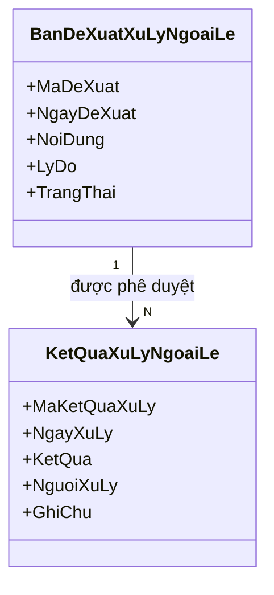

14. Sơ đồ tổng thể

```mermaid
classDiagram

    class NguoiDung {
        +MaNguoiDung
        +HoTen
        +MatKhau
        +SoDienThoai
        +Email
        +VaiTro
        +TrangThai
    }

    class NhanVien {
        +MaNhanVien
        +MaBoPhan
        +ChucVu
    }

    class KhachHang {
        +DiaChi
    }

    class VaiTro {
        +MaVaiTro
        +TenVaiTro
        +MoTa
    }

    class BoPhan {
        +MaBoPhan
        +TenBoPhan
        +MoTa
    }

    class DonHang {
        +MaDonHang
        +NgayDat
        +TrangThai
        +NgayGiaoDuKien
        +GhiChu
    }

    class ChiTietDonHang {
        +MaMatHang
        +SoLuong
        +DonGia
        +TongTien
    }

    class MatHang {
        +MaMatHang
        +TenMatHang
        +MaLoaiHang
        +DonViTinh
        +DonGia
        +MoTa
        +TrangThai
    }

    class LoaiHang {
        +MaLoaiHang
        +TenLoaiHang
        +MoTa
    }

    class Xuong {
        +MaXuong
        +TenXuong
        +DiaDiem
        +NguoiQuanLy
        +TrangThai
    }

    class NhaCungCap {
        +MaNhaCungCap
        +TenNhaCungCap
        +DiaChi
        +SoDienThoai
        +Email
        +TrangThai
    }

    class KeHoachSanXuat {
        +MaKeHoachSanXuat
        +NgayLap
        +NgayNhanDuKien
        +TrangThai
        +GhiChu
    }

    class ChiTietKeHoachSanXuat {
        +MaMatHang
        +SoLuong
    }

    class ChiTietNguyenLieuKeHoachSanXuat {
        +MaMatHang
        +SoLuongCanThiet
        +GhiChu
    }

    class KeHoachMuaBan {
        +MaKeHoachMuaBan
        +MaKeHoachSanXuat
        +NgayLap
        +TrangThai
        +GhiChu
    }

    class ChiTietKeHoachMuaBan {
        +MaMatHang
        +SoLuong
        +DonGiaDuKien
    }

    class DonMuaHang {
        +MaDonMua
        +NgayLap
        +TrangThai
        +NgayGiaoDuKien
        +GhiChu
    }

    class ChiTietDonMuaHang {
        +MaMatHang
        +SoLuong
        +DonGia
        +TongTien
    }

    class PhieuYeuCauNhapXuat {
        +MaPhieuYeuCau
        +LoaiYeuCau
        +MaKeHoachSanXuat
        +MaXuong
        +NgayYeuCau
        +NgayThucHienDuKien
        +TrangThai
        +GhiChu
    }

    class ChiTietPhieuYeuCauNhapXuat {
        +MaMatHang
        +SoLuong
        +GhiChu
    }

    class PhieuKho {
        +MaPhieu
        +LoaiPhieu
        +MaKho
        +NgayLap
        +TrangThai
        +GhiChu
    }

    class ChiTietPhieuKho {
        +MaChiTietLo
        +SoLuong
        +DonGia
        +GhiChu
    }

    class LoHang {
        +MaLo
        +NgayTao
        +TrangThai
        +GhiChu
    }

    class LoNguyenVatLieu {
        +NgayNhan
        +MaNhaCungCap
    }

    class LoThanhPham {
        +NgaySanXuat
        +NgayXuat
    }

    class LoHangTraVe {
        +NgayTra
        +LyDoTra
    }

    class ChiTietLo {
        +MaChiTietLo
        +MaLo
        +MaMatHang
        +SoLuong
        +DonGia
        +GhiChu
    }

    class Kho {
        +MaKho
        +TenKho
        +LoaiKho
        +DiaDiem
        +NguoiQuanLy
        +TrangThai
    }

    class TonKho {
        +MaTonKho
        +MaKho
        +MaChiTietLo
        +SoLuongTon
        +MucTonToiThieu
        +NgayCapNhat
    }

    class PhieuKiemKe {
        +MaKiemKe
        +NgayKiemKe
        +MaKho
        +NguoiThucHien
        +TrangThai
        +KetLuan
    }

    class ChiTietPhieuKiemKe {
        +MaChiTietLo
        +SoLuongHeThong
        +SoLuongThucTe
        +ChenhLech
        +NguyenNhan
    }

    class KetQuaKiemTraQCAC {
        +MaKetQua
        +NgayKiemTra
        +KetQua
        +GhiChu
    }

    class ChiTietKetQuaKiemTraQCAC {
        +MaChiTietLo
        +SoLuongKiemTra
        +SoLuongDat
        +SoLuongLoi
        +TinhTrang
    }

    class BanBaoCaoSanXuat {
        +MaBaoCao
        +NgayLap
        +LoaiBaoCao
        +GhiChu
    }

    class ChiTietBaoCaoSanXuat {
        +MaChiTietBaoCao
        +MaMatHang
        +SoLuong
        +SoLuongCanThiet
        +SoLuongNVLSuDung
    }

    class ChiTietLoBaoCaoSanXuat {
        +MaChiTietLo
        +SoLuong
    }

    class BanDeXuatXuLyNgoaiLe {
        +MaDeXuat
        +NgayDeXuat
        +NoiDung
        +LyDo
        +TrangThai
    }

    class KetQuaXuLyNgoaiLe {
        +MaKetQuaXuLy
        +NgayXuLy
        +KetQua
        +NguoiXuLy
        +GhiChu
    }

    NguoiDung <|-- NhanVien
    NguoiDung <|-- KhachHang

    VaiTro "1" --> "N" NguoiDung : có
    BoPhan "1" --> "N" NhanVien : có

    LoaiHang "1" --> "N" MatHang : phân loại

    KhachHang "1" --> "N" DonHang : đặt
    DonHang "1" --> "N" ChiTietDonHang : gồm
    MatHang "1" --> "N" ChiTietDonHang : xuất hiện trong

    DonHang "1" --> "N" KeHoachSanXuat : phát sinh
    Xuong "1" --> "N" KeHoachSanXuat : thực hiện tại
    KeHoachSanXuat "1" --> "N" ChiTietKeHoachSanXuat : gồm
    MatHang "1" --> "N" ChiTietKeHoachSanXuat : sản xuất
    KeHoachSanXuat "1" --> "N" ChiTietNguyenLieuKeHoachSanXuat : cần nguyên liệu
    MatHang "1" --> "N" ChiTietNguyenLieuKeHoachSanXuat : là nguyên liệu

    KeHoachSanXuat "1" --> "N" KeHoachMuaBan : phát sinh
    KeHoachMuaBan "1" --> "N" ChiTietKeHoachMuaBan : gồm
    MatHang "1" --> "N" ChiTietKeHoachMuaBan : kế hoạch
    KeHoachMuaBan "1" --> "N" DonMuaHang : phát sinh
    NhaCungCap "1" --> "N" DonMuaHang : cung cấp
    DonMuaHang "1" --> "N" ChiTietDonMuaHang : gồm
    MatHang "1" --> "N" ChiTietDonMuaHang : mua

    KeHoachSanXuat "1" --> "N" PhieuYeuCauNhapXuat : phát sinh
    Xuong "1" --> "N" PhieuYeuCauNhapXuat : yêu cầu bởi
    PhieuYeuCauNhapXuat "1" --> "N" ChiTietPhieuYeuCauNhapXuat : gồm
    MatHang "1" --> "N" ChiTietPhieuYeuCauNhapXuat : yêu cầu
    PhieuYeuCauNhapXuat "1" --> "N" PhieuKho : phát sinh
    Kho "1" --> "N" PhieuKho : thực hiện tại
    PhieuKho "1" --> "N" ChiTietPhieuKho : gồm
    ChiTietLo "1" --> "N" ChiTietPhieuKho : nhập/xuất

    LoHang <|-- LoNguyenVatLieu
    LoHang <|-- LoThanhPham
    LoHang <|-- LoHangTraVe

    LoHang "1" --> "N" ChiTietLo : gồm
    MatHang "1" --> "N" ChiTietLo : thuộc lô

    Kho "1" --> "N" TonKho : theo dõi
    ChiTietLo "1" --> "N" TonKho : tồn theo lô

    Kho "1" --> "N" PhieuKiemKe : được kiểm kê
    PhieuKiemKe "1" --> "N" ChiTietPhieuKiemKe : gồm
    ChiTietLo "1" --> "N" ChiTietPhieuKiemKe : được kiểm kê

    KetQuaKiemTraQCAC "1" --> "N" ChiTietKetQuaKiemTraQCAC : gồm
    ChiTietLo "1" --> "N" ChiTietKetQuaKiemTraQCAC : được kiểm tra

    BaoCaoSanXuat "1" --> "N" ChiTietBaoCaoSanXuat : gồm
    MatHang "1" --> "N" ChiTietBaoCaoSanXuat : báo cáo
    ChiTietBaoCaoSanXuat "1" --> "N" ChiTietLoBaoCaoSanXuat : chia theo lô
    ChiTietLo "1" --> "N" ChiTietLoBaoCaoSanXuat : lô được báo cáo

    DeXuatXuLyNgoaiLe "1" --> "N" PheDuyetXuLyNgoaiLe : được phê duyệt
```
